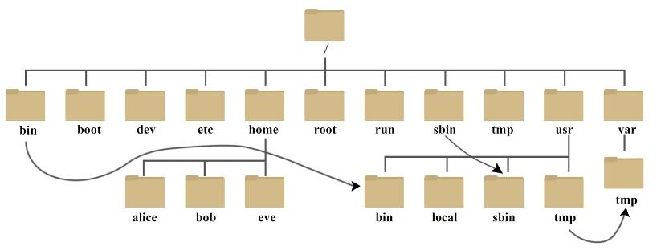

<!-- TOC -->

- [Linux](#linux)
- [一些手册](#%E4%B8%80%E4%BA%9B%E6%89%8B%E5%86%8C)
- [文件系统层次化标准（FHS，Filesystem Hierarchy Standard）](#%E6%96%87%E4%BB%B6%E7%B3%BB%E7%BB%9F%E5%B1%82%E6%AC%A1%E5%8C%96%E6%A0%87%E5%87%86fhsfilesystem-hierarchy-standard)
    - [物理设备的命名规则](#%E7%89%A9%E7%90%86%E8%AE%BE%E5%A4%87%E7%9A%84%E5%91%BD%E5%90%8D%E8%A7%84%E5%88%99)
- [Linux 系统目录结构](#linux-%E7%B3%BB%E7%BB%9F%E7%9B%AE%E5%BD%95%E7%BB%93%E6%9E%84)
    - [几个目录是比较重要](#%E5%87%A0%E4%B8%AA%E7%9B%AE%E5%BD%95%E6%98%AF%E6%AF%94%E8%BE%83%E9%87%8D%E8%A6%81)
- [常用命令](#%E5%B8%B8%E7%94%A8%E5%91%BD%E4%BB%A4)
    - [ifconfig： 显示网络设备信息](#ifconfig-%E6%98%BE%E7%A4%BA%E7%BD%91%E7%BB%9C%E8%AE%BE%E5%A4%87%E4%BF%A1%E6%81%AF)
    - [netstat](#netstat)
    - [ps 命令](#ps-%E5%91%BD%E4%BB%A4)
    - [mount](#mount)
- [/configure、make、make install 命令](#configuremakemake-install-%E5%91%BD%E4%BB%A4)
- [Linux 用户和用户组管理](#linux-%E7%94%A8%E6%88%B7%E5%92%8C%E7%94%A8%E6%88%B7%E7%BB%84%E7%AE%A1%E7%90%86)
- [chmod](#chmod)
- [df -h](#df--h)
- [du -sh](#du--sh)
- [in  快捷方式](#in--%E5%BF%AB%E6%8D%B7%E6%96%B9%E5%BC%8F)
- [系统设置](#%E7%B3%BB%E7%BB%9F%E8%AE%BE%E7%BD%AE)
    - [reset](#reset)
    - [alias](#alias)
    - [crontab](#crontab)
    - [chkconfig](#chkconfig)
- [其他linux版本](#%E5%85%B6%E4%BB%96linux%E7%89%88%E6%9C%AC)
    - [Alibaba Cloud Linux 2](#alibaba-cloud-linux-2)
    - [Inclavare Containers](#inclavare-containers)

<!-- /TOC -->

# Linux

# 一些手册

<https://manned.org/>

<https://helpmanual.io/>

# 文件系统层次化标准（FHS，Filesystem Hierarchy Standard）

```cmd
# /boot 存放开机启动加载程序的核心文件；(如kernel和grup)
# /dev 以文件形式存放任何设备与接口
        /dev/console：系统控制台，也就是直接和系统连接的监视器；
        /dev/hd：IDE设备文件；
        /dev/sd：sata、usb、scsi等设备文件；
        /dev/fd：软驱设备文件；
        /dev/tty：虚拟控制台设备文件；
        /dev/pty：提供远程虚拟控制台设备文件；
        /dev/null：所谓"黑洞"，所有写入该设备的信息都将消失，如当想要将屏幕上的输出信息隐藏起来时，只要将输出信息输入
# /etc 主机、系统或网络配置文件存放目录；
# /bin 存放经常使用的命令
# /home 用户目录
        /home/~/.bashrc：提供bash环境中所需使用的别名；
        /home/~/.bash_profile：提供bash环境所需的变量；一般先执行.bashrc后，才会再执行.bash_profile；
        /home/~/.bash_history：用户历史命令文件，记录用户曾经输入过的所有命令；(默认为1000条，可以通过HISTSIZE变量更改)
        /home/~/.bash_logout：当用户注销的同时，系统会自动执行.bash_logout文件，如果管理员需要记录用户注销的一些额外记录、
# /lib Library(系统的基本动态连接库)
# /lost+found 系统异常关机的记录文件
# /media 移动存储设备默认挂载点；(如光盘)
# /mnt：临时挂载用的设备挂载点；(如磁盘分区，网络共享)
# /sbin 开机过程需要的命令
# /opt 第三方软件
# /srv 一些网络服务的数据文件目录
# /root 系统管理员目录
# /tmp 存放临时文件
# /proc process 进程，存放内核状态
        /proc/cpuinfo：cpu的硬件信息，如类型、厂家、型号和性能等
        /proc/devices：记录所有在/dev目录中相关的设备文件分类方式
        /proc/filesystems：当前运行内核所配置的文件系统
        /proc/interrupts：可以查看每一个IRQ的编号对应到哪一个硬件设备
        /proc/loadavg：系统"平均负载"，3个数据指出系统当前的工作负载
        /proc/dma：当前正在使用的DMA通道 
        /proc/ioports：将目前系统上所有可看到的硬件对应到内存位置的分配表的详细信息呈现出来
        /proc/kcore：系统上可以检测到的物理内存，主机内存多大，这个文件就有多大
        /proc/kmsg：在系统尚未进入操作系统阶段，把加载kernel和initrd的信息先记录到该文件中，后续会将日志信息写入/var/log/message文件中
        /proc/meminfo：记录系统的内存信息
        /proc/modules：与lsmod命令查看到的模块信息完全一致
        /proc/mtrr：负责内存配置的机制
        /proc/iomem：主要用于储存配置后所有内存储存的明细信息
        /proc/partitions：这个文件可以实时呈现系统目前看到的分区
        /proc/数字目录：数字目录很多，它们代表所有目前正在系统中运行的所有程序
        /proc/bus：有关该主机上现有总线的所有信息，如输入设备、PCI接口、PCMCIA扩展卡及USB接口信息
        /proc/net目录：存放的都是一些网络相关的虚拟配置文件，都是ASCII文件，可以查看(与ifconfig、arp、netstat等有关)
        /proc/scsi：保存系统上所有的scsi设备信息(包括sata和usb设备的信息)
        /proc/sys目录：存放系统核心所使用的一些变量，根据不同性质的文件而存放在不同的子目录中，可以通过/etc/sysctl.conf文件设置和更改其默认值；变量时实时的变更，有很多设置很象是开关，设置后马上生效；
        /proc/tty：存放有关目前可用的正在使用的tty设备的信息
        /proc/self：存放到查看/proc的程序的进程目录的符号连接，当2个进程查看proc时，这将会是不同的连接；主要便于程序得到它自己的进程目录；
        /proc/stat：系统的不同状态信息；
        /proc/uptime：系统启动的时间长度；
        /proc/version：系统核心版本；
# /usr/local 用户自行安装的软件
# /usr/share 帮助与说明文件，也可存放共享文件
# /var 动态文件或数据存放目录，默认日志文件都存放在这个目录下，一般建议把此目录单独划分一个分区；
```

## 物理设备的命名规则

在Linux系统中，一切皆文件，硬件设备也不例外。既然是文件，就必须有文件名称。系统内核中的udev设备管理器会自动把硬件名称规范起来，目的是让用户通过设备文件的名字可以猜出设备大致的属性以及分区信息等。

```cmd
#  /dev/hd[a-d] IDE硬盘
#  /dev/sd[a-z] SCSI/SATA/USB硬盘 一般的硬盘都是“/dev/sd”开头
#  /dev/lp[0-15] 打印机
#  /dev/cdrom 光驱
#  /dev/mouse 鼠标
```

# Linux 系统目录结构



- /bin bin 是 Binaries (二进制文件) 的缩写, 这个目录存放着最经常使用的命令。
- /dev dev 是 Device(设备) 的缩写, 该目录下存放的是 Linux 的外部设备，在 Linux 中访问设备的方式和访问文件的方式是相同的。
- /etc etc 是 Etcetera(等等) 的缩写,这个目录用来存放所有的系统管理所需要的配置文件和子目录
- /home 用户的主目录，在 Linux 中，每个用户都有一个自己的目录，一般该目录名是以用户的账号命名
- /media linux 系统会自动识别一些设备，例如U盘、光驱等等，当识别后，Linux 会把识别的设备挂载到这个目录下。
- /mnt 系统提供该目录是为了让用户临时挂载别的文件系统的，我们可以将光驱挂载在 /mnt/ 上，然后进入该目录就可以查看光驱里的内容了。
- /usr  usr 是 unix shared resources(共享资源) 的缩写，这是一个非常重要的目录，用户的很多应用程序和文件都放在这个目录下，类似于 windows 下的 program files 目录
- /root 该目录为系统管理员，也称作超级权限者的用户主目录
- /usr/bin 系统用户使用的应用程序
- /usr/sbin 超级用户使用的比较高级的管理程序和系统守护程序
- var 是 variable(变量) 的缩写，这个目录中存放着在不断扩充着的东西，我们习惯将那些经常被修改的目录放在这个目录下。包括各种日志文件。

## 几个目录是比较重要

- /etc
- /bin, /sbin, /usr/bin, /usr/sbin: 这是系统预设的执行文件的放置目录
- /var

# 常用命令

```
pwd:print work directory (打印当前目录 显示出当前工作目录的绝对路径)
ps: process status (进程状态，类似于windows的任务管理器)
df: disk free 其功能是显示磁盘可用空间数目信息及空间结点信息。换句话说，就是报告在任何安装的设备或目录中，还剩多少自由的空间。
rmdir：Remove Directory（删除目录）
rm：Remove（删除目录或文件）
mkdir：Make Directory(创建目录)
su：Swith user(切换用户) 
mv: Move file (移动文件)
cp: Copy file (复制文件)
chown: Change owner(拥有者改为指定的用户或组)
chmod:改变 linux 系统文件或目录的访问权限
cat：查看文本文件内容
find：查找文件
tail -10： 查看文件的尾部的10行
kill:杀死进程，可以先用ps 或 top命令查看进程的id，然后再用kill命令杀死进程。
```

## ifconfig： 显示网络设备信息

```
# 启动关闭指定网卡
# ifconfig eth0 down
# ifconfig eth0 up

# 配置IP地址
# ifconfig eth0 192.168.1.56 
```

## netstat

```
# 查看当前所有tcp端口
# netstat -ntlp

# 查看所有80端口使用情况
# netstat -ntulp | grep 80
```

## ps 命令

```
# 显示当前所有进程环境变量及进程间关系
# ps -ef

# 与grep联用查找某进程
# ps -aux | grep apache
```

## mount

用于挂载Linux系统外的文件

```
mount /dev/hda1 /mnt

// 挂载iso
mount -t iso9660 /dev/cdrom /mnt/cdrom
```

# ./configure、make、make install 命令

./configure  是用来检测你的安装平台的目标特征的。
make 是用来编译的，它从Makefile中读取指令，然后编译
make install是用来安装的，它也从Makefile中读取指令，安装到指定的位置。

```
安装编译环境
yum install gcc make autoconf automake libtool libxml2-devel

# 生成 Makefile，为下一步的编译做准备，你可以通过在 configure 后加上参数来对安装进行控制
# ./configure --prefix=/usr

# 开始进行源代码编译
# make

# 进行安装 需要 root 权限
# make install
```

# Linux 用户和用户组管理

```
# 查看用户列表
# compgen -u
```

```
# 增加一个新的用户组
groupadd 选项 用户组
groupdel 用户组

# 添加新的用户账号
-d 目录 指定用户主目录，如果此目录不存在，则同时使用-m选项，可以创建主目录。
-g 用户组 指定用户所属的用户组。
useradd 选项 用户名

# 删除一个已有的用户账号
userdel 选项 用户名

# 修改用户账号
usermod 选项 用户名
```

```
# groupadd usergroup

# -r:　　 用来建立系统账户
# -s：　　指定用户的登录Shell
# -g：　　指定所属的基本组（组名或GID）
# useradd -r -g usergroup -s /bin/false user

# mkdir mysql-files

# 设置文件所有者和文件关联组的命令
# chown user:usergroup mysql-files
# chmod 750 mysql-files
```

# chmod

7 读 + 写 + 执行 rwx 111
6 读 + 写 rw- 110  
5 读 + 执行 r-x 101  
4 只读 r-- 100  
3 写 + 执行 -wx 011  
2 只写 -w- 010  
1 只执行 --x 001  
0 无 --- 000  

# df -h

查看各分区使用情况

# du -sh

查看指定目录的大小

# in  (快捷方式)

- 软链接：
  - 1.软链接，以路径的形式存在。类似于Windows操作系统中的快捷方式
  - 2.软链接可以 跨文件系统 ，硬链接不可以
  - 3.软链接可以对一个不存在的文件名进行链接
  - 4.软链接可以对目录进行链接
- 硬链接：
  - 1.硬链接，以文件副本的形式存在。但不占用实际空间。
  - 2.不允许给目录创建硬链接
  - 3.硬链接只有在同一个文件系统中才能创建

为某一个文件在另外一个位置建立一个同步的链接

```
ln [参数][源文件或目录][目标文件或目录]
```

```
# 给文件创建软链接
ln -s log2013.log link2013
```

# 　系统设置

## reset

- reset === tset

```
reset [-IQqrs] [-] [-e ch] [-i ch] [-k ch] [-m mapping] [terminal]
tset  [-IQqrs] [-] [-e ch] [-i ch] [-k ch] [-m mapping] [terminal]
```

## alias

用户可利用alias，自定指令的别名。  
若仅输入alias，则可列出目前所有的别名设置。  
alias的效力仅及于该次登入的操作。  
若要每次登入是即自动设好别名，可在.profile或.cshrc中设定指令的别名。  

```
alias
alias [别名]=[指令名称]
```

## crontab

用来定期执行程序的命令

```
crontab [ -u user ] file
crontab [ -u user ] { -l | -r | -e }
```

```
# 时程表 格式
# f1 是表示分钟 (0 - 59)
# f2 表示小时 (0 - 23)
# f3 表示一个月份中的第几日  (1 - 31)
# f4 表示月份  (1 - 12) 
# f5 表示一个星期中的第几天 (0 - 7) (星期天 为0)
# program 表示要执行的程序
# f1 f2 f3 f4 f5 program
```

## chkconfig

用于检查，设置系统的各种服务

```
chkconfig [--add][--del][--list][系统服务] 
chkconfig [--level <等级代号>][系统服务][on/off/reset]
```

# 其他linux版本

## 　Alibaba Cloud Linux 2

<https://openanolis.org/blog/alibaba-cloud-linux-lts2/>

<https://www.alibabacloud.com/help/zh/doc-detail/111881.htm>

- 用户态软件包保持与最新版CentOS 7兼容，该版本用户态软件包可直接在Alibaba Cloud Linux 2使用。
- 默认搭载阿里云CLI。
- 网络服务从network.service切换为systemd-networkd。
- 软件包安全漏洞（CVE）修复在Alibaba Cloud Linux 2版本支持期限内会持续更新，详情请参见Alibaba Cloud Linux 2 CVE更新记录。Alibaba Cloud Linux 2提供自动化修复方案，详情请参见基于YUM的安全更新操作。

```
docker pull registry.cn-hangzhou.aliyuncs.com/alinux/aliyunlinux:2.1903
```

## Inclavare Containers

开源Enclave容器运行时技术栈和安全架构

<https://inclavare-containers.io/>
