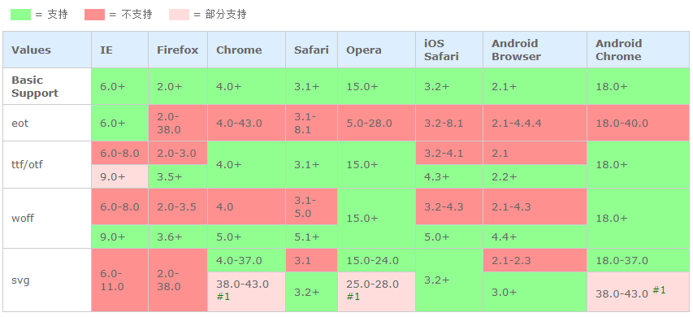

# 弹性盒子模型

> 子元素的排列方式（水平或者垂直） ` [适用于：flex容器]`

（旧）box-orient：`horizontal` | vertical | inline-axis | block-axis  
（新）flex-direction：`row` | row-reverse | column | column-reverse

### 对应关系
* horizontal==row 水平行中从左向右排列子元素。
* vertical==column 从上向下垂直排列子元素。
* inline-axis （映射为 horizontal）
* block-axis （映射为 vertical）
* `box-orient:horizontal + box-direction:reverse==row-reverse`
* `box-orient:horizontal + box-direction:reverse==column-reverse`


> 子元素的排列顺序是否反转 ` [适用于：flex容器]`

（旧）box-direction：normal | reverse  
（新）无


> 子元素的对齐方式（左对齐|居中对齐|右对齐|两边对齐） ` [适用于：flex容器]`

（旧）box-pack：`start` | center | end | justify  
（新）justify-content：`flex-start` | flex-end | center | space-between | space-around


### 对应关系

 * start==flex-start 设置伸缩盒对象的子元素从开始位置对齐
 * center==center 设置伸缩盒对象的子元素居中对齐
 * end==flex-end 设置伸缩盒对象的子元素从结束位置对齐（大部分情况等同于右对齐）
 * justify==space-between 设置或伸缩盒对象的子元素两端对齐
 * `space-around 弹性盒子元素会平均地分布在行里，两端保留子元素与子元素之间间距大小的一半。` 

> 多行的弹性盒模型 类似justify-content对齐方式 本属性在`只有一行的伸缩容器上没有效果`。 ` [适用于：flex容器]`

（旧）`无`  
（新）align-content：`flex-start` | flex-end | center | space-between | space-around | stretch


### 对应关系
* flex-start 各行向弹性盒容器的起始位置堆叠  `开始对齐`
* flex-end 各行向弹性盒容器的结束位置堆叠  `尾部对齐`
* center 各行向弹性盒容器的中间位置堆叠  `居中对齐`
* space-between 各行在弹性盒容器中平均分布  `两边对齐`
* space-around 各行在弹性盒容器中平均分布，两端保留子元素与子元素之间间距大小的一半。  `两边对齐,且保留间距`
* stretch 各行将会伸展以占用剩余的空间


> 子元素的对齐方式 box-pack的效果正好（相反）互补 ` [适用于：flex容器]`

（旧）box-align：`start` | end | center | baseline | stretch  
（新）align-items：`flex-start` | flex-end | center | baseline | stretch  


### 对应关系
* start==flex-start 弹性盒子元素的侧轴（纵轴）起始位置的边界紧靠住该行的侧轴起始边界。`子元素从起始位置对齐`
* end==flex-end 弹性盒子元素的侧轴（纵轴）起始位置的边界紧靠住该行的侧轴结束边界。`子元素从结束位置对齐`
* center==center 弹性盒子元素在该行的侧轴（纵轴）上居中放置。`子元素居中对齐`
* baseline 如弹性盒子元素的行内轴与侧轴为同一条，则该值与'flex-start'等效。其它情况下，该值将参与基线对齐。`子元素从结束位置对齐`
* stretch==stretch 如果指定侧轴大小的属性值为'auto'，则其值会使项目的边距盒的尺寸尽可能接近所在行的尺寸，但同时会遵照'min/max-width/height'属性的限制。`项目的内容随侧轴（纵轴）自动铺满盒子`

> 子元素如何分配其剩余空间 `(在子元素上使用)` ` [适用于：flex子项]`

（旧）box-flex：`0` | number   
（新）flex：none | <' flex-grow '> <' flex-shrink >'? || <' flex-basis '>


```
* none：none关键字的计算值为: 0 0 auto

* 如果缩写「flex: 1」, 则其计算值为「1 1 0%」

* 如果缩写「flex: auto」, 则其计算值为「1 1 auto」

* 如果「flex: none」, 则其计算值为「0 0 auto」

* 如果「flex: 0 auto」或者「flex: initial」, 则其计算值为「0 1 auto」，即「flex」初始值  
```

> 弹性盒的扩展比率 `如何分配其剩余空间` `(不允许负值)` `(在子元素上使用)` ` [适用于：flex子项]`

（旧）box-flex：`0` | number   
（新）flex-grow：`0` | number


> 弹性盒的收缩比率 `(不允许负值)` `(在子元素上使用)`  ` [适用于：flex子项]`

（旧）无  
（新）flex-shrink：`1` | number 


> 弹性盒伸缩基准值 `如果所有子元素的基准值之和大于剩余空间，则会根据每项设置的基准值，按比率伸缩剩余空间` `(不允许负值)` `(在子元素上使用)` ` [适用于：flex子项]`

（旧）无  
（新）flex-basis：`0%` |  length | percentage | auto | content


> 子元素的所属组 `(在子元素上使用)` ` [适用于：flex子项]`

（旧）box-flex-group：`1` | integer  
（新）无


> 子元素的显示顺序 `(在子元素上使用)` ` [适用于：flex子项]`

（旧）box-ordinal-group：`1` | integer 
（新）order：`0` | integer


> 子元素是否可以换行显示   ` [适用于：flex容器]`

（旧）box-lines：`single` | multiple  
（新）flex-wrap：`nowrap` | wrap | wrap-reverse

### 对应关系

* single==nowrap 单行
* multiple==wrap 多行
* wrap-reverse `与 wrap相同且顺序倒序`

> 复合属性。设置或检索弹性盒模型对象的子元素排列方式。` [适用于：flex容器]`

（旧）无  
（新）flex-flow：<' flex-direction '> || <' flex-wrap '>

> 定义flex子项单独在侧轴（纵轴）方向上的对齐方式 `(在子元素上使用)`

（旧）无  
（新）align-self：`auto` | flex-start | flex-end | center | baseline | stretch

### 对应关系
* auto 计算值为元素的父元素的'align-items'值，如果其没有父元素，则计算值为'stretch'。
* flex-start 子元素的侧轴（纵轴）起始位置的边界紧靠住该行的侧轴起始边界。
* flex-end 子元素的侧轴（纵轴）起始位置的边界紧靠住该行的侧轴结束边界。
* center 子元素在该行的侧轴（纵轴）上居中放置。
* baseline 子元素的行内轴与侧轴为同一条，则该值与'flex-start'等效。
* stretch 如果指定侧轴大小的属性值为'auto'，则其值会使项目的边距盒的尺寸尽可能接近所在行的尺寸，但同时会遵照'min/max-width/height'属性的限制。`项目的内容随侧轴（纵轴）自动铺满盒子`


# 速度曲线

* linear 规定以`相同速度`开始至结束的过渡效果（等于 cubic-bezier(0,0,1,1)）。
* ease 规定`慢速开始，然后变快，然后慢速结束`的过渡效果（cubic-bezier(0.25,0.1,0.25,1)）。**`* 注 transition|animation 等默值`**
* ease-in 规定以`慢速开始`的过渡效果（等于 cubic-bezier(0.42,0,1,1)）。
* ease-out 规定以`慢速结束`的过渡效果（等于 cubic-bezier(0,0,0.58,1)）。
* ease-in-out 规定以`慢速开始和结束`的过渡效果（等于 cubic-bezier(0.42,0,0.58,1)）。
* cubic-bezier(n,n,n,n) 在 cubic-bezier 函数中`定义自己`的值。可能的值是 0 至 1 之间的数值。


# transform

* transform：none | <transform-function>+
   * none：无转换  
   **`2D Transform Functio`**
   * matrix 以一个含六值的(a,b,c,d,e,f)变换矩阵的形式指定一个2D变换，相当于直接应用一个[a,b,c,d,e,f]变
   * translate 指定对象的2D translation（2D平移）。第一个参数对应X轴，第二个参数对应Y轴。如果第二个参数未提供，则默认
   * translatex 指定对象X轴（水平方向）
   * translatey 指定对象Y轴（垂直方向）
   * rotate 指定对象的2D rotation（2D旋转），需先有 <' transform-origin '> 属性
   * scale 指定对象的2D scale（2D缩放）。第一个参数对应X轴，第二个参数对应Y轴。如果第二个参数未提供，则默认取第一个参
   * scalex 指定对象X轴的（水平方向
   * scaley 指定对象Y轴的（垂直方向
   * skew 指定对象skew transformation（斜切扭曲）。第一个参数对应X轴，第二个参数对应Y轴。如果第二个参数未提供，则默认
   * skewx 指定对象X轴的（水平方向
   * skewy 指定对象Y轴的（垂直方向  
   **`3D Transform Functio`**  
   * matrix3d 以一个4x4矩阵的形式指定一个3
   * translate3d 指定对象的3D位移。第1个参数对应X轴，第2个参数对应Y轴，第3个参数对应Z轴，参数不允
   * translatez 指定对象Z轴
   * rotate3d 指定对象的3D旋转角度，其中前3个参数分别表示旋转的方向x,y,z，第4个参数表示旋转的角度，参数不允
   * rotatex 指定对象在x轴上的旋
   * rotatey 指定对象在y轴上的旋
   * rotatez 指定对象在z轴上的旋
   * scale3d 指定对象的3D缩放。第1个参数对应X轴，第2个参数对应Y轴，第3个参数对应Z轴，参数不允
   * scalez 指定对象的z
   * perspective 指定透

* transform-origin：[ <percentage> | <length> | left | center① | right ] [ <percentage> | <length> | top | center② | bottom ]?对象以某个原点进行转换。 `默认值：50% 50%，效果等同于center center`

* transform-style：`flat` | preserve-3d 某元素的子元素是（看起来）位于三维空间内，还是在该元素所在的平面内被扁平化。


* perspective：`none` | <length> 指定观察者与「z=0」平面的距离，使具有三维位置变换的元素产生透视效果。「z>0」的三维元素比正常大，而「z<0」时则比正常小，大小程度由该属性的值决定。 ``


* perspective-origin：[ <percentage> | <length> | left | center① | right ] [ <percentage> | <length> | top | center② | bottom ]? 指定透视点的位置。 `默认值：50% 50%，效果等同于center center`


* backface-visibility：`visible` | hidden 指定元素背面面向用户时是否可见。


> transition

* transition

```css
transition：<single-transition>[,<single-transition>]*

<single-transition> = [ none | <single-transition-property> ] || <time> || <single-transition-timing-function> || <time>
```

* transition-property： 检索或设置对象中的参与过渡的属性。`默认值：all`
```css 
transition-property：none | <single-transition-property>[ ,<single-transition-property> ]* 
```

* transition-duration：<time>[ ,<time> ]* 过渡的持续时间 `默认值：0`

* transition-timing-function：过渡的动画类型 `默认值：ease`
```css
transition-timing-function：<single-transition-timing-function>[,<single-transition-timing-function>]*
```
#### single-transition-timing-function
```css
<single-transition-timing-function> = ease | linear | ease-in | ease-out | ease-in-out | step-start | step-end | steps(<integer>[, [ start | end ] ]?) | cubic-bezier(<number>, <number>, <number>, <number>)
```

* transition-delay：<time>[ ,<time> ]* 延迟过渡的时间


> animation

* animation
```css
animation：<single-animation>[,<single-animation>]*
```
single-animation
```css
<single-animation> = <single-animation-name> || <time> || <single-animation-timing-function> || <time> || <single-animation-iteration-count> || <single-animation-direction> || <single-animation-fill-mode> || <single-animation-play-state>
```

* animation-name 对象所应用的动画名称，必须与规则@keyframes配合使用，因为动画名称由@keyframes定义 `默认值：none`


* animation-duration：<time>[,<time>]* 动画的持续时间 `默认值：0s`

* animation-timing-function 动画的过渡类型 `默认值：ease`
```css
animation-timing-function：<single-animation-timing-function>[,<single-animation-timing-function>]*
```
single-animation-timing-function
```css
<single-animation-timing-function> = ease | linear | ease-in | ease-out | ease-in-out | step-start | step-end | steps(<integer>[, [ start | end ] ]?) | cubic-bezier(<number>, <number>, <number>, <number>)
```

* animation-delay：<time>[,<time>]* 动画的延迟时间 `默认值：0s`


* animation-iteration-count：\<single-animation-iteration-count\>[,<single-animation-iteration-count>]*动画的循环次数 `默认值：1`

    \<single-animation-iteration-count\> = `infinite(无限)` | \<number\> 

* animation-direction：\<single-animation-direction\>[,\<single-animation-direction\>]* 动画在循环中是否反向运动  `默认值：normal`

```css
<single-animation-direction> = normal | reverse | alternate | alternate-reverse

//normal-正常方向
//reverse-反方向运行
//alternate-动画先正常运行再反方向运行，并持续交替运行
//alternate-reverse-动画先反运行再正方向运行，并持续交替运行
```

<single-animation-direction> = normal | reverse | alternate | alternate-reverse

6. 对象动画的状态
* animation-play-state：\<single-animation-play-state\>[,\<single-animation-play-state\>]*` 默认值：running`

```css
<single-animation-play-state> = running | paused

//running：运动
//paused：暂停
```

* animation-fill-mode：\<single-animation-fill-mode\>[,\<single-animation-fill-mode\>]* 动画时间之外的状态  `默认值：none`

```css
<single-animation-fill-mode> = none | forwards | backwards | both
//none：默认值。不设置对象动画之外的状态
//forwards：设置对象状态为动画结束时的状态
//backwards：设置对象状态为动画开始时的状态
//both：设置对象状态为动画结束或开始的状态
```


> 动画定义 [ie 10+] 

```css
@keyframes <identifier> { <keyframes-blocks> }

<keyframes-blocks>：[ [ from | to | <percentage> ]{ sRules } ] [ [ , from | to | <percentage> ]{ sRules } ]*
```

```css
@keyframes testanimations {
	from { opacity: 1; }
	to { opacity: 0; }
}
```
```css
@keyframes testanimations {
	from { transform: translate(0, 0); }
	20% { transform: translate(20px, 20px); }
	40% { transform: translate(40px, 0); }
	60% { transform: translate(60px, 20); }
	80% { transform: translate(80px, 0); }
	to { transform: translate(100px, 20px); }
}
```


> meta


```
<meta name="viewport" content="width=device-width,minimum-scale=1.0,maximum-scale=1.0,user-scalable=no">  
```
* width:以pixels（像素）为单位， 定义viewport（视口）的宽度。  
* height:以pixels（像素）为单位， 定义viewport（视口）的高度。 
* initial-scale:定义设备宽度（device-width纵向模式或device-height横向模式）与视口大小之间的比率。 

* maximum-scale 定义要放大的最大金额。它必须大于或等于minimum-scale或未定义行为。浏览器设置可以忽略这个规则，iOS10 +默认忽略它。

* minimum-scale:定义最小缩放级别。它必须小于或等于maximum-scale行为未定义。浏览器设置可以忽略这个规则，iOS10 +默认忽略它。

* user-scalable:	如果设置为no，用户无法放大网页。默认是yes。浏览器设置可以忽略这个规则，iOS10 +默认忽略它。


> 选择器

* 关系选择符
    * E F { sRules } 选择所有被E元素包含的F元素。
    * E>F { sRules } 选择所有作为E元素的子元素F。`[ie 7+] (只能命中子元素，而不能命中孙辈)`
    * E+F { sRules } 选择紧贴在E元素之后F元素。` [ie 7+] `
    * E~F { sRules } 选择E元素后面的所有兄弟元素F。` [ie 7+] `
* 属性选择符
    * E[att] { sRules } 选择具有att属性的E元素 ` [ie 7+] `
    * E[att="val"] 选择具有att属性且属性值等于val的E元素。` [ie 7+] `
    * E[att~="val"] 选择具有att多个属性中存在一个的E元素 `<div class="a b">3</div>` ` [ie 7+] `。
    * E[att^="val"] 选择具有att属性且属性值为以val开头的字符串的E元素。` [ie 7+] `
    * E[att$="val"] 选择具有att属性且属性值为以val结尾的字符串的E元素。` [ie 7+] `
    * E[att*="val"] 选择具有att属性且属性值为包含val的字符串的E元素。` [ie 7+] `
    * E[att|="val"] 选择具有att属性且属性值为以val开头并用连接符"-"分隔的字符串的E元素，如果属性值仅为val，也将被选择。` [ie 7+] `
```html
<style>
div[class|="a"] {
	border: 2px solid #000;
}
</style>
<div class="a-test">1</div>命中
<div class="b-test">2</div>
<div class="c-test">3</div>
```

* 伪类选择符
    * E:link  设置超链接a在未被访问前的样式 `[ie 6+]`
    * E:visited { sRules } 设置超链接a在其链接地址已被访问过时的样式 `[ie 6+]`
    * E:hover { sRules } 设置元素在其鼠标悬停时的样式 `[ie 6+]`
    * E:active { sRules } 设置元素在被用户激活（在鼠标点击与释放之间发生的事件）时的样式。`[ie 6+]`
    * E:focus { sRules } 设置对象在成为输入焦点（该对象的onfocus事件发生）时的样式。`[ie 6+]`
    * E:not(s) { sRules } 匹配不含有s选择符的元素E。`[ie 9+]`
    * E:root { sRules } 匹配E元素在文档的根元素。在HTML中，根元素永远是HTML `[ie 9+]`
    * E:first-child { sRules }E:必须是父级元素的子元素且位于第一位  `[ie 7+]`
    * E:last-child { sRules }E:必须是父级元素的子元素且位于最后一位  `[ie 9+]`
    * E:only-child { sRules }E为父级元素唯一的无素！  `[ie 9+]`
    * E:nth-child(n) { sRules }E必须是父级元素的子元素且位于所有子元素的第n位！  `[ie 9+]`
    * E:nth-last-child(n) { sRules }同E:nth-child(n)反向！  `[ie 9+]`
    * E:first-of-type { sRules }E必须是父级元素的子元素且第一次出现！  `[ie 9+]`
    * E:last-of-type { sRules }同E:first-of-type 反向！  `[ie 9+]`
    * E:only-of-type { sRules }E必须是父级元素的子元素且只能在所有子元素中出现一次  `[ie 9+]`
    * E:nth-of-type(n) { sRules }同E:nth-child，不同之处是位子的n（先根据E选择器过滤掉其他子元素的位置，再取在n位置的元素）  `[ie 9+]`
    * E:nth-last-of-type(n) { sRules }E:nth-of-type 反向！  `[ie 9+]`
    * E:empty { sRules } 匹配没有任何子元素（包括text节点）的元素E。`[ie 9+]`
    * E:checked { sRules } 匹配用户界面上处于选中状态的元素E。(用于input type为radio与checkbox时) `[ie 9+]`
    * E:enabled { sRules }  匹配用户界面上处于可用状态的元素E。`[ie 9+]`
    * E:disabled { sRules } 匹配用户界面上处于禁用状态的元素E。`[ie 9+]`
    * E:target { sRules } 匹配相关URL指向的E元素。`解释：URL后面跟锚点#，指向文档内某个具体的元素。这个被链接的元素就是目标元素(target element)，:target选择器用于选取当前活动的目标元素。` `[ie 9+]`

* 伪对象选择符
    * E:first-letter/E::first-letter { sRules } 设置对象内的第一个字符的样式。`[ie 9+]`
    * E:first-line/E::first-line { sRules } 设置对象内的第一行的样式。`[ie 9+]`
    * E:before/E::before { sRules } 设置在对象前（依据对象树的逻辑结构）发生的内容。用来和content属性一起使用，并且`必须定义content属性` `[ie 8部分支持]` `[ie 9+]`
   
    ```text
    IE10在使用伪元素动画有一个问题
    .test:hover {}
    .test:hover::before { /* 这时animation和transition才生效 */ }
    ```
   `需要使用一个空的:hover来激活`

    * E:after/E::after { sRules } 设置在对象后（依据对象树的逻辑结构）发生的内容。用来和content属性一起使用，并且必须定义content属性 `[ie 8部分支持]` `[ie 8+]`

    * E::placeholder { sRules }input-placeholder样式 `[ie 10部分支持]` `[ie 10+]`
    * E::selection { sRules }用户鼠标选中文本的样式`[ie 9+]`


> @font-face

```css
@font-face {
	font-family: 'diyfont';
	src: url('diyfont.eot'); /* IE9+ */
	src: url('diyfont.eot?#iefix') format('embedded-opentype'), /* IE6-IE8 */
		 url('diyfont.woff') format('woff'), /* chrome、firefox */
		 url('diyfont.ttf') format('truetype'), /* chrome、firefox、opera、Safari, Android, iOS 4.2+*/
		 url('diyfont.svg#fontname') format('svg'); /* iOS 4.1- */
}
```

