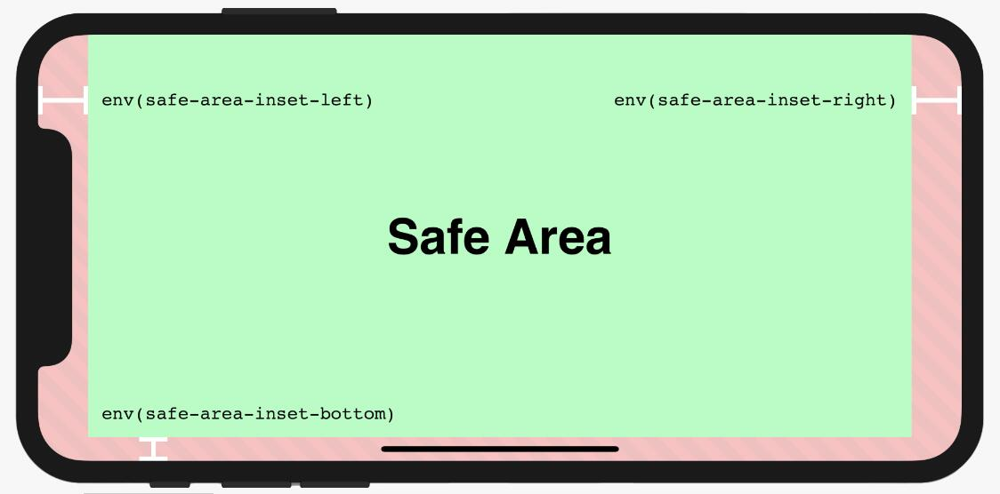

# 新iPhone X的边缘显示屏

https://webkit.org/blog/7929/designing-websites-for-iphone-x/?hmsr=funteas.com&utm_medium=funteas.com&utm_source=funteas.com


##　viewport-fit

* viewport-fit = cover 填充整个屏幕
```html
<meta name='viewport' content='initial-scale=1, viewport-fit=cover'>
```

## 安全区



WebKit的iOS中11包括一个新的CSS功能，
* env() | constant()以及一组四个预定义的环境变量，constant（）已被删除并被env（）取代
* safe-area-inset-left，
* safe-area-inset-right，
* safe-area-inset-top，
* safe-area-inset-bottom

```css
.post {
    padding: 12px;
    padding-left: env(safe-area-inset-left);
    padding-right: env(safe-area-inset-right);
}
```