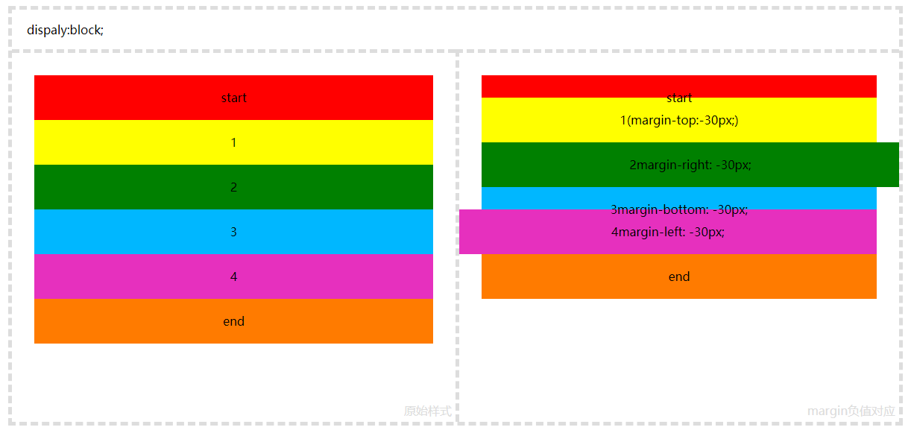
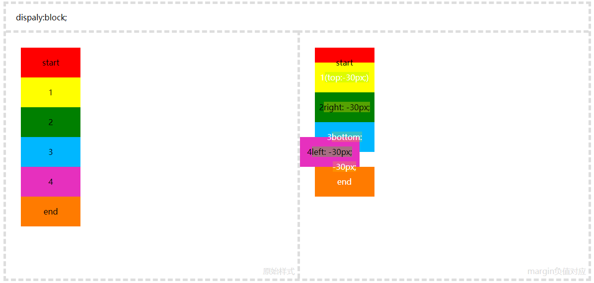
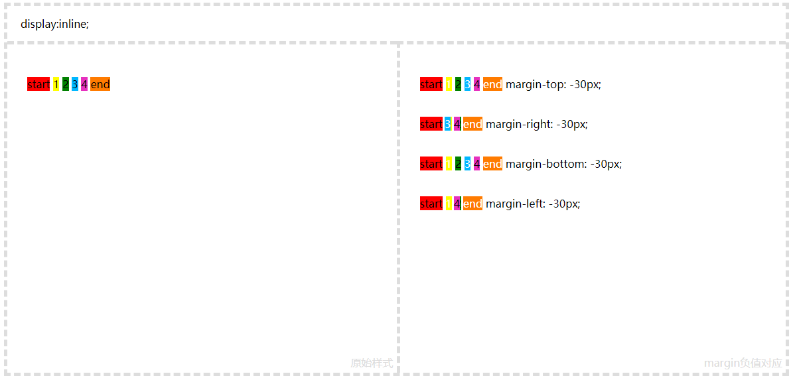
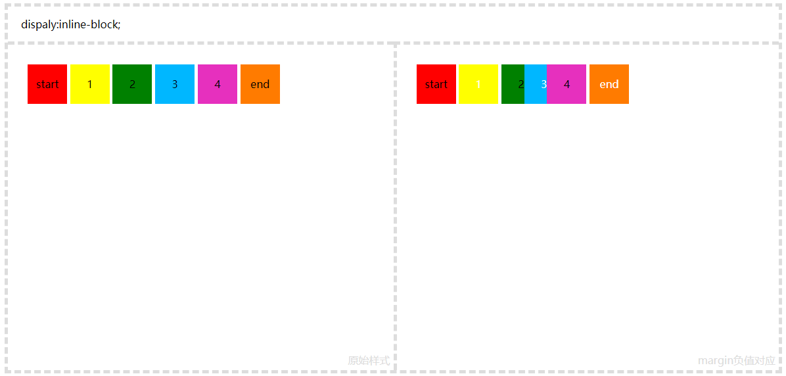
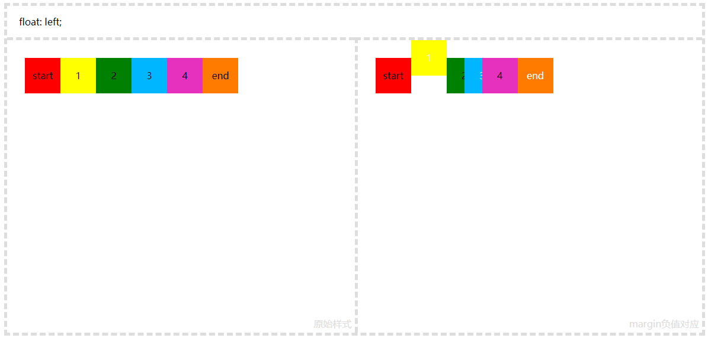
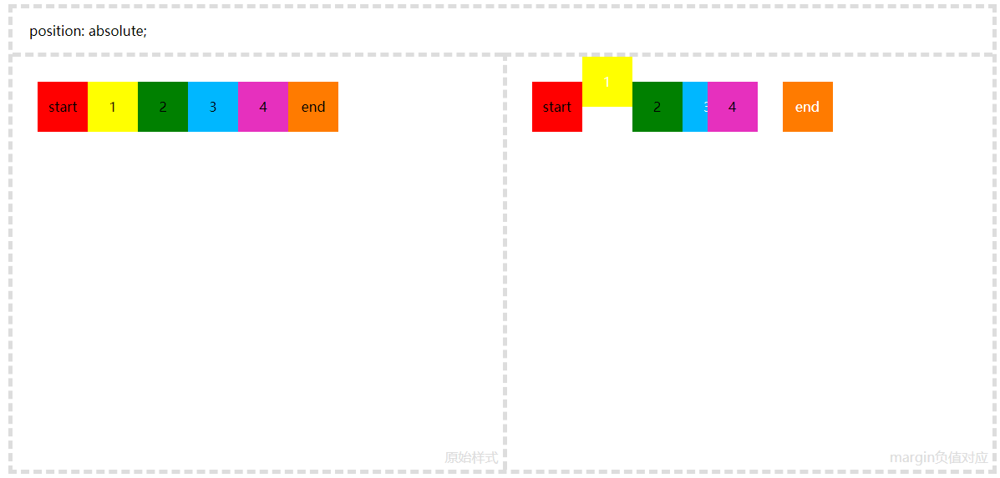
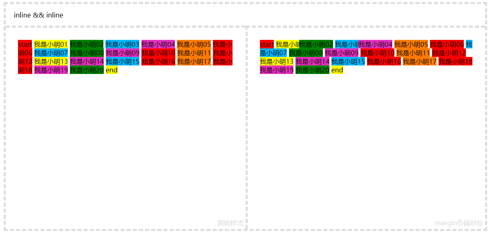
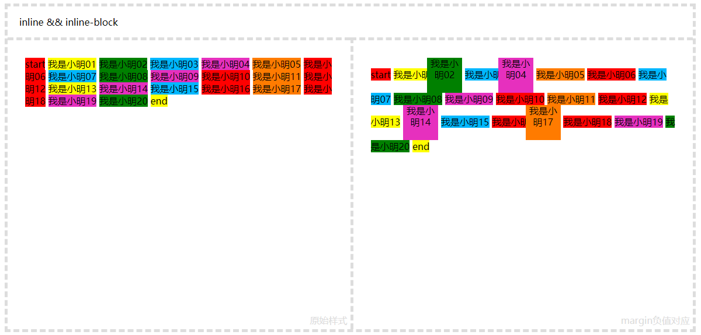
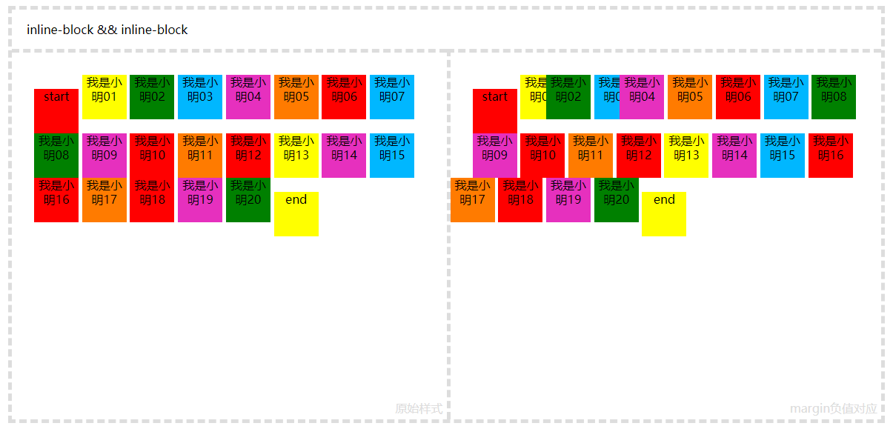
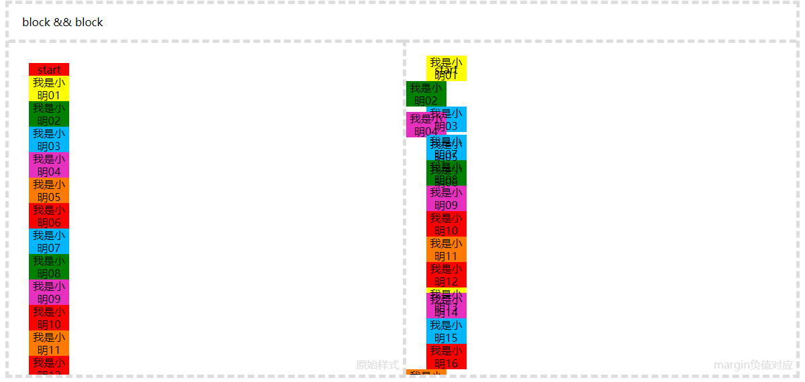

# Margin负值介绍

应用：
* 应用普通元素
    * dispaly:block;
    * dispaly:block(width、height);
    * display:inline;
    * display:inline-block;
* 应用float元素;
* 应用于postion元素;

为了方便理解这里`假设`两个高度，两个宽度`(仅为理解)`：
* `clientHeight` 可视高度（即肉眼得到的高度）;
* `clientWidth` 可视宽度（即肉眼得到的宽度）;
* `readHeight` 隐式高度 css读取的高度，可能大于或小于`clientHeight`,不影响可视高度 ;  
* `readWidth` 隐式高度 css读取的宽度，可能大于或小于`clientWidth`,不影响可视宽度 ;  
`通常认为：clientHeight==readHeight clientWidth==readWidth`

下面所有demo  
`1=margin-top: -30px;  `  
`2=margin-right: -30px;  `  
`3=margin-bottom: -30px;  `  
`4=margin-left: -30px;`

> dispaly:block;



margin-top:readHeight从`顶部变小` 表现出元素向上移动  
margin-right:元素宽度向右增加  
margin-bottom:readHeight从`底部变小` 表现出元素`无位移`，但next元素则表现出向上移动  
margin-left:元素宽度向左增加

>  dispaly:block(width、height);



margin-top:readHeight从`顶部变小` 表现出元素向上移动  
margin-right:readWidth从`右变小` 表现出元素`无位移`
margin-bottom:readHeight从`底部变小` 表现出元素`无位移`，但next元素则表现出向上移动  
margin-left:readWidth从`左变小` 表现出元素`向左移动`

> display:inline;



margin-top:无表现  
margin-right:readWidth从`右变小` 表现出元素`无位移`，但next元素则表现出向左移动  
margin-bottom:无表现  
margin-left:readWidth从`左变小` 表现出元素`向左移动`

> display:inline-block;



margin-top:无表现  
margin-right:readWidth从`右变小` 表现出元素`无位移`，但next元素则表现出向左移动  
margin-bottom:无表现  
margin-left:readWidth从`左变小` 表现出元素`向左移动`

> float元素



margin-top:readHeight从`顶部变小` 表现出元素向上移动   
margin-right:readWidth从`右变小` 表现出元素`无位移`，但next元素则表现出向左移动  
margin-bottom:readHeight从`底部变小` 表现出元素`无位移`
margin-left:readWidth从`左变小` 表现出元素`向左移动`

> position: absolute;



margin-top:表现出元素向上移动   
margin-right:无表现   
margin-bottom:无表现   
margin-left:表现出元素向左移动   


# 几种特殊的情况

## 对子元素的影响 ##  

>  inline && inline



margin-top:无表现
margin-right:readWidth从`右变小` 表现出元素`无位移`，但next元素则表现出向左移动，next元素覆盖当前right内容   
margin-bottom:无表现   
margin-left:readWidth从`左变小` 表现出元素`向左移动`，当前内容覆盖prve的元素内容   

>  inline && inline-block



表现与 `inline && inline` 相同

>  inline-block && inline-block



表现与 `inline && inline` 相同


>  block && block



## 内容将覆盖prve的元素，但`文字无法覆盖` ##

margin-top:readHeight从`顶部变小` 表现出元素向上移动    
margin-right:readWidth从`右变小` 表现出元素`无位移`   
margin-bottom:readHeight从`底部变小` 表现出元素`无位移`  
margin-left:readWidth从`左变小` 表现出元素`向左移动`  

> inline && float

表现与 `block && block` 相同

# 常见布局应用(网上摘录)

> 左右固定，中间自适应（双飞翼）
```html
<style>
*{
        margin:0;
        padding: 0
    }
    .main{
        float: left;
        width: 100%;

    }
    .main .main-content{
        margin: 0 210px;
        background-color: rgba(33, 114, 214, 0.8);
        height: 500px
    }
    .left{
        width: 200px;
        float: left;
        background-color: rgba(255, 82, 0, 0.8);
        margin-left: -100%;
        height: 200px

    }
    .right{
        width: 200px;
        height: 200px;
        margin-left: -200px;
        float: left;
        background-color: rgba(90, 243, 151, 0.8);
    }
</style>
<div class="main">
            <div class="main-content">main content</div>
</div>
<div class="left">left</div>
<div class="right">right</div>
```

> 去除列表右边框

```html
<style>
.container{
        margin:0 auto;
        width: 500px;
        border: 1px #ccc solid;
        margin-bottom: 20px;
}
.list{
    overflow: hidden;
    margin-right: -10px;

}
.list li{
    width:92px;
    height: 92px;
    background-color: #ccc;
    margin-bottom: 20px;
    float: left;
    margin-right: 10px;
}
</style>
<div class="container">
    <ul class="list">
        <li>我是一个列表</li>
        <li>我是一个列表</li>
        <li>我是一个列表</li>
        <li>我是一个列表</li>
        <li>我是一个列表</li>
        <li>我是一个列表</li>
        <li>我是一个列表</li>
        <li>我是一个列表</li>
        <li>我是一个列表</li>
        <li>我是一个列表</li>
    </ul>
</div>
```

> 负边距+定位：水平垂直居中(`只有在知道子元素的高宽`)

```html
<style></style>
<div style="style="position: relative;width:500px;height: 500px;"">
<div style="width:200px;height: 200px;position: absolute;top:50%;left:50%;margin-left: -100px;margin-top:-100px;"></div>
</div>
```
> 单边框实现

```html
<style>
    .list div {
        float: left;
        border: 1px solid #ddd;
        width: 100px;
        height: 100px;
        margin: -1px -1px 0 0;
    }
    </style>
    <div class="list">
        <div></div>
        <div></div>
        <div></div>
        <div></div>
        <div></div>
        <div></div>
        <div></div>
        <div></div>
    </div>
```

> 去除列表最后一个li元素的border-bottom

```html
<style>
    ul.table{
        border:1px #ccc solid;
        margin-top:100px;
    }
    ul.table li{
        border-bottom: 1px #ccc solid;
        list-style: none;
        margin-bottom: -1px;
    }
    </style>
    <ul class="table"> 
        <li>I am li</li>
        <li>I am li</li>
        <li>I am li</li>
        <li>I am li</li>
        <li>I am li</li>
    </ul>
```

> 多列等高

利用margin-bottom为负值会减少css读取元素高度(`readHeight`)的特性，加上padding-bottom和overflow:hidden,就能做一个未知高度的多列等高布局（当然也可以用table）
```html
<style>
    .container{
        margin:0 auto;
        width: 100%;
        overflow: hidden;
    }
    .left{
        height: 50px;
        width: 33.33%;
        margin-bottom: -5000px;
        padding-bottom: 5000px;
        float: left;
        background-color: rgba(33, 114, 214, 0.8);
    }
    .main{
        height:100px;
        margin-bottom: -5000px;
        width: 33.33%;
        float: left;
        padding-bottom: 5000px;
        background-color: rgba(255, 82, 0, 0.8);
    }
    .right{
        width: 33.33%;
        float: left;
        margin-bottom: -5000px;
        padding-bottom: 5000px;
        background-color: rgba(90, 243, 151, 0.8)
    }
</style>
<div class="container">
    <div class="left"> height:50px</div>
    <div class="main">height:100px</div>
    <div class="right">height:30px</div>
</div>
```

## 更多参考

https://www.jianshu.com/p/549aaa5fabaa  
https://www.cnblogs.com/xiaohuochai/p/5314289.html

> 表现

　　虽然margin可以应用到所有元素，但display属性不同时，表现也不同

　　【1】block元素可以使用四个方向的margin值

　　【2】inline元素使用上下方向的margin值无效

　　【3】inline-block使用上下方向的margin负值看上去无效

　　　　[注意]inline-block使用上下方向的margin负值只是看上去无效，这与其默认的vertical-align:baseline有关系，当垂直对齐的属性值为其他值时，则会显示不同的视觉效果

> 重叠

　　margin负值并不总是后面元素覆盖前面元素，它与元素display属性有关系

　　【1】两个block元素重叠时，后面元素可以覆盖前面元素的背景，但无法覆盖其内容

　　【2】当两个inline元素，或两个line-block元素，或inline与inline-block元素重叠时，后面元素可以覆盖前面元素的背景和内容

　　【3】当inline元素(或inline-block元素)与block元素重叠时，inline元素(或inline-block元素)覆盖block元素的背景，而内容的话， 后面的元素覆盖前面的元素

　　综上所述，个人理解，在普通流布局中，浏览器将页面布局分为内容和背景，内容的层叠显示始终高于背景。block元素分为内容和背景，而inline元素或inline-block元素，它本身就是内容(包括其背景等样式设置)

> 浮动

　　【1】block元素与浮动元素重叠时，其边框和背景在该浮动元素之下显示，而内容在浮动元素之上显示

　　【2】inline或inline-block元素与浮动元素重叠时，其边框、背景和内容都在该浮动元素之上显示

> 定位

　　【1】定位元素(position不为static)`覆盖其他元素的背景和内容`

　　【2】将relative属性值应用于inline元素，由于无法改变其行内元素的本质，所以其上下margin依然存在问题