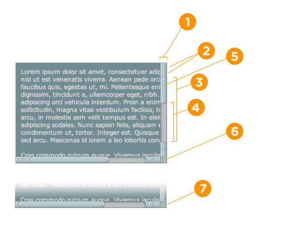

# 定制滚动条

```css
::-webkit-scrollbar              { /* 1 整个滚动条*/ }
::-webkit-scrollbar-button       { /* 2 滚动条上的按钮 (上下箭头).*/ } 
::-webkit-scrollbar-track        { /* 3 滚动条轨道*/ }
::-webkit-scrollbar-track-piece  { /* 4 滚动条没有滑块的轨道部分*/ }
::-webkit-scrollbar-thumb        { /* 5 滚动条上的滚动滑块*/ }
::-webkit-scrollbar-corner       { /* 6 当同时有垂直滚动条和水平滚动条时交汇的部分.*/ }
::-webkit-resizer                { /* 7 某些元素的corner部分的部分样式(例:textarea的可拖动按钮).*/ }
```



原文 https://webkit.org/blog/363/styling-scrollbars/
```
:horizontal – The horizontal pseudo-class applies to any scrollbar pieces that have a horizontal orientation.

:vertical – The vertical pseudo-class applies to any scrollbar pieces that have a vertical orientation.

:decrement – The decrement pseudo-class applies to buttons and track pieces. It indicates whether or not the button or track piece will decrement the view’s position when used (e.g., up on a vertical scrollbar, left on a horizontal scrollbar).

:increment – The increment pseudo-class applies to buttons and track pieces. It indicates whether or not a button or track piece will increment the view’s position when used (e.g., down on a vertical scrollbar, right on a horizontal scrollbar).

:start – The start pseudo-class applies to buttons and track pieces. It indicates whether the object is placed before the thumb.

:end – The end pseudo-class applies to buttons and track pieces. It indicates whether the object is placed after the thumb.

:double-button – The double-button pseudo-class applies to buttons and track pieces. It is used to detect whether a button is part of a pair of buttons that are together at the same end of a scrollbar. For track pieces it indicates whether the track piece abuts a pair of buttons.

:single-button – The single-button pseudo-class applies to buttons and track pieces. It is used to detect whether a button is by itself at the end of a scrollbar. For track pieces it indicates whether the track piece abuts a singleton button.

:no-button – Applies to track pieces and indicates whether or not the track piece runs to the edge of the scrollbar, i.e., there is no button at that end of the track.

:corner-present – Applies to all scrollbar pieces and indicates whether or not a scrollbar corner is present.

:window-inactive – Applies to all scrollbar pieces and indicates whether or not the window containing the scrollbar is currently active. (In recent nightlies, this pseudo-class now applies to ::selection as well. We plan to extend it to work with any content and to propose it as a new standard pseudo-class.)
```

```
:horizontal 水平伪类适用于任何具有水平方向的滚动条。

:vertical 垂直伪类适用于任何垂直方向的滚动条。

:decrement 递减伪类适用于-webkit-scrollbar-button和-webkit-scrollbar-track-piece。它指示按钮或轨道片段在使用时是否将递减视图的位置（例如，在垂直滚动条上，左侧水平滚动条上）

:increment 增量伪类应用于-webkit-scrollbar-button和-webkit-scrollbar-track-piece。它指示按钮或轨道片段在使用时是否将增加视图的位置（例如，在垂直滚动条上，在水平滚动条上的右边）。

:start 开始伪类适用于-webkit-scrollbar-button和-webkit-scrollbar-track-piece。它指示对象是否放在滑块之前。

:end  结束伪类适用于-webkit-scrollbar-button和-webkit-scrollbar-track-piece。它指示对象是否放在滑块后面。

:double-button 双按钮伪类应用于-webkit-scrollbar-button和-webkit-scrollbar-track-piece。它用于检测按钮是否位于滚动条同一端的一对按钮的一部分。对于轨道部件，它指示轨道部件是否邻接一对按钮。

:single-button  单按钮伪类适用于-webkit-scrollbar-button和-webkit-scrollbar-track-piece。它用于检测按钮本身是否在滚动条的末尾。对于轨道片段，它指示轨道片段是否邻接单个按钮。

:no-button 适用于跟踪棋子并指示棋子是否跑到滚动条的边缘，即在棋子的那一端没有按钮。

:corner-present 适用于所有滚动条，并指示滚动条角是否存在。

:window-inactive 适用于所有滚动条，并指示包含滚动条的窗口当前是否处于活动状态。（在最近的夜晚，这个伪类现在也适用于:: selection，我们计划扩展它以处理任何内容，并将其作为一个新的标准伪类提出来。）

```
`另外：enabled，：disabled，：hover和：active伪类也可用于滚动条。`