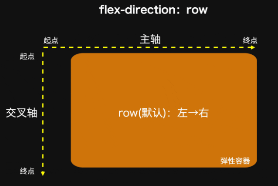
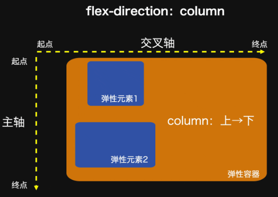
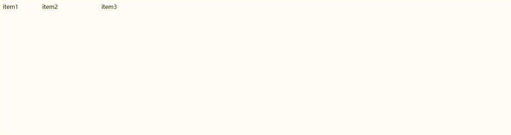

# display: flex;

https://developer.mozilla.org/en-US/docs/Glossary/Flex
https://www.cnblogs.com/qcloud1001/p/9848619.html

容器属性:
* flex-flow  == flex-drection + flex-wrap
* flex-direction：`row`|column|row-reverse|column-reverse 水平|垂直|水平反转|垂直反转
* flex-wrap：`nowrap`|wrap|wrap-reverse 可使得主轴上的元素不折行、折行、反向折行。
* justify-content:`normal`
* align-items `stretch`|flex-start|flex-end|center
* align-content

元素属性

* order：排序
* flex-grow:`0` 放大比例 当子项总和小于容器时生效
* flex-shrink:`1` 缩小比例 当子项总和大于容器时生效
* flex-basis：`auto` 默认值，权值大于width 
* flex： flex-grow flex-shrink  flex-basis
* align-self 相对align-items 但针对flex子项

## `主轴`

  

  



## justify-content 相对于主轴

`normal` 项目打包在默认位置,网格和弹性容器中表现为拉伸。

normal | \<content-distribution\> | \<overflow-position\>? [ <content-position> | left | right ]  

\<content-distribution\> = space-between | space-around | space-evenly | stretch  
\<overflow-position\> = unsafe | safe  
\<content-position\> = center | start | end | flex-start | flex-end  

## align-items 相对交叉轴

* stretch 拉升，导致flex 高/宽 100%;
* flex-start
* flex-end
* center


## flex

默认值：  
flex-grow：0   
flex-shrink：1  
flex-basis：auto

* flex: 1 =「1 1 0%」

* flex: auto=「1 1 auto」

* flex: none=「0 0 auto」 // 常用于固定尺寸 不伸缩

* 如果「flex: 0 auto」或者「flex: initial」, 则其计算值为「0 1 auto」，即「flex」初始值  


## flex-shrink:1 缩小比例

当不够分配时，元素都将等比例缩小，占满整个宽度

根据各子项的宽度比率，平均拆分多出的宽度。

```html
<div style="width:500px;display:flex;">
    <div style="width:200px;flex-shrink:1">item1</div>
    <div style="width:300px;flex-shrink:1">item2</div>
    <div style="width:400px;flex-shrink:1">item3</div>
</div>
```
sum=200*flex-shrink+300*flex-shrink+400*flex-shrink=900
_d=sum-500=400  
各子项的宽度比率：
item1=200/900  
item2=300/900
item3=400/900

item1-width=200-400*200/900 =111.111
item1-width=300-400*300/900 =166.666
item1-width=400-400*400/900 =222.222

 


## flex-grow:0 放大比例

参考 flex-shrink