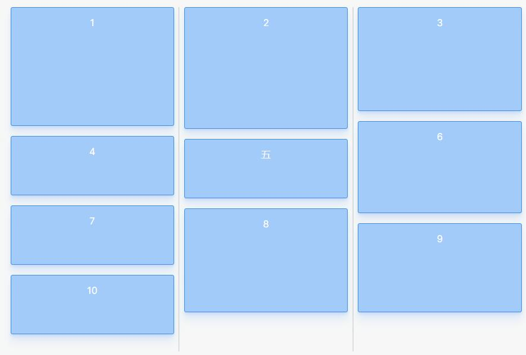

<!-- TOC -->

- [CSS 砌体流布局](#css-%E7%A0%8C%E4%BD%93%E6%B5%81%E5%B8%83%E5%B1%80)
- [CSS之文本两端对齐](#css%E4%B9%8B%E6%96%87%E6%9C%AC%E4%B8%A4%E7%AB%AF%E5%AF%B9%E9%BD%90)
- [transform 对 position:fixed 失效](#transform-%E5%AF%B9-positionfixed-%E5%A4%B1%E6%95%88)
- [去除input[type=number]的默认样式](#%E5%8E%BB%E9%99%A4inputtypenumber%E7%9A%84%E9%BB%98%E8%AE%A4%E6%A0%B7%E5%BC%8F)
- [文字在手机端下移](#%E6%96%87%E5%AD%97%E5%9C%A8%E6%89%8B%E6%9C%BA%E7%AB%AF%E4%B8%8B%E7%A7%BB)
- [背景图片居中模糊](#%E8%83%8C%E6%99%AF%E5%9B%BE%E7%89%87%E5%B1%85%E4%B8%AD%E6%A8%A1%E7%B3%8A)
- [在 iOS Safari 浏览器中，100vh 的行为可能会出现一些问题](#%E5%9C%A8-ios-safari-%E6%B5%8F%E8%A7%88%E5%99%A8%E4%B8%AD100vh-%E7%9A%84%E8%A1%8C%E4%B8%BA%E5%8F%AF%E8%83%BD%E4%BC%9A%E5%87%BA%E7%8E%B0%E4%B8%80%E4%BA%9B%E9%97%AE%E9%A2%98)

<!-- /TOC -->

# CSS 砌体流布局

<https://tobiasahlin.com/blog/masonry-with-css/>



```css
/* Render items as columns */
.container {
  display: flex;
  flex-flow: column wrap;
  height:300px; // 这个高度必须有
}

/* Re-order items into rows */
.item:nth-child(3n + 1) {
  order: 1;
}
.item:nth-child(3n + 2) {
  order: 2;
}
.item:nth-child(3n) {
  order: 3;
}

/* Force new columns */
.container::before,
.container::after {
  content: "";
  flex-basis: 100%;
  width: 0;
  order: 2;
}
```

# CSS之文本两端对齐

```scss
// <div class="item">
//     <span class="label" >{{item.label}}</span>：
//     <span class="value">{{item.value}}</span>
// </div>

.label {
    display: inline-block;
    height: 100%;
    width: 100px;
    text-align: justify;
    vertical-align: top;
    &::after {
        display: inline-block;
        width: 100%;
        content: '';
        height: 0;
    }
}
```

*text-align-last ios不兼容

```scss
.label {
    display: inline-block;
    height: 100%;
    min-width: 100px;
    text-align: justify;
    text-align-last: justify;
}
```

# transform 对 position:fixed 失效

父级及以上有transform属性,fixed属性相当于转换成了absolute

# 去除input[type=number]的默认样式

```css
input[type=number] {
    -moz-appearance:textfield;
}
input[type=number]::-webkit-inner-spin-button,
input[type=number]::-webkit-outer-spin-button {
    -webkit-appearance: none;
    margin: 0;
}
```

# 文字在手机端下移

- 一般由于字体导致

```css
div{
 font-family: Chinese Quote,-apple-system,BlinkMacSystemFont,Segoe UI,PingFang SC,Hiragino Sans GB,Microsoft YaHei,Helvetica Neue,Helvetica,Arial,sans-serif,Apple Color Emoji,Segoe UI Emoji,Segoe UI Symbol;
}
```

# 背景图片居中模糊

- 可以在低ppi下会产品（未测试）
- 如果 容器尺寸/2!=图片尺寸/2 则产生模糊

```css
  width:45px;
  height:45px;
  background-image:url();// width:40px;height:40px; 会模糊
  background-position: center;
```

# 在 iOS Safari 浏览器中，100vh 的行为可能会出现一些问题

这是由于 Safari 在计算视窗高度时，将地址栏和工具栏的高度也计算在内，导致实际可视区域的高度小于视窗高度。当页面内容超过实际可视区域高度时，会触发滚动条的出现。

要解决这个问题，你可以尝试使用一些技巧来适应 iOS Safari 的行为。以下是一些可能的解决方案：

使用 100% 代替 100vh：将样式中的 100vh 替换为 100%，这样元素将使用父元素的高度，而不是视窗的高度。这可能需要父元素具有明确的高度或使用相对定位。

# margin无效

> 标签下无内容导致margin无法达到效果

```html
<!-- div 高度为60 -->
<div class="box0" style="margin: 30px 0 60px;"></div>
<!-- 解决办法 -->
<div class="box0" style="margin: 30px 0 60px;"></div>
<style>
.box0::before {
        content: '';
        display: table;
    }
</style>
```
