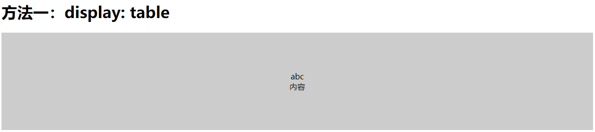
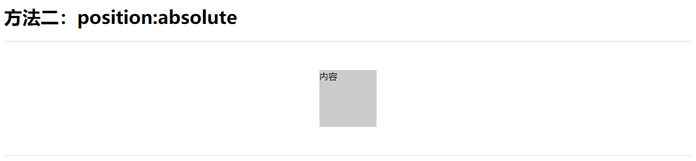
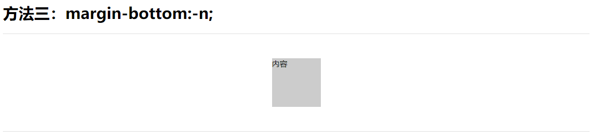
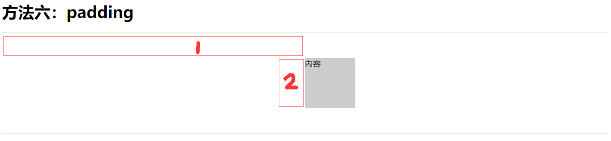

# 水平垂直居中

> display: table



```css
    <style>
    /*方法一*/
    .tab-wrapper { 
        display: table; 
        height: 200px; 
        width: 100%; 
        }

    .tab-cell {
        display: table-cell;
        text-align: center;
        vertical-align: middle; 
        background: #ccc; 
        }
    </style>

  <div class="tab-wrapper">
    <div class="tab-cell">内容</div>
  </div>
```


*此方法主要在于table特性，采用属性  
`text-align: center;vertical-align: middle;`

`*兼容：IE8+` 
> position:absolute


```css 
    <style>
    /*方法二*/
    .pos-wrapper { 
        position: relative; 
        height: 200px; 
        width: 100%; 
        border: 1px solid #ddd; 
        border-left: none; 
        border-right: none; 
        }

    .pos-cell { 
        position: absolute; 
        top: 50%;
        left:50%; 
        width: 100px; 
        height: 100px;
        margin-left: -50px; 
        margin-top: -50px; 
        background: #ccc; 
        }
    </style>

  <h1>方法二：position:absolute</h1>
  <div class="pos-wrapper">
    <div class="pos-cell">内容</div>
  </div>
    
```
此方法在于`margin`的负值应用！  

`*兼容：IE6+`  
`*注意：对于高宽未知的情况下，无效！`

> margin-bottom:-n;


```css 
    <style>
        /*方法三*/

    .flo-wrapper {
      position: relative;
      height: 200px;
      width: 100%;
      border: 1px solid #ddd;
      border-left: none;
      border-right: none;
    }

    .floater {
      height: 50%;
      margin-bottom: -50px;
    }

    .flo-cell {
      clear: both;
      width: 100px;
      height: 100px;
      margin: 0 auto;
      position: relative;
      background: #ccc;
    }
    </style>

  <h1>方法三：margin-bottom:-n;</h1>
  <div class="flo-wrapper">
    <div class="floater">
    </div>
    <div class="flo-cell">内容</div>
  </div>
```
原理根方法二一样，在于`margin`的负值应用！  
通过一个元素占用容器一半高度，再用margin-bottom:-内容1/2高度;

`*兼容：IE6+`  
`*注意：对于高度未知的情况下，无效！`

> position:absolute margin:auto

```css 
    <style>
    /*方法四*/
    .mar-wrapper {
      position: relative;
      height: 200px;
      width: 100%;
      border: 1px solid #ddd;
      border-left: none;
      border-right: none;
    }

    .mar-cell {
      position: absolute;
      top: 0;
      bottom: 0;
      left: 0;
      right: 0;
      margin: auto;
      height: 100px;
      width: 100px;
      background: #ccc;
    }
    </style>

  <h1>方法四：position:absolute margin:auto</h1>
  <div class="mar-wrapper">
    <div class="mar-cell">内容</div>
  </div>
```
此方法在于以下几个必需属性`原理百度一下`
```css
position: absolute;
top: 0;
bottom: 0;
left: 0;
right: 0;
margin: auto;
```
` *兼容：IE8+`  
` *注意：由于对于高宽未知的情况下高宽视为100%，则无效！`  
` *注意：支持已知高宽（高宽可为百分比）`

> line-height

```css
    <style>
    .line-wrapper {
      height: 200px;
      width: 100%;
      border: 1px solid #ddd;
      border-left: none;
      border-right: none;
    }

    .line-text {
      line-height: 200px;
      text-align: center;
    }
    </style>

  <h1>方法五：line-height</h1>
  <div class="line-wrapper">
    <div class="line-text">内容</div>
  </div>

```
常用于文本  
` *兼容：IE6+`  

> line-height 变体

```css 
    <style>
    .line-wrapper {
      text-align: center;
    }

    .line-wrapper:after {
      content: '';
      display: inline-block;
      height: 100%;
      vertical-align: middle;
    }

    .line-cell {
      display: inline-block;
      width: 100px;
      height: 100px;
      background: #ccc;
      vertical-align: middle;
    }

    </style>

  <h1>方法五变体：line-height</h1>
  <div class="line-wrapper">
    <div class="line-cell">内容</div>
  </div>
```
此方法原理就是两个元素垂直居中对齐，一个元素的高度必须是容器高度！  
上方法如果需要兼容ie6、7可以将：after换成其他标签  
` *兼容：IE6+`  


> padding

```css 
    <style>
    /*方法六*/

    .pad-wrapper {
      width: 100%;
      border: 1px solid #ddd;
      border-left: none;
      border-right: none;
      padding: 50px 50%;
      box-sizing: border-box;
    }

    .pad-cell {
      width: 100px;
      height: 100px;
      background: #ccc;
      margin-left: -50px;
    }
    </style>
  <div class="pad-wrapper">
    <div class="pad-cell">内容</div>
  </div>
```
此方法在容器必需属性：
```css
padding: 50px 50%;
box-sizing: border-box;
```
子元素
```css
margin-left: -50px;
```

原理很简单box-sizing让宽度包含border+padding，上图`①` 位置即50%的宽度，将子元素向左移动一半宽度即可！

` * 兼容：IE8+`  
` * 不推荐使用`


> css3 Flexbox

```css 
    <style>
     /*方法七*/
    .box-wrapper {
      display: -webkit-box;
      display: -moz-box;
      display: -ms-flexbox;
      display: -webkit-flex;
      display: flex;
      -webkit-align-items: center;
      align-items: center;
      -webkit-justify-content: center;
      justify-content: center;
      width: 100%;
      border: 1px solid #ddd;
      border-left: none;
      border-right: none;
      height: 200px;
    }

    .box-cell {
      width: 100px;
      height: 100px;
      background: #ccc;
    }
    </style>
  <h1>方法七：box</h1>
  <div class="box-wrapper">
    <div class="box-cell">内容</div>
  </div>
```
` * 兼容：IE10+`  

> css3 Transforms


```css 
    <style>
    /*方法八*/

    .transforms-wrapper {
      width: 100%;
      border: 1px solid #ddd;
      border-left: none;
      border-right: none;
      height: 200px;
      position: relative;
    }

    .transforms-cell {
      width: 100px;
      height: 100px;
      background: #ccc;
      position: absolute;  
      top: 50%; left: 50%;  
  -webkit-transform: translate(-50%,-50%);  
          transform: translate(-50%,-50%);  
    }
    </style>
  <h1>方法八：Transforms</h1>
  <div class="transforms-wrapper">
    <div class="transforms-cell">内容</div>
  </div>
```
原理与方法二相同区别在与`不需要知道子元素的高宽`  
` * 兼容：IE10+`  
> 


```css 
    <style>
    
    </style>

```