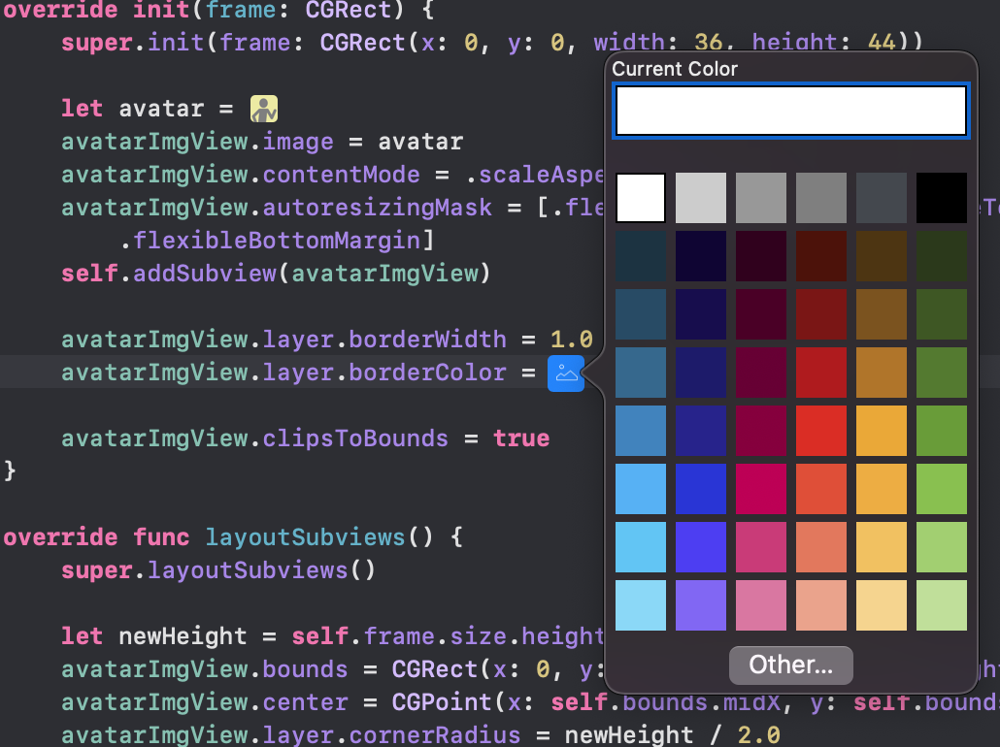
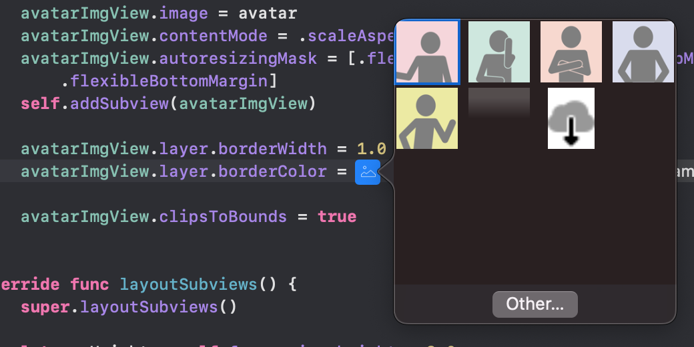

<!-- @import "[TOC]" {cmd="toc" depthFrom=1 depthTo=6 orderedList=false} -->

<!-- code_chunk_output -->

- [小技巧](#小技巧)
  - [使用颜色选择器和图像列表直接在代码中设置颜色和图像](#使用颜色选择器和图像列表直接在代码中设置颜色和图像)

<!-- /code_chunk_output -->


# 小技巧

## 使用颜色选择器和图像列表直接在代码中设置颜色和图像

https://designcode.io/swiftui-handbook-color-literals

```swift
#colorLiteral()
#imageLiteral()
```



-----------------------



