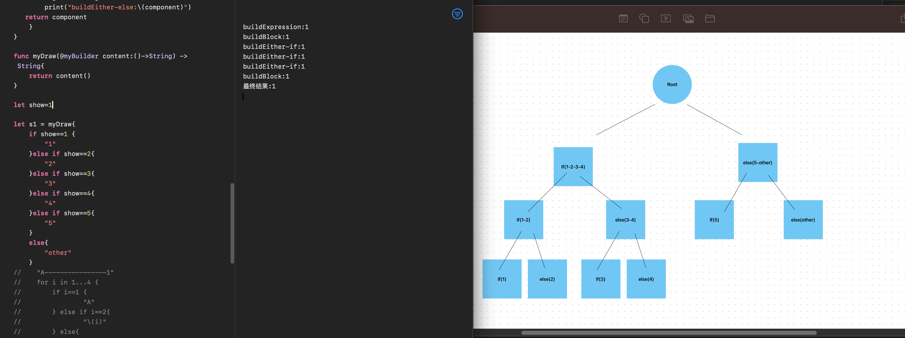

# resultBuilder 结果构造器

https://www.kodeco.com/39798703-swift-result-builders-getting-started
https://docs.swift.org/swift-book/documentation/the-swift-programming-language/advancedoperators/#Result-Builders
https://docs.swift.org/swift-book/documentation/the-swift-programming-language/attributes/#resultBuilder

https://github.com/carson-katri/awesome-result-builders

```swift
@resultBuilder
enum CipherBuilder {
  static func buildBlock(_ components: String...) -> String {
    components
      .joined(separator: " ")
      .replacingOccurrences(of: "e", with: "🥚")
  }
}

@CipherBuilder
func buildEggCipherMessage() -> String {
  "A secret report within the guild."
  "4 planets have come to our attention"
  "regarding a plot that could jeopardize spice production."
}
```
## 理解

值得探索这里正在发生的事情。您只是在buildEggCipherMessage()的正文中列出字符串。没有逗号，也不是数组。那么它是如何运作的呢？

编译器根据您在CipherBuilder中定义的规则重写buildEggCipherMessage()的主体。因此，当Xcode编译此代码时：

```swift
{
  "A secret report within the guild."
  "4 planets have come to our attention"
  "regarding a plot that could jeapardize spice production."
}

// 假设转换为:
return CipherBuilder.buildBlock(
  "A secret report within the guild.",
  "4 planets have come to our attention",
  "regarding a plot that could jeapardize spice production."
)
```


## 图解工作

```swift
@resultBuilder
struct myBuilder {
    static func buildBlock(_ components: String...) -> String {       
        let s = components.joined(separator: "")
        print("buildBlock:\(s)")
        return s
    }
    
    static func buildExpression(_ expression: String) -> String {
            print("buildExpression:\(expression)")
            return expression
        }
    
    static func buildArray(_ components: [String]) -> String {
        print("buildArray:\(components)")
      return  components.joined(separator: "")
    }
    
    static func buildEither(first component: String) -> String {
        print("buildEither-if:\(component)")
    return component
    }
    
    static func buildEither(second component: String) -> String {
        print("buildEither-else:\(component)")
   return component
    }
}

func myDraw(@myBuilder content:()->String) -> String{
    return content()
}

let show=4

let s1 = myDraw{
    if show==1 {
        "1"
    }else if show==2{
        "2"
    }else if show==3{
        "3"
    }else if show==4{
        "4"
    }else if show==5{
        "5"
    }
    else{
        "other"
    }
}

print("最终结果:\(s1)")
```

