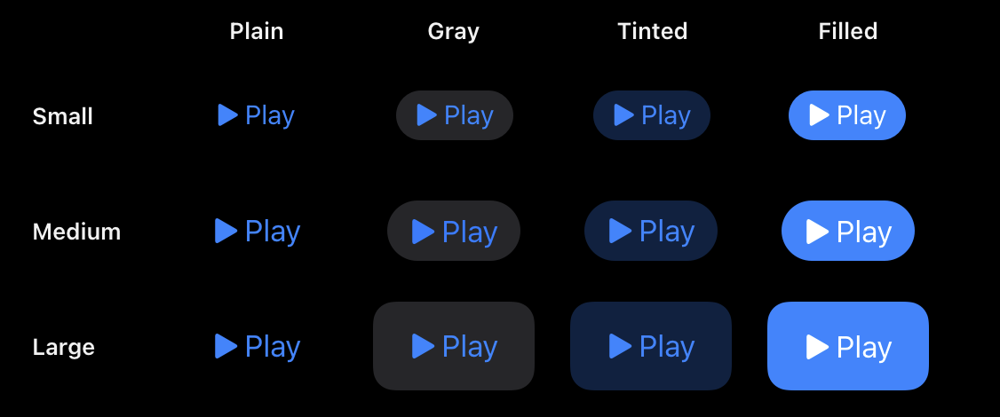
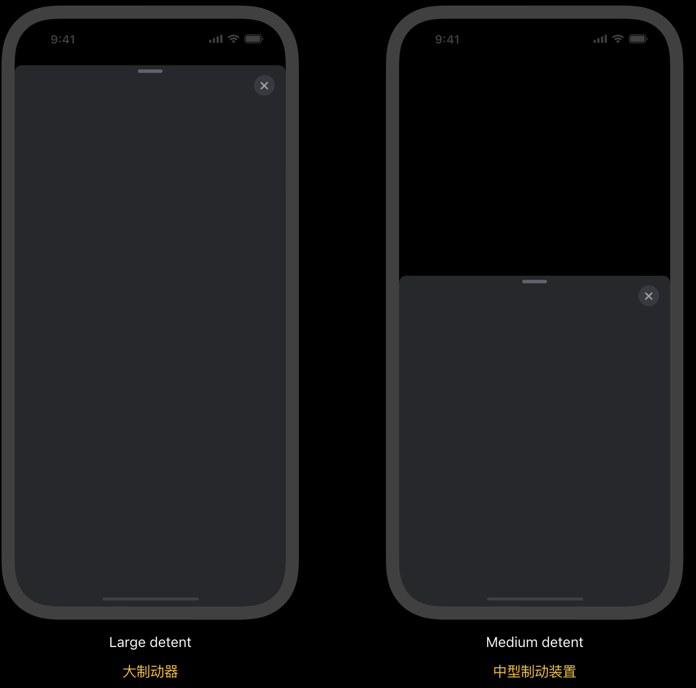
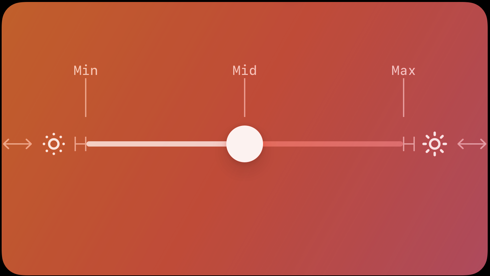
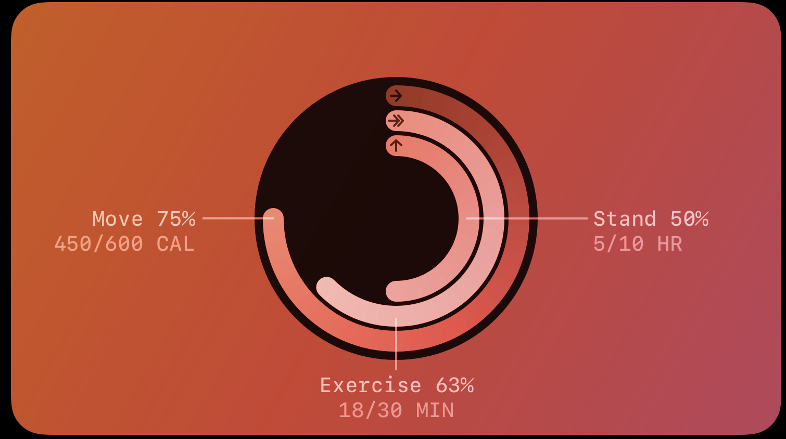
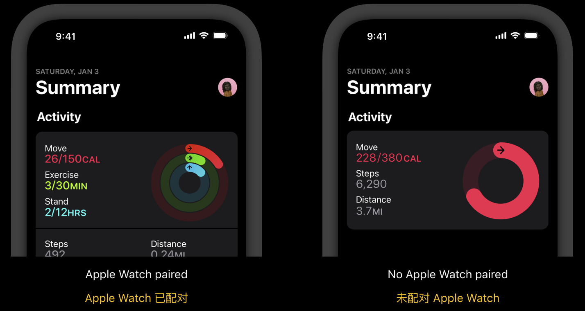

# Design

<https://developer.apple.com/design/human-interface-guidelines/designing-for-ios>

## Getting started

### 为 iOS 设计

* 通过限制屏幕控件的数量，同时以最少的交互即可发现次要细节和操作，帮助人们专注于主要任务和内容。
* 无缝适应外观变化——例如设备方向、深色模式和动态类型——让人们选择最适合他们的配置
* 支持适应人们通常握持设备方式的交互。例如，当控件位于显示屏的中间或底部区域时，人们往往会更容易、更舒适地触及控件，因此让人们滑动以向后导航或在列表行中启动操作尤其重要。
* 在获得人们的许可后，通过平台功能集成可用的信息，从而增强体验，而无需要求人们输入数据。例如，您可能接受付款、通过生物识别身份验证提供安全性或提供使用设备位置的功能。

## 基础

### Accessibility 无障碍

* Buttons and controls 按钮和控件 目标的尺寸至少需要为 44x44 pt

### App icons

* 对于 iOS、iPadOS 和 watchOS，您可以告诉 Xcode 从 1024×1024 px App Store 图标生成所有尺寸，或者您可以为部分或所有单个图标尺寸提供资源。
* 对于 macOS 和 tvOS，您需要提供所有尺寸；
* 对于visionOS，您提供单个1024x1024 px资源。
* 图标设计为方形图像。在大多数平台上，系统会应用一个遮罩，自动调整图标角以符合平台的美观。例如，visionOS 和 watchOS 自动应用圆形遮罩。
* iOS, iPadOS 平台注意事项
  * 应用程序图标的外观自定义为浅色、深色或有色

### colors

* iOS 定义了两组动态背景颜色——系统颜色和分组颜色——每组都包含主要、次要和第三种变体，可帮助您传达信息的层次结构。一般来说，当您有分组表视图时，请使用分组背景颜色（ systemGroupedBackground 、 secondarySystemGroupedBackground 和 tertiarySystemGroupedBackground ）；否则，使用系统背景颜色集（ systemBackground 、 secondarySystemBackground 和 tertiarySystemBackground ）。

### Dark Mode 深色模式

### Icons 图标

### Images 图片

* iPadOS, watchOS @2x
* iOS @2x 和 @3x
* visionOS @2x或更高（详情请参阅visionOS）
* macOS, tvOS @1x 和 @2x

### Layout

* 不同的设备屏幕尺寸、分辨率和色彩空间
* 不同的设备方向（纵向/横向）
* 动态岛和摄像机控制等系统功能
* iPad 上的外部显示器支持、显示缩放和多任务处理模式
* 动态类型文本大小更改
* 基于区域设置的国际化功能，例如从左到右/从右到左布局方向、日期/时间/数字格式、字体变化和文本长度
* Visual hierarchy 视觉层次
  * 人们通常首先按阅读顺序查看项目，即从上到下、从前导到尾随，因此将最重要的项目放置在窗口、显示屏或字段的顶部和前导侧附近通常效果很好看法。
  * 创建视觉分组以帮助人们找到他们想要的信息。例如，您可以使用负空间、背景形状、颜色、材料或分隔线来显示元素何时相关并将信息分隔到不同的区域。
  * 考虑提供视觉提示来帮助人们发现当前隐藏的内容。例如，如果您无法一次显示大型集合中的所有项目，则需要指示还有当前不可见的其他项目。根据平台的不同，您可能会显示部分项目以暗示人们可以通过与视图交互（例如通过滚动）来显示其他内容。
  * 通过在交互组件周围提供足够的空间，使交互组件易于发现。如果交互式组件太靠近，或者其他内容挤满了它们，那么人们可能很难区分这些组件，这可能会使您的应用程序或游戏难以使用。
* Guides and safe areas 指南和安全区域
  * 布局指南定义了一个矩形区域，可帮助您在屏幕上定位、对齐和间隔内容。该系统包括预定义的布局指南，可以轻松地在内容周围应用标准边距并限制文本宽度以获得最佳可读性。您还可以定义自定义布局指南。有关开发人员指南，请参阅 UILayoutGuide 和 NSLayoutGuide 。
  * 安全区域定义视图中未被导航栏、选项卡栏、工具栏或窗口可能提供的其他视图覆盖的区域。安全区域对于避免设备的交互和显示功能至关重要，例如 iPhone 上的动态岛或某些 Mac 型号上的摄像头外壳。有关开发人员指南，请参阅相对于安全区域定位内容。
* 扩展视觉内容以填满屏幕。确保背景和全屏图稿延伸到显示屏的边缘。还要确保可滚动布局一直延伸到设备屏幕的底部。
* 插入全角按钮。遵守全角按钮两侧的标准系统定义边距。屏幕底部的全角按钮通常在具有圆角并且与安全区域底部对齐时看起来效果最好，这也确保它不会与主屏幕指示器冲突。
* 尽可能避免将交互式控件放置在屏幕的底部边缘。
* 为不同的状态栏高度做好准备。如果您在状态栏下方显示内容，则可以使用安全区域来帮助根据需要动态地重新定位内容。
* iOS keyboard layout guide iOS 键盘布局指南
  * iOS 提供了键盘布局指南，表示键盘当前占用的空间并说明安全区域插入。

### Materials 材料

材质通过模糊和修改底层视觉内容的颜色值来赋予半透明度。

半透明度可以改善前景和背景元素的融合，在视觉上传达层与层之间的分离，并帮助人们保留地方感。为了增强半透明度，材料可以与活力结合起来。活力通过将颜色从材质后面向前拉，增强了文本、符号和填充等前景内容的深度感。

### Motion 运动

优美、流畅的动作使界面栩栩如生，传达状态，提供反馈和指导，并丰富应用或游戏的视觉体验。

### Privacy 隐私

* 必须请求访问权限的几个示例
  * 个人数据，包括位置、健康、财务、联系方式和其他个人识别信息
  * 用户生成的内容，例如电子邮件、消息、日历数据、联系人、游戏信息、Apple Music 活动、HomeKit 数据以及音频、视频和照片内容
  * 受保护的资源，例如蓝牙外围设备、家庭自动化功能、Wi-Fi 连接和本地网络
  * 相机和麦克风等设备功能
  * 在全空间中运行的visionOS应用程序中，ARKit数据，例如手部跟踪、平面估计、图像锚定和世界跟踪
  * 设备的广告标识符，支持应用程序跟踪

## Components 组件

* charts
* image views
  * 图像视图中，您可以拉伸、缩放图像、调整大小以适合图像或将图像固定到特定位置。
  * 图像视图通常不是交互式的。
* Text views
  * 文本视图显示多行样式文本内容，可以选择对其进行编辑
  * 文本视图可以是任意高度，并且当内容延伸到视图之外时允许滚动。默认情况下，文本视图中的内容与前缘对齐并使用系统标签颜色。在 iOS、iPadOS 和 VisionOS 中，如果文本视图可编辑，则当人们选择该视图时会出现键盘。
* Web views
  * 在适当的时候支持前进和后退导航。 Web 视图支持前进和后退导航，但默认情况下此行为不可用。如果人们可能使用您的 Web 视图访问多个页面，请允许向前和向后导航，并提供相应的控件来启动这些功能。
  * WKWebView — WebKit <https://developer.apple.com/documentation/webkit/wkwebview>

### Layout and organization 布局和组织

* Boxes 盒子创建了一组视觉上不同的、逻辑上相关的信息和组件
  * 
  * 默认情况下，iOS 和 iPadOS 在框中使用第二和第三背景颜色(secondarySystemBackground 和 tertiarySystemBackground)。
  * GroupBox — SwiftUI https://developer.apple.com/documentation/SwiftUI/GroupBox
  * NSBox — AppKit https://developer.apple.com/documentation/appkit/nsbox
* Collections  集合管理一组有序的内容，并以可定制且高度可视化的布局呈现它。
  * 
  * 一般来说，集合非常适合显示基于图像的内容。
  * UICollectionView — UIKit https://developer.apple.com/documentation/uikit/uicollectionview 
  * NSCollectionView — AppKit https://developer.apple.com/documentation/appkit/nscollectionview
* Column views 列视图 列视图（也称为浏览器）允许人们使用一系列垂直列查看和导航数据层次结构。
  * 
  * NSBrowser — AppKit https://developer.apple.com/documentation/appkit/nsbrowser
* Disclosure controls  披露控件显示和隐藏与特定控件或视图相关的信息和功能。
  * 
  * 披露控件可在 iOS、iPadOS 和 VisionOS 中使用 SwiftUI DisclosureGroup 视图。
* Labels 标签是一段静态文本，人们可以阅读并经常复制，但不能编辑。
* Lists and tables 列表和表格
  * 
  * List — SwiftUI https://developer.apple.com/documentation/SwiftUI/List
  * Tables — SwiftUI https://developer.apple.com/documentation/SwiftUI/Tables
  * UITableView — UIKit https://developer.apple.com/documentation/uikit/uitableview
  * NSTableView — AppKit https://developer.apple.com/documentation/appkit/nstableview
* Lockups 锁定将多个单独的视图组合成一个交互式单元
  * iOS、iPadOS、macOS、visionOS 或 watchOS 不支持。
  * 每个锁定由内容视图、页眉和页脚组成
  * 四种类型的锁定：卡片、标题按钮、字母组合、海报
* Outline views 大纲视图在组织成列和行的单元格滚动列表中显示分层数据。
  * 
  * iOS、iPadOS、tvOS、visionOS 或 watchOS 不支持。
  * OutlineGroup — SwiftUI https://developer.apple.com/documentation/SwiftUI/OutlineGroup
  * NSOutlineView — AppKit https://developer.apple.com/documentation/appkit/nsoutlineview
* Split views 拆分视图管理多个相邻内容窗格的呈现，每个内容窗格都可以包含各种组件，包括表、集合、图像和自定义视图。
  * 
  * NavigationSplitView — SwiftUI https://developer.apple.com/documentation/SwiftUI/NavigationSplitView
  * UISplitViewController — UIKit https://developer.apple.com/documentation/uikit/uisplitviewcontroller
  * NSSplitViewController — AppKit https://developer.apple.com/documentation/appkit/nssplitviewcontroller
* Tab views 选项卡视图在同一区域中呈现多个互斥的内容窗格，人们可以使用选项卡式控件在这些窗格之间进行切换。
  * 
  * iOS、iPadOS、tvOS 或visionOS 不支持。 对于类似的功能，请考虑使用分段控件(segmented control)。
  * TabView — SwiftUI https://developer.apple.com/documentation/SwiftUI/TabView
  * NSTabView — AppKit https://developer.apple.com/documentation/appkit/nstabview

### Menus and actions 菜单和操作

* Activity views 活动视图（通常称为共享表）呈现人们可以在当前上下文中执行的一系列任务。
  * 
  * 活动视图可以显示为工作表或弹出框，具体取决于设备和方向。
  * 考虑使用符号来代表您的自定义活动。 SF Symbols 提供了一套全面的可配置符号，您可以使用它们在活动视图中传达项目和概念。如果您需要创建自定义界面图标，请将其置于大约 70x70 像素的区域的中心。有关指导，请参阅图标。
  * 共享扩展为人们提供了一种与应用程序、社交媒体帐户和其他服务共享当前上下文中的信息的便捷方式。操作扩展使人们可以启动特定于内容的任务，例如添加书签、复制链接、编辑内嵌图像或以另一种语言显示选定的文本，而无需离开当前上下文。
    * 在 iOS 和 iPadOS 中，共享和操作扩展显示在人们选择操作按钮时出现的共享表中
  * UIActivityViewController — UIKit https://developer.apple.com/documentation/uikit/uiactivityviewcontroller
  * UIActivity — UIKit https://developer.apple.com/documentation/uikit/uiactivity
  * App Extension Support — Foundation https://developer.apple.com/documentation/foundation/app_extension_support
* Buttons 按钮启动瞬时动作
  * 风格。基于大小、颜色和形状的视觉风格。
  * 内容。按钮显示以传达其用途的符号（或界面图标）、文本标签或两者。
  * 角色。系统定义的角色，用于标识按钮的语义并可以影响其外观。
  * iOS 和 iPadOS 有四种按钮样式
    * 
  * Button — SwiftUI https://developer.apple.com/documentation/SwiftUI/Button
  * UIButton — UIKit https://developer.apple.com/documentation/uikit/uibutton
  * NSButton — AppKit https://developer.apple.com/documentation/appkit/nsbutton
* Context menus 上下文菜单提供对与项目直接相关的功能的访问，而不会使界面混乱。
  * 
  * 默认是隐藏
    * VisionOS、iOS 和 iPadOS 中系统定义的触摸或捏合手势
    * 在 macOS 和 iPadOS 中，按住 Control 键的同时单击指点设备
    * 在 macOS 或 iPadOS 中二次单击妙控板
  * contextMenu(menuItems:) — SwiftUI https://developer.apple.com/documentation/SwiftUI/View/contextMenu(menuItems:)
  * UIContextMenuInteraction — UIKit https://developer.apple.com/documentation/uikit/uicontextmenuinteraction
  * popUpContextMenu(_:with:for:) — AppKit https://developer.apple.com/documentation/appkit/nsmenu/1518170-popupcontextmenu
* Dock menus 在 Mac 上，人们可以在 Dock 中二次单击应用程序或游戏的图标以显示 Dock 菜单，其中显示系统提供的项目和自定义项目。
  * 
* Edit menus 编辑菜单 除了提供复制、选择、翻译和查找等相关命令之外，编辑菜单还允许人们对当前视图中的选定内容进行更改。
  * 
  * 除了文本之外，编辑菜单的命令还可以应用于多种类型的可选内容，例如图像、文件以及联系人卡片、图表或地图位置等对象。
  * 编辑菜单在不同平台上的外观和行为可能略有不同
    * 在visionOS中，人们使用标准的捏合手势将编辑菜单作为水平条打开，或者他们可以在上下文菜单中打开它。
    * 在 iOS 中，编辑菜单以紧凑的水平列表显示命令，当人们触摸并按住或双击以选择视图中的内容时，就会出现该列表。
    * 在 iPadOS 中，编辑菜单看起来会有所不同，具体取决于人们显示它的方式。当人们使用触摸交互来显示菜单时，它使用紧凑的水平外观。相比之下，当人们使用键盘或指点设备来显示它时，编辑菜单使用垂直布局，其中三个或四个重要命令可以显示在顶部的一行中。
    * 在 macOS 中，人们可以在执行编辑任务时显示的上下文菜单中访问编辑命令，也可以通过菜单栏中应用程序的“编辑”菜单访问编辑命令。
  * 有关标准编辑菜单命令的列表，请参阅 UIResponderStandardEditActions 。
  * UIEditMenuInteraction — UIKit https://developer.apple.com/documentation/uikit/uieditmenuinteraction
  * NSMenu — AppKit https://developer.apple.com/documentation/appkit/nsmenu
* Menus 菜单 当人们与菜单交互时，菜单会显示其选项，使其成为在应用或游戏中呈现命令的一种节省空间的方式。
  * 
  * 在 iOS 和 iPadOS 中，菜单可以以以下三种布局之一显示项目
        
  * Menu — SwiftUI https://developer.apple.com/documentation/SwiftUI/Menu
  * Menus and shortcuts — UIKit https://developer.apple.com/documentation/uikit/menus_and_shortcuts
  * Menus — AppKit https://developer.apple.com/documentation/appkit/nsapplication/menus
* Pop-up buttons 弹出按钮 弹出按钮显示互斥选项的菜单
  * 
  * 
  * MenuPickerStyle — SwiftUI https://developer.apple.com/documentation/SwiftUI/MenuPickerStyle
  * changesSelectionAsPrimaryAction — UIKit https://developer.apple.com/documentation/uikit/uibutton/3752184-changesselectionasprimaryaction
  * NSPopUpButton — AppKit https://developer.apple.com/documentation/appkit/nspopupbutton
* Pull-down buttons 下拉按钮 下拉按钮显示与按钮用途直接相关的项目或操作菜单
  * 
  * 考虑使用“更多”下拉按钮来显示不需要在主界面中突出位置的项目。
    * 
  * MenuPickerStyle — SwiftUI https://developer.apple.com/documentation/SwiftUI/MenuPickerStyle 
  * showsMenuAsPrimaryAction — UIKit https://developer.apple.com/documentation/uikit/uicontrol/3601223-showsmenuasprimaryaction
  * pullsDown — AppKit https://developer.apple.com/documentation/appkit/nspopupbutton/1532070-pullsdown
* Toolbars 工具栏 工具栏提供对常用命令和控件的便捷访问，这些命令和控件执行与当前视图相关的操作。
  * 
  * 工具栏的外观和行为可能有所不同
    * 在visionOS中，工具栏出现在应用程序主窗口的底部边缘。
    * 在 iOS 中，工具栏出现在屏幕底部。 iOS 工具栏不可自定义，也不支持分组
    * 在 iPadOS 和 macOS 中，工具栏显示在屏幕或窗口的顶部。两个平台都支持可自定义的工具栏和分组的工具栏项。在 macOS 中，人们可以隐藏应用程序的工具栏。
  * iOS 尽管工具栏和选项卡栏都出现在屏幕底部，但它们都有不同的用途
    * 工具栏包含用于执行与屏幕相关的操作的按钮，例如创建项目、过滤项目或标记内容。
    * 选项卡栏可让人们在应用程序的不同区域之间导航，例如“时钟”应用程序中的“闹钟”、“秒表”和“计时器”选项卡。
  * 避免在工具栏中使用分段控件。分段控件允许人们切换上下文，而工具栏的操作特定于当前屏幕
  * Toolbars — SwiftUI https://developer.apple.com/documentation/SwiftUI/Toolbars
  * UIToolbar — UIKit https://developer.apple.com/documentation/uikit/uitoolbar
  * NSToolbar — AppKit https://developer.apple.com/documentation/appkit/nstoolbar

### Navigation and search 导航和搜索

* Navigation bars 导航栏 导航栏出现在窗口或屏幕的顶部，帮助人们浏览内容层次结构。
  * 
  * 在大多数情况下，使用不超过 15 个字符往往效果很好，因为它为“后退”按钮和可选控件留出了足够的空间。
  * Migrating to new navigation types — SwiftUI https://developer.apple.com/documentation/SwiftUI/Migrating-to-New-Navigation-Types
  * UINavigationBar — UIKit https://developer.apple.com/documentation/uikit/uinavigationbar
* Path controls 路径控制 路径控件显示所选文件或文件夹的文件系统路径
  * 
  * iOS、iPadOS、tvOS、visionOS 或 watchOS 不支持。
* Search fields 搜索字段 搜索字段允许人们搜索内容集合以查找他们输入的特定术语。
  * 
  * iOS, iPadOS
    * 可以在导航栏或内容区域内显示搜索字段
  * searchable(text:placement:) — SwiftUI https://developer.apple.com/documentation/SwiftUI/View/searchable(text:placement:)
  * UISearchBar — UIKit https://developer.apple.com/documentation/uikit/uisearchbar
  * UISearchTextField — UIKit https://developer.apple.com/documentation/uikit/uisearchtextfield
  * NSSearchField — AppKit https://developer.apple.com/documentation/appkit/nssearchfield
* Sidebars 侧边栏 侧边栏可以帮助人们导航您的应用或游戏，从而快速访问顶级内容集合。
  * 
  * iOS, iPadOS
    * 在 iOS 应用程序中，考虑使用选项卡栏而不是侧边栏
    * 在 iPadOS 应用中，考虑使用侧边栏而不是选项卡栏。由于侧边栏可以显示大量项目，因此可以提高 iPad 应用程序的导航效率
  * NavigationSplitView — SwiftUI https://developer.apple.com/documentation/SwiftUI/NavigationSplitView
  * sidebar — SwiftUI https://developer.apple.com/documentation/SwiftUI/ListStyle/sidebar
  * UICollectionLayoutListConfiguration — UIKit https://developer.apple.com/documentation/uikit/uicollectionlayoutlistconfiguration
  * NSSplitViewController — AppKit https://developer.apple.com/documentation/appkit/nssplitviewcontroller
* Tab bars 标签栏 选项卡栏使用栏项目在同一视图中互斥的内容窗格之间导航。
  * 
  * macOS 或 watchOS 不支持。
  * 默认情况下，选项卡栏是半透明的：仅当内容出现在其后面时，它才使用背景材质，当视图滚动到底部时会删除该材质。
  * 当屏幕上有键盘时，选项卡栏会隐藏。
  * 图标
    * 
  * UITabBar — UIKit https://developer.apple.com/documentation/uikit/uitabbar
* Token fields 令牌字段 令牌字段是一种文本字段，可以将文本转换为易于选择和操作的令牌。
  * 
  * iOS、iPadOS、tvOS、visionOS 和 watchOS 不支持

### Presentation 展示

* Action sheets 行动表 操作表是一种模式视图，它呈现与人们发起的操作相关的选择。
  * 
  * UIAlertController.Style.actionSheet <https://developer.apple.com/documentation/uikit/uialertcontroller/style/actionsheet>
* Alerts 警报 警报可以立即为人们提供他们需要的关键信息
  * 
    * alert(_:isPresented:actions:) — SwiftUI
    * UIAlertController — UIKit <https://developer.apple.com/documentation/uikit/uialertcontroller>
* Page controls 页面控件 页面控件显示一行指示符图像，每个图像代表平面列表中的一个页面。
  * 
  * 默认情况下，页面控件显示为一系列小指示点，代表可用页面。实心点表示当前页面。从视觉上看，这些点总是等距的，如果太多而无法放入窗口，则会被剪掉。
  * iOS, iPadOS
    * 页面控件可以调整指示器的外观以提供有关列表的更多信息。例如，该控件突出显示当前页面的指示器，以便人们可以估计页面在列表中的相对位置。当指示器的数量超出了空间的容纳范围时，控件可以缩小两侧的指示器，以表明有更多页面可用。
    * 
    * UIPageControl <https://developer.apple.com/documentation/uikit/uipagecontrol>
* Panels 面板 在 macOS 应用程序中，面板通常浮动在其他打开的窗口上方，提供与活动窗口或当前选择相关的补充控件、选项或信息。
  * 
  * iOS、iPadOS、tvOS、visionOS 或 watchOS 不支持。
* Popovers 弹出窗口 弹出窗口是一种短暂的视图，当人们单击或点击控件或交互区域时，它会出现在其他内容之上。
  * 
  * iOS, iPadOS
    * 避免在紧凑视图中显示弹出窗口
    * 对于紧凑视图，请通过在全屏模式视图（如工作表）中显示信息来使用所有可用的屏幕空间。
  * popover(isPresented:attachmentAnchor:arrowEdge:content:) — SwiftUI https://developer.apple.com/documentation/SwiftUI/View/popover(isPresented:attachmentAnchor:arrowEdge:content:)
  * UIPopoverPresentationController — UIKit https://developer.apple.com/documentation/uikit/uipopoverpresentationcontroller
  * NSPopover — AppKit https://developer.apple.com/documentation/appkit/nspopover
* Scroll views 滚动视图
  * 
  * ScrollView https://developer.apple.com/documentation/SwiftUI/ScrollView
  * UIScrollView https://developer.apple.com/documentation/uikit/uiscrollview
  * NSScrollView https://developer.apple.com/documentation/appkit/nsscrollview
  * WKPageOrientation https://developer.apple.com/documentation/watchkit/wkpageorientation
* Sheets 工作表可以帮助人们执行与当前环境密切相关的范围任务
  * 
  * iOS, iPadOS
    * 
    * 滚动其内容或拖动抓取器时，可调整大小的工作表会展开，抓取器是一个可以出现在工作表顶部边缘的小型水平指示器
  * sheet(item:onDismiss:content:) — SwiftUI https://developer.apple.com/documentation/SwiftUI/View/sheet(item:onDismiss:content:)
  * UISheetPresentationController — UIKit https://developer.apple.com/documentation/uikit/uisheetpresentationcontroller
  * presentAsSheet(_:) — AppKit https://developer.apple.com/documentation/appkit/nsviewcontroller/1434489-presentassheet
* Windows 视窗 窗口显示应用程序或游戏中的 UI 视图和组件
  * 
  * Windows — SwiftUI https://developer.apple.com/documentation/SwiftUI/Windows
  * WindowGroup — SwiftUI https://developer.apple.com/documentation/SwiftUI/WindowGroup
  * UIWindow — UIKit https://developer.apple.com/documentation/uikit/uiwindow
  * NSWindow — AppKit https://developer.apple.com/documentation/appkit/nswindow

### Selection and input 选择与输入

* Color wells 颜色井可以让人们调整文本、形状、参考线和其他屏幕元素的颜色。
  * 
  * UIColorWell — UIKit https://developer.apple.com/documentation/uikit/uicolorwell
  * UIColorPickerViewController — UIKit https://developer.apple.com/documentation/uikit/uicolorpickerviewcontroller
  * NSColorWell — AppKit https://developer.apple.com/documentation/appkit/nscolorwell
  * Color Programming Topics 
* Combo boxes 组合框 组合框将文本字段与下拉按钮组合在单个控件中
  * 
  * iOS、iPadOS、tvOS、visionOS 或 watchOS 不支持。
* Digit entry views 数字输入视图 数字输入视图填满整个屏幕，并提示人们使用数字专用键盘输入一系列数字，例如 PIN。
  * 
  * iOS、iPadOS、macOS、visionOS 或 watchOS 不支持
* Image wells 图像井是图像视图的可编辑版本
  * 
  * iOS、iPadOS、tvOS、visionOS 或 watchOS 不支持
* Pickers 选择器显示一个或多个可滚动的不同值列表，人们可以从中进行选择。
  * 
  * 考虑使用选择器来提供中长的项目列表。如果您需要显示相当短的选择列表，请考虑使用下拉按钮而不是选择器。
  * iOS, iPadOS
    * 日期选择器是一种高效的界面，用于使用触摸、键盘或定点设备选择特定日期、时间或两者。您可以采用以下样式之一显示日期选择器：
      * 紧凑 - 在模式视图中显示可编辑日期和时间内容的按钮。
        * 
      * 内联 - 仅适用于时间，显示值轮的按钮；对于日期和时间，内联日历视图。
        * 
      * 滚轮 — 一组滚轮，还支持通过内置或外部键盘输入数据。
        * 
      * 自动 - 系统根据当前平台和日期选择器模式确定的样式。
    * 日期选择器有四种模式，每种模式都呈现一组不同的可选值。
      * 日期 — 显示月份、月份中的日期和年份。
      * 时间 — 显示小时、分钟和（可选）AM/PM 名称
      * 日期和时间 — 显示日期、小时、分钟和（可选）AM/PM 名称。
      * 倒计时器 — 显示小时和分钟，最长可达 23 小时 59 分钟。此模式在内联或紧凑样式中不可用
  * Picker — SwiftUI https://developer.apple.com/documentation/SwiftUI/Picker
  * UIDatePicker — UIKit https://developer.apple.com/documentation/uikit/uidatepicker
  * UIPickerView — UIKit https://developer.apple.com/documentation/uikit/uipickerview
  * NSDatePicker — AppKit https://developer.apple.com/documentation/appkit/nsdatepicker
* Segmented controls 分段控制 分段控件是两个或多个分段的线性集合，每个分段都用作按钮。
  * 
  * 分段控件可以提供单个选择或多个选择
    * 
  * 避免使用分段控件来提供操作，例如添加、删除或编辑内容
  * 目标是在宽界面中不超过大约五到七个部分，在 iPhone 上不超过大约五个部分
  * iOS, iPadOS
    * 避免在工具栏中使用分段控件
  * segmented — SwiftUI https://developer.apple.com/documentation/SwiftUI/PickerStyle/segmented
  * UISegmentedControl — UIKit https://developer.apple.com/documentation/uikit/uisegmentedcontrol
  * NSSegmentedControl — AppKit https://developer.apple.com/documentation/appkit/nssegmentedcontrol
* Sliders 滑块 滑块是一个水平轨道，带有一个称为拇指的控件，人们可以在最小值和最大值之间进行调整。
  * 
  * Slider — SwiftUI https://developer.apple.com/documentation/SwiftUI/Slider
  * UISlider — UIKit https://developer.apple.com/documentation/uikit/uislider
  * NSSlider — AppKit https://developer.apple.com/documentation/appkit/nsslider
* Steppers 步进器是一种两段控件，人们用它来增加或减少增量值
  * 
  * UIStepper — UIKit https://developer.apple.com/documentation/uikit/uistepper
  * NSStepper — AppKit https://developer.apple.com/documentation/appkit/nsstepper
* Text fields 文本字段 文本字段是一个矩形区域，人们可以在其中输入或编辑小的特定文本片段。
  * 
  * 使用文本字段请求少量信息，例如姓名或电子邮件地址。要让人们输入大量文本，请改用文本视图。
  * iOS, iPadOS
    * 在文本字段的尾部显示一个清除按钮，以帮助人们擦除他们的输入。当此元素存在时，人们可以点击它来清除文本字段的内容，而无需一直点击删除键。
  * TextField — SwiftUI https://developer.apple.com/documentation/SwiftUI/TextField
  * SecureField — SwiftUI https://developer.apple.com/documentation/SwiftUI/SecureField
  * UITextField — UIKit https://developer.apple.com/documentation/uikit/uitextfield
  * NSTextField — AppKit https://developer.apple.com/documentation/appkit/nstextfield
* Toggles 切换开关可以让人们在一对相反的状态之间进行选择，例如打开和关闭，并使用不同的外观来指示每个状态。
  * 
  * 切换可以有多种样式，例如开关和复选框，并且不同的平台可以以不同的方式使用这些样式
  * 仅在必要时更改开关的默认颜色。在大多数情况下，默认的绿色往往效果很好
  * 在列表之外，使用行为类似于切换按钮而不是开关的按钮。避免提供解释按钮用途的标签。
  * macOS
    * 除了开关切换样式之外，macOS还支持复选框样式，并且还定义了可以提供类似行为的单选按钮
      * 
  * Toggle — SwiftUI https://developer.apple.com/documentation/SwiftUI/Toggle
  * UISwitch — UIKit https://developer.apple.com/documentation/uikit/uiswitch
  * NSButton.ButtonType.toggle — AppKit https://developer.apple.com/documentation/appkit/nsbutton/buttontype/toggle
  * NSSwitch — AppKit https://developer.apple.com/documentation/appkit/nsswitch
* Virtual keyboards 虚拟键盘 在iOS、iPadOS、tvOS和visionOS中，系统提供了各种类型的虚拟键盘供人们输入数据。
  * 
  * UIKeyboardType 键盘类型
  * UITextContentType 内容类型
  * Custom input views 自定义输入视图
    * 参阅 inputViewController
  * 自定义输入附件视图 输入附件视图可以出现在虚拟键盘上
    * 参阅 inputAccessoryView
  * Custom keyboards 定制键盘 在 iOS、iPadOS 和 tvOS 中，您可以通过创建应用扩展来提供自定义键盘来替换系统键盘。应用程序扩展是您提供的代码，人们可以安装和使用它来扩展系统特定区域的功能
    * 如果您想提供自定义键盘供人们仅在您的应用程序中使用，请考虑创建自定义输入视图。
  * iOS, iPadOS
    * 使用键盘布局指南让键盘感觉像是界面的一个组成部分。使用布局指南还可以帮助您在屏幕上显示虚拟键盘时保持界面的重要部分可见。有关指导，请参阅 iOS 键盘布局指南。
  * UIKeyboardType — UIKit https://developer.apple.com/documentation/uikit/uikeyboardtype

### Status 状态

* Activity rings 活动环 活动环显示个人每日移动、锻炼和站立目标的进展情况
  * 
  * 在 watchOS 中，“活动”环元素始终包含三个环，其颜色和含义与“活动”应用程序提供的颜色和含义相匹配。在 iOS 中，“活动”环元素包含表示活动近似值的单个“移动”环，或者如果 Apple Watch 已配对，则包含所有三个环。
  * iOS
    * 活动环在 iOS 中可用 HKActivityRingView
    * 与 Apple Watch 配对后，iOS 会显示所有三个活动环。
    * 如果没有配对 Apple Watch，iOS 只会显示“移动”环，它根据用户的步数和来自其他应用程序的锻炼信息来表示一个人的活动的近似值。
    * 
  * HKActivityRingView — HealthKit
* Gauges 仪表 仪表显示某个值范围内的特定数值
  * 
  * Gauge — SwiftUI
  * NSLevelIndicator — AppKit
* Progress indicators 进度指标
  * 
  * iOS, iPadOS
    * 隐藏导航栏和工具栏中轨道的未填充部分。默认情况下，进度条的轨道包括已填充和未填充的部分。当您在导航栏或工具栏中使用进度条时（例如，显示页面加载），请将其配置为隐藏轨道的未填充部分。
      * 
    * Refresh content controls 刷新内容控件
      * 
  * macOS
    * 
  * watchOS
    * 
  * ProgressView — SwiftUI https://developer.apple.com/documentation/SwiftUI/ProgressView
  * UIProgressView — UIKit https://developer.apple.com/documentation/uikit/uiprogressview
  * UIActivityIndicatorView — UIKit https://developer.apple.com/documentation/uikit/uiactivityindicatorview
  * UIRefreshControl — UIKit https://developer.apple.com/documentation/uikit/uirefreshcontrol
  * NSProgressIndicator — AppKit https://developer.apple.com/documentation/appkit/nsprogressindicator
* Rating indicators 评级指示器使用一系列水平排列的图形符号（默认情况下为星星）来传达排名级别。
  * 
  * iOS、iPadOS、tvOS、visionOS 或 watchOS 不支持
  * NSLevelIndicator.Style.rating — AppKit

### System experiences 系统体验

* App Shortcuts 应用程序快捷方式 应用程序快捷方式是应用程序或游戏中易于理解、经常使用的任务或内容，您提供给系统供人们在各种环境中使用。
  * 
  * 应用程序快捷方式适用于 iPhone、iPad、Apple Watch、HomePod 和 AirPods，因此人们在安装您的应用程序或游戏后几乎可以在任何地方使用它们。
  * 自定义快捷方式
* Complications 复杂功能会在表盘上显示及时的相关信息，人们每次抬起手腕都可以查看这些信息。
  * 
  * iOS、iPadOS、macOS、tvOS 或visionOS 不支持
  * WidgetKit WidgetKit
* Controls 控制 在 iOS 和 iPadOS 中，控件可让您从控制中心、锁定屏幕或操作按钮快速访问应用程序的功能。
  * 
  * 从 iOS 18 和 iPadOS 18 开始，控件是一个按钮或切换开关，可让您从系统的其他区域快速访问应用程序的功能。
  * 控件根据其出现位置的不同，以不同方式显示其信息
    * 在控制中心中，控件显示其符号，并且在较大尺寸时显示其标题和值
    * 在锁定屏幕上，控件会显示其符号
    * 在已分配给“操作”按钮的控件的 iPhone 设备上，按住该控件会在动态岛中显示该控件的符号及其值（如果存在）。
    * 
  * LockedCameraCapture https://developer.apple.com/documentation/LockedCameraCapture
  * WidgetKit https://developer.apple.com/documentation/WidgetKit
* Home Screen quick actions 主屏幕快速操作 主屏幕快速操作为人们提供了一种从主屏幕执行特定于应用程序的操作的方法。
  * 
  * Add Home Screen Quick Actions（添加主屏幕快速操作） — UIKit https://developer.apple.com/documentation/uikit/menus_and_shortcuts/add_home_screen_quick_actions
* Live Activities 现场活动 实时活动显示应用程序中的最新信息，让人们一目了然地查看活动、事件或任务的进度。
  * 
  * 实时活动还会显示在以下位置
    * 显示在锁定屏幕上的通知列表顶部
    * 在支持动态岛的设备上，系统会在 TrueDepth 相机周围的固定位置显示实时活动。
    * 在不支持动态岛的设备上，系统可以在屏幕顶部短暂出现的横幅中显示实时活动更新
    * 在处于待机状态的 iPhone 上，实时活动会填满整个屏幕，以在远处提供一目了然的信息，或者它会占用屏幕顶部的最小空间，为小部件留出空间。
    * 在 Apple Watch 上，当实时活动在连接的 iPhone 上开始时，智能堆栈会自动出现，实时活动显示在顶部。
  * The Lock Screen 锁屏
    * 
    * 
  * The Dynamic Island 动态岛
  * 动态岛使用 44 点的圆角半径，其圆角形状与 TrueDepth 相机相匹配
  * ActivityKit 活动套件 https://developer.apple.com/documentation/ActivityKit
  * SwiftUI https://developer.apple.com/documentation/SwiftUI
  * WidgetKit https://developer.apple.com/documentation/WidgetKit
  * Developing a WidgetKit strategy https://developer.apple.com/documentation/WidgetKit/Developing-a-WidgetKit-strategy
* The menu bar 菜单栏 在 Mac 上，屏幕顶部的菜单栏显示应用或游戏中的顶级菜单，其中通常包括系统提供的菜单和自定义菜单。
  * 
  * iOS、iPadOS、tvOS、visionOS 或 watchOS 不支持
  * CommandMenu — SwiftUI https://developer.apple.com/documentation/SwiftUI/CommandMenu
  * Adding Menus and Shortcuts to the Menu Bar and User Interface — UIKit https://developer.apple.com/documentation/uikit/uicommand/adding_menus_and_shortcuts_to_the_menu_bar_and_user_interface
  * NSStatusBar — AppKit https://developer.apple.com/documentation/appkit/nsstatusbar
* Notifications 通知 通知为人们提供了及时、高价值的信息，他们一目了然
  * 
  * 根据平台的不同，通知可以使用各种样式，例如
    * 锁定屏幕、主屏幕、主视图或桌面上的横幅或视图
    * 应用程序图标上的徽章
    * 通知中心的一个项目
  * Notification actions 通知操作
    * 通知可以呈现可自定义的详细视图，其中最多包含四个按钮
  * Badging 徽章 徽章是一个填充的小椭圆形，其中包含一个数字，该数字可以显示在应用程序图标上，以指示可用的未读通知数量。
    * 仅使用徽章来向人们显示他们有多少未读通知
    * 保持徽章最新
  * Asking permission to use notifications — User Notifications <https://developer.apple.com/documentation/UserNotifications/asking-permission-to-use-notifications>
  * User Notifications UI <https://developer.apple.com/documentation/UserNotificationsUI>
  * User Notifications <https://developer.apple.com/documentation/UserNotifications>
* Status bars 状态栏 状态栏出现在屏幕的上边缘，显示有关设备当前状态的信息，例如时间、移动运营商和电池电量。
  * 
  * 状态栏下方的模糊内容。默认情况下，状态栏的背景是透明的，允许显示下面的内容。
  * 请务必保持状态栏可读，并且不要暗示其后面的内容是交互式的。有几种常见的技术可以做到这一点
    * 使用自动显示状态栏背景的导航栏
    * 在状态栏后面显示自定义图像，例如渐变或纯色
    * 在状态栏后面放置一个模糊视图。有关开发人员指南，请参阅 UIBlurEffect
  * 避免永久隐藏状态栏。
  * UIStatusBarStyle — UIKit https://developer.apple.com/documentation/uikit/uistatusbarstyle
  * preferredStatusBarStyle — UIKit https://developer.apple.com/documentation/uikit/uiviewcontroller/1621416-preferredstatusbarstyle
* Top Shelf 顶层架子 Apple TV 主屏幕提供了一个名为“Top Shelf”的区域，它以丰富、引人入胜的方式展示您的内容，同时还允许人们访问 Dock 中他们最喜欢的应用程序
  * 
  * iOS、iPadOS、macOS、visionOS 或 watchOS 不支持
* Watch faces 表盘 表盘是人们在 watchOS 中选择作为主要视图的视图
  * iOS、iPadOS、macOS、tvOS 或visionOS 不支持。
* Widgets 小部件 小部件会提升并显示应用程序或游戏中的少量及时的相关信息，以便人们可以在其他上下文中一目了然地看到它
  * 
  * 小部件可以显示内容并提供特定功能，而无需人们打开您的应用程序。人们可以使用小部件来组织和个性化他们的设备，快速访问他们需要的信息和功能：
    * 在 iOS 和 iPadOS 中，小部件出现在主屏幕、今日视图和锁定屏幕上
    * 在 macOS 中，人们将小部件放置在桌面和通知中心中
    * 在 watchOS 中，当人们转动数字表冠时，小部件就会出现在智能堆栈中
  * Updating widget content 更新小部件内容
    * 小部件会定期刷新其信息
    * Widget不支持持续实时更新，系统可能会根据各种因素调整更新限制
  * Adding interactivity to widgets 为小部件添加交互性
    * 人们点击或单击小部件来启动其相应的应用程序。在 iOS、iPadOS、macOS 和 watchOS 中，小部件还可以包含按钮和开关，以在不启动应用程序的情况下提供附加功能。
  * WidgetKit 组件工具包
  * Developing a WidgetKit strategy(制定 WidgetKit 策略) — WidgetKit <https://developer.apple.com/documentation/WidgetKit/Developing-a-WidgetKit-strategy>

### Inputs 输入

* Action button 动作按钮 “操作”按钮可让人们在支持的 iPhone 和 Apple Watch 型号上快速访问他们最喜欢的功能。
* Apple Pencil and Scribble 苹果铅笔和涂鸦 Apple Pencil 除了作为指针和 UI 交互工具外，还可以让绘图、手写和标记变得轻松自然。
* Digital Crown Digital Crown 是 Apple Vision Pro 和 Apple Watch 的重要硬件输入。
  * 
* Eyes 眼睛 在visionOS中，人们查看虚拟对象，将其识别为可以与之交互的目标
* Focus and selection 焦点帮助人们直观地确认他们的交互目标对象
  * iOS 或 watchOS 不支持。
* Game controls 游戏控制 精确、直观的游戏控制可增强游戏玩法并提高玩家对游戏的沉浸感。
  * Game Controller 游戏控制器
* Gestures 手势 手势是人们与设备交互的关键方式，可以引发与内容的紧密个人联系，并增强直接操作应用程序对象的感觉。
* Gyroscope and accelerometer 陀螺仪和加速度计 设备上的陀螺仪和加速计可以提供有关设备在物理世界中运动的数据。
  * 参阅 Core Motion
  * Getting processed device-motion data(获取处理后的设备运动数据) — Core Motion <https://developer.apple.com/documentation/coremotion/getting_processed_device-motion_data>
* Keyboards 键盘 物理键盘可以成为输入文本、玩游戏、控制应用程序等的重要输入设备。
* Nearby interactions 附近互动 附近的交互支持设备上的体验，整合附近环境中人和物体的存在
    * 设备之间交互
    * 良好的附近互动对人们来说是直观和自然的，因为它建立在他们对周围世界的固有意识之上。例如，当用户将 iPhone 靠近时，在 iPhone 上播放音乐的人可以继续在 HomePod mini 上收听音乐，只需将音频输出从 iPhone 传输到 HomePod mini 即可。
* Pointing devices 指点设备 人们可以使用触控板或鼠标等定点设备来导航界面并启动操作。
* Remotes 遥控器 Siri Remote 是 Apple TV 的主要输入方法，可帮助人们感受到与房间另一端屏幕内容的联系。
* Touch Bar Touch Bar 是一种 Retina 显示屏和输入设备，位于受支持的 MacBook Pro 型号键盘上方。

### Technologies 技术

* AirPlay 隔空播放 AirPlay 可让人们将媒体内容从 iOS、iPadOS、macOS 和 tvOS 设备无线传输到 Apple TV、HomePod 以及支持 AirPlay 的电视和扬声器
    * 当系统提供的播放器不能满足您的应用程序的需求时，才考虑设计自定义视频播放器。有关开发人员指南，请参阅 AVPlayerViewController
    * AVFoundation
    * AVKit
* Always On 始终开启 在包含“始终开启”显示屏的设备上，当人们暂停与设备的交互时，系统可以继续显示应用程序的界面
    * 在“始终开启”状态下，设备可以通过调暗显示屏并最大程度地减少屏幕上的运动，以低功耗、保护隐私的方式继续为人们提供有用的、一目了然的信息。系统可以根据设备显示不同的项目。
    * 在 iPhone 14 Pro 和 iPhone 14 Pro Max 上，当人们将设备正面朝上放在一边并停止与其交互时，系统会显示锁定屏幕项目，例如小部件和实时活动。
    * 当人们在佩戴 Apple Watch 时放下手腕时，系统会使表盘变暗，只要应用程序位于最前面或正在运行后台会话，就会继续显示应用程序界面。
* App Clips 应用剪辑 App Clip 是应用程序的轻量级版本，可让人们快速执行日常任务，而无需下载和安装您的应用程序。
    * App Clip 专注于为任务提供尽可能最快的解决方案，在设备上保留有限的时间，同时保护人们的隐私
    * iOS 17 开始，应用程序可以包含链接和 App Clip 预览，人们点击这些预览即可启动另一个应用程序的 App Clip
    * 如果您的应用程序提供了即时体验，可以帮助人们在有限的时间内执行任务，请考虑创建应用程序剪辑。例如
        * 租赁自行车可能附带一个应用程序剪辑代码，人们点击或扫描即可启动一个应用程序剪辑，以便他们租用自行车。
    * App Clip 是与尚未安装应用程序的人分享应用程序的一些功能的好方法。有关开发人员指南，请参阅 App Clip。
    * App Clips https://developer.apple.com/documentation/AppClip
    * App Store Connect https://appstoreconnect.apple.com/ 
* Apple Pay Apple Pay 是一种安全、简单的方式，可以在 iPhone、iPad、Mac 和 Apple Watch 上运行的应用程序以及网站上支付实体商品和服务以及捐赠和订阅的费用
* Augmented reality 增强现实 增强现实 (AR) 可让您提供身临其境、引人入胜的体验，将虚拟对象与现实世界无缝融合
    * ARKit https://developer.apple.com/documentation/arkit
* CareKit 护理包 人们可以使用 CareKit 应用程序来管理与糖尿病等慢性疾病相关的护理计划、从受伤或手术中恢复或实现健康和保健目标。
    * CareKit https://carekit-apple.github.io/CareKit/documentation/carekit
* CarPlay 车载应用 CarPlay 可以让人们通过汽车的内置显示屏获取路线、拨打电话、发送和接收消息、听音乐等，同时保持专注于道路
    * CarPlay 应用程序，然后像安装其他应用程序一样将其安装在 iPhone 上。当人们将 iPhone 与车辆连接时，已安装的 CarPlay 应用程序的应用程序图标会出现在 CarPlay 主屏幕上。
* Game Center 游戏中心 GameKit 框架支持 Game Center，这是一个社交游戏网络，适用于在 iOS、iPadOS、macOS、tvOS、visionOS 和 watchOS 上运行的游戏。
* HealthKit 健康套件  HealthKit 是 iOS、iPadOS 和 watchOS 中健康和健身数据的中央存储库
* HomeKit 家庭套件 HomeKit 让人们可以使用 Siri 或 iPhone、iPad、Apple Watch 和 Mac 上的 Home 应用程序安全地控制家中的互联配件
* iCloud iCloud 是一项服务，可让人们从任何设备无缝访问他们关心的内容（照片、视频、文档等），而无需执行显式同步
* ID Verifier 身份验证器 ID Verifier 可让您的 iPhone 应用程序亲自读取移动 ID，无需外部硬件。
    * 从 iOS 17 开始，您可以将 ID Verifier 集成到您的应用中，让 iPhone 读取符合 ISO18013-5 的移动 ID，并帮助您支持面对面的 ID 验证。例如，音乐会场地的工作人员可以使用 iPhone 上的应用程序来验证顾客的年龄
* iMessage apps and stickers iMessage 应用程序可以帮助人们在对话中与他人共享内容、协作甚至玩游戏；贴纸是人们可以用来装饰对话的图像。
* In-app purchase 在应用程序内购买 人们可以在您的应用程序中安全地使用应用程序内购买来支付虚拟商品（例如优质内容、数字商品和订阅），无论该应用程序运行在什么设备上。
    * In-App Purchase(应用内购买) — StoreKit https://developer.apple.com/documentation/storekit/in-app_purchase
* Live Photos 现场照片 实时照片让人们以丰富的声音和动作互动体验捕捉最喜爱的回忆，为传统静态照片增添活力
* Mac Catalyst 当您使用 Mac Catalyst 创建 iPad 应用程序的 Mac 版本时，您可以让人们有机会在新环境中享受体验
* Machine learning 机器学习 机器学习是一种强大且多功能的工具，可以帮助您改善现有体验并创造人们喜爱的新体验
    * Create ML 创建机器学习 https://developer.apple.com/documentation/CreateML
* Maps 地图 地图在您的应用程序或网站上显示室外或室内地理数据
    * MapKit 地图工具包
    * MapKit JS 地图套件JS
* Messages for Business 商业消息 Messages for Business 可帮助客户通过 iOS、iPadOS、macOS、visionOS 和 watchOS 中的消息应用与企业建立联系。
* NFC 近场通信 (NFC) 允许彼此相距几厘米内的设备以无线方式交换信息
    * Core NFC 核心NFC https://developer.apple.com/documentation/corenfc
* Photo editing 图片修改 照片编辑扩展允许人们通过应用滤镜或进行其他更改来修改照片应用程序中的照片和视频
    * PhotoKit 照片套件 https://developer.apple.com/documentation/photokit
* ResearchKit 研究套件 研究应用程序可以让世界各地的人们参与重要的医学研究
* SharePlay 分享游戏 SharePlay 可帮助多人在 FaceTime 通话或消息对话中共享活动，例如观看电影、听音乐、玩游戏或在白板上勾勒想法
    * Group Activities 团体活动 https://developer.apple.com/documentation/GroupActivities
* ShazamKit 沙赞工具包 ShazamKit 通过将音频样本与 ShazamKit 目录或自定义音频目录进行匹配来支持音频识别
* Sign in with Apple 使用 Apple 登录 Sign in with Apple 提供了一种快速、私密的方式来登录应用程序和网站，为人们提供值得信赖的一致体验，并且无需记住多个帐户和密码，非常方便
    * Authentication Services 认证服务 https://developer.apple.com/documentation/AuthenticationServices
    * Displaying Sign in with Apple buttons on the web(在网络上显示“使用 Apple 登录”按钮) — Sign in with Apple https://developer.apple.com/documentation/sign_in_with_apple/displaying_sign_in_with_apple_buttons_on_the_web
* Siri Siri 使人们可以使用语音、触摸或自动化轻松快速地完成日常任务
* Tap to Pay on iPhone 在 iPhone 上点击支付 iPhone 上的 Tap to Pay 让商家可以使用 iPhone 上的应用程序接受非接触式付款，而无需连接外部硬件
* Wallet 钱包 Wallet 可帮助人们在 iPhone 和 Apple Watch 上安全地存储信用卡和借记卡、驾驶执照或州身份证、交通卡、活动门票、钥匙等
