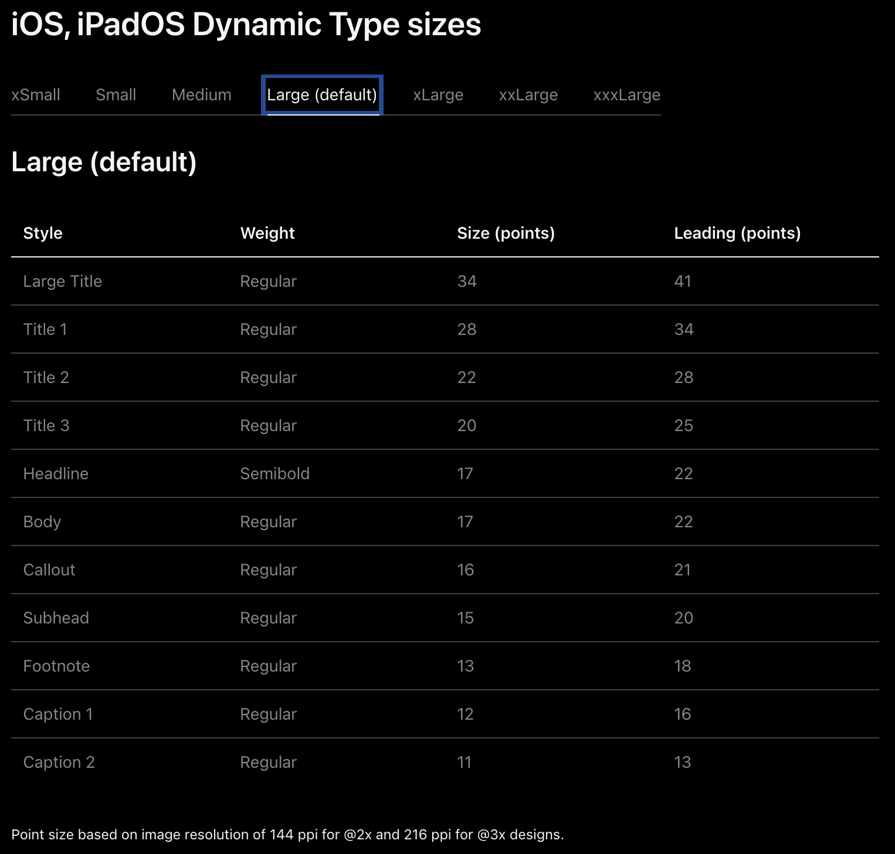

<!-- @import "[TOC]" {cmd="toc" depthFrom=1 depthTo=6 orderedList=false} -->

<!-- code_chunk_output -->

- [字体](#字体)

<!-- /code_chunk_output -->


# 字体

https://developer.apple.com/cn/design/human-interface-guidelines/typography#Platform-considerations

https://developer.apple.com/design/human-interface-guidelines/typography#Platform-considerations

https://developer.apple.com/documentation/uikit/uifont



```swift
// 返回指定文本样式的系统字体实例，并根据用户所选的内容大小类别进行缩放
class func preferredFont(forTextStyle: UIFont.TextStyle) -> UIFont

// 返回指定大小的标准界面项目的字体对象。
class func systemFont(ofSize: CGFloat) -> UIFont
```