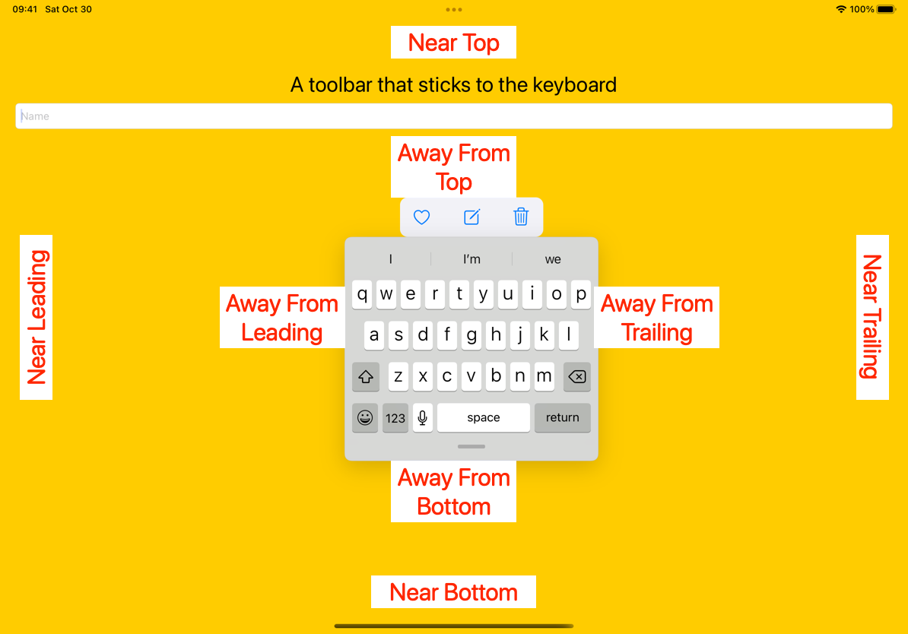

<!-- @import "[TOC]" {cmd="toc" depthFrom=1 depthTo=6 orderedList=false} -->

<!-- code_chunk_output -->

- [UIKeyboardLayoutGuide](#uikeyboardlayoutguide)
  - [usesBottomSafeArea](#usesbottomsafearea)
  - [iphone 上的键盘](#iphone-上的键盘)

<!-- /code_chunk_output -->

# UIKeyboardLayoutGuide

- 不同类型的键盘处于活动状态时，系统报告 keyboard Layout Guide near 和 away From 哪些边缘
  - Docked keyboards (iphone 的键盘)
    - 始终 away From 前缘、后缘和顶缘
    - 始终 near 底部边缘
  - (Split and undocked keyboards) 拆分和脱离底座的键盘
        - 始终 away From 前缘、后缘和底缘
        - 可以 near 顶部边缘
  - 浮动键盘：
    - 可以 away From 所有边缘
    - 可以 near 任意边或任意两个相邻边
  - 快捷方式栏（可通过外部连接键盘使用）：
    - 始终 away From 顶部边缘并 near 底部边缘
    - 折叠状态下可 near 前缘或后缘

> followsUndockedKeyboard = false 时，指南会在键盘停靠时与键盘匹配。当键盘不在屏幕上时，参考线位于窗口底部，高度等于当前 safeAreaInsets 的底部

- 键盘不可见时,布局指南位于屏幕底部，其高度与安全区域插图匹配。然后顶部锚点与安全区域的底部相匹配

```swift
// 无需要第三方处理，即可实现键盘不遮挡效果
view.keyboardLayoutGuide.followsUndockedKeyboard = false
view.keyboardLayoutGuide.topAnchor.constraint(
    equalToSystemSpacingBelow: textView.bottomAnchor, multiplier: 1.0).isActive = true
```

> followsUndockedKeyboard = true 时，即使在脱离或浮动时，要跟随所有键盘锚点

摘录网络图片


```swift
view.keyboardLayoutGuide.followsUndockedKeyboard = true

// 远离顶部边缘
// 键盘远离顶部边缘时，工具栏位于键盘布局指南的顶部：
let awayFromTop = toolbar.bottomAnchor.constraint(equalTo:
  view.keyboardLayoutGuide.topAnchor)
awayFromTop.identifier = "KB-awayFromTop"
view.keyboardLayoutGuide.setConstraints([awayFromTop],
  activeWhenAwayFrom: .top)

// 靠近顶部边缘
// 键盘靠近顶部边缘时，工具栏下降到屏幕底部
let nearTop = toolbar.bottomAnchor.constraint(equalTo:
  view.safeAreaLayoutGuide.bottomAnchor)
nearTop.identifier = "KB-nearTop"
view.keyboardLayoutGuide.setConstraints([nearTop],
  activeWhenNearEdge: .top)

// 中间
// 键盘远离前缘和后缘时，工具栏与键盘水平居中
let inMiddle = toolbar.centerXAnchor.constraint(equalTo:
  view.keyboardLayoutGuide.centerXAnchor)
inMiddle.identifier = "KB-inMiddle"
view.keyboardLayoutGuide.setConstraints([inMiddle],
  activeWhenAwayFrom: [.leading, .trailing])

// 靠近前缘
// 工具栏的前导锚点限制为键盘指南的前导锚点
let nearLeading = toolbar.leadingAnchor.constraint(equalTo:
  view.keyboardLayoutGuide.leadingAnchor)
nearLeading.identifier = "KB-nearLeading"
view.keyboardLayoutGuide.setConstraints([nearLeading],
  activeWhenNearEdge: .leading)

// 靠近后缘
// 工具栏限制到键盘指南的后锚点
let nearTrailing = toolbar.trailingAnchor.constraint(equalTo:
  view.keyboardLayoutGuide.trailingAnchor)
nearTrailing.identifier = "KB-nearTrailing"
view.keyboardLayoutGuide.setConstraints([nearTrailing],
  activeWhenNearEdge: .trailing)
```

## usesBottomSafeArea 

```swift
 // 一个布尔值，指示布局指南是否使用视图的安全区域布局指南
 var usesBottomSafeArea: Bool { get set }
```

## iphone 上的键盘

```swift
// 生效 键盘始终远离顶部边缘
view.keyboardLayoutGuide.setConstraints([keyboardLayout], activeWhenAwayFrom: .top) 
// 不生效
view.keyboardLayoutGuide.setConstraints([keyboardLayout], activeWhenAwayFrom: .top) 

// 键盘始终靠近底部边缘
view.keyboardLayoutGuide.setConstraints([bottomLayout], activeWhenNearEdge: .bottom)
// 生效 不生效
view.keyboardLayoutGuide.setConstraints([bottomLayout], activeWhenNearEdge: .bottom)
```