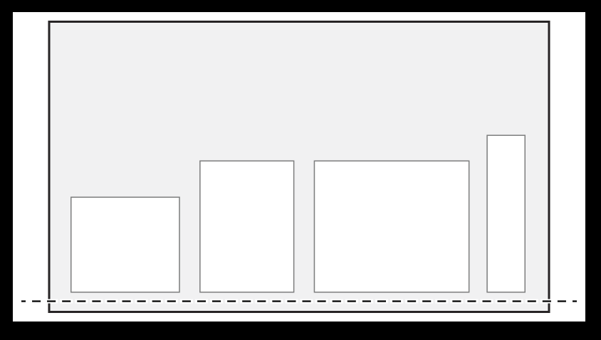

<!-- @import "[TOC]" {cmd="toc" depthFrom=1 depthTo=6 orderedList=false} -->

<!-- code_chunk_output -->

- [UIStackView](#uistackview)
  - [堆栈视图和自动布局](#堆栈视图和自动布局)
  - [API](#api)
    - [Managing arranged subviews 管理排列的子视图](#managing-arranged-subviews-管理排列的子视图)
    - [Configuring the layout 配置布局](#configuring-the-layout-配置布局)
    - [Adding space between items 在项目之间添加空间](#adding-space-between-items-在项目之间添加空间)
  - [小笔记](#小笔记)
  - [UIStackView.Alignment](#uistackviewalignment)
  - [UIStackView.Distribution](#uistackviewdistribution)

<!-- /code_chunk_output -->

# UIStackView

<https://developer.apple.com/documentation/uikit/uistackview>

一个简化的界面，用于在列或行中布局视图集合。

```swift
@MainActor
class UIStackView : UIView
```

堆栈视图允许您利用自动布局的力量，创建可以动态适应设备方向、屏幕大小和可用空间任何变化的用户界面。  
堆栈视图管理其 arrangedSubviews 属性中所有视图的布局。这些视图沿着堆栈视图的轴排列，基于它们在ar arrangedSubviews数组中的顺序。  
确切的布局因堆栈视图的轴、分布、对齐、间距和其他属性而异。

## 堆栈视图和自动布局

堆栈视图使用`自动布局来定位和调整其排列视图的大小`。  
堆栈视图将第一个和最后一个排列视图与其沿堆栈轴的边缘对齐。  
在`水平堆栈`中，这意味着第一个排列视图的前缘被固定在堆栈的前缘上，最后一个排列视图的后缘被固定在堆栈的后边缘。  
在`垂直堆栈`中，顶部和底部边缘分别固定在堆栈的顶部和底部边缘。  
如果您将堆栈视图的isLayoutMarginsRelativeArrangement属性设置为true，则堆栈视图将其内容固定在相关边距而不是边缘。

对于除UIStackView.Distribution.fillEqually分发以外的所有发行版，堆栈视图在沿堆栈轴计算其大小时使用每个排列视图的intinticallyContentSize属性。UIStackView.Distribution.fillEqually调整所有排列视图的大小，使其大小相同，沿着其轴填充堆栈视图。如果可能的话，堆栈视图会拉伸所有排列的视图，以匹配沿堆栈轴线具有最长内在尺寸的视图。

对于除UIStackView.Alignment.fill对齐以外的所有对齐，堆栈视图在计算其垂直于堆栈轴的大小时使用每个排列视图的intrintrintContentSize属性。UIStackView.Alignment.fill调整所有排列视图的大小，以便它们垂直于其轴填充堆栈视图。如果可能的话，堆栈视图会拉伸所有排列的视图，以匹配垂直于堆栈轴的最大内在尺寸的视图。

## API

### Managing arranged subviews 管理排列的子视图

```swift
// 将视图添加到排列的子视图数组的末尾。
func addArrangedSubview(_ view: UIView)

// 按堆栈视图排列的视图列表。
var arrangedSubviews: [UIView] { get }

// 将提供的视图添加到指定索引处排列的子视图数组中。
func insertArrangedSubview(
    _ view: UIView,
    at stackIndex: Int
)

// 从堆栈的排列子视图数组中删除提供的视图。
func removeArrangedSubview(_ view: UIView)
```

### Configuring the layout 配置布局

```swift
// 排列视图所沿的轴线。
// enum Axis : Int, @unchecked Sendable
// case horizontal
// case vertical
var axis: NSLayoutConstraint.Axis { get set }

// 垂直于堆栈视图轴的排列子视图的对齐。
// default:UIStackView.Alignment.fill
// UIStackView.Alignment 
// case fill 堆栈视图调整其排列视图大小的布局，以便它们填充垂直于堆栈视图轴的可用空间。
// case center
// case leading
// case trailing
// static var top:
// static var bottom
// case firstBaseline
// case lastBaseline
var alignment: UIStackView.Alignment { get set }

// 沿堆栈视图轴排列视图的分布。
// default:UIStackView.Distribution.fill
// UIStackView.Distribution
// case fill 当排列视图不适合堆栈视图时，它会根据其压缩阻力优先级缩小视图。如果排列的视图没有填充堆栈视图，它会根据其拥抱优先级来拉伸视图。如果有任何歧义，堆栈视图会根据排列的子视图数组中的索引调整排列视图的大小。 
// case fillEqually  调整视图大小，使其沿着堆栈视图的轴线大小相同。
// case fillProportionally 视图根据其沿堆栈视图轴的内在内容大小按比例调整大小。
// case equalSpacing 当排列视图不填充堆栈视图时，它会均匀地填充视图之间的间距。
// case equalCentering 一种布局，该布局试图沿着堆栈视图的轴轴以相等的中心到中心间距定位排列的视图，同时保持间距属性在视图之间的距离。
var distribution: UIStackView.Distribution { get set }

// 堆栈视图的排列视图的相邻边缘之间的点距离。
var spacing: CGFloat { get set }

// 一个布尔值，确定视图之间的垂直间距是否从其基线测量。
// 如果 true ，则视图之间的垂直空间从基于文本的视图的最后一个基线到其下方视图的第一个基线进行测量。顶部和底部视图也被定位，以便其最近的基线是距离堆栈视图边缘的指定距离。
// 此属性仅用于垂直堆栈视图。使用对齐属性在水平堆栈视图中对齐视图。
// The default value is false.
var isBaselineRelativeArrangement: Bool { get set }

// 一个布尔值，用于确定堆栈视图是否相对于其布局边距布局其排列视图。
// 如果为true，堆栈视图将布局其相对于其布局边距的排列视图。
// 如果为false，它列出了相对于其边界的排列视图。
// 默认值为假。
var isLayoutMarginsRelativeArrangement: Bool { get set }
```

### Adding space between items 在项目之间添加空间

```swift
// 在指定视图之后返回自定义间距。
func customSpacing(after arrangedSubview: UIView) -> CGFloat

// 在指定视图之后应用自定义间距。
func setCustomSpacing(
    _ spacing: CGFloat,
    after arrangedSubview: UIView
)

// 堆栈视图中子视图的默认间距。
class let spacingUseDefault: CGFloat

// 系统定义的相邻视图的间距。
class let spacingUseSystem: CGFloat
```

## 小笔记

- 如果 UIStackView 有宽度约束，arrangedSubviews 会根据配置分配
- 如果 UIStackView 没有宽度、高度约束，UIStackView的高宽为 arrangedSubviews 之和

## UIStackView.Alignment

> UIStackView.Alignment.fill 填充垂直于堆栈视图轴的可用空间


> UIStackView.Alignment.center 堆栈视图将其排列视图的中心与其沿轴的中心对齐


> UIStackView.Alignment.leading 堆栈视图沿其前缘对齐其排列视图的前缘


> UIStackView.Alignment.trailing 堆栈视图沿其后缘对齐其排列视图的后缘


> top ==  UIStackView.Alignment.leading


> bottom ==  UIStackView.Alignment.trailing



> UIStackView.Alignment.firstBaseline 堆栈视图根据其第一基线对齐其排列的视图


> UIStackView.Alignment.lastBaseline 堆栈视图根据最后的基线对齐排列的视图


## UIStackView.Distribution

> UIStackView.Distribution.fill 堆栈视图会调整其排列视图的大小，使它们填满堆栈视图轴线上的可用空间。

当排列的视图无法放入堆栈视图时，它会根据视图的抗压缩性优先级缩小视图。如果排列好的视图没有填满堆栈视图，堆栈视图会根据视图的拥抱优先级拉伸视图。如果有任何不明确的地方，堆栈视图会根据已排列视图在 arrangedSubviews 数组中的索引来调整已排列视图的大小。

```swift
// 设置视图内容的压缩抗性优先级的方法
// 较高的优先级值表示视图更不容易被压缩。例如.required、.defaultHigh、.defaultLow等。
// .required：表示视图的内容在压缩时必须被保持不变，不允许压缩。
// .defaultHigh：表示视图的内容在压缩时具有较高的抗性，只允许轻微的压缩。
// .defaultLow：表示视图的内容在压缩时相对容易被压缩，可以更多地进行压缩。
// .fittingSizeLevel：表示视图的内容在压缩时允许更大程度的压缩，以适应可用空间。
func setContentCompressionResistancePriority(UILayoutPriority, for: NSLayoutConstraint.Axis)

// 设置视图内容的拉伸抗性优先级的方法。它是UIView的一个方法，用于调整视图在自动布局中的行为
// 较高的优先级值表示视图更不容易被拉伸。定义了不同优先级的常量，例如.required、.defaultHigh、.defaultLow等。
// .required：表示视图的内容在拉伸时必须被保持不变，不允许压缩。
// .defaultHigh：表示视图的内容在拉伸时具有较高的抗性，只允许轻微的拉伸。
// .defaultLow：表示视图的内容在拉伸时相对容易被拉伸，可以更多地进行拉伸。
// .fittingSizeLevel：表示视图的内容在拉伸时允许更大程度的拉伸，以适应可用空间。
func setContentHuggingPriority(UILayoutPriority, for: NSLayoutConstraint.Axis)
```


> UIStackView.Distribution.fillEqually 堆栈视图会调整其排列视图的大小，使它们填满堆栈视图轴线上的可用空间,使它们沿着堆栈视图的轴线大小相同。


> UIStackView.Distribution.fillProportionally 视图会根据其内在内容的大小，沿着堆栈视图的轴线按比例调整大小


> UIStackView.Distribution.equalSpacing 均匀填充视图之间的间距


> UIStackView.Distribution.equalCentering 堆栈视图的轴线以相等的中心到中心间距定位排列的视图，同时保持间距属性在视图之间的距离


