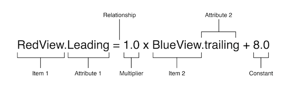

# 更新视图层次结构的布局 

常见来源：
* 用户调整窗口大小（OS X）。
* 用户在iPad（iOS）上输入或离开分屏浏览。
* 设备旋转（iOS）。
* 活动通话和录音栏出现或消失（iOS）。
* 您想要支持不同大小的课程。
* 您希望支持不同的屏幕尺寸。

这些更改大多可以在运行时发生，并且需要应用程序的动态响应。其他更改，例如支持不同的屏幕尺寸，代表了适应不同环境的应用程序。即使通过屏幕大小在运行时通常也不会改变，创建自适应界面也可以让您的应用程序在iPhone 4S、iPhone 6 Plus甚至iPad上运行得同样好。自动布局也是在iPad上支持侧拉和拆分视图的关键组件。

# Auto Layout Guide 自动布局



此约束，红色视图的前缘必须是蓝色视图后缘后8.0点。

部分：

* Item 1 - 方程中的第一个项目——在这种情况下，是`红色视图`。项目必须是`视图`或`布局指南`。
* Attribute 1 - 要限制在第一个项目上的属性——在这种情况下，红色视图的leading。
* Relationship - 左翼和右翼之间的关系。这种关系可以有三个值之一：`等于(=)`、`大于或等于(>=)`，或`小于或等于(<=)`。在这种情况下，左侧和右侧是相等的。
* Multiplier - Item 2属性Attribute 2的值乘以这个浮点数。在这种情况下，乘数是1.0。
* Item 2 - 等式中的第二个项目——在这种情况下，蓝色视图。与第一个项目不同，这`可以留空`。
* Attribute 2 - 在第二个项目上受限的属性——在这种情况下，蓝色视图的尾随边缘。如果第二个项目留空，则必须不是属性。
* Constant - 一个恒定的浮点偏移量——在这种情况下，8.0。此值被添加到属性2的值中。

# Auto Layout Attributes

* `left`, `right`, `leading`, `trailing`, `top`, `bottom`
* `height`, `width`, and `vertical and horizontal centers`
* Text items also have one or more `baseline` attributes.

# 样本方程

方程可用的参数和属性范围很广，允许您创建许多不同类型的约束。  
您可以定义`视图之间的空间`，`对齐视图的边缘`，`定义两个视图的相对大小`，甚至可以`定义视图的宽高比`。  
`然而，并非所有属性都是兼容的。`

考虑到这些差异，适用以下规则：

* 您不能将大小属性限制为位置属性。
* 您无法为位置属性分配常量值。
* 您不能将非身份乘数（1.0以外的值）与位置属性一起使用。
* 对于位置属性，您不能将垂直属性限制为水平属性。
* 对于位置属性，您不能将前导或尾随属性限制为左或右属性。

例如，如果没有额外的上下文，将项目的顶部设置为常量值20.0就没有意义。您必须始终定义一个项目相对于其他项目的位置属性，例如，比超级视图的顶部低20.0点。然而，将项目的高度设置为20.0是完全有效的。有关更多信息，请参阅解释值。

# Equality, Not Assignment =号，而不是分配

重要的是要注意，Note中显示的方程代表`==`，而不是赋值`=`。

您会发现自动布局经常提供多种方法来解决同一问题。  
准则：

* 整数乘数比分数乘数更受青睐。
* 正常数优于负常数。
* 在可能的情况下，视图应按布局顺序显示：leading to trailing, top to bottom.（从左到右，从上到下）

# 创建明确、令人满意的布局

一般来说，约束必须`定义每个视图的大小和位置`。假设超级视图的大小已经设置（例如，iOS中场景的根视图），一个不明确、令人满意的布局要求每个维度每个视图有两个约束（不包括超级视图）。然而，在选择要使用的约束时，您有各种各样的选择。例如，以下三种布局都会产生不明确、令人满意的布局（仅显示水平约束）：

# 不明确、令人满意的布局

一个不明确、令人满意的布局要求每个维度每个视图有两个约束（不包括超级视图）。然而，在选择要使用的约束时，您有各种各样的选择。  
即可以使用部分约束，让系统自动计算高度，宽度

# 约束不等式

约束也可以代表不等式。具体来说，约束的关系可以`等于`、`大于或等于`、`小于或等于`

例如，您可以使用约束来定义视图的最小或最大大小

```swift
// Setting the minimum width
View.width >= 0.0 * NotAnAttribute + 40.0
 
// Setting the maximum width
View.width <= 0.0 * NotAnAttribute + 280.0
```

开始使用不等式，每个维度规则的每个视图的两个约束就会分解。你总是可以用两个不平等来取代单一的平等关系。如下：单等关系和一对不等式产生相同的行为。  
两个不等式并不总是等同于单个相等的关系。例如，`下面不等式限制了视图宽度的可能值的范围，但它们本身并不定义宽度`。您仍然需要额外的水平约束来定义此范围内视图的位置和大小。

```swift
// 单一的平等关系
Blue.leading = 1.0 * Red.trailing + 8.0
 
// 可以用两种不平等关系来取代
Blue.leading >= 1.0 * Red.trailing + 8.0
Blue.leading <= 1.0 * Red.trailing + 8.0
```

# 约束优先级

默认情况下，所有约束都是必需的。  
自动布局必须计算一个满足所有约束的解决方案。  
如果不能，则存在错误。自动布局将有关无法满足的约束的信息打印到控制台上，并选择要打破的约束之一。然后，它在没有打破约束的情况下重新计算解决方案。

可以创建可选约束。所有约束的优先级都在1到1000之间。需要优先级为1000的约束。所有其他约束都是可选的。

在计算解决方案时，自动布局试图按从最高到最低的优先级顺序满足所有约束。如果它不能满足可选约束，则跳过该约束，并继续到下一个约束。

即使无法满足可选约束，它仍然会影响布局。如果跳过约束后布局中有任何歧义，系统将选择最接近约束的解决方案。通过这种方式，不满意的可选约束就是一种将观点拉向它们的力量。

可选的约束和不平等往往是齐头并进的。例如，在清单3-4中，您可以为两个不平等提供不同的优先级。可能需要大于或相等的关系（优先级为1000），而小于或相等的关系具有较低的优先级（优先级250）。这意味着蓝色视图距离红色不能超过8.0点。然而，其他限制可能会把它拉得更远。尽管如此，考虑到布局中的其他约束，可选约束会将蓝色视图拉向红色视图，确保它尽可能接近8.0点间距。

不要觉得有义务使用所有1000个优先级值。事实上，优先事项应该围绕系统定义的`低优先级（250）`、`中优先级（500）`、`高（750）`和`所需（1000）`优先级分组。您可能需要制定比这些值高一到两个点的约束，以帮助防止联系。如果你走得更远，你可能想重新审视布局的逻辑。

有关iOS上预定义约束常量的列表，请参阅UILayoutPriority枚举。对于OS X，请参阅布局优先级常量。

# 内在内容大小

到目前为止，所有示例都使用约束来定义视图的位置和大小。然而，鉴于其当前内容，一些视图具有自然的大小。这被称为它们的内在内容大小。例如，按钮的内在内容大小是其标题的大小加上小页边距。

并非所有视图都有内在的内容大小。对于这样做的视图，内在内容大小可以定义视图的高度、宽度或两者兼而有之。一些例子列于表3-1。

* UIView and NSView -- UIView and NSView
* Sliders -- 仅定义宽度（iOS）。定义宽度、高度或两者兼而有之——具体取决于滑块的类型（OS X）。
* Labels, buttons, switches, and text fields -- 定义高度和宽度。
* Text views and image views -- 内在内容大小可能会有所不同。

内在内容大小基于视图的当前内容。标签或按钮的内在内容大小取决于显示的文本量和使用字体。对于其他视图，内在内容大小甚至更加复杂。例如，空图像视图没有内在内容大小。然而，一旦您添加图像，其内在内容大小就会设置为图像的大小。  

文本视图的内在内容大小因内容、是否启用滚动以及应用于视图的其他约束而异。例如，启用滚动后，视图没有内在的内容大小。禁用滚动后，默认情况下，视图的内在内容大小是根据文本的大小计算的，而无需任何行包装。例如，如果文本中没有返回，它会计算将内容布局为一行文本所需的高度和宽度。如果您添加约束来指定视图的宽度，则内在内容大小定义了显示给定宽度的文本所需的高度。

自动布局使用每个维度的一对约束来表示视图的内在内容大小。内容拥抱将视图向内拉，使其紧密贴合内容。压缩阻力将视图向外推，这样它就不会剪切内容。  

默认情况下，视图的内容拥抱使用250优先级，压缩阻力使用750优先级。  

尽可能在布局中使用视图的内在内容大小。它允许您的布局随着视图内容的变化动态适应。它还减少了创建非歧义、非冲突布局所需的约束数量，但您需要管理视图的内容拥抱和抗压缩（CHCR）优先级。以下是一些处理内在内容大小的准则：

# 内在内容大小与配件尺寸

`内在内容大小充当自动布局的输入`。当视图具有内在内容大小时，系统会生成约束来表示该大小，并使用约束来计算布局。  
另一方面，配件尺寸是自动布局引擎的输出。这是根据视图的约束计算视图的大小。如果视图使用自动布局布局其子视图，那么系统可能能够根据其内容计算视图的拟合大小。

# 属性值

自动布局中的值总是以点为内。然而，这些测量的确切含义可能因所涉及的属性和视图的布局方向而异。

Auto Layout Attributes | Value | Notes
---------|----------|---------
Height，Width  | 视图的大小| 这些属性可以分配恒定值，也可以与其他高度和宽度属性结合使用。这些值不能是负值。
Top，Bottom，Baseline  | 值会随着屏幕向下移动而增加。| 这些属性只能与Center Y、Top、Bottom和 Baseline attributes 相结合。
Leading，Trailing  | 当你向后缘移动时，值会增加。对于从左到右的布局方向，值会随着您向右移动而增加。对于从右到左的布局方向，值会随着向左移动而增加。 | 这些属性只能与Leading、Trailing或Center X属性结合使用。
Left，Right  | 当你向右移动时，值会增加。 | 这些属性只能与Left，Right和Center Y属性组合，避免使用 Left 和 Right 侧属性。改为使用“Leading”和“Trailing”。这允许布局适应视图的阅读方向。默认情况下，阅读方向是根据用户设置的当前语言确定的。（国人仅使用left和right 即可）
 Center X，Center Y |该解释基于方程中的另一个属性。 |Center X可以与Center X、Leading、Srailing、Right和Left属性相结合。 Center Y可以与Center Y、Top、 Bottom和 Baseline attributes 属性相结合。
