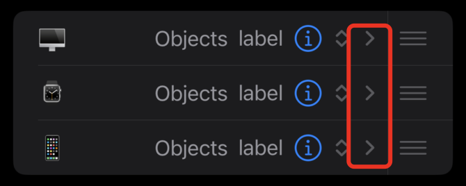
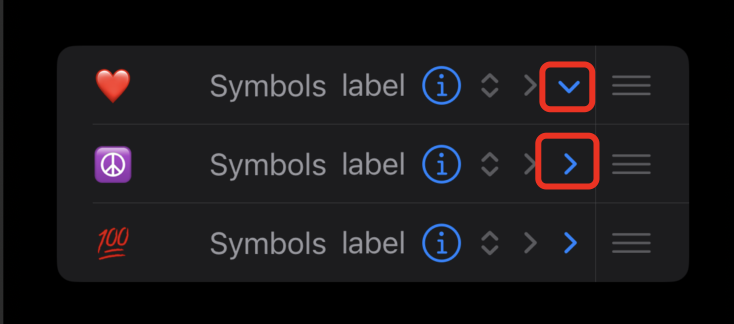
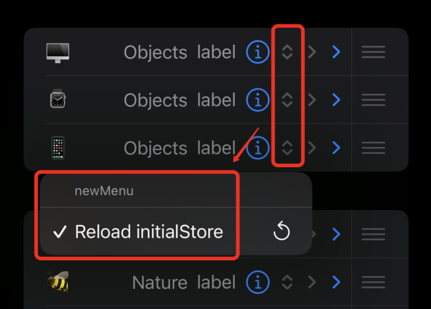
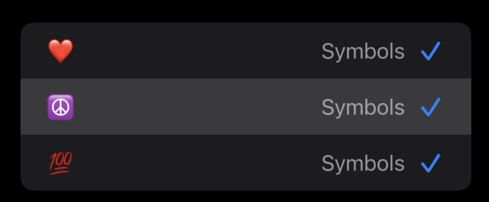
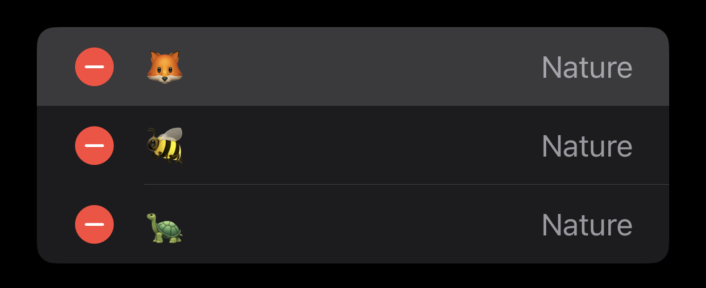
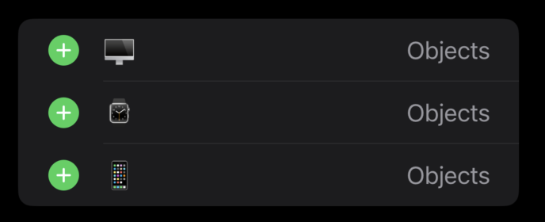
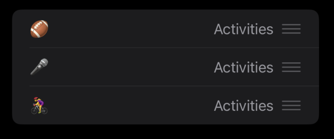
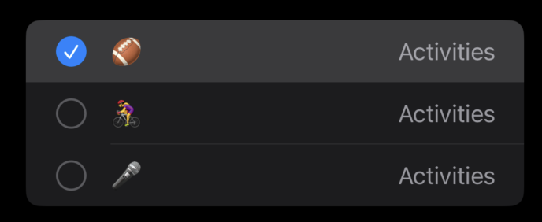
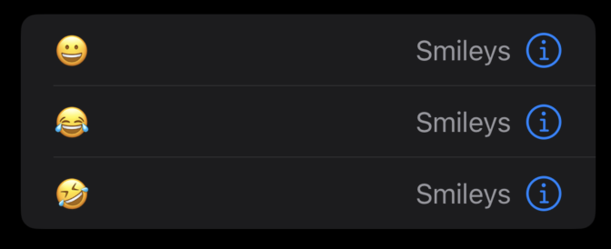

<!-- TOC -->

- [UICollectionViewListCell](#uicollectionviewlistcell)

<!-- /TOC -->

# UICollectionViewListCell

提供列表功能和默认样式的集合视图单元格。

列表单元格表示可能出现在列表中的单个项目。列表单元格为缩进提供内置支持，并能够添加单元格配件（UICellAccessory）进行视觉装饰或支持用户与单元格的交互。

您可以在任何类型的布局中使用列表单元格。在列表中使用列表单元格可以为单元格启用额外的列表特定行为。例如，在列表部分或布局中，您可以定义列表单元格之间的分隔符对齐，并为每个单元格的前缘和后缘配置滑动操作。您可以使用列表（使用：layoutEnvironment:）创建单个列表部分，或使用列表（使用：）创建完整的列表布局。

您可以使用列表单元格的defaultContentConfiguration()获取具有预配置默认样式的列表内容配置。获得默认配置后，您将内容分配给它，自定义任何其他属性，并将其作为当前内容配置分配给单元格。有关自定义选项，请参阅UIListContentConfiguration。

```swift
@MainActor class UICollectionViewListCell : UICollectionViewCell
```

- func defaultContentConfiguration() -> UIListContentConfiguration
- var accessories: [UICellAccessory] 一系列装饰单元的配件。
- var indentationLevel: Int
- var indentationWidth: CGFloat
- var indentsAccessories: Bool
- var separatorLayoutGuide: UILayoutGuide

## UICellAccessory

 集合视图列表单元格中的附件

 单元格附件是可以添加到列表单元格 ( UICollectionViewListCell ) 的视觉元素。  
 您可以使用单元格附件作为视觉指示器，或让用户执行特定于单元格的操作，例如`选择、重新排序或删除单元格`。  
 单元格附件出现在单元格内容视图之外的单元格的前缘或后缘。

- UICellAccessory.DisplayedState
  - case always 配件始终显示。
  - case whenEditing 该附件仅在单元格处于编辑模式时显示。
  - case whenNotEditing 仅当单元格不处于编辑模式时才会显示附件

> static func disclosureIndicator(displayed: UICellAccessory.DisplayedState, options: UICellAccessory.DisclosureIndicatorOptions) -> UICellAccessory 

配件是一个指向尾部方向的披露楔形。该配件出现在电池的尾部边缘.使用此单元格附件指示用户可以点击该单元格来公开其他内容。

- UICellAccessory.DisclosureIndicatorOptions 披露指示器的配置选项
 

> static func outlineDisclosure(displayed: UICellAccessory.DisplayedState, options: UICellAccessory.OutlineDisclosureOptions, actionHandler: UICellAccessory.ActionHandler?) -> UICellAccessory  

创建具有指定显示状态、配置选项和可选操作处理程序的大纲公开系统附件。  
使用此单元格附件来指示项目可以展开和折叠，并使用户能够在展开和折叠状态之间切换。

 

> static func popUpMenu(UIMenu, displayed: UICellAccessory.DisplayedState, options: UICellAccessory.PopUpMenuOptions, selectedElementDidChangeHandler: UICellAccessory.MenuSelectedElementDidChangeHandler?) -> UICellAccessory

创建具有指定菜单、显示状态、配置选项和可选选择处理程序的弹出菜单系统附件。

配置的弹出菜单单元附件，显示为一对向上和向下的 V 形图案。该附件表示点击单元格中的任意位置会显示一个弹出菜单。该附件出现在电池的后缘。

 

 > static func checkmark(displayed: UICellAccessory.DisplayedState, options: UICellAccessory.CheckmarkOptions) -> UICellAccessory

 创建具有指定显示状态和配置选项的复选标记系统附件。

 

 > static func delete(displayed: UICellAccessory.DisplayedState, options: UICellAccessory.DeleteOptions, actionHandler: UICellAccessory.ActionHandler?) -> UICellAccessory

 创建具有指定显示状态、配置选项和可选操作处理程序的删除系统附件。

 

 > static func insert(displayed: UICellAccessory.DisplayedState, options: UICellAccessory.InsertOptions, actionHandler: UICellAccessory.ActionHandler?) -> UICellAccessory

 创建具有指定显示状态、配置选项和可选操作处理程序的插入系统附件。

  

  > static func reorder(displayed: UICellAccessory.DisplayedState, options: UICellAccessory.ReorderOptions) -> UICellAccessory

  创建具有指定显示状态和配置选项的重新排序系统附件

  

  > static func multiselect(displayed: UICellAccessory.DisplayedState, options: UICellAccessory.MultiselectOptions) -> UICellAccessory

  创建具有指定显示状态和配置选项的多选系统附件



> static func label(text: String, displayed: UICellAccessory.DisplayedState, options: UICellAccessory.LabelOptions) -> UICellAccessory

创建具有指定文本、显示状态和配置选项的标签系统附件。

> static func detail(displayed: UICellAccessory.DisplayedState, options: UICellAccessory.DetailOptions, actionHandler: UICellAccessory.ActionHandler?) -> UICellAccessory

创建具有指定显示状态、配置选项和可选操作处理程序的详细系统附件。

