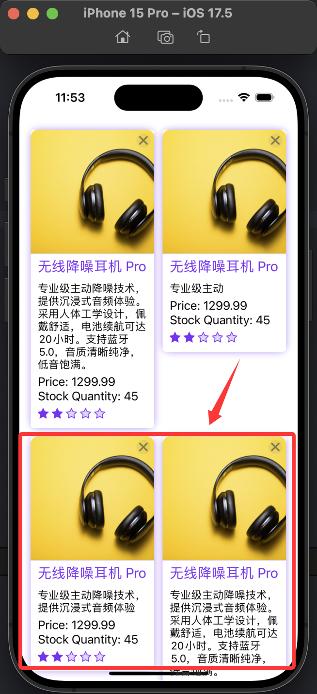

<!-- @import "[TOC]" {cmd="toc" depthFrom=1 depthTo=6 orderedList=false} -->

<!-- code_chunk_output -->

- [小笔记](#小笔记)
  - [UICollectionViewCompositionalLayoutSectionProvider 提供不同布局](#uicollectionviewcompositionallayoutsectionprovider-提供不同布局)
  - [UICollectionViewCompositionalLayout 实现的瀑布流](#uicollectionviewcompositionallayout-实现的瀑布流)

<!-- /code_chunk_output -->

# 小笔记

## UICollectionViewCompositionalLayoutSectionProvider 提供不同布局

```swift
import UIKit

class MultiLayoutViewController: UIViewController {
    
    // 部分类型枚举
    enum SectionType: Int, CaseIterable {
        case featured        // 特色部分（大卡片）
        case grid            // 网格部分
        case horizontalScroll // 水平滚动部分
        case list            // 列表部分
    }
    
    // 数据模型
    struct Section {
        let type: SectionType
        let title: String
        let items: Int
    }
    
    // 示例数据
    private var sections: [Section] = [
        Section(type: .featured, title: "特色内容", items: 1),
        Section(type: .grid, title: "推荐内容", items: 6),
        Section(type: .horizontalScroll, title: "热门内容", items: 8),
        Section(type: .list, title: "最新内容", items: 5)
    ]
    
    private var collectionView: UICollectionView!
    private let headerKind = "sectionHeader"
    
    override func viewDidLoad() {
        super.viewDidLoad()
        configureCollectionView()
        configureDataSource()
    }
    
    private func configureCollectionView() {
        // 创建compositional布局
        let layout = createLayout()
        // 初始化collectionView
        collectionView = UICollectionView(frame: view.bounds, collectionViewLayout: layout)
        view.addSubview(collectionView)
        
        // 注册cell和supplementary视图
        collectionView.register(UICollectionViewCell.self, forCellWithReuseIdentifier: "cell")
        collectionView.register(
            HeaderView.self,
            forSupplementaryViewOfKind: headerKind,
            withReuseIdentifier: "header"
        )
    }
    
    private func createLayout() -> UICollectionViewLayout {
        // 使用section provider创建布局
        let layout = UICollectionViewCompositionalLayout { [weak self] (sectionIndex, environment) -> NSCollectionLayoutSection? in
            guard let self = self else { return nil }
            // 根据部分类型创建不同的布局
            let sectionType = self.sections[sectionIndex].type
            
            // 根据部分类型返回对应的布局
            switch sectionType {
            case .featured:
                return self.createFeaturedSection()
            case .grid:
                return self.createGridSection()
            case .horizontalScroll:
                return self.createHorizontalScrollSection()
            case .list:
                return self.createListSection()
            }
        }
        
        return layout
    }
    
    // MARK: - 各种布局部分创建方法
    
    // 特色部分 - 大型横幅
    private func createFeaturedSection() -> NSCollectionLayoutSection {
        // 创建item
        let itemSize = NSCollectionLayoutSize(
            widthDimension: .fractionalWidth(1.0),
            heightDimension: .fractionalHeight(1.0)
        )
        let item = NSCollectionLayoutItem(layoutSize: itemSize)
        item.contentInsets = NSDirectionalEdgeInsets(top: 5, leading: 5, bottom: 5, trailing: 5)
        
        // 创建group
        let groupSize = NSCollectionLayoutSize(
            widthDimension: .fractionalWidth(1.0),
            heightDimension: .absolute(200)
        )
        let group = NSCollectionLayoutGroup.horizontal(layoutSize: groupSize, subitems: [item])
        
        // 创建section
        let section = NSCollectionLayoutSection(group: group)
        
        // 添加header
        section.boundarySupplementaryItems = [createSectionHeader()]
        
        return section
    }
    
    // 网格部分 - 2列网格
    private func createGridSection() -> NSCollectionLayoutSection {
        // 创建item
        let itemSize = NSCollectionLayoutSize(
            widthDimension: .fractionalWidth(0.5),
            heightDimension: .fractionalHeight(1.0)
        )
        let item = NSCollectionLayoutItem(layoutSize: itemSize)
        item.contentInsets = NSDirectionalEdgeInsets(top: 5, leading: 5, bottom: 5, trailing: 5)
        
        // 创建group
        let groupSize = NSCollectionLayoutSize(
            widthDimension: .fractionalWidth(1.0),
            heightDimension: .fractionalWidth(0.5)
        )
        let group = NSCollectionLayoutGroup.horizontal(layoutSize: groupSize, subitems: [item])
        
        // 创建section
        let section = NSCollectionLayoutSection(group: group)
        
        // 添加header
        section.boundarySupplementaryItems = [createSectionHeader()]
        
        return section
    }
    
    // 水平滚动部分
    private func createHorizontalScrollSection() -> NSCollectionLayoutSection {
        // 创建item
        let itemSize = NSCollectionLayoutSize(
            widthDimension: .fractionalWidth(1.0),
            heightDimension: .fractionalHeight(1.0)
        )
        let item = NSCollectionLayoutItem(layoutSize: itemSize)
        item.contentInsets = NSDirectionalEdgeInsets(top: 5, leading: 5, bottom: 5, trailing: 5)
        
        // 创建group
        let groupSize = NSCollectionLayoutSize(
            widthDimension: .absolute(150),
            heightDimension: .absolute(150)
        )
        let group = NSCollectionLayoutGroup.horizontal(layoutSize: groupSize, subitems: [item])
        
        // 创建section
        let section = NSCollectionLayoutSection(group: group)
        section.orthogonalScrollingBehavior = .continuous // 启用水平滚动
        
        // 添加header
        section.boundarySupplementaryItems = [createSectionHeader()]
        
        return section
    }
    
    // 列表部分 - 全宽行
    private func createListSection() -> NSCollectionLayoutSection {
        // 创建item
        let itemSize = NSCollectionLayoutSize(
            widthDimension: .fractionalWidth(1.0),
            heightDimension: .fractionalHeight(1.0)
        )
        let item = NSCollectionLayoutItem(layoutSize: itemSize)
        item.contentInsets = NSDirectionalEdgeInsets(top: 5, leading: 5, bottom: 5, trailing: 5)
        
        // 创建group
        let groupSize = NSCollectionLayoutSize(
            widthDimension: .fractionalWidth(1.0),
            heightDimension: .absolute(60)
        )
        let group = NSCollectionLayoutGroup.horizontal(layoutSize: groupSize, subitems: [item])
        
        // 创建section
        let section = NSCollectionLayoutSection(group: group)
        
        // 添加header
        section.boundarySupplementaryItems = [createSectionHeader()]
        
        return section
    }
    
    // 创建section header
    private func createSectionHeader() -> NSCollectionLayoutBoundarySupplementaryItem {
        let headerSize = NSCollectionLayoutSize(
            widthDimension: .fractionalWidth(1.0),
            heightDimension: .estimated(44)
        )
        
        let header = NSCollectionLayoutBoundarySupplementaryItem(
            layoutSize: headerSize,
            elementKind: headerKind,
            alignment: .top
        )
        
        return header
    }
    
    // MARK: - 配置数据源
    
    private func configureDataSource() {
        collectionView.dataSource = self
        collectionView.delegate = self
    }
}

// MARK: - UICollectionViewDataSource
extension MultiLayoutViewController: UICollectionViewDataSource, UICollectionViewDelegate {
    
    func numberOfSections(in collectionView: UICollectionView) -> Int {
        return sections.count
    }
    
    func collectionView(_ collectionView: UICollectionView, numberOfItemsInSection section: Int) -> Int {
        return sections[section].items
    }
    
    func collectionView(_ collectionView: UICollectionView, cellForItemAt indexPath: IndexPath) -> UICollectionViewCell {
        let cell = collectionView.dequeueReusableCell(withReuseIdentifier: "cell", for: indexPath)
        
        // 根据部分类型设置不同的cell外观
        let sectionType = sections[indexPath.section].type
        
        switch sectionType {
        case .featured:
            cell.backgroundColor = .systemRed
        case .grid:
            cell.backgroundColor = .systemBlue
        case .horizontalScroll:
            cell.backgroundColor = .systemGreen
        case .list:
            cell.backgroundColor = .systemOrange
        }
        
        return cell
    }
    
    func collectionView(_ collectionView: UICollectionView, viewForSupplementaryElementOfKind kind: String, at indexPath: IndexPath) -> UICollectionReusableView {
        if kind == headerKind {
            let header = collectionView.dequeueReusableSupplementaryView(
                ofKind: kind,
                withReuseIdentifier: "header",
                for: indexPath
            ) as! HeaderView
            
            header.titleLabel.text = sections[indexPath.section].title
            return header
        }
        
        return UICollectionReusableView()
    }
}

// MARK: - HeaderView
class HeaderView: UICollectionReusableView {
    let titleLabel: UILabel = {
        let label = UILabel()
        label.font = .systemFont(ofSize: 18, weight: .bold)
        label.translatesAutoresizingMaskIntoConstraints = false
        return label
    }()
    
    override init(frame: CGRect) {
        super.init(frame: frame)
        
        backgroundColor = .systemBackground
        addSubview(titleLabel)
        
        NSLayoutConstraint.activate([
            titleLabel.leadingAnchor.constraint(equalTo: leadingAnchor, constant: 8),
            titleLabel.trailingAnchor.constraint(equalTo: trailingAnchor, constant: -8),
            titleLabel.topAnchor.constraint(equalTo: topAnchor, constant: 8),
            titleLabel.bottomAnchor.constraint(equalTo: bottomAnchor, constant: -8)
        ])
    }
    
    required init?(coder: NSCoder) {
        fatalError("init(coder:) has not been implemented")
    }
}
```

## UICollectionViewCompositionalLayout 实现的瀑布流

* 不能完美实现瀑布流的布局效果
    * 基于分组实现瀑布流，分组与分组之间是顶部对齐的

    

```swift
import UIKit
class WaterfallCompositionalLayout {
    struct WaterfallLayoutConfig {
        let columnCount: Int
        let spacing: CGFloat
        let contentInsets: NSDirectionalEdgeInsets
        
        static let defaultValue = WaterfallLayoutConfig(
            columnCount: 2,
            spacing: 10,
            contentInsets: NSDirectionalEdgeInsets(top: 10, leading: 10, bottom: 10, trailing: 10)
        )
    }
    
    static func create(
        config: WaterfallLayoutConfig = .defaultValue,
        itemProvider: @escaping (IndexPath, NSCollectionLayoutEnvironment) -> NSCollectionLayoutItem) -> UICollectionViewLayout {
        
        let layout = UICollectionViewCompositionalLayout { (sectionIndex, environment) -> NSCollectionLayoutSection? in
            let columns = config.columnCount
            
            // 创建嵌套组实现瀑布流
            let itemLayoutSize = NSCollectionLayoutSize(
                widthDimension: .fractionalWidth(1.0),
                heightDimension: .estimated(100)
            )
            
            // 使用item provider获取具有动态高度的item
            let indexPath = IndexPath(item: 0, section: sectionIndex)
            let layoutItem = itemProvider(indexPath, environment)
            
            // 创建列组
            let columnGroupSize = NSCollectionLayoutSize(
                widthDimension: .fractionalWidth(1.0 / CGFloat(columns)),
                heightDimension: .estimated(100)
            )
            let columnGroup = NSCollectionLayoutGroup.vertical(
                layoutSize: columnGroupSize,
                subitems: [layoutItem]
            )
            columnGroup.interItemSpacing = .fixed(10)
            
            // 创建水平组包含所有列
            let containerGroupSize = NSCollectionLayoutSize(
                widthDimension: .fractionalWidth(1.0),
                heightDimension: .estimated(100)
            )
            
            var columnGroups: [NSCollectionLayoutGroup] = []
            // 两列
            for _ in 0..<columns {
                columnGroups.append(columnGroup)
            }
            
            let containerGroup = NSCollectionLayoutGroup.horizontal(
                layoutSize: containerGroupSize,
                subitems: columnGroups
            )
            containerGroup.interItemSpacing = .fixed(config.spacing)
            
            // 创建section
            let section = NSCollectionLayoutSection(group: containerGroup)
            section.interGroupSpacing = config.spacing
            section.contentInsets = config.contentInsets
//            section.orthogonalScrollingBehavior = .continuous
            
            return section
        }
        
        return layout
    }
}

```
