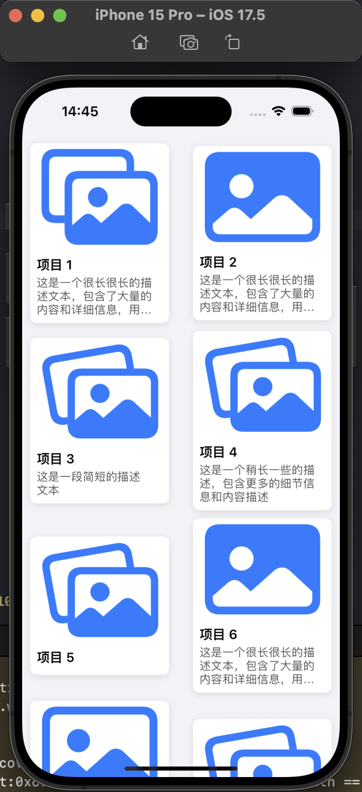

<!-- @import "[TOC]" {cmd="toc" depthFrom=1 depthTo=6 orderedList=false} -->

<!-- code_chunk_output -->

- [瀑布流](#瀑布流)
  - [注意事项](#注意事项)
  - [UICollectionViewDelegateFlowLayout 实现单列瀑布流](#uicollectionviewdelegateflowlayout-实现单列瀑布流)
  - [UICollectionViewDelegateFlowLayout 实现多列列瀑布流](#uicollectionviewdelegateflowlayout-实现多列列瀑布流)
  - [UICollectionViewCompositionalLayout 实现单列瀑布流](#uicollectionviewcompositionallayout-实现单列瀑布流)
  - [使用 UICollectionViewLayout 实现瀑布流](#使用-uicollectionviewlayout-实现瀑布流)

<!-- /code_chunk_output -->

# 瀑布流

第三方：<https://github.com/chiahsien/CHTCollectionViewWaterfallLayout/blob/develop/Source/CHTCollectionViewWaterfallLayout.swift>

## 注意事项

- 尽量缓存布局信息，防止重复计算
- 动态高度尽量可直接计算，直接使用自动布局性能不行，如使用systemLayoutSizeFitting
- 图片的大小应尽量提前提供如：服务器API接口返回、或直接写死
- UILabel 的计算大小 请参考 ：获取动态高度总结.md

## UICollectionViewDelegateFlowLayout 实现单列瀑布流

- 简单
- 此方法对于多列瀑布流，无能为力，原因:每个 cell 不可自定义位置
- 使用 layout.estimatedItemSize = UICollectionViewFlowLayout.automaticSize 即可
- UICollectionViewCell 对contentView使用自动布局 或者 重写 preferredLayoutAttributesFitting方法

```swift
// UICollectionViewDelegateFlowLayout 实现单列瀑布流

import UIKit

// 模型类
struct WaterfallItem {
    let title: String
    let image: UIImage
    let description: String?
}

// 自定义单元格
class WaterfallCell: UICollectionViewCell {
    static let reuseID = "WaterfallCell"
    
    // UI 组件
    private let imageView = UIImageView()
    private let titleLabel = UILabel()
    private let descriptionLabel = UILabel()
    private let containerView = UIView()
    
    // 用于控制单元格宽度的约束
    private var widthConstraint: NSLayoutConstraint?
    private var imageHeightConstraint: NSLayoutConstraint?
    
    override init(frame: CGRect) {
        super.init(frame: frame)
        setupUI()
    }
    
    required init?(coder: NSCoder) {
        super.init(coder: coder)
        setupUI()
    }
    
    private func setupUI() {
        // 样式设置
        contentView.backgroundColor = UIColor.systemBackground
        contentView.layer.cornerRadius = 8
        contentView.layer.shadowColor = UIColor.black.cgColor
        contentView.layer.shadowOpacity = 0.1
        contentView.layer.shadowOffset = CGSize(width: 0, height: 2)
        contentView.layer.shadowRadius = 4
        
        // 添加容器视图
        contentView.addSubview(containerView)
        containerView.translatesAutoresizingMaskIntoConstraints = false
        NSLayoutConstraint.activate([
            containerView.topAnchor.constraint(equalTo: contentView.topAnchor),
            containerView.leadingAnchor.constraint(equalTo: contentView.leadingAnchor),
            containerView.trailingAnchor.constraint(equalTo: contentView.trailingAnchor),
            containerView.bottomAnchor.constraint(equalTo: contentView.bottomAnchor)
        ])
        
        // 配置图片视图
        containerView.addSubview(imageView)
        imageView.contentMode = .scaleAspectFill
        imageView.clipsToBounds = true
        imageView.layer.cornerRadius = 8
        imageView.layer.maskedCorners = [.layerMinXMinYCorner, .layerMaxXMinYCorner]
        imageView.translatesAutoresizingMaskIntoConstraints = false
        
        // 配置标题标签
        containerView.addSubview(titleLabel)
        titleLabel.font = UIFont.systemFont(ofSize: 16, weight: .semibold)
        titleLabel.numberOfLines = 2
        titleLabel.translatesAutoresizingMaskIntoConstraints = false
        
        // 配置描述标签
        containerView.addSubview(descriptionLabel)
        descriptionLabel.font = UIFont.systemFont(ofSize: 14)
        descriptionLabel.textColor = .darkGray
        descriptionLabel.numberOfLines = 3
        descriptionLabel.translatesAutoresizingMaskIntoConstraints = false
        
        // 设置约束
        NSLayoutConstraint.activate([
            imageView.topAnchor.constraint(equalTo: containerView.topAnchor),
            imageView.leadingAnchor.constraint(equalTo: containerView.leadingAnchor),
            imageView.trailingAnchor.constraint(equalTo: containerView.trailingAnchor),
            
            titleLabel.topAnchor.constraint(equalTo: imageView.bottomAnchor, constant: 8),
            titleLabel.leadingAnchor.constraint(equalTo: containerView.leadingAnchor, constant: 8),
            titleLabel.trailingAnchor.constraint(equalTo: containerView.trailingAnchor, constant: -8),
            
            descriptionLabel.topAnchor.constraint(equalTo: titleLabel.bottomAnchor, constant: 4),
            descriptionLabel.leadingAnchor.constraint(equalTo: containerView.leadingAnchor, constant: 8),
            descriptionLabel.trailingAnchor.constraint(equalTo: containerView.trailingAnchor, constant: -8),
            descriptionLabel.bottomAnchor.constraint(equalTo: containerView.bottomAnchor, constant: -8)
        ])
        
        // 初始宽度约束 (会在配置时更新)
        let width = max(frame.width, 100)
        widthConstraint = containerView.widthAnchor.constraint(equalToConstant: width)
        widthConstraint?.isActive = true
    }
    
    func configure(with item: WaterfallItem, columnWidth: CGFloat) {
        // 设置内容
        titleLabel.text = item.title
        imageView.image = item.image
        descriptionLabel.text = item.description
        
        // 如果描述为空，隐藏描述标签
        descriptionLabel.isHidden = (item.description == nil)
        
        // 更新宽度约束
        widthConstraint?.constant = columnWidth
        
        // 更新图片高度约束以保持宽高比
        if let constraint = imageHeightConstraint {
            constraint.isActive = false
        }
        
        let aspectRatio = item.image.size.height / item.image.size.width
        imageHeightConstraint = imageView.heightAnchor.constraint(equalTo: imageView.widthAnchor, multiplier: aspectRatio)
        imageHeightConstraint?.isActive = true
        
        // 必须调用这些方法触发布局更新
        setNeedsLayout()
        layoutIfNeeded()
    }
    
    // 关键方法：优化自动计算高度
    override func preferredLayoutAttributesFitting(_ layoutAttributes: UICollectionViewLayoutAttributes) -> UICollectionViewLayoutAttributes {
        // 复制布局属性以避免修改原始属性
        let attributes = layoutAttributes.copy() as! UICollectionViewLayoutAttributes
        
        // 设置目标尺寸，宽度固定，高度自适应
        let targetSize = CGSize(width: layoutAttributes.frame.width, height: 0)
        
        // 使用 systemLayoutSizeFitting 计算实际需要的尺寸
        let size = contentView.systemLayoutSizeFitting(
            targetSize,
            withHorizontalFittingPriority: .required,     // 水平方向必须遵循设定宽度
            verticalFittingPriority: .fittingSizeLevel    // 垂直方向可以自适应
        )
        
        // 更新属性的尺寸
        attributes.frame.size.height = size.height
        
        return attributes
    }
    
    override func prepareForReuse() {
        super.prepareForReuse()
        imageView.image = nil
        titleLabel.text = nil
        descriptionLabel.text = nil
    }
}

// 视图控制器
class WaterfallViewController: UIViewController {
    
    private var collectionView: UICollectionView!
    private var items: [WaterfallItem] = []
    
    // 瀑布流配置
    private let columnCount = 1
    private var columnWidth: CGFloat = 0
    private var columnHeights: [CGFloat] = []
    
    override func viewDidLoad() {
        super.viewDidLoad()
        view.backgroundColor = .systemBackground
        title = "瀑布流示例"
        
        setupCollectionView()
        initializeColumnHeights()
        loadDemoData()
    }
    
    private func setupCollectionView() {
        // 创建布局
        let layout = UICollectionViewFlowLayout()
        layout.scrollDirection = .vertical
        layout.minimumInteritemSpacing = 10
        layout.minimumLineSpacing = 10
        layout.sectionInset = UIEdgeInsets(top: 10, left: 10, bottom: 10, right: 10)
        
        // 使用估计尺寸，实际尺寸将由 systemLayoutSizeFitting 确定
        layout.estimatedItemSize = UICollectionViewFlowLayout.automaticSize
        
        // 创建集合视图
        collectionView = UICollectionView(frame: view.bounds, collectionViewLayout: layout)
        collectionView.backgroundColor = .systemGroupedBackground
        collectionView.autoresizingMask = [.flexibleWidth, .flexibleHeight]
        collectionView.alwaysBounceVertical = true
        
        // 设置数据源和代理
        collectionView.dataSource = self
        collectionView.delegate = self
        
        // 注册单元格
        collectionView.register(WaterfallCell.self, forCellWithReuseIdentifier: WaterfallCell.reuseID)
        
        view.addSubview(collectionView)
    }
    
    private func initializeColumnHeights() {
        columnHeights = Array(repeating: 0, count: columnCount)
    }
    
    private func calculateColumnWidth() -> CGFloat {
        let totalWidth = collectionView.bounds.width - 20
        let insetLeft = collectionView.contentInset.left + 10
        let insetRight = collectionView.contentInset.right + 10
        let availableWidth = totalWidth - insetLeft - insetRight
        let spacing = CGFloat(10) * CGFloat(columnCount - 1)
        return (availableWidth - spacing) / CGFloat(columnCount)
    }
    
    private func getShortestColumnIndex() -> Int {
        var shortestIndex = 0
        var shortestHeight = columnHeights[0]
        
        for (index, height) in columnHeights.enumerated() {
            if height < shortestHeight {
                shortestHeight = height
                shortestIndex = index
            }
        }
        
        return shortestIndex
    }
    
    private func loadDemoData() {
        // 创建一些演示数据
        let randomImages = [
            UIImage(systemName: "photo")!,
            UIImage(systemName: "photo.fill")!,
            UIImage(systemName: "photo.on.rectangle")!,
            UIImage(systemName: "photo.on.rectangle.angled")!,
            UIImage(systemName: "rectangle.stack.person.crop")!
        ]
        
        let descriptions = [
            "这是一段简短的描述文本",
            "这是一个稍长一些的描述，包含更多的细节信息和内容描述",
            nil,
            "这是一个很长很长的描述文本，包含了大量的内容和详细信息，用于测试多行文本在瀑布流中的表现和布局效果"
        ]
        
        for i in 1...30 {
            let randomImage = randomImages[Int.random(in: 0..<randomImages.count)]
            let randomDescription = descriptions[Int.random(in: 0..<descriptions.count)]
            
            let item = WaterfallItem(
                title: "项目 \(i)",
                image: randomImage,
                description: randomDescription
            )
            
            items.append(item)
        }
        
        collectionView.reloadData()
    }
    
    override func viewWillTransition(to size: CGSize, with coordinator: UIViewControllerTransitionCoordinator) {
        super.viewWillTransition(to: size, with: coordinator)
        
        coordinator.animate(alongsideTransition: { _ in
            // 重置列高度
            self.initializeColumnHeights()
            // 重新计算列宽
            self.columnWidth = self.calculateColumnWidth()
            // 更新布局
            self.collectionView.collectionViewLayout.invalidateLayout()
        })
    }
}

// MARK: - UICollectionViewDataSource
extension WaterfallViewController: UICollectionViewDataSource {
    func collectionView(_ collectionView: UICollectionView, numberOfItemsInSection section: Int) -> Int {
        return items.count
    }
    
    func collectionView(_ collectionView: UICollectionView, cellForItemAt indexPath: IndexPath) -> UICollectionViewCell {
        let cell = collectionView.dequeueReusableCell(withReuseIdentifier: WaterfallCell.reuseID, for: indexPath) as! WaterfallCell
        
        // 计算当前列宽
        columnWidth = calculateColumnWidth()
        
        // 配置单元格
        cell.configure(with: items[indexPath.item], columnWidth: columnWidth)
        
        return cell
    }
}

// MARK: - UICollectionViewDelegateFlowLayout
extension WaterfallViewController: UICollectionViewDelegateFlowLayout {
    // 此方法提供初始尺寸，但实际高度将由 systemLayoutSizeFitting 决定
    func collectionView(_ collectionView: UICollectionView, layout collectionViewLayout: UICollectionViewLayout, sizeForItemAt indexPath: IndexPath) -> CGSize {
        let width = calculateColumnWidth()
        return CGSize(width: width, height: 100) // 高度是估计值，将被单元格自己计算的高度覆盖
    }
    
    // 在单元格显示后更新列高度记录
    func collectionView(_ collectionView: UICollectionView, willDisplay cell: UICollectionViewCell, forItemAt indexPath: IndexPath) {
        // 获取最短的列
        let columnIndex = getShortestColumnIndex()
        
        // 更新该列的高度
        columnHeights[columnIndex] += cell.frame.height + 10 // 10是行间距
    }
}

// MARK: - UICollectionViewDelegate
extension WaterfallViewController: UICollectionViewDelegate {
    func collectionView(_ collectionView: UICollectionView, didSelectItemAt indexPath: IndexPath) {
        collectionView.deselectItem(at: indexPath, animated: true)
        print("选中了项目: \(items[indexPath.item].title)")
    }
}

```




## UICollectionViewDelegateFlowLayout 实现多列列瀑布流

- 需要重构部分方法 与 继承 UICollectionViewLayout 差不多

```swift
import UIKit

protocol TwoColumnWaterfallLayoutDelegate: AnyObject {
    func collectionView(_ collectionView: UICollectionView, heightForItemAt indexPath: IndexPath, withWidth width: CGFloat) -> CGFloat
}

class TwoColumnWaterfallLayout: UICollectionViewFlowLayout {
    weak var delegate: TwoColumnWaterfallLayoutDelegate?
    
    private let numberOfColumns = 2
    private var cachedAttributes: [UICollectionViewLayoutAttributes] = []
    private var contentHeight: CGFloat = 0
    private let cellSpacing: CGFloat = 10.0
    private let paddingSpacing: CGFloat = 10.0
    
    private var contentWidth: CGFloat {
        guard let collectionView = collectionView else { return 0 }
        let insets = collectionView.contentInset
        return collectionView.bounds.width - (insets.left + insets.right)
    }
    
    override func prepare() {
        super.prepare()
        
        guard let collectionView = collectionView,collectionView.numberOfSections > 0 else { return }
        
        cachedAttributes.removeAll()
        contentHeight = 0
        let wrapWidth = contentWidth - (CGFloat(numberOfColumns-1)*cellSpacing) - paddingSpacing*2
        let columnWidth = wrapWidth / CGFloat(numberOfColumns)
        var xOffsets: [CGFloat] = []
        // 计算所有cell 的x 偏移
        for column in 0..<numberOfColumns {
            xOffsets.append(CGFloat(column) * columnWidth + paddingSpacing + (CGFloat(column)*cellSpacing))
        }
        // 一个二维数组 保存列的高度
        var yOffsets = [CGFloat](repeating: 0, count: numberOfColumns)
        
        // 使用 UICollectionViewLayoutAttributes 缓存所有cell 的位置信息
        for item in 0..<collectionView.numberOfItems(inSection: 0) {
            let indexPath = IndexPath(item: item, section: 0)
            
            // 最矮列索引
            let column = yOffsets.firstIndex(of: yOffsets.min() ?? 0) ?? 0
            
            // 通过代理实现动态高度
            let itemHeight = delegate?.collectionView(collectionView, heightForItemAt: indexPath, withWidth: columnWidth) ?? 180
            let height = itemHeight + minimumInteritemSpacing
            
            let frame = CGRect(x: xOffsets[column], y: yOffsets[column], width: columnWidth, height: height)
            // 中心点不变，在Y轴上变小 10 刚好与 let height = itemHeight + minimumInteritemSpacing 的 minimumInteritemSpacing 抵消
            let insetFrame = frame.insetBy(dx: 0, dy: minimumInteritemSpacing/2)
            // print(yOffsets[column],frame,insetFrame,frame.maxY)
            
            let attributes = UICollectionViewLayoutAttributes(forCellWith: indexPath)
            attributes.frame = insetFrame
            cachedAttributes.append(attributes)
            
            // 返回
            contentHeight = max(contentHeight, frame.maxY)
            yOffsets[column] = yOffsets[column] + height
        }
    }
    
    override func layoutAttributesForElements(in rect: CGRect) -> [UICollectionViewLayoutAttributes]? {
        return cachedAttributes.filter { $0.frame.intersects(rect) }
    }
    
    override func layoutAttributesForItem(at indexPath: IndexPath) -> UICollectionViewLayoutAttributes? {
        return cachedAttributes[indexPath.item]
    }
    
    override var collectionViewContentSize: CGSize {
        return CGSize(width: contentWidth, height: contentHeight)
    }
}

// 模型类
struct TwoColumnWaterfallItem {
    let title: String
    let image: UIImage
    let description: String?
}

// 自定义单元格
class TwoColumnWaterfallCell: UICollectionViewCell {
    static let reuseID = "TwoColumnWaterfallCell"
    
    // UI 组件
    private let imageView = UIImageView()
    private let titleLabel = UILabel()
    private let descriptionLabel = UILabel()
    private let containerView = UIView()
    
    // 用于控制单元格宽度的约束
    private var widthConstraint: NSLayoutConstraint?
    private var imageHeightConstraint: NSLayoutConstraint?
    
    override init(frame: CGRect) {
        super.init(frame: frame)
        setupUI()
    }
    
    required init?(coder: NSCoder) {
        super.init(coder: coder)
        setupUI()
    }
    
    private func setupUI() {
        // 样式设置
        contentView.backgroundColor = UIColor.systemBackground
        contentView.layer.cornerRadius = 8
        contentView.layer.shadowColor = UIColor.black.cgColor
        contentView.layer.shadowOpacity = 0.1
        contentView.layer.shadowOffset = CGSize(width: 0, height: 2)
        contentView.layer.shadowRadius = 4
        
        // 添加容器视图
        contentView.addSubview(containerView)
        containerView.translatesAutoresizingMaskIntoConstraints = false
        NSLayoutConstraint.activate([
            containerView.topAnchor.constraint(equalTo: contentView.topAnchor),
            containerView.leadingAnchor.constraint(equalTo: contentView.leadingAnchor),
            containerView.trailingAnchor.constraint(equalTo: contentView.trailingAnchor),
            containerView.bottomAnchor.constraint(equalTo: contentView.bottomAnchor)
        ])
        
        // 配置图片视图
        containerView.addSubview(imageView)
        imageView.contentMode = .scaleAspectFill
        imageView.clipsToBounds = true
        imageView.layer.cornerRadius = 8
        imageView.layer.maskedCorners = [.layerMinXMinYCorner, .layerMaxXMinYCorner]
        imageView.translatesAutoresizingMaskIntoConstraints = false
        
        // 配置标题标签
        containerView.addSubview(titleLabel)
        titleLabel.font = UIFont.systemFont(ofSize: 16, weight: .semibold)
        titleLabel.numberOfLines = 2
        titleLabel.translatesAutoresizingMaskIntoConstraints = false
        
        // 配置描述标签
        containerView.addSubview(descriptionLabel)
        descriptionLabel.font = UIFont.systemFont(ofSize: 14)
        descriptionLabel.textColor = .darkGray
        descriptionLabel.numberOfLines = 3
        descriptionLabel.translatesAutoresizingMaskIntoConstraints = false
        
        let constraints = [
            imageView.topAnchor.constraint(equalTo: containerView.topAnchor),
            imageView.leadingAnchor.constraint(equalTo: containerView.leadingAnchor),
            imageView.trailingAnchor.constraint(equalTo: containerView.trailingAnchor),
            
            titleLabel.topAnchor.constraint(equalTo: imageView.bottomAnchor, constant: 8),
            titleLabel.leadingAnchor.constraint(equalTo: containerView.leadingAnchor, constant: 8),
            titleLabel.trailingAnchor.constraint(equalTo: containerView.trailingAnchor, constant: -8),
            
            descriptionLabel.topAnchor.constraint(equalTo: titleLabel.bottomAnchor, constant: 4),
            descriptionLabel.leadingAnchor.constraint(equalTo: containerView.leadingAnchor, constant: 8),
            descriptionLabel.trailingAnchor.constraint(equalTo: containerView.trailingAnchor, constant: -8),
            descriptionLabel.bottomAnchor.constraint(equalTo: containerView.bottomAnchor, constant: -8)
        ]
        
        // 设置约束
        NSLayoutConstraint.activate(constraints)
    }
    
    func configure(with item: WaterfallItem) {
        // 设置内容
        titleLabel.text = item.title
        imageView.image = item.image
        descriptionLabel.text = item.description
        
        // 如果描述为空，隐藏描述标签
        descriptionLabel.isHidden = (item.description == nil)
        
        let aspectRatio = item.image.size.height / item.image.size.width
        imageHeightConstraint?.isActive = false
        imageHeightConstraint = imageView.heightAnchor.constraint(equalTo: imageView.widthAnchor, multiplier: aspectRatio)
        imageHeightConstraint?.isActive = true
    }
    
    override func prepareForReuse() {
        super.prepareForReuse()
        imageView.image = nil
        titleLabel.text = nil
        descriptionLabel.text = nil
    }
}

class TwoColumnWaterfallLayoutViewController: UIViewController {
    var collectionView:UICollectionView!
    private var items: [WaterfallItem] = []
    override func viewDidLoad() {
        super.viewDidLoad()
        view.backgroundColor = .systemBackground
        setupCollectionView()
        loadData()
    }
    
    // 使用示例
    func setupCollectionView() {
        let layout = TwoColumnWaterfallLayout()
        layout.delegate = self
        collectionView = UICollectionView(frame: view.bounds, collectionViewLayout: layout)
        // 设置数据源和代理
        collectionView.dataSource = self
        
        // 注册单元格
        collectionView.register(TwoColumnWaterfallCell.self, forCellWithReuseIdentifier: TwoColumnWaterfallCell.reuseID)
        view.addSubview(collectionView)
        collectionView.snp.makeConstraints { make in
            make.leading.trailing.bottom.equalToSuperview()
            make.top.equalTo(view.safeAreaLayoutGuide.snp.top)
        }
    }
    
    
    
    private func loadData() {
        // 创建一些演示数据
        let randomImages = [
            UIImage(systemName: "photo")!,
            UIImage(systemName: "photo.fill")!,
            UIImage(systemName: "photo.on.rectangle")!,
            UIImage(systemName: "photo.on.rectangle.angled")!,
            UIImage(systemName: "rectangle.stack.person.crop")!
        ]
        
        let descriptions = [
            "这是一段简短的描述文本",
            "这是一个稍长一些的描述，包含更多的细节信息和内容描述",
            nil,
            "这是一个很长很长的描述文本，包含了大量的内容和详细信息，用于测试多行文本在瀑布流中的表现和布局效果"
        ]
        
        for i in 1...30 {
            let randomImage = randomImages[Int.random(in: 0..<randomImages.count)]
            let randomDescription = descriptions[Int.random(in: 0..<descriptions.count)]
            
            let item = WaterfallItem(
                title: "项目 \(i)",
                image: randomImage,
                description: randomDescription
            )
            
            items.append(item)
        }
        
        collectionView.reloadData()
    }
}

// MARK: - UICollectionViewDataSource
extension TwoColumnWaterfallLayoutViewController: UICollectionViewDataSource {
    func collectionView(_ collectionView: UICollectionView, numberOfItemsInSection section: Int) -> Int {
        return items.count
    }
    
    func collectionView(_ collectionView: UICollectionView, cellForItemAt indexPath: IndexPath) -> UICollectionViewCell {
        let cell = collectionView.dequeueReusableCell(withReuseIdentifier: TwoColumnWaterfallCell.reuseID, for: indexPath) as! TwoColumnWaterfallCell
        
        // 配置单元格
        cell.configure(with: items[indexPath.item])
        
        return cell
    }
}

extension TwoColumnWaterfallLayoutViewController: TwoColumnWaterfallLayoutDelegate {
    func collectionView(_ collectionView: UICollectionView, heightForItemAt indexPath: IndexPath, withWidth width: CGFloat) -> CGFloat {
        
        guard let cell = collectionView.dataSource?.collectionView(collectionView, cellForItemAt: indexPath) as? TwoColumnWaterfallCell else {
            print(collectionView.numberOfItems(inSection: 0))
            return 100
        }
        
        // 使用systemLayoutSizeFitting计算动态高度
        let size = cell.contentView.systemLayoutSizeFitting(
            CGSize(width: width, height: UIView.layoutFittingCompressedSize.height),
            withHorizontalFittingPriority: .required,
            verticalFittingPriority: .fittingSizeLevel
        )
        print(size.height)
        return size.height
    }
}
```


## UICollectionViewCompositionalLayout 实现单列瀑布流

- 简单
- 此方法对于多列瀑布流，无能为力，原因:每个 cell 不可自定义位置
- 使用 .estimated(100) 即可

```swift
//
//  WaterfallCompositionalLayout.swift
//  NewsApp
//
//  Created by yang.chuan on 2025/3/10.
//

import UIKit

class WaterfallCompositionalLayout {
    
    struct WaterfallLayoutConfig {
        let columnCount: Int
        let spacing: CGFloat
        let contentInsets: NSDirectionalEdgeInsets
        
        static let defaultValue = WaterfallLayoutConfig(
            columnCount: 2,
            spacing: 10,
            contentInsets: NSDirectionalEdgeInsets(top: 10, leading: 10, bottom: 10, trailing: 10)
        )
    }
    
    static func create(
        config: WaterfallLayoutConfig = .defaultValue,
        itemProvider: @escaping (IndexPath, NSCollectionLayoutEnvironment) -> NSCollectionLayoutItem) -> UICollectionViewLayout {
        
        let layout = UICollectionViewCompositionalLayout { (sectionIndex, environment) -> NSCollectionLayoutSection? in
            
            let columns = config.columnCount
            
            // 创建嵌套组实现瀑布流
            let itemLayoutSize = NSCollectionLayoutSize(
                widthDimension: .fractionalWidth(1.0),
                heightDimension: .estimated(100)
            )
            
            // 使用item provider获取具有动态高度的item
            let indexPath = IndexPath(item: 0, section: sectionIndex)
            let layoutItem = itemProvider(indexPath, environment)
            
            // 创建列组
            let columnGroupSize = NSCollectionLayoutSize(
                widthDimension: .fractionalWidth(1.0 / CGFloat(columns)),
                heightDimension: .estimated(100)
            )
            let columnGroup = NSCollectionLayoutGroup.vertical(
                layoutSize: columnGroupSize,
                subitems: [layoutItem]
            )
            columnGroup.interItemSpacing = .fixed(10)
            
            // 创建水平组包含所有列
            let containerGroupSize = NSCollectionLayoutSize(
                widthDimension: .fractionalWidth(1.0),
                heightDimension: .estimated(100)
            )
            
            var columnGroups: [NSCollectionLayoutGroup] = []
            for _ in 0..<columns {
                columnGroups.append(columnGroup)
            }
            
            let containerGroup = NSCollectionLayoutGroup.horizontal(
                layoutSize: containerGroupSize,
                subitems: columnGroups
            )
            containerGroup.interItemSpacing = .fixed(config.spacing)
            
            // 创建section
            let section = NSCollectionLayoutSection(group: containerGroup)
            section.interGroupSpacing = config.spacing
            section.contentInsets = config.contentInsets
            
            return section
        }
        
        return layout
    }
}

// 模型类
struct WaterfallCompositionalLayoutWaterfallItem {
    let title: String
    let image: UIImage
    let description: String?
}

// 自定义单元格
class WaterfallCompositionalLayoutCell: UICollectionViewCell {
    static let reuseID = "WaterfallCompositionalLayoutCell"
    
    // UI 组件
    private let imageView = UIImageView()
    private let titleLabel = UILabel()
    private let descriptionLabel = UILabel()
    private let containerView = UIView()
    
    // 用于控制单元格宽度的约束
    private var widthConstraint: NSLayoutConstraint?
    private var imageHeightConstraint: NSLayoutConstraint?
    
    override init(frame: CGRect) {
        super.init(frame: frame)
        setupUI()
    }
    
    required init?(coder: NSCoder) {
        super.init(coder: coder)
        setupUI()
    }
    
    private func setupUI() {
        // 样式设置
        contentView.backgroundColor = UIColor.systemBackground
        contentView.layer.cornerRadius = 8
        contentView.layer.shadowColor = UIColor.black.cgColor
        contentView.layer.shadowOpacity = 0.1
        contentView.layer.shadowOffset = CGSize(width: 0, height: 2)
        contentView.layer.shadowRadius = 4
        
        // 添加容器视图
        contentView.addSubview(containerView)
        containerView.translatesAutoresizingMaskIntoConstraints = false
        NSLayoutConstraint.activate([
            containerView.topAnchor.constraint(equalTo: contentView.topAnchor),
            containerView.leadingAnchor.constraint(equalTo: contentView.leadingAnchor),
            containerView.trailingAnchor.constraint(equalTo: contentView.trailingAnchor),
            containerView.bottomAnchor.constraint(equalTo: contentView.bottomAnchor)
        ])
        
        // 配置图片视图
        containerView.addSubview(imageView)
        imageView.contentMode = .scaleAspectFill
        imageView.clipsToBounds = true
        imageView.layer.cornerRadius = 8
        imageView.layer.maskedCorners = [.layerMinXMinYCorner, .layerMaxXMinYCorner]
        imageView.translatesAutoresizingMaskIntoConstraints = false
        
        // 配置标题标签
        containerView.addSubview(titleLabel)
        titleLabel.font = UIFont.systemFont(ofSize: 16, weight: .semibold)
        titleLabel.numberOfLines = 2
        titleLabel.translatesAutoresizingMaskIntoConstraints = false
        
        // 配置描述标签
        containerView.addSubview(descriptionLabel)
        descriptionLabel.font = UIFont.systemFont(ofSize: 14)
        descriptionLabel.textColor = .darkGray
        descriptionLabel.numberOfLines = 3
        descriptionLabel.translatesAutoresizingMaskIntoConstraints = false
        
        let constraints = [
            imageView.topAnchor.constraint(equalTo: containerView.topAnchor),
            imageView.leadingAnchor.constraint(equalTo: containerView.leadingAnchor),
            imageView.trailingAnchor.constraint(equalTo: containerView.trailingAnchor),
            
            titleLabel.topAnchor.constraint(equalTo: imageView.bottomAnchor, constant: 8),
            titleLabel.leadingAnchor.constraint(equalTo: containerView.leadingAnchor, constant: 8),
            titleLabel.trailingAnchor.constraint(equalTo: containerView.trailingAnchor, constant: -8),
            
            descriptionLabel.topAnchor.constraint(equalTo: titleLabel.bottomAnchor, constant: 4),
            descriptionLabel.leadingAnchor.constraint(equalTo: containerView.leadingAnchor, constant: 8),
            descriptionLabel.trailingAnchor.constraint(equalTo: containerView.trailingAnchor, constant: -8),
            descriptionLabel.bottomAnchor.constraint(equalTo: containerView.bottomAnchor, constant: -8)
        ]
        
        // 设置约束
        NSLayoutConstraint.activate(constraints)
    }
    
    func configure(with item: WaterfallItem) {
        // 设置内容
        titleLabel.text = item.title
        imageView.image = item.image
        descriptionLabel.text = item.description
        
        // 如果描述为空，隐藏描述标签
        descriptionLabel.isHidden = (item.description == nil)
        
        let aspectRatio = item.image.size.height / item.image.size.width
        imageHeightConstraint?.isActive = false
        imageHeightConstraint = imageView.heightAnchor.constraint(equalTo: imageView.widthAnchor, multiplier: aspectRatio)
        imageHeightConstraint?.isActive = true
    }
    
    override func prepareForReuse() {
        super.prepareForReuse()
        imageView.image = nil
        titleLabel.text = nil
        descriptionLabel.text = nil
    }
}

class WaterfallCompositionalLayoutViewController: UIViewController {
    var collectionView:UICollectionView!
    private var items: [WaterfallItem] = []
    // 高度缓存
    private var heightCache: [IndexPath: CGFloat] = [:]
    override func viewDidLoad() {
        super.viewDidLoad()
        view.backgroundColor = .systemBackground
        view.directionalLayoutMargins = .init(top: 20, leading: 20, bottom: 20, trailing: 20)
        setupCollectionView()
        view.addSubview(collectionView)
        collectionView.snp.makeConstraints { make in
            make.leading.trailing.bottom.equalToSuperview()
            make.top.equalTo(view.safeAreaLayoutGuide.snp.top)
        }
        
        loadData()
    }
    
    // 使用示例
    func setupCollectionView() {
        // 使用自定义Compositional Layout
        let layout = WaterfallCompositionalLayout.create(
            config: .init(columnCount: 2, spacing: 12, contentInsets: .init(top: 16, leading: 16, bottom: 16, trailing: 16))
        ) { [weak self] indexPath, env in
            let itemSize = NSCollectionLayoutSize(
                widthDimension: .fractionalWidth(1.0),
                heightDimension: .estimated(self?.getItemHeight(at: indexPath) ?? 100.0)
            )
            let item = NSCollectionLayoutItem(layoutSize: itemSize)
            return item
        }
        
        collectionView = UICollectionView(frame: view.bounds, collectionViewLayout: layout)
        // 设置数据源和代理
        collectionView.dataSource = self
        
        // 注册单元格
        collectionView.register(TwoColumnWaterfallCell.self, forCellWithReuseIdentifier: TwoColumnWaterfallCell.reuseID)
    }
    
    // 获取缓存高度或计算高度
    private func getItemHeight(at indexPath: IndexPath) -> CGFloat {
        if let height = heightCache[indexPath] {
            return height
        }
        // 缓存高度
        heightCache[indexPath] = CGFloat(100.0)
        return heightCache[indexPath] ?? 50.0
    }
    
    private func loadData() {
        // 创建一些演示数据
        let randomImages = [
            UIImage(systemName: "photo")!,
            UIImage(systemName: "photo.fill")!,
            UIImage(systemName: "photo.on.rectangle")!,
            UIImage(systemName: "photo.on.rectangle.angled")!,
            UIImage(systemName: "rectangle.stack.person.crop")!
        ]
        
        let descriptions = [
            "这是一段简短的描述文本",
            "这是一个稍长一些的描述，包含更多的细节信息和内容描述",
            nil,
            "这是一个很长很长的描述文本，包含了大量的内容和详细信息，用于测试多行文本在瀑布流中的表现和布局效果"
        ]
        
        for i in 1...30 {
            let randomImage = randomImages[Int.random(in: 0..<randomImages.count)]
            let randomDescription = descriptions[Int.random(in: 0..<descriptions.count)]
            
            let item = WaterfallItem(
                title: "项目 \(i)",
                image: randomImage,
                description: randomDescription
            )
            
            items.append(item)
        }
        
        collectionView.reloadData()
    }
}

// MARK: - UICollectionViewDataSource
extension WaterfallCompositionalLayoutViewController: UICollectionViewDataSource {
    func collectionView(_ collectionView: UICollectionView, numberOfItemsInSection section: Int) -> Int {
        return items.count
    }
    
    func collectionView(_ collectionView: UICollectionView, cellForItemAt indexPath: IndexPath) -> UICollectionViewCell {
        let cell = collectionView.dequeueReusableCell(withReuseIdentifier: TwoColumnWaterfallCell.reuseID, for: indexPath) as! TwoColumnWaterfallCell
        
        // 配置单元格
        cell.configure(with: items[indexPath.item])
        
        return cell
    }
}

```


## 使用 UICollectionViewLayout 实现瀑布流

- 代码复杂，不可靠

```swift
//
//  CollectionViewWaterfallLayout.swift
//  NewsApp
//  简单的瀑布流
//  Created by yang.chuan on 2025/3/10.
//

import UIKit

class CollectionViewWaterfallLayout: UICollectionViewLayout {
    
    private var contentSize = CGSizeMake(0, 0)
    private let cellHeight = 300
    private let cellSpacing = 10
    private let paddingSpacing = 10
    private let columns = 2
    private var columnsLayoutAttributes = [[UICollectionViewLayoutAttributes]]()
    var delegate:CollectionViewWaterfallLayoutDelegate?
    // MARK: 初始化
    override func prepare() {
        super.prepare()
        
        guard let collectionView = collectionView, collectionView.numberOfSections > 0 , collectionView.dataSource != nil else { return }
        columnsLayoutAttributes.removeAll()
        columnsLayoutAttributes = [[UICollectionViewLayoutAttributes]](repeating: [], count: columns)
        // cell 总数量
        let cellCount = collectionView.numberOfItems(inSection: 0)
        // (总宽度 - cellSpacing)
        let warpWidth = Int(collectionView.bounds.width) - (columns-1)*cellSpacing - paddingSpacing*2
        // cell 的宽度
        let cellWidth = (warpWidth / columns)
        // 行数
        // let rows = (warpWidth / 2) + (warpWidth % 2)
        for cellIndex:Int in 0..<cellCount {
            let cellIndex = IndexPath(row: cellIndex, section: 0)
           
            let attribute = UICollectionViewLayoutAttributes(forCellWith: cellIndex)
            // 所在列索引
            let columnIndex = findMinHeightColumnIndex()
            // 动态高度
//            let dynamicHeight = max(Float.random(in: 0...10) * 50.0 , 300.0)
            var dynamicHeight = 100.0
//            if delegate != nil,let waterfallLayoutSzie = delegate?.waterfallLayout {
//                let size = waterfallLayoutSzie(self,cellIndex)
//                dynamicHeight = size.height
//            }else{
//                guard let cell = collectionView.cellForItem(at: cellIndex) else {
//                    continue
//                }
//                dynamicHeight = cell.contentView.systemLayoutSizeFitting(CGSize(width: Double(cellWidth), height: UIView.layoutFittingCompressedSize.height), withHorizontalFittingPriority: .required, verticalFittingPriority: .fittingSizeLevel).height
//                print(dynamicHeight)
//            }
            var y = 0
            
            if let attr = columnsLayoutAttributes[columnIndex].last {
                y = cellSpacing + Int(attr.frame.maxY)
            }
            attribute.frame = CGRect(
                x:paddingSpacing + columnIndex*Int(cellWidth) + cellSpacing*columnIndex,
                y: y,
                width: Int(cellWidth),
                height: Int(dynamicHeight)
            )
            columnsLayoutAttributes[columnIndex].append(attribute)
        }
        contentSize = CGSizeMake(collectionView.bounds.width, CGFloat(contextHeight()))
    }
    
    // 查找最矮 Column 索引
    func findMinHeightColumnIndex()->Int {
        return columnsLayoutAttributes.map{ attributes in
            return attributes.last
        }.enumerated().min{
            if let a = $0.element,let b = $1.element {
                return a.frame.maxY < b.frame.maxY
            }
            
            if $1.element == nil {
                return false
            }
            return true
            
        }?.offset ?? 0
    }
    
    // 获取高度
    func contextHeight()->Int {
        return Int(columnsLayoutAttributes.compactMap{ attributes in
            return attributes.last
        }.max { $0.frame.maxY < $1.frame.maxY}?.frame.maxY ?? 0)
    }
    
    // MARK: 可视区域显示的Cell
    override func layoutAttributesForElements(in rect: CGRect) -> [UICollectionViewLayoutAttributes]? {
        var attributesArray = [UICollectionViewLayoutAttributes]()
        
        for attributeItem in columnsLayoutAttributes.flatMap({$0}) {
            if rect.intersects(attributeItem.frame) {
                attributesArray += [attributeItem]
            }
        }
        
        return attributesArray
    }
    
    // MARK: 指定ViewContentSize
    override var collectionViewContentSize: CGSize {
        return contentSize
    }
}

protocol CollectionViewWaterfallLayoutDelegate {
    func waterfallLayout(_ layout: CollectionViewWaterfallLayout, sizeForItemAt indexPath: IndexPath) -> CGSize
}

```
