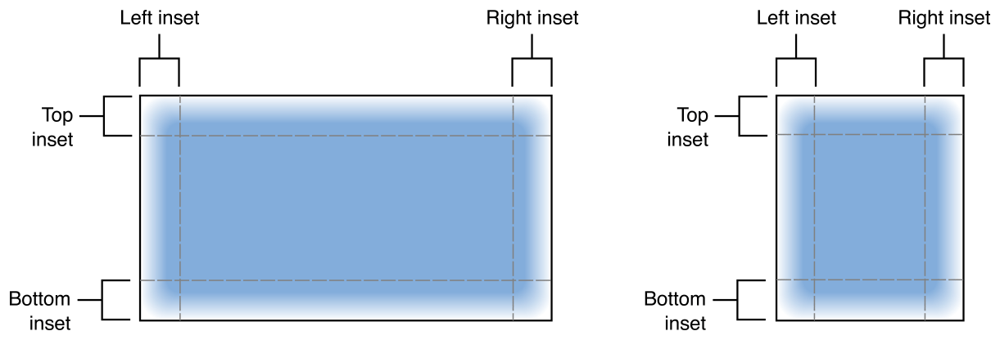
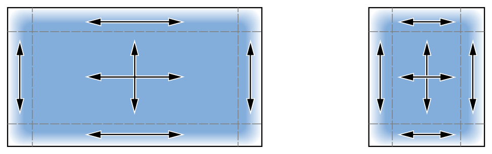

<!-- TOC -->

- [UIImage](#uiimage)
- [Create image objects](#create-image-objects)
- [Define a stretchable image 定义可拉伸的图像](#define-a-stretchable-image-定义可拉伸的图像)
- [Compare images 比较图像](#compare-images-比较图像)
- [Access the image data 访问图像数据](#access-the-image-data-访问图像数据)
- [API](#api)
    - [Loading and caching images 加载和缓存图像](#loading-and-caching-images-加载和缓存图像)
    - [Loading images for display 加载图像以供显示](#loading-images-for-display-加载图像以供显示)
    - [Creating and initializing image objects 创建和初始化图像对象](#creating-and-initializing-image-objects-创建和初始化图像对象)
    - [Creating animated images  创建动画图像](#creating-animated-images--创建动画图像)
    - [Changing the image attributes 更改图像属性](#changing-the-image-attributes-更改图像属性)
    - [Getting standard system images 获取标准系统图像](#getting-standard-system-images-获取标准系统图像)
    - [Getting the image data 获取图像数据](#getting-the-image-data-获取图像数据)
    - [Getting the image size and scale](#getting-the-image-size-and-scale)
    - [访问图像属性](#访问图像属性)
    - [Getting the image configuration 获取图像配置](#getting-the-image-configuration-获取图像配置)
    - [Managing the baseline](#managing-the-baseline)
    - [Getting rendering information 获取渲染信息](#getting-rendering-information-获取渲染信息)
    - [Drawing images](#drawing-images)
    - [Tinting the image 着色图像](#tinting-the-image-着色图像)
    - [Exporting standard bitmap formats 导出标准位图格式](#exporting-standard-bitmap-formats-导出标准位图格式)
- [class UIImage.Configuration](#class-uiimageconfiguration)
    - [API](#api-1)
        - [Modifying a configuration object 修改配置对象](#modifying-a-configuration-object-修改配置对象)
- [class UIImage.SymbolConfiguration](#class-uiimagesymbolconfiguration)
    - [Inherits From](#inherits-from)
    - [API](#api-2)
        - [Creating a color configuration 创建颜色配置](#creating-a-color-configuration-创建颜色配置)
        - [Getting an unspecified configuration 获取未指定的配置](#getting-an-unspecified-configuration-获取未指定的配置)
        - [Removing configuration attributes  移除配置属性](#removing-configuration-attributes--移除配置属性)
        - [Comparing symbol image configurations 比较符号图像配置](#comparing-symbol-image-configurations-比较符号图像配置)

<!-- /TOC -->

# UIImage

在应用程序中管理图像数据的对象。

您使用图像对象来表示各种图像数据，`UIImage类能够管理底层平台支持的所有图像格式的数据`。  
图像对象是不可变的，因此您始终从现有图像数据创建它们，例如磁盘上的图像文件或编程创建的图像数据。  
图像对象可以包含`单个图像`或`一系列图像，用于动画`。

您可以通过几种不同的方式使用图像对象：

- 将图像分配给UIImageView对象，以便在界面中显示图像。
- 使用图像自定义系统控件，如按钮、滑块和分段控件。
- 将图像直接绘制到视图或其他图形上下文中。
- 将图像传递给可能需要图像数据的其他API。

虽然图像对象支持所有平台原生图像格式，但建议您对应用程序中的大多数图像使用`PNG或JPEG`文件。  
`图像对象针对读取和显示两种格式进行了优化`，这些格式比大多数其他图像格式提供了更好的性能。  
由于`PNG格式是无损的，因此特别推荐用于您在应用程序界面中使用的图像`。

```swift
class UIImage : NSObject
```

# Create image objects

使用该类的方法创建图像对象时，您`必须`将现有图像数据`位于文件`或`数据结构`中。  
您`无法创建空图像`并将其绘制内容。  
创建图像对象有很多选项，每个选项最适合特定情况：

- 使用init（named:in:compatibleWith:）方法（或init（named:）方法）从位于应用程序主捆绑包（或其他已知捆绑包）中的图像资产或图像文件创建图像。`由于这些方法会自动缓存图像数据，因此特别建议您经常使用的图像使用它们`。
- 使用imageWithContentsOfFile:或init(contentsOfFile:)方法创建初始数据不在捆绑包中的图像对象。这些方法`每次都从磁盘加载映像数据`，因此不要使用它们反复加载相同的映像。
- 使用 animatedImage(with:duration:) 和 animatedImageNamed(_:duration:) 方法创建一个由多个顺序图像组成的 UIImage 对象。在UIImageView对象中安装生成的图像，以便在界面中创建动画。

图像资产是管理应用程序随附的图像的最简单方法。  
每个新的Xcode项目都包含一个资产库，您可以向其中添加多个图像集。  
图像集包含应用程序使用的单个图像的变体。  
单个图像集可以为不同的平台、不同的特征环境（紧凑或常规）以及不同的比例因素提供不同版本的图像。

# Define a stretchable image 定义可拉伸的图像

`端盖(end cap)`的概念，用来指定图片中的哪一部分不用拉伸

可拉伸图像是定义您可以以美观的方式复制底层图像数据的区域。  
可拉伸图像通常用于创建可以增长或缩小以填充可用空间的背景。

使用 resizableImage（withCapInsets:）或 resizableImage（withCapInsets:resizingMode:）方法向现有图像添加嵌件来定义可拉伸图像。  
插入将图像细分为两个或多个部分。  
为每个插入指定非零值会产生一个分为九个部分的图像，如下图所示：



每个插入都定义了图像中在给定维度中不拉伸的部分。  
图像`顶部`和`底部`嵌入内的区域`保持固定高度`，`左右`嵌入区域保持`固定宽度`。  
下图显示了九部分图像的每个部分如何拉伸图像本身以填充可用空间。  
图像的`角落不会改变大小`，因为它们位于水平和垂直嵌入内：



# Compare images 比较图像

isEqual(_:)方法是确定两个图像对象是否包含相同图像数据的唯一可靠方法。

# Access the image data 访问图像数据

`图像对象不提供对其底层图像数据的直接访问`。但是，您可以以其他格式检索图像数据，以便在您的应用程序中使用。  
具体来说，您可以使用cgImage和ciImage属性来检索分别与Core Graphics和Core Image兼容的图像版本。  
您还可以使用pngData()和jpegData(compressionQuality:)函数生成包含PNG或JPEG格式图像数据的NSData对象。

# API

## Loading and caching images 加载和缓存图像

```swift
// 使用与指定特征集合兼容的命名图像资产创建图像对象。
// 在搜索资产目录时，此方法更喜欢包含符号图像的资产，而不是包含位图图像的同名资产。由于系统支持iOS 13及更高版本中的符号图像，因此您可以在同一资产目录中包含这两种类型的资产。系统会自动回到早期版本iOS上的位图映像。
// 您不能使用此方法加载系统符号映像；而是使用init（systemName:compatibleWith:）方法。
// 此方法使用您指定的名称检查图像对象的系统缓存，并返回最适合您指定的特征集合的图像变体。如果缓存中没有匹配的映像对象，此方法将从可用资产目录中创建映像或从磁盘加载映像。
// 该系统可以随时清除缓存的图像数据，以释放内存。仅对缓存中未使用的图像进行清除。
// 在iOS 9及更高版本中，此方法是线程安全的。
init?(named: String, in: Bundle?, compatibleWith: UITraitCollection?)

// 使用与您指定的配置兼容的命名图像资产创建图像。
init?(named: String, in: Bundle?, with: UIImage.Configuration?)

// 从指定的命名资产创建图像对象。
init?(named: String)

// 返回指定资源的图像对象。
init(imageLiteralResourceName: String)

// 创建一个包含具有指定配置的系统符号图像的图像对象。
init?(systemName: String, withConfiguration: UIImage.Configuration?)

// 创建一个包含适合指定特征的系统符号图像的图像对象。
init?(systemName: String, compatibleWith: UITraitCollection?)

// 创建一个包含系统符号图像的图像对象。
init?(systemName: String)

```

## Loading images for display 加载图像以供显示

```swift
// 同步解码图像，并提供新的图像显示在视图和动画中。
//  除非您之前开始使用 prepareForDisplay（completionHandler:）准备图像，否则请避免在主线程上使用此方法。如果您正在解码许多图像，例如使用集合视图，从并发队列调用此方法可能会因要求太多的系统线程而降低性能。改为使用串行队列。
// 此方法返回一个新的图像对象，以便通过图像视图高效显示。将此方法创建的图像对象分配给图像视图的图像属性。如果UIImageView可以在不解码的情况下渲染图像，则此方法无需进一步处理即可返回有效的图像。如果系统无法解码图像，例如从CIImage创建的图像，则该方法返回nil。
// UIKit不会将准备好的图像与原始图像或资产目录中的任何相关变体相关联。如果您的应用程序环境动态更改显示特征，请倾听特征环境的变化，并在环境发生变化时准备新图像。
func preparingForDisplay() -> UIImage?

// 异步解码图像，并提供新的图像显示在视图和动画中。
func prepareForDisplay(completionHandler: (UIImage?) -> Void)

// 返回指定大小的新缩略图图像。
// 在UIImageView中显示图像时，您可以使用视图的contentMode属性自动剪辑或缩放图像。但是，当本机图像大小远大于视图的边界时，解码全尺寸图像会产生不必要的内存开销。通过使用此方法创建指定大小的缩略图图像，您可以避免以全尺寸解码图像的开销。
func preparingThumbnail(of: CGSize) -> UIImage?

// 在背景线程上异步创建指定大小的缩略图图像。
func prepareThumbnail(of: CGSize, completionHandler: (UIImage?) -> Void)

```

## Creating and initializing image objects 创建和初始化图像对象

```swift
// 使用指定文件的内容初始化并返回图像对象。
init?(contentsOfFile path: String)

// 使用指定数据初始化并返回图像对象。
init?(data: Data)

// 使用指定的数据和缩放因子初始化并返回图像对象。
init?(data: Data, scale: CGFloat)

// 使用指定的Quartz image引用初始化并返回图像对象。
init(cgImage: CGImage)

// 初始化并返回具有指定比例和方向Quartz image的图像对象。
init(cgImage: CGImage, scale: CGFloat, orientation: UIImage.Orientation)

// 使用指定的Core Image对象初始化并返回图像对象。
init(ciImage: CIImage)

// 使用指定的Core Image对象和属性初始化并返回图像对象。
init(ciImage: CIImage, scale: CGFloat, orientation: UIImage.Orientation)

```

## Creating animated images  创建动画图像

```swift
// 创建并返回动画图像。
// 此方法通过将一系列数字附加到名称参数中提供的基本文件名来加载一系列文件。
// 例如，如果 name 参数的内容是“image”，此方法将尝试从名称为“image0”、“image1”等文件中加载图像，一直到“image1024”。
// 动画图像中包含的所有图像都应具有相同的大小和比例。
// - name 文件的完整或部分路径（没有后缀）。
class func animatedImageNamed(_ name: String, duration: TimeInterval) -> UIImage?

// 从现有图像集创建并返回动画图像。
class func animatedImage(with: [UIImage], duration: TimeInterval) -> UIImage?

// 创建并返回带有端盖的动画图像。
// 此方法通过将一系列数字附加到名称参数中提供的基本文件名来加载一系列文件。例如，如果名称参数的内容是“image”，此方法将尝试从名称为“image0”、“image1”等文件中加载图像，一直到“image1024”。动画图像中包含的所有图像都应具有相同的大小和比例。
// 动画中的每帧都遵循resizableImage（withCapInsets:）方法创建的可调整大小图像的规则。
// - name 文件的完整或部分路径（没有后缀）。
class func animatedResizableImageNamed(_ name: String,capInsets: UIEdgeInsets,duration: TimeInterval) -> UIImage?

// 创建并返回带有端盖和特定调整大小模式的动画图像。
class func animatedResizableImageNamed(String, capInsets: UIEdgeInsets, resizingMode: UIImage.ResizingMode, duration: TimeInterval) -> UIImage?

```

## Changing the image attributes 更改图像属性

```swift
// 返回当前映像的新版本，将当前配置属性替换为指定的属性。
func withConfiguration(UIImage.Configuration) -> UIImage

// 返回当前映像的新版本，在当前属性之上应用指定的配置属性。
func applyingSymbolConfiguration(UIImage.SymbolConfiguration) -> UIImage?

// 返回当前图像的新版本，当它处于从右到左布局时水平翻转。
// 使用此方法指定应在从右到左布局中翻转的图像。请注意，大多数图像不需要以从右到左的布局翻转。
// 此方法返回当前UIImage对象，flipsForRightToLeftLayoutDirection属性设置为true；它不会返回翻转的图像。
// 当返回的图像以从右到左的布局方向显示在UIImageView对象中时（无论是布局方向是由系统语言设置的，还是因为图像视图的语义ContentAttribute属性设置为UISemanticContentAttribute.forceRightToLeft），图像都会翻转。
// 当返回的图像在从左到右的上下文中显示时，它似乎没有翻转。
func imageFlippedForRightToLeftLayoutDirection() -> UIImage

// 返回新版本的图像，这是原始图像的镜像。
func withHorizontallyFlippedOrientation() -> UIImage

// 返回使用指定渲染模式的新版本的图像。
func withRenderingMode(UIImage.RenderingMode) -> UIImage

// 返回使用指定对齐嵌入的图像的新版本。
func withAlignmentRectInsets(UIEdgeInsets) -> UIImage

// 返回带有指定大写嵌入的新版本图像。
func resizableImage(withCapInsets: UIEdgeInsets) -> UIImage

// 返回带有指定大写入集和选项的新版本图像。
func resizableImage(withCapInsets: UIEdgeInsets, resizingMode: UIImage.ResizingMode) -> UIImage

// 创建当前图像对象的副本，没有任何基线信息。
func imageWithoutBaseline() -> UIImage

// 从图像底部的指定偏移量处创建一个基线的新图像。
func withBaselineOffset(fromBottom: CGFloat) -> UIImage
```

## Getting standard system images 获取标准系统图像

您使用图像对象来表示各种图像数据，UIImage类能够管理底层平台支持的所有图像格式的数据。  
图像对象是不可变的，因此您始终从现有图像数据创建它们，例如磁盘上的图像文件或编程创建的图像数据。  
图像对象可以包含单个图像或一系列图像，用于动画。

```swift
// 指示添加内容的标准图像。
class var add: UIImage

// 指示删除内容的标准图像。
class var remove: UIImage

// 指示用户发起操作的标准图像。
class var actions: UIImage

// 填充圆背景上勾号的标准图像。
class var checkmark: UIImage

// 带有白色边框的有色圆圈上勾号的标准图像。
class var strokedCheckmark: UIImage

```

## Getting the image data 获取图像数据

```swift
// 底层Quartz image 数据。
var cgImage: CGImage?

// 底层Core Image数据。
var ciImage: CIImage?

// 组成动画对象动画的完整图像对象数组。
// 对于非动画图像，此属性的值为nil。
var images: [UIImage]?

// 图像的图像资产（如果有的话）。
// 对于从图像资产加载的图像，此属性包含一个图像资产对象，您可以使用该对象获取图像的其他变体。  
// 如果您没有使用图像资产创建图像对象，则此属性的值为nil。
// 对于使用ciImage对象创建的图像，此属性始终为nil。
var imageAsset: UIImageAsset? { get }

```

## Getting the image size and scale

```swift
var scale: CGFloat { get }

var size: CGSize { get }

```

## 访问图像属性

```swift
// 接收器图像的方向。
// enum Orientation
// case up 原始像素数据与图像的预期显示方向相匹配。
// case down 图像已从原始像素数据的方向旋转180°。
// case left 图像已从原始像素数据的方向逆时针旋转90°。
// case right 图像已从原始像素数据的方向顺时针旋转90°。
// case upMirrored 图像已从原始像素数据的方向水平翻转。
// case downMirrored 图像已从原始像素数据的方向垂直翻转。
// case leftMirrored 图像已顺时针旋转90°，并从原始像素数据的方向水平翻转。
// case rightMirrored 图像逆时针旋转90°，并从原始像素数据的方向水平翻转。
// 定向值常见于图像元数据中，正确指定图像方向对于显示图像和某些类型的图像处理都很重要。
// UIImage类根据其方向元数据自动处理以正确的显示方向显示图像所需的转换，因此图像对象的imageOrientation属性只需指示应用了哪种转换。
// 例如，iOS 设备摄像头总是在相机传感器的原生横向方向中编码像素数据，以及指示相机方向的元数据。
// 当UIImage加载以纵向拍摄的照片时，它会自动应用90°旋转，然后再显示图像数据，图像的imageOrientation值UIImage.Orientation.right表示已应用此旋转。
var imageOrientation: UIImage.Orientation { get }

// 一个布尔值，指示图像是否在从右到左布局中翻转。
var flipsForRightToLeftLayoutDirection: Bool { get }

// 调整图像大小的模式。
// 默认值为UIImage.ResizingMode.tile。
// 然而，UIImage将以尽可能快的方式实现调整大小模式，同时仍然保留所需的视觉外观。这意味着，如果要调整大小的区域是1像素区域，并且该属性设置为UIImage.ResizingMode.tile，则该区域将被拉伸，因为对于该大小的区域来说，两者几乎无法区分，并且拉伸速度比瓷砖快得多。
// 要设置此属性的值，您需要调用 animatedResizableImageNamed(_:capInsets:resizingMode:duration:) 或 resizableImage(withCapInsets:resizingMode:)，并使用 resizingMode 参数指定调整大小模式。

// enum ResizingMode
// case tile 调整大小时，图像会平铺。换句话说，原始图像的内部区域将被重复，以填充新调整大小的图像的内部区域。
// case stretch 调整大小时，图像会拉伸。换句话说，原始图像的内部区域将被缩放，以填充新调整的图像的内部区域。
var resizingMode: UIImage.ResizingMode { get }

// 显示动画图像的时间间隔。
var duration: TimeInterval { get }

// 端盖插入。
var capInsets: UIEdgeInsets

// 用于在布局期间定位图像的对齐元数据。
// 您可以使用插入值作为提示，以更精确地指定图像内容。
// 例如，如果您有一个包含发光效果的20 x 20像素图标，您可以将插入设置为{{2, 2}, {16, 16}}，以指示底层图标的位置，而不显示发光效果。
// 包含图像的对象可以使用这些嵌入将图像正确放置在其内容中。
var alignmentRectInsets: UIEdgeInsets { get }

// 一个布尔值，指示图像是否是符号。
// 符号图像是基于矢量的图像，用于应用程序的图标。
// 如果图像是系统提供的符号图像或您在资产目录中提供的自定义符号图像，则此属性的值为true。
// 对于所有其他图像类型，该值为false。
var isSymbolImage: Bool

```

## Getting the image configuration 获取图像配置

```swift
// 图像的配置详细信息。
var configuration: UIImage.Configuration?

// 符号图像的配置细节。
var symbolConfiguration: UIImage.SymbolConfiguration?

// 描述图像当前变体的特征集合。
var traitCollection: UITraitCollection

```

## Managing the baseline 

```swift
// 基线相对于图像底部的位置。
var baselineOffsetFromBottom: CGFloat?

```

## Getting rendering information 获取渲染信息

```swift
// 确定应用程序如何渲染图像的设置。
// 默认渲染模式为UIImage.RenderingMode.automatic。
// enum RenderingMode
// case automatic 使用上下文的默认渲染模式绘制图像。
// case alwaysOriginal 始终绘制原始图像，而不是将其视为模板。
// case alwaysTemplate 始终将图像绘制为模板图像，忽略其颜色信息。
var renderingMode: UIImage.RenderingMode { get }

// 图像的首选图像渲染器格式。
var imageRendererFormat: UIGraphicsImageRendererFormat

```

## Drawing images

```swift
// 在当前上下文的指定点绘制图像。
func draw(at: CGPoint)

// 使用自定义合成选项在指定点绘制整个图像。
func draw(at: CGPoint, blendMode: CGBlendMode, alpha: CGFloat)

// 在指定的矩形中绘制整个图像，并根据需要进行缩放以适应。
func draw(in: CGRect)

// 使用指定的合成选项在指定的矩形中绘制整个图像。
func draw(in: CGRect, blendMode: CGBlendMode, alpha: CGFloat)

// 使用接收器的内容作为瓷砖图案绘制平铺石英图案。
func drawAsPattern(in: CGRect)
```

## Tinting the image 着色图像

```swift
// 返回具有指定色调的当前图像的新版本。
func withTintColor(UIColor) -> UIImage

// 返回使用指定渲染模式的色调颜色的新版本图像。
func withTintColor(UIColor, renderingMode: UIImage.RenderingMode) -> UIImage
```

## Exporting standard bitmap formats 导出标准位图格式

```swift
// 返回一个包含JPEG格式指定图像的数据对象。
func jpegData(compressionQuality: CGFloat) -> Data?

// 返回一个包含PNG格式指定图像的数据对象。
func pngData() -> Data?

```

# class UIImage.Configuration

包含系统在选择当前图像变体时使用的特征的配置对象。  
图像可能包含多种变体来考虑环境因素，例如界面是`浅色`还是`深色`。  
图像配置对象允许您覆盖当前环境并呈现具有特定属性的图像。例如，您可能希望将图像的特定版本渲染到您的界面。  

UIImage.Configuration对象是`不可变`的，您`不会直接创建它们`。  
相反，从UITraitCollection或UIImage对象获取现有的图像配置对象。  
要向配置对象添加属性，请使用 applying(_:) 方法创建一个新对象，将现有对象的值与您提供的新值合并。  
将新对象分配给您用于显示图像的UIImageView对象的首选SymbolConfiguration属性。  
如果您直接绘制图像，请使用withConfiguration(_:)方法创建包含新属性的新图像。

## API

### Modifying a configuration object 修改配置对象

```swift
// 返回一个配置对象，该对象在当前对象的值之上应用指定的配置值。
func applying(UIImage.Configuration?) -> Self

// 返回一个新的配置对象，该对象将当前特征与指定特征集合中的特征合并。
func withTraitCollection(UITraitCollection?) -> Self

// 与图像配置相关的特征。
var traitCollection: UITraitCollection?
```

# class UIImage.SymbolConfiguration

包含应用于符号图像的特定字体、大小、样式和权重属性的对象。  

符号图像配置对象包括应用于符号图像的点大小、比例、文本样式、权重和字体等详细信息。  
该系统使用这些细节来确定要使用的图像变体以及如何缩放或样式图像。  

UIImage.SymbolConfiguration对象在您创建它们后`是不可变`的。  
如果您在对象上使用 `applying(_:)` 方法，则新的图像属性将替换您之前提供的任何属性。  
创建符号配置对象后，将其分配给您用于显示图像的UIImageView对象的首选符号配置属性。  
如果您直接绘制图像，请使用withConfiguration(_:)方法创建包含新属性的新图像。

```swift
class SymbolConfiguration : UIImage.Configuration, @unchecked Sendable
```

## Inherits From

UIImage.Configuration

## API

```swift
init(pointSize: CGFloat)
Creates a configuration object with the specified point-size information.
init(pointSize: CGFloat, weight: UIImage.SymbolWeight)
Creates a configuration object with the specified point-size and weight information.
init(pointSize: CGFloat, weight: UIImage.SymbolWeight, scale: UIImage.SymbolScale)
Creates a configuration object with the specified point-size, weight, and scale information.
init(scale: UIImage.SymbolScale)
Creates a configuration object with the specified scale information.
init(textStyle: UIFont.TextStyle)
Creates a configuration object with the specified font text style information.
init(textStyle: UIFont.TextStyle, scale: UIImage.SymbolScale)
Creates a configuration object with the specified font text style and scale information.
init(weight: UIImage.SymbolWeight)
Creates a configuration object with the specified weight information.
init(font: UIFont)
Creates a configuration object with the specified font information.
init(font: UIFont, scale: UIImage.SymbolScale)
Creates a configuration object with the specified font and scale information.
enum UIImage.SymbolScale
Constants that indicate which scale variant of a symbol image to use.
enum UIImage.SymbolWeight
Constants that indicate which weight variant of a symbol image to use.
```

### Creating a color configuration 创建颜色配置

```swift
// 使用来自一种颜色的配色方案创建颜色配置。
init(hierarchicalColor: UIColor)

// 从多种颜色的调色板创建带有配色方案的颜色配置。
init(paletteColors: [UIColor])

// 创建一个颜色配置，指定符号图像使用其多色变体（如果有的话）。
class func preferringMulticolor() -> Self

```

### Getting an unspecified configuration 获取未指定的配置

```swift
// 包含所有属性未指定值的符号配置对象。
class var unspecified: UIImage.SymbolConfiguration

```

### Removing configuration attributes  移除配置属性

```swift
// 返回当前符号配置对象的副本，没有点大小和权重信息。
func configurationWithoutPointSizeAndWeight() -> Self

// 返回当前符号配置对象的副本，没有缩放信息。
func configurationWithoutScale() -> Self

// 返回当前符号配置对象的副本，没有字体文本样式信息。
func configurationWithoutTextStyle() -> Self

// 返回当前符号配置对象的副本，没有权重信息。
func configurationWithoutWeight() -> Self

```

### Comparing symbol image configurations 比较符号图像配置

```swift
// 返回一个布尔值，该值指示配置对象是否等效。
func isEqual(to: UIImage.SymbolConfiguration?) -> Bool

```
