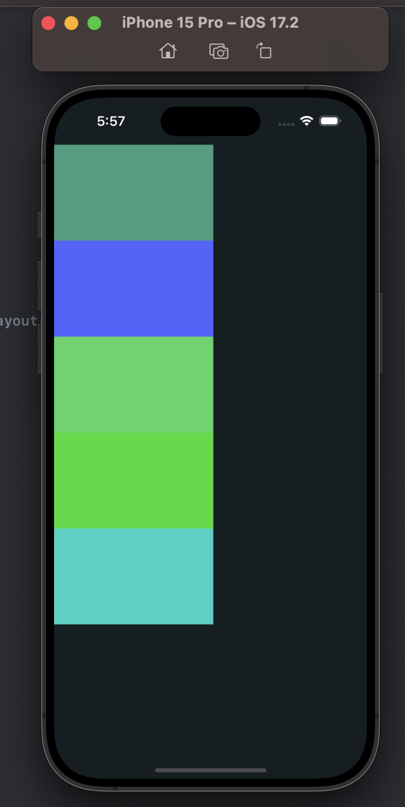

# UICollectionView 使用 UICollectionViewLayout 自定义布局

> 问题重现

* UICollectionViewLayout子类,`不存在导航拦`情况下，滚动位置未在安全区域处理渲染
* 继承 UICollectionViewFlowLayout 的子类无此问题
* contentInsetAdjustmentBehavior 设置如下

```swift
collectionView.contentInsetAdjustmentBehavior = .automatic
```

UICollectionViewLayout子类 如下图


设置

```swift
collectionView.contentInsetAdjustmentBehavior = .always
```



UICollectionViewFlowLayout子类 如下图


