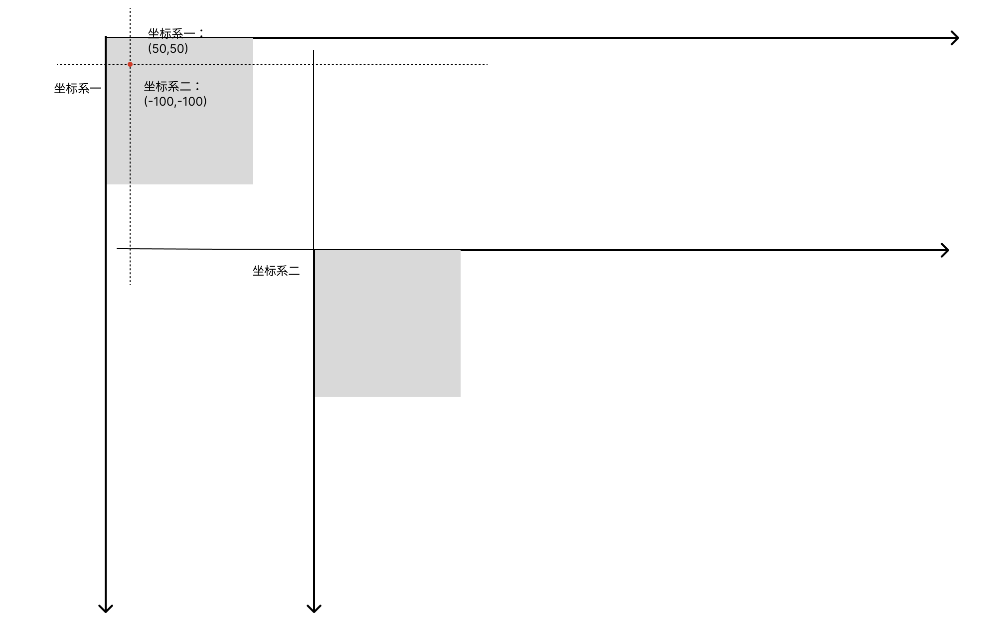

<!-- @import "[TOC]" {cmd="toc" depthFrom=1 depthTo=6 orderedList=false} -->

<!-- code_chunk_output -->

- [视图坐标系之间转换](#视图坐标系之间转换)

<!-- /code_chunk_output -->

# 视图坐标系之间转换

```swift
// 将一个点从接收器的坐标系统转换为指定视图的坐标系统。
func convert(CGPoint, to: UIView?) -> CGPoint

// 将点从给定视图的坐标系转换为接收器的坐标系。
func convert(CGPoint, from: UIView?) -> CGPoint

// 将矩形从接收器的坐标系统转换为另一个视图。
func convert(CGRect, to: UIView?) -> CGRect

// 将矩形从另一个视图的坐标系统转换为接收器的坐标系统。
func convert(CGRect, from: UIView?) -> CGRect

```

```swift
func viewConvert() {
    let fromView = UIView(frame: .init(x: 0, y: 0, width: 100, height: 100))
    let toView = UIView(frame: .init(x: 200, y: 200, width: 300, height: 300))
    
    // 相对 fromView 的坐标 转换为相对 toView 的坐标
    print("convert(CGPoint, to: UIView?)",fromView.convert(.init(x: 50, y: 50), to: toView))
    // convert(CGPoint, to: UIView?) (-150.0, -150.0)
    
    // 相对 toView 的坐标 转换为相对 fromView 的坐标
    print("convert(CGPoint, from: UIView?)",fromView.convert(.init(x: 50, y: 50), from: toView))
    // convert(CGPoint, from: UIView?) (250.0, 250.0)
    
    // 相对 fromView 的CGRect 转换为相对 toView 的CGRect
    print("convert(CGRect, to: UIView?)",fromView.convert(.init(x: 50, y: 50,width: 50,height:50), to: toView))
    // convert(CGRect, to: UIView?) (-150.0, -150.0, 50.0, 50.0)
    
    // 相对 toView 的CGRect 转换为相对 fromView 的CGRect
    print("convert(CGRect, from: UIView?)",fromView.convert(.init(x: 50, y: 50,width: 50,height:50), from: toView))
    // convert(CGRect, from: UIView?) (250.0, 250.0, 50.0, 50.0)
}
```


