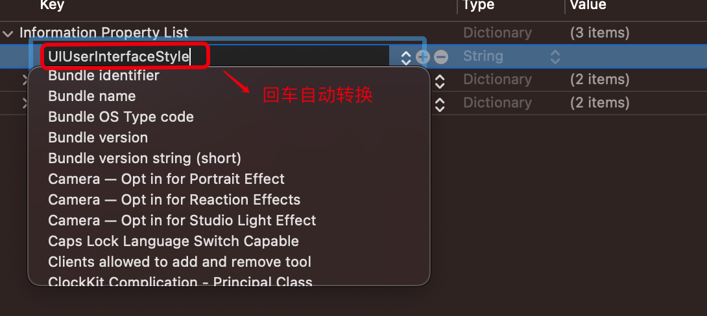
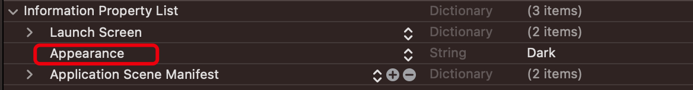

<!-- @import "[TOC]" {cmd="toc" depthFrom=1 depthTo=6 orderedList=false} -->

<!-- code_chunk_output -->

- [Info.plist](#infoplist)
  - [Application Scene Manifest 场景配置](#application-scene-manifest-场景配置)
  - [方向](#方向)
  - [故事板文件](#故事板文件)
  - [主题切换](#主题切换)
  - [状态栏](#状态栏)
  - [摄像头和麦克风](#摄像头和麦克风)
  - [Face ID](#face-id)
  - [定位](#定位)
  - [媒体库](#媒体库)
  - [运动数据](#运动数据)
  - [网络](#网络)
  - [Photos](#photos)
  - [WIFI](#wifi)
  - [HTTP 连接默认安全性](#http-连接默认安全性)
  - [Bundle](#bundle)
  - [启动条件](#启动条件)
  - [后台运行](#后台运行)

<!-- /code_chunk_output -->

<https://developer.apple.com/documentation/bundleresources/information_property_list>

# Info.plist

信息属性列表文件是一个结构化文本文件，其中包含捆绑可执行文件的基本配置信息。

- 注意，xcode 的 Info.plist 可视化的 `键值` 与 `编程对象的键有差异`，但 Info.plist 源码映射的是编程的键如(配置时可直接键入编程Key)：

> Appearance 映射到的是 UIUserInterfaceStyle




```xml
<?xml version="1.0" encoding="UTF-8"?>
<!DOCTYPE plist PUBLIC "-//Apple//DTD PLIST 1.0//EN" "http://www.apple.com/DTDs/PropertyList-1.0.dtd">
<plist version="1.0">
<dict>
 <key>UIUserInterfaceStyle</key>
 <string>Dark</string>
</dict>
</plist>
```

## Application Scene Manifest 场景配置

- [Application Scene Manifest]: Dictionary - 应用程序基于场景的生命周期支持的信息
  - [Enable Multiple Windows]: Boolean - 是否同时支持两个或多个场景
  - [Scene Configuration]: Dictionary - 系统用于创建新场景的默认配置详细信息
    - [Window Application Session Role]:Array of dictionaries - 用于在设备主屏幕上显示内容和响应用户交互的场景配置
      - [Configuration Name]:String 标识场景的特定应用程序名称
      - [Class Name ]:String  UIKit 实例化的场景类名称
      - [Delegate Class Name]:String 实例化并用作场景委托对象的应用程序特定类的名称
      - [Storyboard Name]:String 故事板故事板名称

## 方向

- [UIInterfaceOrientation]:String 应用程序用户界面的初始方向
- [UISupportedInterfaceOrientations]:String[] 应用程序支持的界面方向

## 故事板文件

- [Main storyboard file base name]:String - Macos 应用程序故事板资源文件的名称
- [Main storyboard file base name]:String - UIKit 应用程序主故事板文件的名称

## 主题切换

- [UIUserInterfaceStyle]:String(Automatic|Light|Dark) - 应用程序的用户界面风格

## 状态栏

- [UIStatusBarHidden]:Boolean 启动应用程序时隐藏状态栏
- [UIStatusBarStyle]:String 应用程序启动时状态栏的样式

## 摄像头和麦克风

- [NSCameraUsageDescription]: String 一条信息，告诉用户应用程序请求访问设备摄像头的原因。
- [NSMicrophoneUsageDescription]:String 一条信息，告诉用户应用程序请求访问设备麦克风的原因。

## Face ID

- [NSFaceIDUsageDescription]:String 一条信息，告诉用户为什么应用程序请求使用 Face ID 进行身份验证。

## 定位

- [NSLocationAlwaysAndWhenInUseUsageDescription]:String 一条信息，告诉用户为什么应用程序要求随时访问用户的位置信息。
- [NSLocationWhenInUseUsageDescription]:String 一条信息，告诉用户应用程序在前台运行时请求访问用户位置信息的原因。
- [NSLocationDefaultAccuracyReduced]:Bool 一个布尔值，表示应用程序是否在默认情况下请求降低定位精度

## 媒体库

- [NSAppleMusicUsageDescription]:String - 应用程序使用 API 访问用户的媒体库，系统需要此密钥

## 运动数据

- [NSMotionUsageDescription]:String - 应用程序使用访问设备运动数据的 API（包括 CMSensorRecorder 、 CMPedometer 、 CMMotionActivityManager 和 CMMovementDisorderManager ），则需要此密钥

## 网络

- [NSLocalNetworkUsageDescription]:String - 告诉用户应用程序请求访问本地网络的原因 任何直接或间接使用本地网络的应用程序都应包含此说明。这包括使用 Bonjour 的应用程序和使用 Bonjour 实现的服务，以及与本地主机的直接单播或组播连接。
- [NSNearbyInteractionUsageDescription]:String - 请求用户允许开始与附近设备的交互会话
  - [Allow Arbitrary Loads]:Boolean 指示是否为所有网络连接禁用应用程序传输安全限制。解决 http 访问
  - [Allows Local Networking]:Boolean 是否允许加载本地资源

## Photos

- [NSPhotoLibraryAddUsageDescription]:String 一条信息，告诉用户为什么应用程序要求对用户的照片库进行仅添加访问
- [NSPhotoLibraryUsageDescription]:String 一条信息，告诉用户应用程序请求访问用户照片库的原因

## WIFI

- [UIRequiresPersistentWiFi]:Boolean 表示应用程序是否需要 Wi-Fi 连接 如果 YES ，iOS 将在应用程序启动时打开 Wi-Fi 连接，并在应用程序运行时保持打开状态。如果 NO ，iOS 将在 30 分钟后关闭活动的 Wi-Fi 连接。如果应用程序在没有打开 Wi-Fi 连接的情况下尝试连接网络，系统可能会使用蜂窝网络来代替。

## HTTP 连接默认安全性

- [NSAppTransportSecurity]:Dictionary  HTTP 连接配置
  - [NSAllowsArbitraryLoads]:Boolean 是否对所有网络连接禁用应用程序传输安全限制
  - [NSAllowsArbitraryLoadsForMedia]:Boolean 是否对使用 AV Foundation 框架发出的请求禁用所有应用程序传输安全限制
  - [NSAllowsArbitraryLoadsInWebContent]:Boolean 是否对来自网页视图的请求禁用所有应用程序传输安全限制
  - [NSAllowsLocalNetworking]:Boolean 是否允许加载本地资源

## Bundle

- [CFBundleIdentifier]:String 捆绑包的唯一标识符 操作系统会使用捆绑包 ID 来识别应用程序
- [CFBundleName]:String 用户可见的捆绑包简称
- [CFBundleDisplayName]:String 软件包显示名称
- [LSMinimumSystemVersion]:String  macOS 中运行所需的最低操作系统版本
- [MinimumOSVersion]:String  在 iOS、iPadOS、tvOS 和 watchOS 中运行所需的操作系统最低版本 对于在 Xcode 中构建的应用程序，不要在 Info.plist 文件中指定 MinimumOSVersion 使用 Deployment Target-> General settings pane

## 启动条件

- [UIRequiredDeviceCapabilities]:String[] 应用程序运行所需的设备相关功能

## 后台运行
  
- [UIBackgroundModes]:Array of strings 应用程序提供的需要在后台运行的服务
