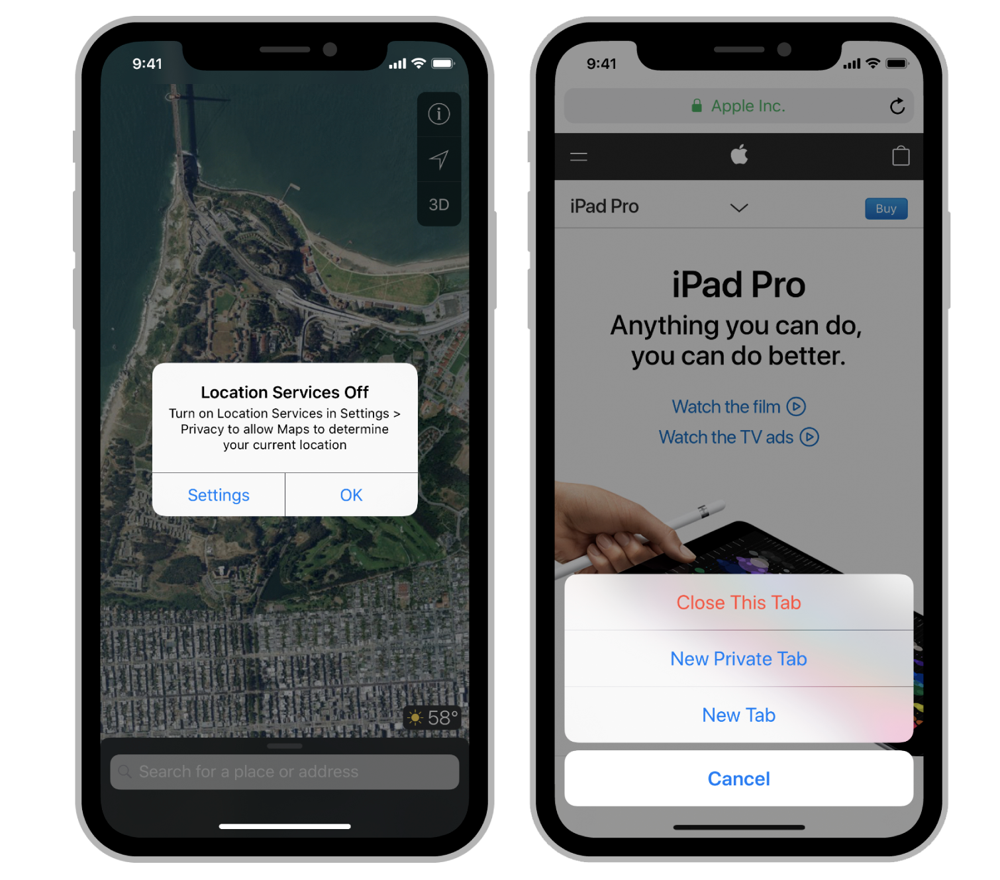

<!-- TOC -->

- [UIAlertController](#uialertcontroller)
- [addAction](#addaction)
- [Demo](#demo)

<!-- /TOC -->



# UIAlertController

https://developer.apple.com/documentation/uikit/uialertcontroller?language=objc

向用户显示警报消息的对象。

# addAction

https://developer.apple.com/documentation/uikit/uialertaction?language=objc

用户在警报中单击按钮时可以执行的操作。

# Demo

```c++
UIAlertController* alert = [UIAlertController alertControllerWithTitle:@"My Alert"
message:@"This is an alert."
preferredStyle:UIAlertControllerStyleAlert];


UIAlertAction* cancelAction = [UIAlertAction actionWithTitle:@"Cancel" style:UIAlertActionStyleCancel
    handler:^(UIAlertAction * action) {}];

UIAlertAction* defaultAction = [UIAlertAction actionWithTitle:@"OK" style:UIAlertActionStyleDefault
    handler:^(UIAlertAction * action) {}];

  
[alert addAction:cancelAction];
// 添加多个操作
[alert addAction:defaultAction];
// 以模态视图展示
[self presentViewController:alert animated:YES completion:nil];
```
