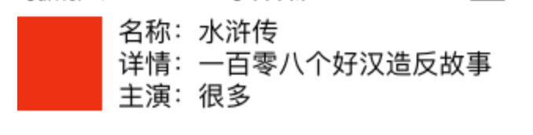

UIStackView 堆栈视图

可理解为display:flex;
可以简单实现



# 管理视图的添加与移除
```c++
//初始化方法，通过数组传入被管理的视图
- (instancetype)initWithArrangedSubviews:(NSArray<__kindof UIView *> *)views; 
//获取被管理的所有视图
@property(nonatomic,readonly,copy) NSArray<__kindof UIView *> *arrangedSubviews;
//添加一个视图进行管理
- (void)addArrangedSubview:(UIView *)view;
//移除一个被管理的视图
- (void)removeArrangedSubview:(UIView *)view;
//在指定位置插入一个被管理的视图
- (void)insertArrangedSubview:(UIView *)view atIndex:(NSUInteger)stackIndex;
```

# 布局模式

```c++
@property(nonatomic) UILayoutConstraintAxis axis;

//水平布局
UILayoutConstraintAxisHorizontal = 0,
//竖直布局
UILayoutConstraintAxisVertical = 1
```

# 对齐模式

```c++
@property(nonatomic) UIStackViewAlignment alignment;

//水平布局时为高度充满，竖直布局时为宽度充满
UIStackViewAlignmentFill,
//前边对其
UIStackViewAlignmentLeading,
//顶部对其
UIStackViewAlignmentTop = UIStackViewAlignmentLeading,
//第一个控件文字的基线对其 水平布局有效
UIStackViewAlignmentFirstBaseline, 
//中心对其
UIStackViewAlignmentCenter,
//后边对其
UIStackViewAlignmentTrailing,
//底部对其
UIStackViewAlignmentBottom = UIStackViewAlignmentTrailing,
//基线对其，水平布局有效
UIStackViewAlignmentLastBaseline, 
```

# 排列方式

```c++

@property(nonatomic) UIStackViewDistribution distribution;

//充满，当只有一个控件时可以使用
UIStackViewDistributionFill = 0,
//平分充满，每个控件占据相同尺寸排列充满
UIStackViewDistributionFillEqually,
//会优先按照约束的尺寸进行排列，如果没有充满，会拉伸最后一个排列的控件充满
UIStackViewDistributionFillProportionally,
//等间距排列
UIStackViewDistributionEqualSpacing,
//中心距离相等
UIStackViewDistributionEqualCentering,
```

# 其他

```c++
//设置最小间距
@property(nonatomic) CGFloat spacing;
//设置布局时是否参照基线
@property(nonatomic,getter=isBaselineRelativeArrangement) BOOL baselineRelativeArrangement;
//设置布局时是否以控件的LayoutMargins为标准，默认为NO，是以控件的bounds为标准
@property(nonatomic,getter=isLayoutMarginsRelativeArrangement) BOOL layoutMarginsRelativeArrangement;
```