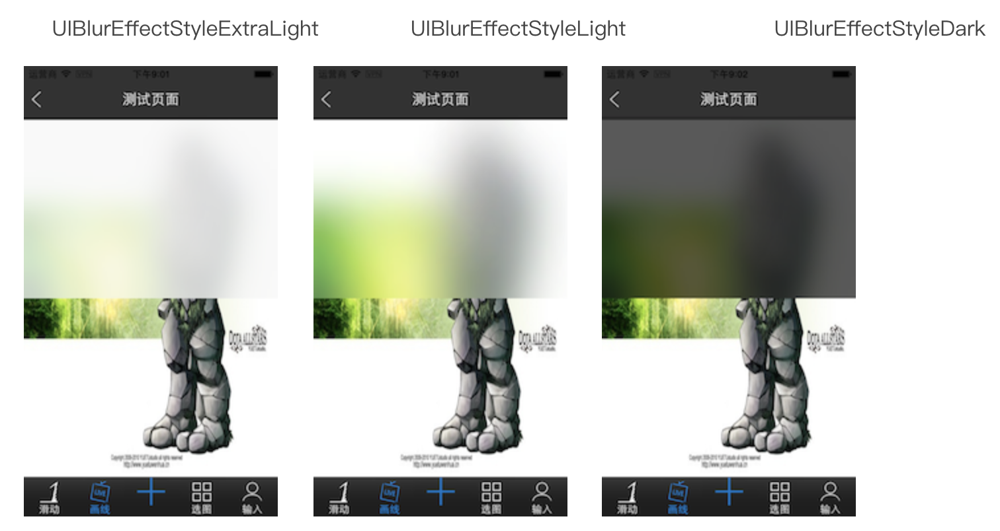

UIVisualEffectView高斯模糊视图




```c++

UIBlurEffect *blur = [UIBlurEffect effectWithStyle:UIBlurEffectStyleLight];
UIVisualEffectView *effectview = [[UIVisualEffectView alloc] initWithEffect:blur];
effectview.frame = CGRectMake(0, 0, imageview.size.width/2, 300);
[imageview addSubview:effectview];

```
