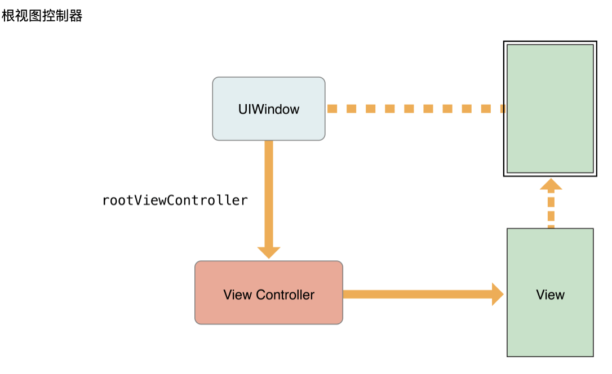

<!-- TOC -->

- [窗户和屏幕](#窗户和屏幕)
- [UIKit 应用程序的结构基于“模型-视图-控制器”（MVC）设计模式，其中对象按用途划分。](#uikit-应用程序的结构基于模型-视图-控制器mvc设计模式其中对象按用途划分)
- [UIApplication 对象运行应用程序的主事件循环并管理应用程序的整个生命周期。](#uiapplication-对象运行应用程序的主事件循环并管理应用程序的整个生命周期)
- [应用与环境](#应用与环境)
- [APP 生命周期](#app-生命周期)
  - [ios 13 以下生命周期](#ios-13-以下生命周期)
  - [ios 13 生命周期](#ios-13-生命周期)
- [< IOS 13](#-ios-13)
  - [坐标系](#坐标系)
  - [frame & bounds & center](#frame--bounds--center)
  - [视图的运行时交互模型](#视图的运行时交互模型)
  - [事件处理方法（视图最常用的覆盖方法）](#事件处理方法视图最常用的覆盖方法)
  - [UIWindow](#uiwindow)
    - [创建和配置 UIWindow](#创建和配置-uiwindow)
  - [View (视图对象)](#view-视图对象)
    - [创建和配置视图对象](#创建和配置视图对象)
    - [以编程方式创建视图对象](#以编程方式创建视图对象)
    - [关键视图属性](#关键视图属性)
    - [tag 属性](#tag-属性)
    - [创建和管理视图层次结构](#创建和管理视图层次结构)
    - [隐藏视图](#隐藏视图)
    - [在视图层次结构中定位视图](#在视图层次结构中定位视图)
    - [在视图层次结构中转换坐标](#在视图层次结构中转换坐标)
    - [在运行时调整视图的大小和位置](#在运行时调整视图的大小和位置)
    - [在运行时修改视图](#在运行时修改视图)
    - [动画](#动画)
    - [定义自定义视图](#定义自定义视图)
  - [动画](#动画-1)
    - [UIKit](#uikit)
    - [Core Animation](#core-animation)
    - [在视图中动画化属性更改](#在视图中动画化属性更改)
    - [使用 Begin / Commit 方法开始动画](#使用-begin--commit-方法开始动画)
    - [配置动画委托](#配置动画委托)
    - [嵌套动画块](#嵌套动画块)
    - [在视图之间创建动画过渡](#在视图之间创建动画过渡)
    - [更改视图的子视图](#更改视图的子视图)
    - [用其他视图替换视图](#用其他视图替换视图)
    - [将多个动画链接在一起](#将多个动画链接在一起)
  - [Layout 图层](#layout-图层)
  - [UIView](#uiview)
  - [UIScreen](#uiscreen)
  - [UIViewController](#uiviewcontroller)
    - [UIViewController 生命周期](#uiviewcontroller-生命周期)
    - [方法详解](#方法详解)
    - [根视图控制器](#根视图控制器)
    - [容器视图控制器](#容器视图控制器)
    - [容器视图控制器通常作为根视图控制器安装在窗口中](#容器视图控制器通常作为根视图控制器安装在窗口中)
    - [独立 View Controller](#独立-view-controller)
    - [保存和恢复状态](#保存和恢复状态)
      - [标记视图控制器以进行保存](#标记视图控制器以进行保存)
      - [选择有效的还原标识符](#选择有效的还原标识符)
  - [UINavigationController](#uinavigationcontroller)
  - [Interface Builder](#interface-builder)
  - [Using Segues](#using-segues)
  - [iOS 滚动视图](#ios-滚动视图)
  - [iOS 文本](#ios-文本)
  - [UIDocument](#uidocument)
  - [UIApplication](#uiapplication)

<!-- /TOC -->

# 窗户和屏幕

- 一个 UIWindow 对象提供其自己并没有什么明显的内容。
- 窗口的所有可见内容均由其根视图控制器提供
- 窗口的作用是从 UIKit 接收事件，并将所有相关事件转发到根视图控制器和关联的视图。

# UIKit 应用程序的结构基于“模型-视图-控制器”（MVC）设计模式，其中对象按用途划分。

- 模型对象管理应用程序的数据和业务逻辑。
- 视图对象提供了数据的可视化表示。
- 控制器对象充当模型和视图对象之间的桥梁，并在适当的时间在它们之间移动数据。

# UIApplication 对象运行应用程序的主事件循环并管理应用程序的整个生命周期。

# 应用与环境

- 在 iOS 13 及更高版本中，用户可以同时创建和管理应用程序用户界面的多个实例，并使用应用程序切换器在它们之间进行切换。

# APP 生命周期

## ios 13 以下生命周期

## ios 13 生命周期

# < IOS 13

## 坐标系


## frame & bounds & center

https://developer.apple.com/library/archive/documentation/WindowsViews/Conceptual/ViewPG_iPhoneOS/WindowsandViews/WindowsandViews.html#//apple_ref/doc/uid/TP40009503-CH2-SW6

- 该 frame 属性包含框架矩形，该矩形指定视图在其**_父视图的坐标系_**中的大小和位置。
- 该 bounds 属性包含 bounds 矩形，该矩形在视图**_自己的本地坐标系_**中指定视图的大小（及其内容原点）。
- 该 center 属性**_包含超级视图坐标系_**中视图的已知中心点。

## 视图的运行时交互模型

1. 用户触摸屏幕。
2. 硬件将触摸事件报告给 UIKit 框架。
3. UIKit 框架将触摸打包到一个 UIEvent 对象中，并将其分派到适当的视图
4. 您的视图的事件处理代码响应该事件。例如，您的代码可能：

   - 更改视图或其子视图的属性（框架，边界，alpha 等）。
   - 调用该 setNeedsLayout 方法以将视图（或其子视图）标记为需要布局更新。
   - 调用 setNeedsDisplay 或 setNeedsDisplayInRect:方法以将视图（或其子视图）标记为需要重绘。
   - 通知控制器有关某些数据的更改。
   - 当然，由您决定视图应执行哪些操作以及应调用哪些方法。

5. 如果视图的几何由于任何原因而改变，则 UIKit 会根据以下规则更新其子视图：

   - 如果为视图配置了自动调整大小规则，则 UIKit 会根据这些规则调整每个视图。
   - 如果视图实现了该 layoutSubviews 方法，则 UIKit 会调用它。
     您可以在自定义视图中覆盖此方法，并使用它来调整任何子视图的位置和大小。例如，提供较大可滚动区域的视图将需要使用多个子视图作为“平铺”，而不是创建一个大视图，该大视图无论如何都不太适合内存。在此方法的实现中，视图将隐藏现在不在屏幕上的所有子视图，或者重新放置它们，并使用它们绘制新显示的内容。作为此过程的一部分，视图的布局代码还可使需要重绘的任何视图无效。

6. 如果任何视图的任何部分被标记为需要重绘，则 UIKit 会要求该视图重绘自身。
   - 对于明确定义 drawRect:方法的自定义视图，UIKit 会调用该方法。此方法的实现应尽快重绘视图的指定区域，而别无其他。此时不要进行其他布局更改，也不要对应用程序的数据模型进行其他更改。此方法的目的是更新视图的视觉内容。

标准系统视图通常不实现 drawRect:方法，而是在此时管理其图形。

7. 任何更新的视图都将与应用程序的其余可见内容组合在一起，并发送到图形硬件进行显示。
8. 图形硬件将渲染的内容传输到屏幕。

## 事件处理方法（视图最常用的覆盖方法）

- 事件处理方法：
  - touchesBegan:withEvent:
  - touchesMoved:withEvent:
  - touchesEnded:withEvent:
  - touchesCancelled:withEvent:
- 该 layoutSubviews 方法
- 该 drawRect:方法

## UIWindow


https://developer.apple.com/documentation/uikit/uiwindow?language=objc

- 每个 iOS 应用程序都至少需要一个窗口（UIWindow 该类的一个实例），有些可能包含多个窗口。
  - 它包含您的应用程序的可见内容。
  - 它在将触摸事件传递到视图和其他应用程序对象中扮演着关键角色。
  - 它与您的应用程序的视图控制器一起使用，以方便方向更改。
- UIWindow 应用程序生命周期的早期从应用程序的主 nib 文件加载（或以编程方式创建）

### 创建和配置 UIWindow

- 编程方式
- Interface Builder 创建和配置

```c++
// 编程方式
self.window = [[[[UIWindow alloc] initWithFrame：[[UIScreen mainScreen] bounds]] autorelease];
```

> 根视图对象(由相应的视图控制器管理) rootViewController

- 对象包含代表您的内容的所有其他视图

https://developer.apple.com/documentation/uikit/uiwindow/1621581-rootviewcontroller?language=objc

## View (视图对象)

视图对象是应用程序与用户交互的主要方式，因此它们承担着许多责任。

- 布局和子视图管理
  - 视图定义了其相对于其父视图的默认大小调整行为。
  - 视图可以管理子视图列表。
  - 视图可以根据需要覆盖其子视图的大小和位置。
  - 视图可以将其坐标系中的点转换为其他视图或窗口的坐标系。
- 绘画和动画
  - 视图在其矩形区域中绘制内容。
  - 某些视图属性可以设置为新值。
- 事件处理
  - 视图可以接收触摸事件
  - 视图参与响应者链

### 创建和配置视图对象

- 通过编程
- Interface Builder

### 以编程方式创建视图对象

```c++
CGRect viewRect = CGRectMake（0，0，100，100）;
UIView * myView = [[UIView alloc] initWithFrame：viewRect];
```

### 关键视图属性

| 属性                   | 描述                                                                                                                                                                        |
| ---------------------- | --------------------------------------------------------------------------------------------------------------------------------------------------------------------------- |
| alpha                  | 透明度                                                                                                                                                                      |
| hidden                 | 直接改变视图的不透明度                                                                                                                                                      |
| opaque                 | 该 opaque 属性告诉系统如何合成视图。将此属性设置为 YES 如果视图的内容是完全不透明的，因此不显示任何基础视图的内容。YES 通过消除不必要的合成操作，将此属性设置为可提高性能。 |
| bounds                 |
| frame                  |
| center                 |
| transform              | transform 属性用于以复杂的方式制作动画或移动整个视图                                                                                                                        |
| autoresizingMask       | 控制视图如何响应其父视图范围的变化                                                                                                                                          |
| autoresizesSubviews    | 控制是否完全调整当前视图的子视图的大小                                                                                                                                      |
| contentMode            | 影响视图内内容的呈现行为 确定内容是如何处理的视图的宽度或高度的变化                                                                                                         |
| contentStretch         | 影响视图内内容的呈现行为 确定内容是如何处理的视图的宽度或高度的变化                                                                                                         |
| contentScaleFactor     | 影响视图内内容的呈现行为 仅当需要为高分辨率屏幕定制视图的绘制行为时，才使用该属性                                                                                           |
| gestureRecognizers     | 影响您的视图处理触摸事件的方式 包含附加到视图的手势识别器                                                                                                                   |
| userInteractionEnabled | 同上                                                                                                                                                                        |
| multipleTouchEnabled   | 同上                                                                                                                                                                        |
| exclusiveTouch         | 同上                                                                                                                                                                        |
| backgroundColor        |
| subviews               | subviews 属性本身包含一个子视图的只读列表，但是有几种添加和重新排列子视图的方法。                                                                                           |
| drawRect               | 有自定义绘图行为的视图，必须重写该 drawRect:方法                                                                                                                            |
| layer                  | 获得更高级的内容，可以直接使用视图的“核心动画” layer。要为视图指定完全不同的图层类型，必须重写该 layerClass 方法。                                                          |

### tag 属性

UIView 类包含一个 tag 属性，您可以使用带有一个整数值来标记单个视图对象。您可以使用标签来唯一标识视图层次结构内的视图，并在运行时对这些视图执行搜索。（基于标记的搜索比您自己迭代视图层次结构要快。）该 tag 属性的默认值为 0。

### 创建和管理视图层次结构

管理视图层次结构是开发应用程序用户界面的关键部分。视图的组织方式不仅影响应用程序的外观，还影响应用程序对更改和事件的响应方式。

- 添加和删 ​​ 除子视图

### 隐藏视图

- 要以视觉方式隐藏视图，可以将其 hidden 属性设置为 YES 或将其 alpha 属性更改为 0.0。
- 隐藏视图不会从系统接收触摸事件
- 隐藏视图确实会参与自动调整大小以及与视图层次结构关联的其他布局操作。

### 在视图层次结构中定位视图

- 将指向任何相关视图的指针存储在适当的位置，例如在拥有这些视图的视图控制器中。
- 为每个视图的 tag 属性分配一个唯一的整数，然后使用该 viewWithTag:方法查找它。

### 在视图层次结构中转换坐标

```
// UIView类定义的坐标转换成与从视图的局部坐标系统
convertPoint:fromView:
convertRect:fromView:
convertPoint:toView:
convertRect:toView:
```

```
// UIWindow该类还定义了几种转换方法。这些方法与UIView版本相似，不同之处在于，这些方法不是在视图的局部坐标系之间来回转换，而是在窗口的坐标系之间来回转换。
convertPoint:fromWindow:
convertRect:fromWindow:
convertPoint:toWindow:
convertRect:toWindow:
```

### 在运行时调整视图的大小和位置

- 自动布局
- 手动布局

> 手动调整视图的布局

- layoutSubviews

> 自动调整大小规则自动处理布局更改

- autoresizesSubviews

https://developer.apple.com/documentation/uikit/uiview/1622425-autoresizessubviews?language=objc

> 调整大小的掩码常量

| 属性                                   | 描述                                                                                                                                 |
| -------------------------------------- | ------------------------------------------------------------------------------------------------------------------------------------ |
| UIViewAutoresizingNone                 | 该视图不会自动调整大小。（这是默认值。）                                                                                             |
| UIViewAutoresizingFlexibleHeight       | 当超级视图的高度更改时，视图的高度也会更改。如果不包含此常数，则视图的高度不会改变。                                                 |
| UIViewAutoresizingFlexibleWidth        | 当超级视图的宽度更改时，视图的宽度也会更改。如果不包含此常数，则视图的宽度不会改变。                                                 |
| UIViewAutoresizingFlexibleLeftMargin   | 视图的左边缘和超级视图的左边缘之间的距离根据需要增大或缩小。如果不包含此常数，则视图的左边缘与超级视图的左边缘保持固定距离。         |
| UIViewAutoresizingFlexibleRightMargin  | 视图的右边缘和超级视图的右边缘之间的距离根据需要增大或缩小。如果不包含此常数，则视图的右边缘与超级视图的右边缘保持固定距离。         |
| UIViewAutoresizingFlexibleBottomMargin | 视图的底部边缘和超级视图的底部边缘之间的距离根据需要增大或缩小。如果不包含此常数，则视图的底边缘与超级视图的底边缘保持固定的距离。   |
| UIViewAutoresizingFlexibleTopMargin    | 视图的顶部边缘和超级视图的顶部边缘之间的距离根据需要增大或缩小。如果不包含此常数，则视图的顶部边缘与超级视图的顶部边缘保持固定距离。 |

### 在运行时修改视图

当应用程序从用户那里接收输入时，它们会响应该输入来调整其用户界面。

- 在视图控制器中
  - 视图控制器必须先创建其视图，然后才能显示它们
  - 当设备更改方向时，视图控制器可能会调整视图的大小和位置以进行匹配。
  - 当视图控制器管理可编辑内容时，它可能会在进入和退出编辑模式时调整其视图层次结构。
- 动画
  - 如果要在用户界面中的不同视图集之间切换，则可以从动画块内部隐藏某些视图，并显示其他视图。
  - 实现特殊效果时，可以使用动画块来修改视图的各种属性。
- 其他
  - 发生触摸事件或手势时，您的界面可能会通过加载一组新视图或更改当前视图来响应。
  - 当用户与滚动视图交互时，较大的可滚动区域可能会隐藏并显示图块子视图。
  - 出现键盘时，您可以重新定位视图或调整视图大小，以使它们不位于键盘下方。

### 动画

每个视图对象都有一个专用的“核心动画”层，用于管理屏幕上视图内容的呈现和动画。

- 后续

### 定义自定义视图

自定义视图使您可以完全控制应用程序内容的外观以及与该内容的交互的处理方式。

- 视图定义适当的初始化方法
  - 对于计划以编程方式创建的视图，请重写该 initWithFrame:方法或定义一个自定义初始化方法。
  - 对于计划从 nib 文件加载的视图，请重写该 initWithCoder:方法。使用此方法初始化您的视图并将其置于已知状态。
- 实现一种 dealloc 方法来处理所有自定义数据的清理。
- 自定义工程图，请覆盖 drawRect:方法并在此处进行工程图。
- 设置 autoresizingMask 视图的属性以定义其自动调整大小行为。
- 如果您的视图类管理一个或多个整体子视图
  - 在视图的初始化序列中创建这些子视图。
  - autoresizingMask 在创建时设置每个子视图的属性。
  - 如果子视图需要自定义布局，请覆盖该 layoutSubviews 方法并在此处实现布局代码。
- 触摸的事件
  - 使用 addGestureRecognizer:方法将任何合适的手势识别器附加到视图。
  - 对于那些你想自己处理触摸的情况下，覆盖 touchesBegan:withEvent:，touchesMoved:withEvent:，touchesEnded:withEvent:，和 touchesCancelled:withEvent:方法。（请记住 touchesCancelled:withEvent:，无论您覆盖其他与触摸相关的其他方法，都应始终覆盖该方法。）

自定义视图：初始化->dealloc(析构)->绘图->自动调整->事件

## 动画

动画在用户界面的不同状态之间提供了流畅的视觉过渡。

### UIKit

https://developer.apple.com/library/archive/documentation/Cocoa/Conceptual/CoreAnimation_guide/Introduction/Introduction.html#//apple_ref/doc/uid/TP40004514

https://developer.apple.com/library/archive/documentation/GraphicsImaging/Conceptual/CoreAnimation_Cookbook/Introduction/Introduction.html#//apple_ref/doc/uid/TP40005406

UIKit 中，动画是使用 UIView 对象执行的

动画 UIView 属性:

- frame
- bounds
- center
- transform
- alpha
- backgroundColor
- contentStretch

### Core Animation

- 图层的大小和位置
- 执行转换时使用的中心点
- 转换为 3D 空间中的图层或其子图层
- 从图层层次结构中添加或删除图层
- 图层相对于其他同级图层的 Z 顺序
- 图层的阴影
- 图层的边框（包括图层的角是否圆角）
- 在调整大小操作期间拉伸的层部分
- 图层的不透明度
- 超出图层范围的子图层的裁剪行为
- 图层的当前内容
- 图层的栅格化行为

### 在视图中动画化属性更改

对 UIView 类的属性进行动画处理，必须将这些更改包装在动画块中。

- animateWithDuration:animations:
- animateWithDuration:animations:completion:
- animateWithDuration:delay:options:animations:completion:

```c++
[UIView animateWithDuration:1.0 animations:^{
        firstView.alpha = 0.0;
        secondView.alpha = 1.0;
}];
```

```c++
// 立即淡出视图
- (IBAction)showHideView:(id)sender
{
    // Fade out the view right away
    [UIView animateWithDuration:1.0
        delay: 0.0
        options: UIViewAnimationOptionCurveEaseIn
        animations:^{
             thirdView.alpha = 0.0;
        }
        completion:^(BOOL finished){
            // Wait one second and then fade in the view
            [UIView animateWithDuration:1.0
                 delay: 1.0
                 options:UIViewAnimationOptionCurveEaseOut
                 animations:^{
                    thirdView.alpha = 1.0;
                 }
                 completion:nil];
        }];
}
```

### 使用 Begin / Commit 方法开始动画

- <ios3 可不做了解

### 配置动画委托

要在动画之前或之后立即执行代码，则必须将一个委托对象和一个开始或停止选择器与您的开始/提交动画块关联。

- setAnimationDelegate:

```c++
// UIView并使用setAnimationWillStartSelector:和setAnimationDidStopSelector:类方法设置开始和停止选择器。在动画期间，动画系统会在适当的时间调用您的委托方法，以使您有机会执行代码。
- (void)animationWillStart:(NSString *)animationID context:(void *)context;
- (void)animationDidStop:(NSString *)animationID finished:(NSNumber *)finished context:(void *)context;
```

### 嵌套动画块

通过嵌套其他动画块来为动画块的各个部分分配不同的时序和配置选项。顾名思义，嵌套动画块是在现有动画块内创建的新动画块。嵌套动画将与任何父动画同时启动，但是（在大多数情况下）将使用其自己的配置选项运行。默认情况下，嵌套动画的确会继承父对象的持续时间和动画曲线，但是即使需要，这些选项也可以被覆盖

### 在视图之间创建动画过渡

- 更改现有视图的可见子视图。
- 将视图层次结构中的一个视图替换为另一视图。

### 更改视图的子视图

更改视图的子视图可让您对视图进行适度的更改。例如，您可以添加或删除子视图以在两个不同状态之间切换超级视图。动画结束时，将显示相同的视图，但现在其内容有所不同。

### 用其他视图替换视图

当您希望界面大不相同时，您可以执行替换视图的操作。

### 将多个动画链接在一起

UIView 动画接口提供用于连接单独的动画块，使得它们在同一时间进行的，而不是顺序地支持。

- 对于基于块的动画，请使用 animateWithDuration:animations:completion:和 animateWithDuration:delay:options:animations:completion:方法支持的完成处理程序来执行所有后续动画。

## Layout 图层

## UIView

https://developer.apple.com/documentation/uikit/uiview?language=objc

## UIScreen

https://developer.apple.com/documentation/uikit/uiscreen?language=objc

## UIViewController

https://developer.apple.com/library/archive/featuredarticles/ViewControllerPGforiPhoneOS/index.html#//apple_ref/doc/uid/TP40007457

https://developer.apple.com/documentation/uikit/uiviewcontroller?language=objc


视图控制器是应用程序内部结构的基础。每个应用程序至少都有一个视图控制器，大多数应用程序都有多个。每个视图控制器管理应用程序用户界面的一部分，以及该界面与基础数据之间的交互。视图控制器还有助于在用户界面的不同部分之间进行转换。

- 内容视图控制器管理应用程序内容的离散部分，并且是您创建的视图控制器的主要类型。
- 容器视图控制器从其他视图控制器（称为子视图控制器）收集信息，并以有助于导航或以不同方式呈现这些视图控制器的内容的方式来呈现信息。

视图控制器始终对其根视图具有引用，并且每个视图对其子视图均具有强引用。

### UIViewController 生命周期


```c++
-(instancetype)initWithNibName:(NSString *)nibNameOrNil bundle:(NSBundle *)nibBundleOrNil{
   self = [super initWithNibName:nibNameOrNil bundle:nibBundleOrNil];
    NSLog(@"%s",__func__);
    return self;
}

// 初始化方法
-(instancetype)init{
    self = [super init];
    NSLog(@"%s",__func__);
    return self;
}

-(instancetype)initWithCoder:(NSCoder *)aDecoder{
    self = [super initWithCoder:aDecoder];
    NSLog(@"%s",__func__);
    return self;
}

-(void)awakeFromNib{
    [super awakeFromNib];
    NSLog(@"%s",__func__);
}

// 创建视图
-(void)loadView{
    [super loadView];
    NSLog(@"%s",__func__);
}

// 视图加载到内存后调用
- (void)viewDidLoad {
    [super viewDidLoad];
    NSLog(@"%s",__func__);
}

// 视图将被添加到视图层次结构中
-(void)viewWillAppear:(BOOL)animated{
    [super viewWillAppear:animated];
    NSLog(@"%s",__func__);
}

// 视图已添加到视图层次结构中
-(void)viewDidAppear:(BOOL)animated{
    [super viewDidAppear:animated];
    NSLog(@"%s",__func__);
}

// 视图将要修改其子视图
-(void)viewWillLayoutSubviews{
    [super viewWillLayoutSubviews];
    NSLog(@"%s",__func__);
}

// 视图需要更新其约束时调用
-(void)updateViewConstraints{
    [super updateViewConstraints];
    NSLog(@"%s",__func__);
}

// 修改视图完成
-(void)viewDidLayoutSubviews{
    [super viewDidLayoutSubviews];
    NSLog(@"%s",__func__);
}

// 视图将要从视图层次结构中删除
-(void)viewWillDisappear:(BOOL)animated{
    [super viewWillDisappear:animated];
    NSLog(@"%s",__func__);
}

// 视图已从视图层次结构中删除
-(void)viewDidDisappear:(BOOL)animated{
    [super viewDidDisappear:animated];
    NSLog(@"%s",__func__);
}

// 视图离开
-(void)dealloc{
    NSLog(@"%s",__func__);
}

@end
```

### 方法详解

- loadView 每次访问 view 时，就会调用 self.view 的 get 方法，在 get 方法中判断 self.view==nil，不为 nil 就直接返回 view，等于 nil 就去调用 loadView 方法。loadView 方法会去判断有无指定 storyBord/Xib 文件，如果有就去加载 storyBord/Xib 描述的控制器 view，如果没有则系统默认创建一个空的 view，赋给 self.view。loadView 方法有可能被多次调用（每当访问 self.view 并且为 nil 时就会调用一次）；
- viewDidLoad view 加载完成时调用（在 loadView 方法执行后被调用），也有可能执行多次（self.view==nil 且被访问时）；
- awakeFromNib
- viewWillAppear view 即将可见时调用
- viewWillLayoutSubviews:view 即将布局子视图时调用
- viewDidLayoutSubviews:view 完成子视图布局后调用
- viewDidAppear:view 已经显示后调用
- viewWillDisappear:view 即将消失、被覆盖或者隐藏时调用此方法
- viewDidDisappear:view 已经消失、被覆盖或者隐藏时调用此方法
- didReceiveMemoryWarning 当收到内存警告时调用此方法
- viewWillUnload 当内存过低时，需要释放一些不需要使用的视图时，即将释放时调用（iOS6 以后被废弃）
- viewDidUnload 当内存过低，释放了一些不需要的视图时调用（iOS6 以后被废弃）

### 根视图控制器

根视图控制器是视图控制器层次结构的基础。



### 容器视图控制器

容器视图控制器使您可以从更易管理和可重用的组件中组装复杂的界面。

- UINavigationController
- UISplitViewController
- UIPageViewController

容器视图控制器通常作为根视图控制器安装在窗口中

### 容器视图控制器通常作为根视图控制器安装在窗口中

- UIKit 框架提供了用于显示警报，拍摄照片和视频以及管理 iCloud 上的文件的视图控制器。UIKit 还定义了许多标准容器视图控制器，可用于组织内容。
- GameKit 框架提供了视图控制器，用于匹配玩家并管理排行榜，成就和其他游戏功能。
- 通讯簿 UI 框架提供了用于显示和选择联系人信息的视图控制器。
- MediaPlayer 框架提供了用于播放和管理视频以及从用户库中选择媒体资产的视图控制器。
- EventKit UI 框架提供了用于显示和编辑用户日历数据的视图控制器。
- GLKit 框架提供了一个用于管理 OpenGL 渲染图面的视图控制器。

### 独立 View Controller

- 视图控制器应始终是独立的对象。任何视图控制器都不应该了解其他视图控制器的内部工作原理或视图层次结构。如果两个视图控制器需要来回通信或来回传递数据，则应始终使用显式定义的公共接口进行通信。

### 保存和恢复状态

状态保留会在挂起应用程序之前记录其配置，以便可以在随后的应用程序启动时恢复该配置。将应用恢复为以前的配置可以为用户节省时间，并提供更好的用户体验。

保留和恢复过程大部分是自动的，但是您需要告诉 iOS 应保留应用程序的哪些部分。

- （必需）将还原标识符分配给要保留其配置的视图控制器。
- （必需）告诉 iOS 如何在启动时创建或定位新的视图控制器对象；
- （可选）对于每个视图控制器，存储使该视图控制器恢复其原始配置所需的任何特定配置数据；

#### 标记视图控制器以进行保存

- restorationIdentifier 属性
- 分配恢复标识符时，请记住，视图控制器层次结构中的所有父视图控制器也必须也具有恢复标识符。

#### 选择有效的还原标识符


## UINavigationController


## Interface Builder

https://developer.apple.com/library/archive/documentation/DeveloperTools/Conceptual/IB_UserGuide/Introduction/Introduction.html#//apple_ref/doc/uid/TP40005344

## Using Segues

## iOS 滚动视图

https://developer.apple.com/library/archive/documentation/WindowsViews/Conceptual/UIScrollView_pg/Introduction/Introduction.html#//apple_ref/doc/uid/TP40008179

## iOS 文本

https://developer.apple.com/library/archive/documentation/StringsTextFonts/Conceptual/TextAndWebiPhoneOS/Introduction/Introduction.html#//apple_ref/doc/uid/TP40009542

## UIDocument

## UIApplication
