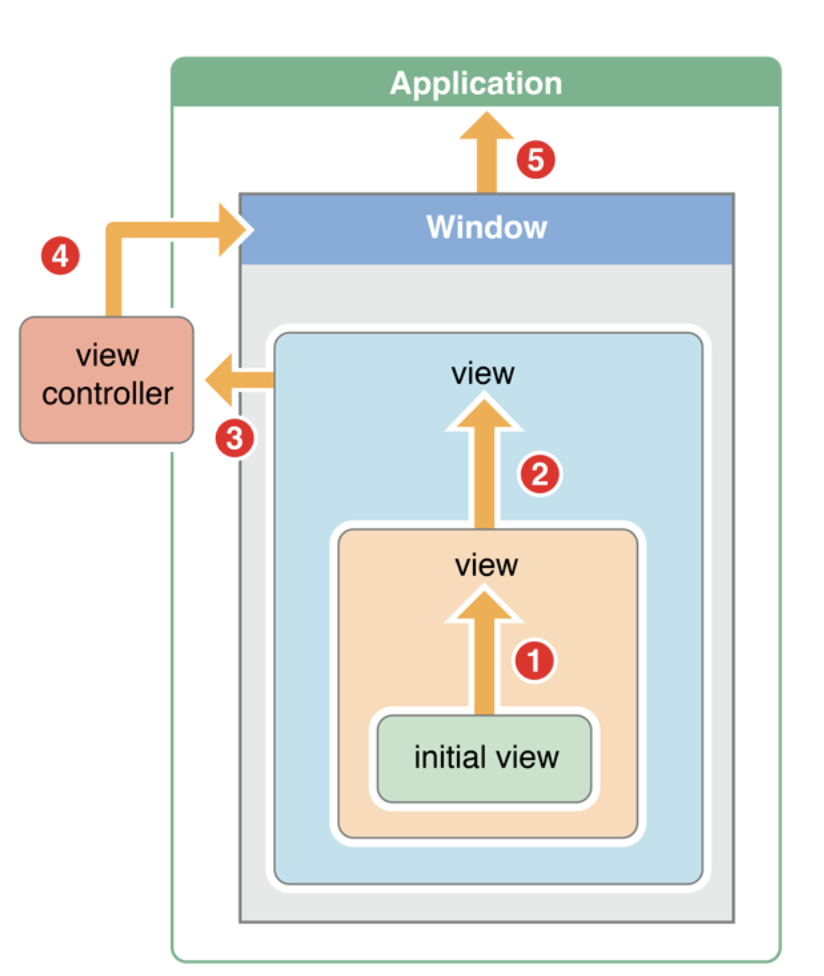
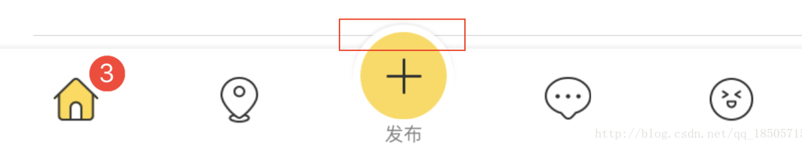

<!-- TOC -->

- [事件传递优先级](#事件传递优先级)
- [事件传递](#事件传递)
  - [hitTest](#hittest)
    - [顺序如下](#顺序如下)
    - [事件穿透](#事件穿透)
    - [（事件转发）子视图超出父视图范围](#事件转发子视图超出父视图范围)
- [视图不响应事件](#视图不响应事件)
- [UIResponder](#uiresponder)
- [UIEvent](#uievent)
- [UITouch](#uitouch)
- [UITapGestureRecognizer 手势识别器对象](#uitapgesturerecognizer-手势识别器对象)
  - [常用属性和方法](#常用属性和方法)
  - [UIGestureRecognizerDelegate](#uigesturerecognizerdelegate)
- [配置手势识别器](#配置手势识别器)
- [UIGestureRecognizerState 手势识别状态。](#uigesturerecognizerstate-手势识别状态)
- [触摸事件](#触摸事件)
  - [touchesBegan:withEvent: 开始触摸](#touchesbeganwithevent-开始触摸)
  - [touchesMoved:withEvent: 移动触摸](#touchesmovedwithevent-移动触摸)
  - [touchesEnded:withEvent: 结束触摸](#touchesendedwithevent-结束触摸)
  - [touchesCancelled:withEvent: 取消触摸序列时通知响应者](#touchescancelledwithevent-取消触摸序列时通知响应者)
- [Touch 手势](#touch-手势)
  - [Handling Tap Gestures 处理轻敲手势](#handling-tap-gestures-处理轻敲手势)
  - [Handling Long-Press Gestures 处理长按手势](#handling-long-press-gestures-处理长按手势)
  - [Handling Pan Gestures 处理平移手势](#handling-pan-gestures-处理平移手势)
  - [Handling Swipe Gestures 处理滑动手势](#handling-swipe-gestures-处理滑动手势)
  - [Handling Pinch Gestures 处理捏手势](#handling-pinch-gestures-处理捏手势)
  - [Handling Rotation Gestures 处理旋转手势](#handling-rotation-gestures-处理旋转手势)

<!-- /TOC -->

# 事件传递优先级

- 通过 hitTest 和 pointInside 两个方法，从 Window 开始向上面的视图查找，找到第一响应者的视图。
- 判断其是继承自 UIControl 还是 UIResponder
  - 继承自 UIControl 通过 UIApplication 直接向其派发消息，并且不再向响应者链派发消息。
  - 继承自 UIResponder 的类，则调用第一响应者的 touchesBegin，并且不会立即执行 touchesEnded，而是调用之后顺着响应者链向后查找。
    - 视图添加了手势，则进入手势的代理方法中，如果代理方法返回可以响应这个事件，则将第一响应者的事件取消，并调用其 touchesCanceled 方法，然后由手势来响应事件。
    - 手势不能处理事件，则交给第一响应者来处理。如果第一响应者也不能响应事件，则顺着响应者链继续向后查找，直到找到能够处理事件的 UIResponder 对象。如果找到 UIApplication 还没有对象响应事件的话，则将这次事件丢弃。

# 事件传递



## hitTest

```c++
- (UIView*)hitTest:(CGPoint)point withEvent:(UIEvent *)event

// point : 在接收器的局部坐标系(界)中指定的点。

// event  : 系统保证调用此方法的事件。如果从事件处理代码外部调用此方法，则可以指定nil。

// returnValue : 视图对象是当前视图和包含点的最远的后代。如果点完全位于接收方的视图层次结构之外，则返回nil。
```

在视图的层次结构中寻找一个最适合的 view 来响应触摸事件。

该方法会被系统调用，调用的时候，如果返回为 nil，即事件有可能被丢弃，否则返回最合适的 view 来响应事件。

### 顺序如下

UIApplication --》UIWindow—》Root view —> subview

> hitTest 理解为前端事件捕获

### 事件穿透

### （事件转发）子视图超出父视图范围



# 视图不响应事件

1. view.userInteractionEnabled = NO;
2. view.hidden = YES;
3. view.alpha < 0.05
4. view 超出 superview 的 bounds

# UIResponder

响应和处理事件的抽象接口。

UIResponder 是 iOS 中用于处理用户事件的 API，可以处理触摸事件、按压事件(3D touch)、远程控制事件、硬件运动事件。可以通过 touchesBegan、pressesBegan、motionBegan、remoteControlReceivedWithEvent 等方法，获取到对应的回调消息。UIResponder 不只用来接收事件，还可以处理和传递对应的事件，如果当前响应者不能处理，则转发给其他合适的响应者处理。

# UIEvent

描述单个用户与您的应用交互的对象。

应用程序可以接收许多不同类型的事件，包括触摸事件，动作事件，远程控制事件和按下事件。

触摸的目的是生成触摸事件供响应者响应，一个触摸事件对应一个 UIEvent 对象，其中的 type 属性标识了事件的类型，事件有如下几种类型：

```c++
// 返回与事件关联的所有触摸。请见下面 UITouch
@property(nonatomic, readonly) NSSet<UITouch *> *allTouches;
```

```c++
typedef NS_ENUM(NSInteger, UIEventType) {
    UIEventTypeTouches,
    UIEventTypeMotion,
    UIEventTypeRemoteControl,
    UIEventTypePresses NS_ENUM_AVAILABLE_IOS(9_0),
};
```

# UITouch

一个手指一次触摸屏幕，就对应生成一个 UITouch 对象。多个手指同时触摸屏幕，生成多个 UITouch 对象。

表示屏幕上发生的触摸的位置，大小，移动和力度的对象

# UITapGestureRecognizer 手势识别器对象

Gesture Recognizers 是在 iOS3.2 引入的，可以用来识别手势、简化定制视图事件处理的对象。Gesture Recognizers 的基类为 UIGestureRecognizer，这一个抽象基类，定义了实现底层手势识别行为的编程接口。在 UIKit 框架中提供了 6 个具体的手势识别类，用来识别常见的手势。

- UITapGestureRecognizer
- UIPinchGestureRecognizer
- UIRotationGestureRecognizer
- UISwipeGestureRecognizer
- UIPanGestureRecognizer
- UIScreenEdgePanGestureRecognizer
- UILongPressGestureRecognizer

```c++

// 初始化方法
- (instancetype)initWithTarget:(nullable id)target action:(nullable SEL)action;

// 添加触发的selector
- (void)addTarget:(id)target action:(SEL)action;

// 移除
- (void)removeTarget:(nullable id)target action:(nullable SEL)action;
```

## 常用属性和方法

```c++
// (重要) 是否终止触摸事件的传递 默认为YES
@property(nonatomic) BOOL cancelsTouchesInView;
// (重要) 控制这个消息的传递时机，默认这个属性为NO
@property(nonatomic) BOOL delaysTouchesBegan;
//设置代理，具体的协议后面会说
@property(nullable,nonatomic,weak) id <UIGestureRecognizerDelegate> delegate;
//设置手势是否有效
@property(nonatomic, getter=isEnabled) BOOL enabled;
//获取手势所在的view
@property(nullable, nonatomic,readonly) UIView *view;
// (重要) 优先触发的手势 第一个参数是需要失效的手势，第二个是生效的手势
- (void)requireGestureRecognizerToFail:(UIGestureRecognizer *)otherGestureRecognizer;
//获取触发触摸的点
- (CGPoint)locationInView:(nullable UIView*)view;
//设置触摸点数
- (NSUInteger)numberOfTouches;
//获取某一个触摸点的触摸位置
- (CGPoint)locationOfTouch:(NSUInteger)touchIndex inView:(nullable UIView*)view;
```

## UIGestureRecognizerDelegate

协议代理，通过代理的回调，我们可以进行自定义手势，也可以处理一些复杂的手势

# 配置手势识别器

# UIGestureRecognizerState 手势识别状态。

- UIGestureRecognizerStatePossible
  手势识别器尚未识别其手势，但是可能正在评估触摸事件。这是默认状态。

- UIGestureRecognizerStateBegan
  手势识别器已接收到被识别为连续手势的触摸对象。它在运行循环的下一个周期发送其动作消息。

- UIGestureRecognizerStateChanged
  姿势识别器已经接收到被识别为对连续姿势的改变的触摸。它在运行循环的下一个周期发送其动作消息。

- UIGestureRecognizerStateEnded
  手势识别器已接收到被识别为连续手势结束的触摸。它在运行循环的下一个周期发送操作消息（或多个消息），并将其状态重置为。
  UIGestureRecognizerStatePossible

- UIGestureRecognizerStateCancelled
  手势识别器已收到触摸，导致取消了连续手势。它在运行循环的下一个周期发送操作消息（或多个消息），并将其状态重置为。
  UIGestureRecognizerStatePossible

- UIGestureRecognizerStateFailed
  手势识别器已收到无法识别为手势的多点触摸序列。没有发送动作消息，并且手势识别器重置为。
  UIGestureRecognizerStatePossible

- UIGestureRecognizerStateRecognized
  手势识别器已接收到多点触摸序列，并将其识别为手势。它在运行循环的下一个周期发送操作消息（或多个消息），并将其状态重置为。
  UIGestureRecognizerStatePossible

# 触摸事件

## touchesBegan:withEvent: 开始触摸

https://developer.apple.com/documentation/uikit/uiresponder/1621142-touchesbegan?language=objc

## touchesMoved:withEvent: 移动触摸

https://developer.apple.com/documentation/uikit/uiresponder/1621107-touchesmoved?language=objc

## touchesEnded:withEvent: 结束触摸

https://developer.apple.com/documentation/uikit/uiresponder/1621084-touchesended?language=objc

## touchesCancelled:withEvent: 取消触摸序列时通知响应者

https://developer.apple.com/documentation/uikit/uiresponder/1621116-touchescancelled?language=objc

# Touch 手势

https://developer.apple.com/documentation/uikit/touches_presses_and_gestures/handling_uikit_gestures?language=objc

## Handling Tap Gestures 处理轻敲手势

https://developer.apple.com/documentation/uikit/touches_presses_and_gestures/handling_uikit_gestures/handling_tap_gestures?language=objc

```c++
//设置点击次数，默认为单击
@property (nonatomic) NSUInteger  numberOfTapsRequired;
//设置同时点击的手指数
@property (nonatomic) NSUInteger  numberOfTouchesRequired;
```

## Handling Long-Press Gestures 处理长按手势

https://developer.apple.com/documentation/uikit/touches_presses_and_gestures/handling_uikit_gestures/handling_long-press_gestures?language=objc

```c++
//设置触发前的点击次数
@property (nonatomic) NSUInteger numberOfTapsRequired;
//设置触发的触摸点数
@property (nonatomic) NSUInteger numberOfTouchesRequired;
//设置最短的长按时间
@property (nonatomic) CFTimeInterval minimumPressDuration;
//设置在按触时时允许移动的最大距离 默认为10像素
@property (nonatomic) CGFloat allowableMovement;
```

## Handling Pan Gestures 处理平移手势

https://developer.apple.com/documentation/uikit/touches_presses_and_gestures/handling_uikit_gestures/handling_pan_gestures?language=objc

```c++
//设置触发拖拽的最少触摸点，默认为1
@property (nonatomic)          NSUInteger minimumNumberOfTouches;
//设置触发拖拽的最多触摸点
@property (nonatomic)          NSUInteger maximumNumberOfTouches;
//获取当前位置
- (CGPoint)translationInView:(nullable UIView *)view;
//设置当前位置
- (void)setTranslation:(CGPoint)translation inView:(nullable UIView *)view;
//设置拖拽速度
- (CGPoint)velocityInView:(nullable UIView *)view;
```

## Handling Swipe Gestures 处理滑动手势

https://developer.apple.com/documentation/uikit/touches_presses_and_gestures/handling_uikit_gestures/handling_swipe_gestures?language=objc

```c++
//设置触发滑动手势的触摸点数
@property(nonatomic) NSUInteger                        numberOfTouchesRequired;
//设置滑动方向
@property(nonatomic) UISwipeGestureRecognizerDirection direction;
//枚举如下
typedef NS_OPTIONS(NSUInteger, UISwipeGestureRecognizerDirection) {
    UISwipeGestureRecognizerDirectionRight = 1 << 0,
    UISwipeGestureRecognizerDirectionLeft  = 1 << 1,
    UISwipeGestureRecognizerDirectionUp    = 1 << 2,
    UISwipeGestureRecognizerDirectionDown  = 1 << 3
};
```

## Handling Pinch Gestures 处理捏手势

https://developer.apple.com/documentation/uikit/touches_presses_and_gestures/handling_uikit_gestures/handling_pinch_gestures?language=objc

```c++
//设置缩放比例
@property (nonatomic)          CGFloat scale;
//设置捏合速度
@property (nonatomic,readonly) CGFloat velocity;
```

## Handling Rotation Gestures 处理旋转手势

https://developer.apple.com/documentation/uikit/touches_presses_and_gestures/handling_uikit_gestures/handling_rotation_gestures?language=objc

```c++
//设置旋转角度
@property (nonatomic)          CGFloat rotation;
//设置旋转速度
@property (nonatomic,readonly) CGFloat velocity;
```
