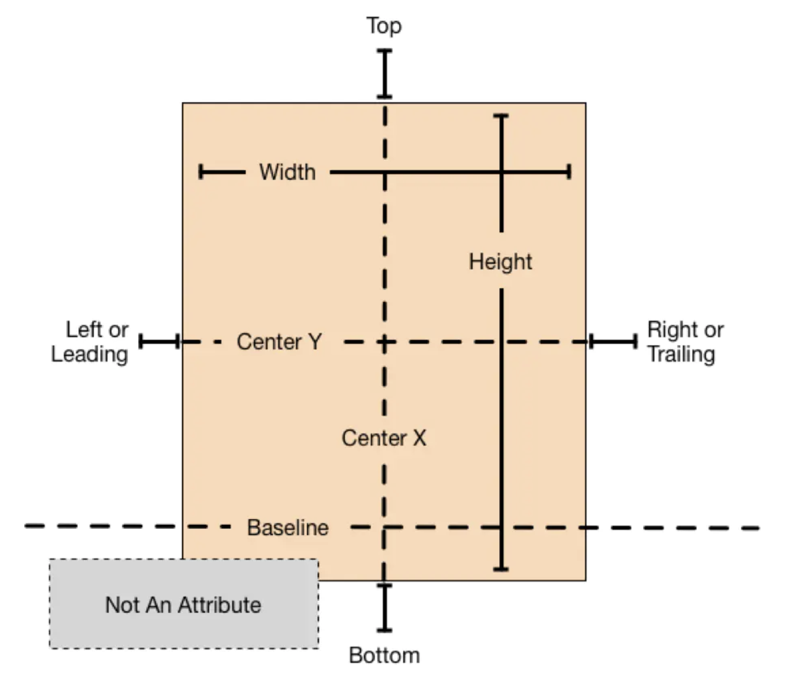
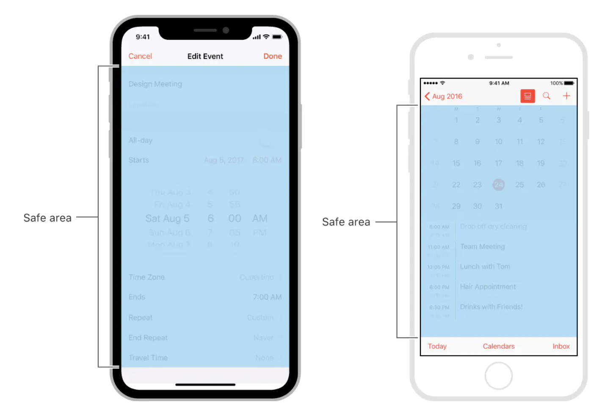

<!-- TOC -->

- [NSLayoutAttribute](#nslayoutattribute)
- [约束创建](#约束创建)
  - [NSLayoutConstraint](#nslayoutconstraint)
  - [UILayoutGuide](#uilayoutguide)
  - [safeAreaLayoutGuide](#safearealayoutguide)
  - [NSLayoutAnchor](#nslayoutanchor)
  - [VFL](#vfl)
- [对齐矩形 alignment rect](#对齐矩形-alignment-rect)

<!-- /TOC -->

自动布局 (Auto Layout)

https://developer.apple.com/library/archive/documentation/UserExperience/Conceptual/AutolayoutPG/index.html#//apple_ref/doc/uid/TP40010853

# NSLayoutAttribute

```c++
typedef NS_ENUM(NSInteger, NSLayoutAttribute) {
    // 视图位置
    NSLayoutAttributeLeft = 1,
    NSLayoutAttributeRight,
    NSLayoutAttributeTop,
    NSLayoutAttributeBottom,
    // 视图前后
    NSLayoutAttributeLeading,
    NSLayoutAttributeTrailing,
    // 视图宽高
    NSLayoutAttributeWidth,
    NSLayoutAttributeHeight,
    // 视图中心
    NSLayoutAttributeCenterX,
    NSLayoutAttributeCenterY,
    // 视图基线
    NSLayoutAttributeLastBaseline,
    NSLayoutAttributeFirstBaseline NS_ENUM_AVAILABLE_IOS(8_0),

    NSLayoutAttributeLeftMargin NS_ENUM_AVAILABLE_IOS(8_0),
    NSLayoutAttributeRightMargin NS_ENUM_AVAILABLE_IOS(8_0),
    NSLayoutAttributeTopMargin NS_ENUM_AVAILABLE_IOS(8_0),
    NSLayoutAttributeBottomMargin NS_ENUM_AVAILABLE_IOS(8_0),
    NSLayoutAttributeLeadingMargin NS_ENUM_AVAILABLE_IOS(8_0),
    NSLayoutAttributeTrailingMargin NS_ENUM_AVAILABLE_IOS(8_0),
    NSLayoutAttributeCenterXWithinMargins NS_ENUM_AVAILABLE_IOS(8_0),
    NSLayoutAttributeCenterYWithinMargins NS_ENUM_AVAILABLE_IOS(8_0),

    // 占位符，在与另一个约束的关系中没有用到某个属性时可以使用占位符
    NSLayoutAttributeNotAnAttribute = 0
};
```

| 布局属性                                            | 表示意义                                                   |
| --------------------------------------------------- | ---------------------------------------------------------- |
| NSLayoutAttributeWidth、NSLayoutAttributeHeight     | 表示视图的尺寸：宽、高                                     |
| NSLayoutAttributeLeft、NSLayoutAttributeRight       | 表示视图的 X 轴方向的位置：左、右                          |
| NSLayoutAttributeLeading、NSLayoutAttributeTrailing | 表示视图的 X 轴方向的位置：前、后                          |
| NSLayoutAttributeTop、 NSLayoutAttributeBottom      | 表示视图 Y 轴方向的位置：顶、底                            |
| NSLayoutAttributeBaseline                           | 表示视图 Y 轴方向的位置：底部基准线                        |
| NSLayoutAttributeCenterX、NSLayoutAttributeCenterY  | 表示视图的中心点：视图在 X 轴的中心点、视图在 Y 轴的中心点 |



# 约束创建

非编程的方式创建约束

- Interface Build

以编程方式创建约束的方式主要有三种：

- 约束构造器（NSLayoutConstraint）
- 布局锚点（Layout Anchors）
- 可视化格式语言（Visual Format Language, VFL）

## NSLayoutConstraint

* 使用“自动布局”来动态计算视图的大小和位置，则必须将此属性设置为NO，然后为视图提供一组无歧义，无冲突的约束。

```c++
view.translatesAutoresizingMaskIntoConstraints=NO; 
```

```c++
// NSLayoutConstraint
+ (instancetype)constraintWithItem:(id)view1
                         attribute:(NSLayoutAttribute)attr1
                         relatedBy:(NSLayoutRelation)relation
                            toItem:(id)view2
                         attribute:(NSLayoutAttribute)attr2
                        multiplier:(CGFloat)multiplier
                          constant:(CGFloat)c;
```

## UILayoutGuide

虚拟的矩形区域

## safeAreaLayoutGuide

在 iOS 11 时，苹果提出了 Safe Area 的概念。因为 iOS 11 搭载的 iPhone X 取消了 Home 键，要为操作保留一些空间，这正好把原来的 Navigation Bar, Status Bar, Tab Bar 包含在里面。safeAreaLayoutGuide 属性正是伴随 Safe Area 出现的。



## NSLayoutAnchor

- NSLayoutXAxisAnchor：X 轴方向的锚点，用来创建水平方向的约束
- NSLayoutYAxisAnchor：Y 轴方向的锚点，用来创建垂直方向的约束
- NSLayoutDimension：尺寸相关的锚点，用来创建尺寸相关的约束

## VFL

VFL（Visual Format Language）是苹果推出的为了简化 Auto Layout 编码的 DSL（Domain-Specific Language）。

| 说明                | 示例                          |
| ------------------- | ----------------------------- |
| 标准间隔            | [button]-[textField]          |
| 宽度约束            | [button(>=50)]                |
| 与父视图的关系      | 丨-50-[purpleBox]-50-丨       |
| 垂直布局            | V:[topField]-10-[bottomField] |
| Flush Views         | [maroonView][blueview]        |
| 优先级              | [button(100@20)]              |
| 宽度相等            | [button(==button2)]           |
| Multiple Predicates | [flexibleButton(>=70,<=100)]  |

- H: 和 V: 每次只能使用一个
- 视图变量名出现在方括号中，如：[blueView]
- 语句的顺序：从上到下，从左到右
- 视图间隔以数字常量出现，如：-10-
- | 表示父视图

```c++
NSNumber *left = @50;
NSNumber *top = @50;
NSNumber *width = @100;
NSNumber *height = @100;
NSDictionary *views = NSDictionaryOfVariableBindings(view1, view2);
NSDictionary *metrics = NSDictionaryOfVariableBindings(left, top, width, height);
[view1 addConstraints:[NSLayoutConstraint constraintsWithVisualFormat:@"H:|-left-[view(>=width)]" options:0 metrics:metrics views:views]];
```

# 对齐矩形 alignment rect

- 多数情况下，frame 和 alignment rect 是相等的
