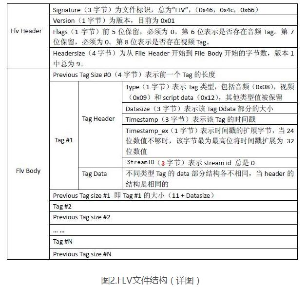

<!-- TOC -->

- [Media Source Extensions API](#media-source-extensions-api)
- [开源项目](#开源项目)
- [MediaSource](#mediasource)
- [SourceBuffer](#sourcebuffer)
- [FLV](#flv)
    - [FLV头文件](#flv头文件)
    - [文件元信息](#文件元信息)
    - [FLV Body](#flv-body)
    - [Audio Tag Data](#audio-tag-data)
    - [Video Tag Data](#video-tag-data)
    - [Script Tag Data (Metadata Tag)](#script-tag-data-metadata-tag)
        - [MetaData](#metadata)

<!-- /TOC -->

https://developer.mozilla.org/zh-CN/docs/Web/API/Media_Source_Extensions_API

# Media Source Extensions API

* 媒体源扩展 API（MSE） 提供了实现无插件且基于 Web 的流媒体的功能。使用 MSE，媒体串流能够通过 JavaScript 创建，并且能通过使用 <audio> 和 <video> 元素进行播放。
* MSE 使我们可以把通常的单个媒体文件的 src 值替换成引用 MediaSource 对象
* 现代浏览器中创造能兼容 MSE 的媒体（assets）非常费时费力，还要消耗大量计算机资源和能源。

# 开源项目

https://github.com/video-dev/hls.js

https://github.com/bilibili/flv.js

# MediaSource

https://developer.mozilla.org/zh-CN/docs/Web/API/MediaSource

MediaSource是Media Source Extensions API 表示媒体资源HTMLMediaElement对象的接口。MediaSource 对象可以附着在HTMLMediaElement在客户端进行播放。

```js
// 是否被当前的浏览器支持
isTypeSupported()
```

# SourceBuffer

https://developer.mozilla.org/zh-CN/docs/Web/API/SourceBuffer

该SourceBuffer接口表示要通过 对象传递到HTMLMediaElement并播放的大量媒体MediaSource。它可以由一个或几个媒体段组成。

# FLV

* 一个二进制文件，由文件头（FLV header）和很多tag组成
* tag又可以分成三类：audio,video,script，分别代表音频流，视频流，脚本流（关键字或者文件信息之类）。



## FLV头文件

## 文件元信息

## FLV Body

FLV body就是由很多tag组成

## Audio Tag Data

## Video Tag Data

## Script Tag Data (Metadata Tag)

放一些关于FLV视频和音频的元数据信息,该类型Tag会跟在File Header后面作为第一个Tag出现，而且只有一个

### MetaData

* duration 时长
* width 视频宽度
* height 视频高度
* videodatarate  视频码率
* framerate 视频帧率
* videocodecid 视频编码方式
* audiosamplerate 音频采样率
* audiosamplesize 音频采样精度
* stereo 是否为立体声
* audiocodecid 音频编码方式
* filesize 文件大小
