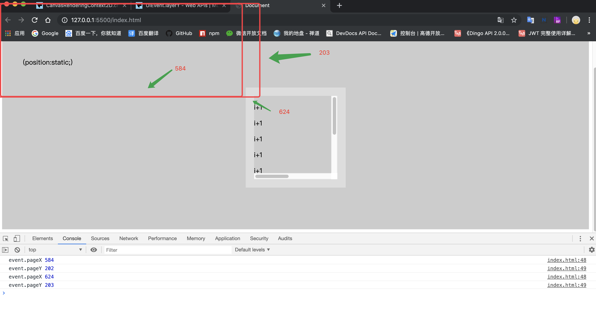

<!-- TOC -->

- [Window](#window)
  - [window.innerHeight window.innerWidth](#windowinnerheight-windowinnerwidth)
  - [window.outerHeight window.outerWidth](#windowouterheight-windowouterwidth)
  - [window.pageXOffset===window.scrollX window.pageYOffset===window.scrollY](#windowpagexoffsetwindowscrollx-windowpageyoffsetwindowscrolly)
  - [window.screen](#windowscreen)
- [Element](#element)
- [HTMLElement](#htmlelement)
- [HTMLHtmlElement](#htmlhtmlelement)
- [HTMLBodyElement](#htmlbodyelement)
- [DOMRect](#domrect)
- [UIEvent](#uievent)
- [MouseEvent](#mouseevent)
- [Touch](#touch)

<!-- /TOC -->

# Window
## window.innerHeight window.innerWidth

* ie9+  

获得浏览器窗口的视口（viewport）高度（宽度）（以像素为单位）；如果有水平滚动条，也包括滚动条高度。

```js
var intViewportHeight = window.innerHeight;
```


## window.outerHeight window.outerWidth

* ie9+ 

获取整个浏览器窗口的高度(宽度)（单位：像素），包括侧边栏（如果存在）、窗口镶边（window chrome）和窗口调正边框（window resizing borders/handles）。


## window.pageXOffset===window.scrollX window.pageYOffset===window.scrollY

* ie9+

返回文档/页面水平(垂直)方向滚动的像素值。


## window.screen

屏幕窗口

* window.screenX 浏览器左边到系统桌面左边的像素值
* window.screenY 浏览器上边到系统桌面上边的像素值

# Element

```js
//height+ padding - 水平滚动条的高度（如果存在）。
var intElemClientHeight = element.clientHeight;

//width + padding - 垂直滚动条宽度 (如果存在)
var intElemClientWidth = element.clientWidth;

//元素左边框的宽度（以像素为单位）
var left = element.clientLeft;

// 元素顶部边框的宽度（以像素为单位）
var top = element.clientTop;

```

```js

// 一个元素的内容高度的测量，包括由于溢出的内容在屏幕上不可见。
// 内容height + padding - border - margin。
var intElemScrollHeight = element.scrollHeight;
var intElemScrollHeight = element.scrollWidth;

var sLeft = element.scrollLeft;
var sLeft = element.scrollTop;
```

# HTMLElement

```js
// 返回一个元件的高度，其中包括垂直填充和边界，为整数。
// offsetHeight是元素CSS高度的像素度量，包括任何边框，填充和水平滚动条（如果呈现）
// border + padding + height  + 滚动条
var intElemOffsetHeight = element.offsetHeight;
var intElemOffsetHeight = element.offsetWidth;

//left是一个整数，表示距离最近的相对定位的父元素的左侧偏移量。
left = element.offsetLeft;  
left = element.offsetTop;
```


# HTMLHtmlElement
# HTMLBodyElement

# DOMRect

* ie8+

```js
//DOMRect 对象包含了一组用于描述边框的只读属性——left、top、right和bottom，单位为像素。除了 width 和 height 外的属性都是相对于视口的左上角位置而言的。
domRect = element.getBoundingClientRect;
```

注意：  
domRect.left 可能等于 element.offsetLeft  
domRect.top 可能等于 element.offsetTop

# UIEvent

```js
// 此属性将页面滚动到帐户并返回相对于整个文档的值，除非事件发生在定位元素内，其中返回值相对于定位元素的左上角。
// ie9+
var xpos = event.layerX
var ypos = event.layerY
```
当前父元素样式为(position:relative;或overflow: scroll;)


当前父元素样式为position:static;

```js
// 鼠标指针所在的X坐标。无论文档的当前水平滚动偏移如何，该值都相对于整个文档的左边缘。
// window|doc|body  event.layerX==event.pageX
// 块元素与上一至
// ie9+
var pos = event.pageX
var pos = event.pageY
```

# MouseEvent

```js
// 提供应用程序客户区域内发生事件的水平坐标（与页面内的坐标相对）。
// 所有元素均相对用户可视区域相对坐标
// ie6+
var x = instanceOfMouseEvent.clientX （MouseEvent.x 别名）
var y = instanceOfMouseEvent.clientY （MouseEvent.y 别名）

```

```js
var xShift = instanceOfMouseEvent.movementX;
```

```js
// 与目标节点的填充边缘之间的X坐标中的偏移量。
// 不包含border 和 margin 
// ie6+
var xOffset = instanceOfMouseEvent.offsetX;
var yOffset = instanceOfMouseEvent.offsetY;
```

```js
// 对于整个文档的左边缘单击鼠标的X（水平）坐标（以像素为单位）。这包括当前不可见的文档的任何部分。
// ie9+
var pageX = MouseEvent.pageX;
```

```js
// 全局（屏幕）坐标中的垂直坐标（偏移）。
// ie6+
var x = instanceOfMouseEvent.screenX
var y = instanceOfMouseEvent.screenY
```

# Touch

```js
// 返回触摸点相对于屏幕的X坐标，不包括任何滚动偏移。
var x = touchItem.screenX;
var y = touchItem.screenY;
```

```js
// 返回相对于触摸点的X坐标到视，不包括任何滚动偏移量。
touchItem.clientX;
touchItem.clientY;
```

```js
// 返回相对于触摸点的X坐标到视，包括任何滚动偏移量。
touchItem.pageX;
touchItem.pageY;
```
```js
// 椭圆的X半径，该半径最接近地限定与触摸表面的接触区域。
var xRadius = touchItem.radiusX;
var yRadius = touchItem.radiusY;
```

```js
// 应用于所描述的椭圆以与用户和触摸表面之间的接触区域对准的旋转度数。
var angle = touchItem.rotationAngle;
```