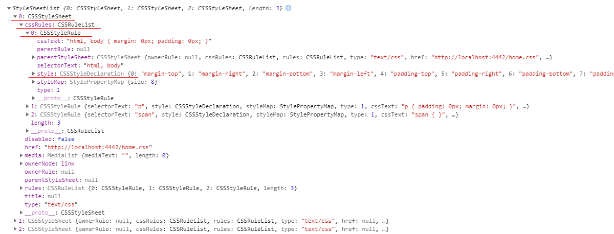

# Style

* [加载方式](#load)
* [获得样式方式](#get)
* [设置样式方式](#set)
* 知识点
    * [StyleSheetList](#style-1)
    * [StyleSheet](#style-2)
    * [CSSStyleSheet](#style-3)
    * [CSSRuleList](#style-5)
    * [CSSRule](#style-6)
    * [CSSStyleRule](#style-4)
    * [CSSStyleDeclaration](#style-7)
* 注意事项
    * [CSSStyleDeclaration.cssText && CSSRule.cssText](#mat-1)


<h2 id="load">样式加载方式：</h2>

* 内联 `<div style="..."></div>`
* 外联 `<link rel="stylesheet" href="*.css">`
* `<style></style>`

<h2 id="get">获得样式方式：</h2>

* HTMLElement.style[styleKey] 取得内联指定样式
* doc.styleSheetSets 取得外联和`<style></style>`样式对象
* window.getComputedStyle(element[, pseudoElt]) 获取元素最终生效样式，可能是任何位置的样式(内联/外联/`<style></style>`)

<h2 id="set">设置样式方式：</h2>

* CSSStyleDeclaration.style[styleKey]=styleValue
* CSSStyleDeclaration.cssText=cssText
* CSSStyleDeclaration.setProperty(propertyName, value, priority)
* var domStyle = document.createElement('style'); `//注意ie8* 兼容性
`

树形关系：  
* `StyleSheetList==[StyleSheet..]` -> `CSSStyleSheet继承StyleSheet接口` -> `CSSStyleSheet==[CSSRuleList...]` -> `CSSRuleList` -> `CSSStyleRule继承CSSRule接口` -> `CSSStyleDeclaration`



<h2 id="style-1">StyleSheetList</h2>
StyleSheet的列表,它是一个类似数组的对象，但不能使用Array方法进行迭代。但是，它可以在其索引的循环标准中迭代，或转换为数组。

```js
var StyleSheet=StyleSheetList[index];
```

通常StyleSheetList通过下以代码获取

```js
var StyleSheetList = document.styleSheets;
```

<h2 id="style-2">StyleSheet</h2>
StyleSheet属于接口

StyleSheet 获得方式：

* document.styleSheets[index]
* `<style>和<link>文档中的元素` LinkStyle.sheet

属性： 

* StyleSheet.disabled 是否Boolean表示当前样式表是否已应用。
* StyleSheet.href 只读 返回DOMString表示样式表位置的a 。
* StyleSheet.media 只读 返回MediaList表示样式信息的预期目标媒体的a 。
* StyleSheet.ownerNode 只读 返回Node将此样式表与当前文档相关联。
* StyleSheet.parentStyleSheet 只读 StyleSheet如果有的话，返回包含这个的一个; null如果没有，则返回。
* StyleSheet.title 只读 返回DOMString表示当前样式表的顾问标题。
* StyleSheet.type只读 返回DOMString表示此样式表的样式表语言。

<h2 id="style-3">CSSStyleSheet</h2>
CSSStyleSheet是从其父级继承属性StyleSheet

* CSSStyleSheet.cssRules 返回实时CSSRuleList，列出CSSRule样式表中的对象。

* CSSStyleSheet.ownerRule 如果使用@import规则将此样式表导入到文档中，则ownerRule属性将返回该属性CSSImportRule，否则返回null。

* CSSStyleSheet.deleteRule() ie9+ 从样式表中删除指定位置的规则

* CSSStyleSheet.insertRule() ie9+ 在给定规则的文本表示的情况下，在样式表中的指定位置插入新规则。

* CSSStyleSheet.addRule() ie6-ie8 请查看兼容连接
* CSSStyleSheet.deleteRule() ie6-ie8 请查看兼容连接

    [addRule&&deleteRule兼容性](#https://www.quirksmode.org/dom/w3c_css.html#change)

<h2 id="style-5">CSSRuleList</h2>
包含有序的CSSRule对象集合

<h2 id="style-6">CSSRule</h2>
CSSRule接口表示单个CSS规则

* CSSRule.cssText 表示规则的文本表示，例如“ h1,h2 { font-size: 16pt }”或“ @import 'url'”。要访问或修改规则的某些部分（例如，示例中的“font-size”的值），请使用专用接口上的属性  作为规则的类型。

* CSSRule.parentRule 只读 否则返回包含规则null。例如，如果此规则是@media块内的样式规则，则父规则将是该规则CSSMediaRule。

* CSSRule.parentStyleSheet 只读 返回CSSStyleSheet包含此规则的样式表的对象

* CSSRule.type 只读 其中的Type常量表示CSS规则的类型。

<h2 id="style-4">CSSStyleRule</h2>
CSSStyleRule表示单个CSS样式规则。它实现CSSRule了类型值

* CSSStyleRule.selectorText 获取此规则的选择器的文本表示，例如"h1,h2"。 `有的浏览器为只读`
* CSSStyleRule.style 返回CSSStyleDeclaration规则的对象。

<h2 id="style-7">CSSStyleDeclaration</h2>
表示CSS属性 - 值对的集合

获得CSSStyleDeclaration对象的方法：

 * HTMLElement.style - 操纵单个元素的样式（`<elem style =“...”>`）;
 * 上面的CSSStyleRule.style
 * window.getComputedStyle()

属性:

* CSSStyleDeclaration.cssText 声明块的文本表示。设置此属性会更改样式。
* CSSStyleDeclaration.length 只读 属性数量。请参阅以下item()方法。
* CSSStyleDeclaration.parentRule 只读 含有CSSRule。

方法：

* CSSStyleDeclaration.getPropertyPriority() 返回可选的优先级“important”。

```js
var priority = style .getPropertyPriority（property）;
```

* CSSStyleDeclaration.getPropertyValue() 给定属性名称返回属性值。

```js
var value = style .getPropertyValue（property）;
```

* CSSStyleDeclaration.item() 返回属性名称。

```js
var propertyName = style[index];
```

* CSSStyleDeclaration.removeProperty() 从CSS声明块中删除属性。
* CSSStyleDeclaration.setProperty() 修改现有的CSS属性或在声明块/中创建新的CSS属性。

```js
style.setProperty(propertyName, value, priority);
```


`propertyName:`是DOMString 表示CSS属性名称（连字符的情况下）进行修改。  
`value:`可选是DOMString 包含新属性值的。如果未指定，则视为空字符串。
注意：value 不得包含"!important" - 应使用priority参数设置。  
`priority:` 可选是DOMString 允许设置“重要”CSS优先级。如果未指定，则视为空字符串。接受以下值：important|underfined|'' 

```js
var declaration = document.styleSheets[0].rules[0].style;
declaration.setProperty('border-width', '1px 2px');
declaration.setProperty('border', '1px solid #ddd','important');
```

<h2 id="">注意事项</h2>

<h3 id="mat-1">CSSStyleDeclaration.cssText && CSSRule.cssText</h3>

CSSStyleDeclaration.cssText `可读/可写`  
返回的格式(`不带选择器`):

```css
color: red; border: 1px solid rgb(221, 221, 221) !important;
```

CSSRule.cssText `只读`   
返回的格式(`带选择器`):

```css
#blanc { color: red; border: 1px solid rgb(221, 221, 221) !important; }
```