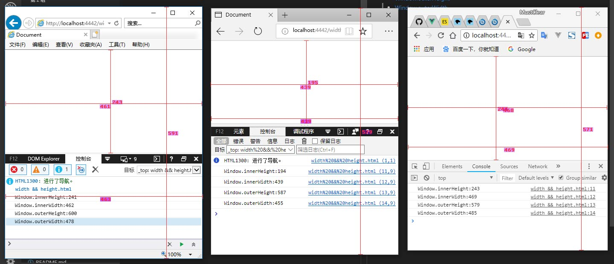
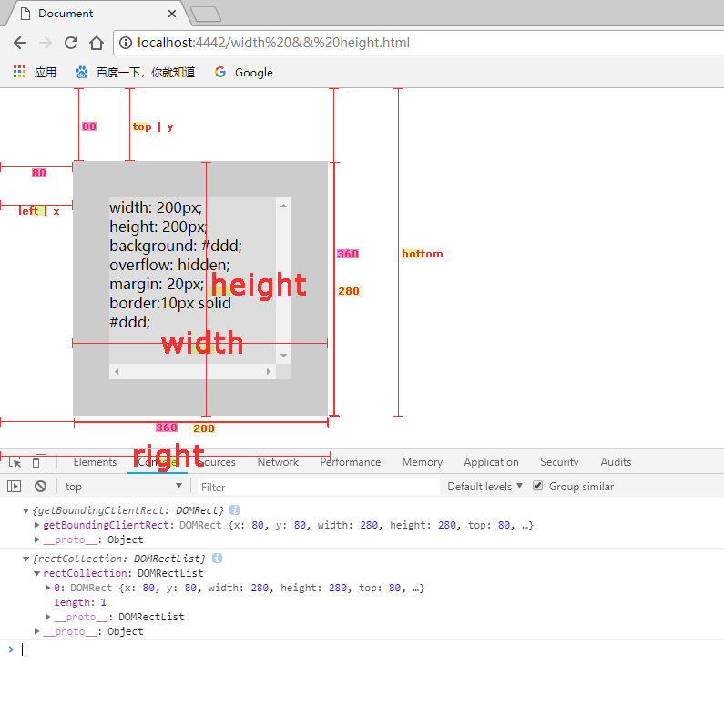

# Width && Height && Left && Top

* [window](#window)
    * [window.innerHeight](#window-1)
    * [window.innerWidth](#window-2)
    * [window.outerHeight](#window-3)
    * [window.outerWidth](#window-4)
* [HTMLElement](#htmlelement)
    * [HTMLElement.offsetParent](#htmlelement-0)
    * [HTMLElement.offsetWidth](#htmlelement-1)
    * [HTMLElement.offsetHeight](#htmlelement-2)
    * [HTMLElement.offsetLeft](#htmlelement-3)
    * [HTMLElement.offsetTop](#htmlelement-4)
* [Element](#element)
    * [Element.clientWidth](#element-1)
    * [Element.clientHeight](#element-2)
    * [Element.clientTop](#element-3)
    * [Element.clientLeft](#element-4)
    * [Element.scrollWidth](#element-5)
    * [Element.scrollHeight](#element-6)
    * [Element.scrollLeft](#element-7)
    * [Element.scrollTop](#element-8)
* [DOMRect](#domrect)
    * [Element.getBoundingClientRect()](#element-9)
    * [Element.getClientRects()](#element-10)


<h2 id="window"></h2>

`*注：以下属性均兼容ie9以上`
<h3 id="window-1">window.innerHeight 只读</h3>
浏览器窗口视口的高度（以像素为单位），包括（如果呈现）水平滚动条。

```js
var intViewportHeight = window.innerHeight;
```

<h3 id="window-2">window.innerWidth</h3>
浏览器窗口视口的宽度（以像素为单位），包括（如果呈现）垂直滚动条。

```js
var intViewportWidth = window.innerWidth;
```

<h3 id="window-3">window.outerHeight</h3>
获取浏览器窗口外部的宽度。它表示整个浏览器窗口的宽度，包括侧边栏（如果展开），窗口镶边和窗口调整边框/句柄。

```js
outWindowWidth = window.outerWidth;
```

<h3 id="window-4">window.outerWidth</h3>
获取浏览器窗口外部的宽度。它表示整个浏览器窗口的宽度，包括侧边栏（如果展开），窗口镶边和窗口调整边框/句柄。

```js
outWindowWidth = window.outerWidth;
```




<h2 id="htmlelement">HTMLElement</h2>

`*注：以下属性均兼容ie8以上,鉴于ie7的占用率不讨论，但ie7存在bug,自己脑补`

<h3 id="htmlelement-0">`HTMLElement.offsetParent 只读` </h3>
 
属性返回对包含元素的最接近（在包含层次结构中最近）的对象的引用。如果没有定位的元素，则 offsetParent 为最近的`table, table cell 或根元素`（标准模式下为 html；quirks 模式下为 body）。 当style.display设置为“none”时，返回null。 offsetParent非常有用，因为offsetTop和offsetLeft是相对于其填充边缘的。

```js
//parentObj 是一个对象引用，当前元素element相对于该对象偏移（offset）。
parentObj = element.offsetParent;   
```

个人理解如下：
1. element为块级元素时，从当前element往上遍历父级元到body结束，寻找存在`position:relative/absolute`（不含fixed）的parentElement即返回;

2. element为内联级元素时，从当前element往上遍历父级元到body结束，寻找存在`position:absolute`（不含fixed）的parentElement即返回;`注意：(ie/edge)会返回position:relative的parentElement`

兼容性:

在 Webkit 中，如果元素为隐藏的（该元素或其祖先元素的 style.display 为 "none"），或者该元素的 style.position 被设为 "fixed"，则该属性返回 null。

在 IE 9 中，如果该元素的 style.position 被设置为 "fixed"，则该属性返回 null。`（display:none 无影响。）`

参考例子 [连接](#example-1)

<h3 id="htmlelement-1">HTMLElement.offsetWidth</h3>

`offsetWidth =  border-left-width + padding-left + width + padding-right + border-right-width; `

<h3 id="htmlelement-2">HTMLElement.offsetHeight</h3>
包括垂直填充和边框的元件的高度，为整数

offsetHeight是元素CSS高度的像素度量，包括边框，填充和元素的水平滚动条（如果存在，如果呈现）。它不包括伪元素的高度，例如：before或：after。

`offsetHeight =  border-top-width + padding-top + height + padding-bottom + border-bottom-width`


<h3 id="htmlelement-3">HTMLElement.offsetLeft</h3>

返回当前元素左上角在HTMLElement.offsetParent节点内向左偏移的像素数。

* 对于块级元素，offsetTop，offsetLeft，offsetWidth和offsetHeight描述元素相对于offsetParent的边框。

* 行内元素（如 span），offsetTop 和 offsetLeft 描述的是第一个边界框的位置（使用 Element.getClientRects() 来获取其宽度和高度），而 offsetWidth 和 offsetHeight 描述的是边界框的尺寸（使用 Element.getBoundingClientRect 来获取其位置）。因此，使用 offsetLeft、offsetTop、offsetWidth、offsetHeight 来对应 left、top、width 和 height 的一个盒子将不会是文本容器 span 的盒子边界。

<h3 id="htmlelement-4">HTMLElement.offsetTop</h3>

返回当前元素相对于其 offsetParent 元素的顶部的距离。


<h2 id="element">Element</h2>
<h3 id="element-1">Element.clientWidth</h3>

clientWidth=width + padding - 垂直滚动条宽度 (如果存在)来计算.


<h3 id="element-2">Element.clientHeight</h3>

clientHeight 可以通过 CSS height + CSS padding - 水平滚动条高度 (如果存在)来计算.

clientHeight=height + padding - 水平滚动条高度 (如果存在)来计算.


<h3 id="element-3">Element.clientTop</h3>
元素顶部边框的宽度（以像素表示）

<h3 id="element-4">Element.clientLeft</h3>
元素的左边框的宽度，以像素表示

<h3 id="element-5">Element.scrollWidth</h3>
元素内容宽度的度量，包括由于溢出导致的视图中不可见内容。  

包括元素的padding，但不包括元素的border和margin。scrollHeight也包括 ::before 和 ::after这样的伪元素。

<h3 id="element-6">Element.scrollHeight</h3>
元素内容高度的度量，包括由于溢出导致的视图中不可见内容。  

包括元素的padding，但不包括元素的border和margin。scrollHeight也包括 ::before 和 ::after这样的伪元素。
 

```js
//判定元素是否滚动到底
element.scrollHeight - element.scrollTop === element.clientHeight
```

<h3 id="element-7">Element.scrollLeft</h3>
读取或设置元素滚动条到元素左边的距离

<h3 id="element-8">Element.scrollTop</h3>
获取或设置一个元素的内容垂直滚动的像素数


<h3 id="domrect">DOMRect</h3>

属性
* DOMRect.x  `(Ie&Edge无)`
* DOMRect.y `(Ie&Edge无)`
* DOMRect.width
* DOMRect.height
* DOMRect.top
* DOMRect.right
* DOMRect.bottom
* DOMRect.left



<h3 id="element-10">Element.getClientRects()</h3>
返回一组DOMRect对象


<h3 id="element-9">Element.getBoundingClientRect()</h3>
返回的值是一个DOMRect对象


<h1 id="example-1">Example-1</h1>

```html
<!DOCTYPE html>
<html lang="en" id="html">

<head>
    <meta charset="UTF-8">
    <meta name="viewport" content="width=device-width, initial-scale=1.0">
    <meta http-equiv="X-UA-Compatible" content="ie=edge">
    <title>Document</title>
    <style>
        html,
        body {
            padding: 0;
            margin: 0;
        }
    </style>
</head>

<body id="body">
    <!-- <div style="margin: 40px;overflow: hidden;display: inline;position: relative;" id="parent_div"> -->
    <!-- <div style="margin: 40px;overflow: hidden;display: inline;position: absolute;" id="parent_div"> -->
    <div style="margin: 40px;overflow: hidden;" id="parent_div">
        <div id="div" style="width: 200px;height: 200px;background: #ddd;overflow: hidden;margin: 20px;border:20px solid #ccc;">
            width: 200px;
            <br/>height: 200px;
            <br/>background: #ddd;
            <br/>overflow: hidden;
            <br/>margin: 20px;
            <br/>border:10px solid #ddd;
        </div>
    </div>
    <script>
        var dombody = window.document.getElementById('div');
        console.log({ 'dombody': dombody.id });
        console.log({ 'offsetParent': dombody.offsetParent.id });
        console.log({ 'doc': dombody });
        console.log('body.offsetWidth:' + dombody.offsetWidth);
        console.log('body.offsetHeight:' + dombody.offsetHeight);
        console.log('body.offsetLeft:' + dombody.offsetLeft);
        console.log('body.offsetTop:' + dombody.offsetTop);
    </script>
</body>

</html>
```