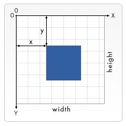

Canvas

<!-- TOC -->

- [坐标空间](#%E5%9D%90%E6%A0%87%E7%A9%BA%E9%97%B4)
- [CanvasRenderingContext2D](#canvasrenderingcontext2d)
    - [填充和描边样式即画笔的设置](#%E5%A1%AB%E5%85%85%E5%92%8C%E6%8F%8F%E8%BE%B9%E6%A0%B7%E5%BC%8F%E5%8D%B3%E7%94%BB%E7%AC%94%E7%9A%84%E8%AE%BE%E7%BD%AE)
    - [渐变和模式](#%E6%B8%90%E5%8F%98%E5%92%8C%E6%A8%A1%E5%BC%8F)
    - [阴影](#%E9%98%B4%E5%BD%B1)
    - [文字样式](#%E6%96%87%E5%AD%97%E6%A0%B7%E5%BC%8F)
    - [线条样式](#%E7%BA%BF%E6%9D%A1%E6%A0%B7%E5%BC%8F)
    - [矩形](#%E7%9F%A9%E5%BD%A2)
    - [绘图文本](#%E7%BB%98%E5%9B%BE%E6%96%87%E6%9C%AC)
    - [路径Path（只是创建，还没有绘制出来）](#%E8%B7%AF%E5%BE%84path%E5%8F%AA%E6%98%AF%E5%88%9B%E5%BB%BA%E8%BF%98%E6%B2%A1%E6%9C%89%E7%BB%98%E5%88%B6%E5%87%BA%E6%9D%A5)
    - [绘图路径](#%E7%BB%98%E5%9B%BE%E8%B7%AF%E5%BE%84)
    - [转换](#%E8%BD%AC%E6%8D%A2)
    - [合成](#%E5%90%88%E6%88%90)
    - [绘制图像](#%E7%BB%98%E5%88%B6%E5%9B%BE%E5%83%8F)
    - [图像像素操作](#%E5%9B%BE%E5%83%8F%E5%83%8F%E7%B4%A0%E6%93%8D%E4%BD%9C)
    - [画布状态](#%E7%94%BB%E5%B8%83%E7%8A%B6%E6%80%81)
- [HTMLCanvasElement.toDataURL](#htmlcanvaselementtodataurl)
- [画布粒子效果 残影](#%E7%94%BB%E5%B8%83%E7%B2%92%E5%AD%90%E6%95%88%E6%9E%9C-%E6%AE%8B%E5%BD%B1)
- [getImageData 事件点击](#getimagedata-%E4%BA%8B%E4%BB%B6%E7%82%B9%E5%87%BB)

<!-- /TOC -->

教程：

<https://www.html5canvastutorials.com/tutorials/html5-canvas-element/>
<http://bucephalus.org/text/CanvasHandbook/CanvasHandbook.html>
<https://joshondesign.com/p/books/canvasdeepdive/toc.html>

```js
var canvas = document.getElementById('tutorial');
if (canvas.getContext) {
  var ctx = canvas.getContext('2d');
  // drawing code here
} else {
  // canvas-unsupported code here
}
```

# 坐标空间

与html相同 从左上角计算



# CanvasRenderingContext2D

## 填充和描边样式即画笔的设置

* ctx.fillStyle = color|gradient|pattern; 属性指定要在形状内使用的颜色，渐变或图案。默认样式为（黑色）。#000
- ctx.strokeStyle = color|gradient|pattern; 指定用于形状周围的笔划（轮廓）的颜色，渐变或图案。默认值为#000（黑色）。

## 渐变和模式

* CanvasGradient ctx.createLinearGradient(x0, y0, x1, y1); 线性渐变
  - CanvasGradient <https://developer.mozilla.org/en-US/docs/Web/API/CanvasGradient>
- CanvasGradient ctx.createRadialGradient(x0, y0, r0, x1, y1, r1); 径向渐变
- CanvasPattern ctx.createPattern(image, repetition); 指定的图像和重复来创建模式 可实现背景平铺

## 阴影

* ctx.shadowBlur = level; 指定应用于阴影的模糊量。默认为0（无模糊）。
- ctx.shadowColor = color; 指定阴影的颜色
- ctx.shadowOffsetX = offset; 指定阴影水平偏移的距离。
- ctx.shadowOffsetY = offset;

## 文字样式

* ctx.font = value; 与csss类似
- ctx.textAlign = "left" || "right" || "center" || "start" || "end";
- ctx.textBaseline = "top" || "hanging" || "middle" || "alphabetic" || "ideographic" || "bottom";
- ctx.direction = "ltr" || "rtl" || "inherit";

## 线条样式

* ctx.lineWidth = value; 设置线条的粗细
- ctx.lineCap = "butt" || "round" || "square"; 确定用于绘制线条端点的形状。
- ctx.lineJoin = "bevel" || "round" || "miter"; 设置两条线连接点的形状
- ctx.miterLimit = value; 设置斜接限制比率
- ctx.getLineDash(); 获取当前线虚线样式
- ctx.setLineDash(segments); 设置线和间隙的交替长度 ，可以通过segments数组参数实现不同的虚线样式
- ctx.lineDashOffset = value; 设置行虚线偏移或“阶段”。

## 矩形

* ctx.clearRect(x, y, width, height); 将矩形区域中的像素设置为透明黑色（rgba(0,0,0,0)）即清除画布
- ctx.fillRect(x, y, width, height); 绘制一个填充矩形
- ctx.strokeRect(x, y, width, height); 绘制一个描边矩形，没有填充色

## 绘图文本

* ctx.fillText(text, x, y [, maxWidth]); 绘制填充文字
  - text 根据(ctx.font|ctx.textAlign|ctx.textBaseline|ctx.direction) 设置文字样式
  - maxWidth 最大宽度
- ctx.strokeText(text, x, y [, maxWidth]); 绘制填充文字轮廓，无填充色
- ctx.measureText(text); 返回TextMetrics对象，可以得到文本的宽度，但一些信息，注意兼容性

## 路径Path（只是创建，还没有绘制出来）

* ctx.beginPath(); 清空子路径列表来启动新路径。
- ctx.closePath(); 当前点到当前子路径起点闭合直线 不直接向画布绘制需要使用stroke()或fill()方法渲染路径。
- ctx.moveTo(x, y); (x, y)坐标指定的点处开始新的子路径
- ctx.lineTo(x, y); 将子路径的最后一个点连接到指定(x, y)坐标，将直线添加到当前子路径。 不直接向画布绘制需要使用stroke()或fill()方法渲染路径。
- ctx.bezierCurveTo(cp1x, cp1y, cp2x, cp2y, x, y); 将三次贝塞尔曲线添加到当前子路径。它需要三个点：前两个是控制点，第三个是终点。起点是当前路径中的最新点
- ctx.quadraticCurveTo(cpx, cpy, x, y); 将二次贝塞尔曲线添加到当前子路径。它需要两点：第一点是控制点，第二点是终​​点。起点是当前路径中的最新点
- ctx.arc(x, y, radius, startAngle, endAngle [, anticlockwise]); 将圆弧添加到当前子路径
- ctx.arcTo(x1, y1, x2, y2, radius); 使用给定的控制点和半径将圆弧添加到当前子路径。 通常用于制作圆角（如果两条线交叉会产生尖角，如果想要圆角可以用此方法）
- ctx.ellipse(x, y, radiusX, radiusY, rotation, startAngle, endAngle [, anticlockwise]); 将椭圆弧添加到当前子路径。
- ctx.rect(x, y, width, height); 当前路径中添加了一个矩形

## 绘图路径

* ctx.fill([fillRule]); 填充当前或给定路径fillStyle
- ctx.fill(path [, fillRule]); 填充当前或给定路径fillStyle
  - path Path2D <https://developer.mozilla.org/en-US/docs/Web/API/Path2D> #TODO
- ctx.stroke(); 描边 注意使用ctx.beginPath();不是会反复绘制
- ctx.stroke(path);
- ctx.drawFocusIfNeeded(element); 指定的元素被聚焦 #TODO
- ctx.drawFocusIfNeeded(path, element); #TODO
- ctx.scrollPathIntoView(); 将当前或给定路径滚动到视图中 #TODO
- ctx.scrollPathIntoView(path); #TODO
- ctx.clip([fillRule]); 将当前或给定路径转换为当前剪切区域。它取代了以前的任何剪辑区域。猜测饼图用了此方法
- ctx.clip(path [, fillRule]);
- ctx.isPointInPath(x, y [, fillRule]); 指定的点是否包含在当前路径中。
- ctx.isPointInPath(path, x, y [, fillRule]);
- ctx.isPointInStroke(x, y); 指定的点是否包含在当前路径中。
- ctx.isPointInStroke(path, x, y [, fillRule]);

## 转换

* ctx.rotate(angle); 转换矩阵添加了一个旋转 旋转角度，以弧度为单位顺时针旋转。degree * Math.PI / 180如果要从度数值计算，可以使用。
- ctx.scale(x, y); 添加缩放变换  翻转效果可以用-1实现
- ctx.translate(x, y); 偏移
- ctx.transform(a, b, c, d, e, f); 矩阵变换。这使您可以缩放，旋转，平移（移动）和倾斜上下文。

## 合成

* ctx.globalAlpha = value; 绘制到画布上之前应用于形状和图像的alpha（透明度）值
- ctx.globalCompositeOperation = type; 设置绘制新形状时要应用的合成操作的类型。 即多个图片相交时怎样处理相交区域 (可以用来切图效果，比如光碟封面)

## 绘制图像

* ctx.drawImage(image, dx, dy);
- ctx.drawImage(image, dx, dy, dWidth, dHeight);
- ctx.drawImage(image, sx, sy, sWidth, sHeight, dx, dy, dWidth, dHeight);

## 图像像素操作

* ctx.createImageData(width, height); 创建ImageData具有指定尺寸的新空白对象。新对象中的所有像素都是透明黑色。
- ctx.createImageData(imagedata);
- ctx.getImageData(sx, sy, sw, sh); 返回一个ImageData对象，该对象表示画布的指定部分的基础像素数据。
- ctx.putImageData(imageData, dx, dy); 将给定ImageData对象的数据绘制到画布上。
- ctx.putImageData(imageData, dx, dy, dirtyX, dirtyY, dirtyWidth, dirtyHeight);

## 画布状态

* ctx.save(); 将当前状态推送到堆栈来保存画布的整个状态。
- ctx.restore(); 通过弹出绘图状态堆栈中的顶部条目来恢复最近保存的画布状态。
- ctx.canvas;

# HTMLCanvasElement.toDataURL()

返回一个data-URL，其中包含由type参数指定的格式的图像表示（默认为png）。返回的图像的分辨率为96dpi。

- canvas.toDataURL(type, encoderOptions);

# 画布粒子效果 残影

残影问题, 方法还是有的:

- 在不改变透明覆盖层颜色的情况下, 把背景色调整为与残影颜色一致即可. 例子中就采用了这种简单粗暴的办法.
- 使用真"轨迹", 记录元素的"过去"M 帧的状态, 当做正常帧来绘制. 好处是可以仅为需要施加效果的元素做处理. 坏处是时间复杂度 O(元素个数) -> O(元素个数*淡出所需帧数). 并且复杂情况下缓存的数据可能不止位置信息, 空间复杂度上升同样需要注意.
- 使用getImageData, 用整形操作 alpha 值. 但如此即抛弃了 GPU 加速的可能, 立刻提升 CPU 负载.

```js
// 使用getImageData
let lastFrame = context.getImageData(0, 0, canvas.width, canvas.height)
for (let i = 3; i < lastFrame.data.length; i += 4) {
  pixelData[i] -= 3 // <- no rounding problem
}
```

# getImageData 事件点击

* 两个canvas（一个前台，一个后台） ，前台canvas 实现用户可视渲染，后台canvas 通过随机色填充后渲染到后台的canvas
* 通过getImageData(x,y,w,h) 获取当前颜色来遍历后台canvas 的元素即可实现事件点击
