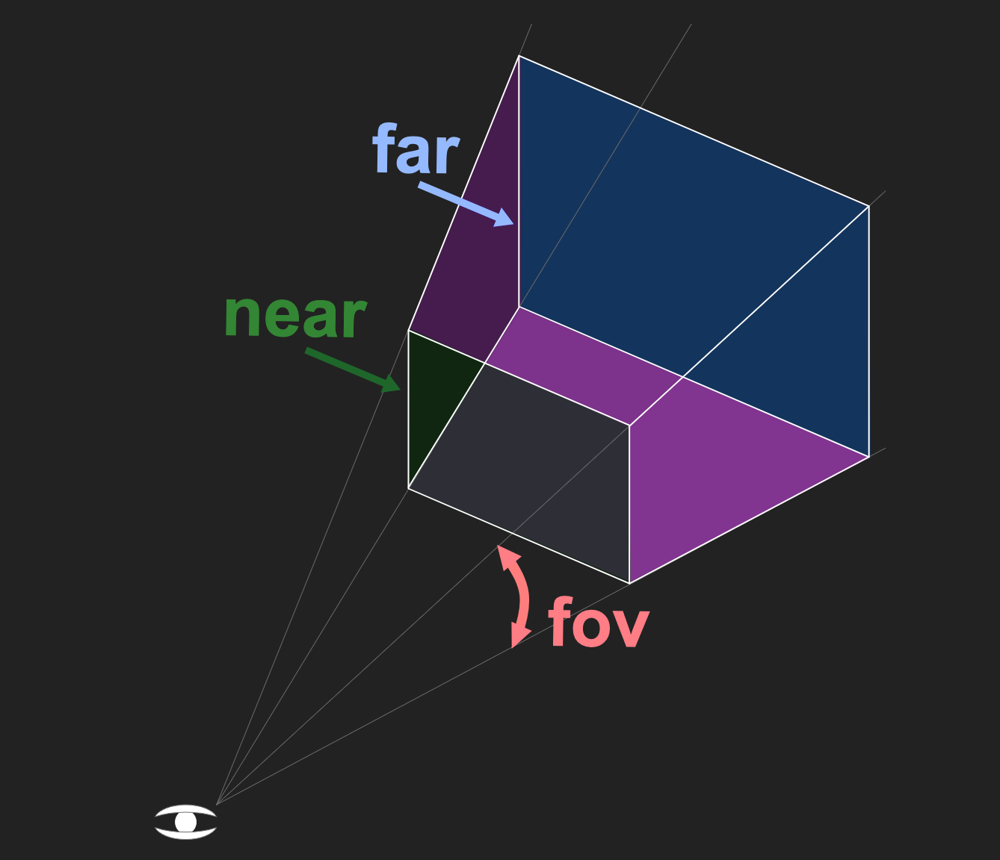

# three.js

<https://threejs.org/manual/#zh/responsive>
<https://threejs.org/docs/>

简单知识梳理

- 三维场景Scene 虚拟的3D场景，用来表示模拟生活中的真实三维场景,或者说三维世界
- 相机Camera 模拟人眼观察
  - near定义了视锥的前端
  - far定义了后端
  - fov是视野
- WebGL渲染器Renderer
- 三维坐标系
  - 轴颜色红R、绿G、蓝B分别对应坐标系的x、y、z轴
  - 右手法则（x 向右、y 向上、z 朝向你（屏幕外->你））
  - Three.js 旋转： rotation 为欧拉角（弧度，默认顺序 XYZ）
- 光源
  - 点光源
  - 平行
  - 聚光灯光源
- Material材质 描述“表面如何与光交互”
  - 纹理贴图是材质属性的图像输入，用来驱动颜色、法线、粗糙度、金属度等
- 几何体geometry
- 动画渲染循环



## 应对HD-DPI显示器

- 两种方法
  - 使用renderer.setPixelRatio
  - 调整canvas的大小时自己处理,从客观上来说更好

```ts
// 使用renderer.setPixelRatio
renderer.setPixelRatio(window.devicePixelRatio);
```

```ts
// 调整canvas的大小时自己处理
function resizeRendererToDisplaySize(renderer) {
      const canvas = renderer.domElement;
      const pixelRatio = window.devicePixelRatio;
      const width = Math.floor( canvas.clientWidth * pixelRatio );
      const height = Math.floor( canvas.clientHeight * pixelRatio );
      const needResize = canvas.width !== width || canvas.height !== height;
      if (needResize) {
        renderer.setSize(width, height, false); // 调整canvas的大小时自己处理
      }
      return needResize;
    }
```
