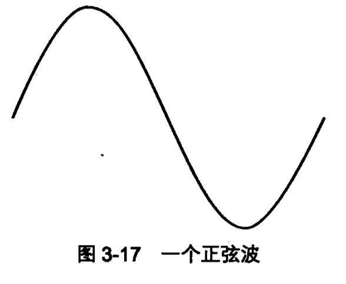
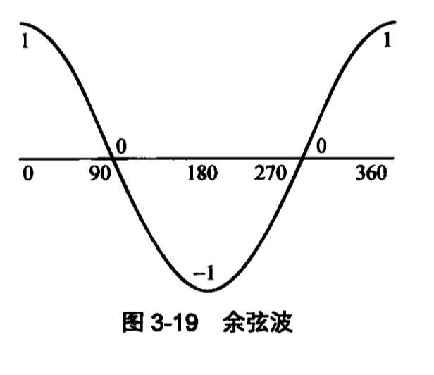
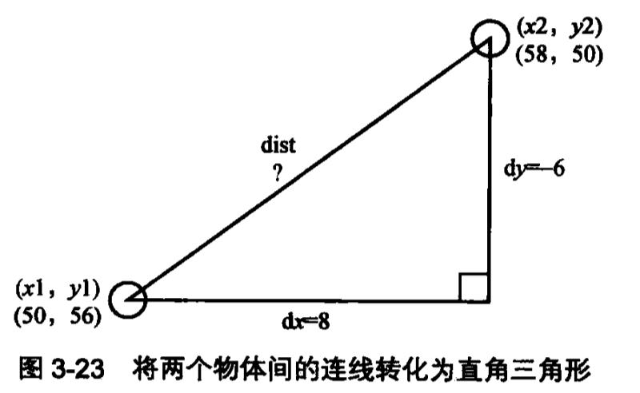

<!-- TOC -->

- [动态动画与静态动画](#动态动画与静态动画)
- [动画基础](#动画基础)
- [动画循环](#动画循环)
- [事件](#事件)
- [三角学](#三角学)
  - [角度与弧度](#角度与弧度)
  - [三角函数](#三角函数)
  - [旋转](#旋转)
  - [正弦应用](#正弦应用)
    - [正弦波（上下动画）](#正弦波上下动画)
    - [线性直线运动](#线性直线运动)
    - [脉冲动画](#脉冲动画)
  - [余弦应用](#余弦应用)
    - [余弦波](#余弦波)
    - [圆周运动](#圆周运动)
    - [椭圆运动](#椭圆运动)
  - [勾股定理 （常用）](#勾股定理-常用)
- [渲染](#渲染)
  - [颜色](#颜色)
- [动画](#动画)
  - [速度(speed)&速度向量（velocity）&加速度](#速度speed速度向量velocity加速度)
- [边界&摩擦力](#边界摩擦力)
  - [边界](#边界)
  - [摩擦力](#摩擦力)
- [用户交互：移动物体](#用户交互移动物体)
  - [拖拽](#拖拽)
  - [投掷](#投掷)
- [缓动与弹动](#缓动与弹动)
  - [缓动](#缓动)
  - [弹动](#弹动)
- [碰撞检测](#碰撞检测)
- [TODO](#todo)
- [坐标旋转 与 斜面反弹](#坐标旋转-与-斜面反弹)
- [撞球物理](#撞球物理)
- [粒子吸引力和重力](#粒子吸引力和重力)
- [正向运动学：让事情走路](#正向运动学让事情走路)
- [反向运动学：拖动和到达](#反向运动学拖动和到达)
- [3D基础知识](#3d基础知识)
- [3D线和填充](#3d线和填充)
- [背面剔除和3D照明](#背面剔除和3d照明)

<!-- /TOC -->
# 动态动画与静态动画

* 动态动画，即游戏，根据用户的操作适应
* 静态动画，定义好的动画

# 动画基础

* 动画帧，每帧有细微变化
* 逐帧动画包含每一帧的图像
* 动态动画包含一幅图的起始信息，及变化规则

# 动画循环

* 几乎所有动画都会表现为某种循环

# 事件

* canvas 本身不支持事件监听，但dom支持事件监听

# 三角学

* 边角关系 Math.sin & Math.cos
* 角度越大，对应的边越长
* canvas 中顺时针的角为正，逆时针为负

## 角度与弧度

* Math.pi
* 一弧度=57.2958度

```js
radians= deg*pi/180
deg=radians*180/pi
```

## 三角函数

* 正弦 对边/斜边 常用
* 余弦 邻边/斜边 常用
* 正切 对边/邻边
* 余切

## 旋转 

* Math.atan2(dy,dx) 注意参数 
* 遇到旋转应该想到Math.atan2()
注意，如果知道半径也可以用asin,但计算量大，不方便

## 正弦应用


### 正弦波（上下动画）


* 可以实现-1至1的平滑动画，即来回（上下）运动，不需要使用用if()判断再重置初始值。
* 可以来实现加速->减速

### 线性直线运动

* 通过++来让动画线性改变状态，如曹着一个方向匀速运动

### 脉冲动画

* 比如让球变大变小

## 余弦应用

### 余弦波



### 圆周运动

* x,y 轴上是做上下运动
* 在动画编程时，需要x轴时，应想到cos;需要Y轴时，应想到sin

### 椭圆运动

* 只需要让x,y轴的比例不同就行了

## 勾股定理 （常用）


* 用于计算哪个坐标的距离
* Math.sqrt(),开平方

# 渲染

## 颜色

# 动画

## 速度(speed)&速度向量（velocity）&加速度

* 速度向量=速度+方向
* 单轴的速度向量 即水平或垂直方向
* 双轴的速度向里 即xy轴上同
* 角度的速度向量 通过三角函数转换为双轴
* 向量加法
* 速度向量是改变物体的位置
--------------------
* 加速度改变的是速度向量
* 单轴加速度
* 双轴加速度
* 重力加速度 可设置为0.1或更小的数值模拟
* 角加速度 通过三角函数转换为双轴

# 边界&摩擦力

## 边界

* 让元素不能离开视野范围
  * 将物体移除 注意物体自身的高宽
  * 将其物体置回边界内
  * 让同一个物体现现在边界内的另一个位置
  * 反弹回来 将加速度变换方向，注意自身的高宽，如要模拟重力可将添加能量损失的百分比

## 摩擦力

* 只能改变速度向量的速度，不能改变方向
* 正确方法 通过加速度计算与速度再减去一个摩擦力，但最后速度不能为0
* 简便方法 通过一个百分比，直接模拟，这个速度永远不会为负值

# 用户交互：移动物体

## 拖拽
## 投掷

* 得到投掷加速度，把新位置-旧位置就是当前加速度

#  缓动与弹动

## 缓动 

## 弹动 

* TODO

# 碰撞检测

* 基于几何图形 对与矩形有用，对于不规则的如圆形就不行了
* 物体与点的碰撞检测 检测代价稍大
* 基于距离的碰撞检测 对于圆形很合适

# TODO

# 坐标旋转 与 斜面反弹

TODO

# 撞球物理

* 质量
* 动量
* 动量守恒

# 粒子吸引力和重力

# 正向运动学：让事情走路

# 反向运动学：拖动和到达

# 3D基础知识

# 3D线和填充

# 背面剔除和3D照明