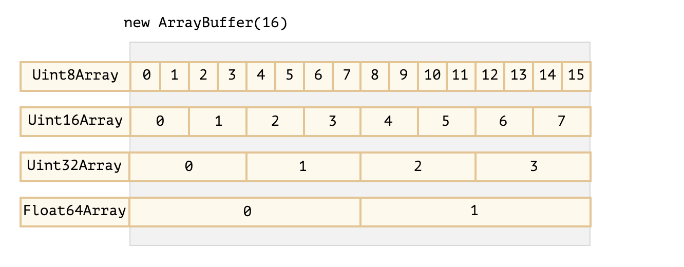

# 类型化数组

类型化数组以后，JavaScript 的二进制数据处理功能增强了很多，接口之间完全可以用二进制数据通信。

https://developer.mozilla.org/zh-CN/docs/Web/JavaScript/Reference/Global_Objects/ArrayBuffer

https://javascript.info/arraybuffer-binary-arrays

https://blog.csdn.net/qq_31001889/article/details/80617198

https://www.cnblogs.com/jixiaohua/p/10714662.html

- 类型化数组是建立在 ArrayBuffer 对象的基础上的。它的作用是，分配一段可以存放数据的连续内存区域。

# 视图

ArrayBuffer 作为内存区域，可以存放多种类型的数据。不同数据有不同的存储方式，这就叫做“视图”。目前，JavaScript 提供以下类型的视图：

- Int8Array：8 位有符号整数，长度 1 个字节。
- Uint8Array：8 位无符号整数，长度 1 个字节。 将每个字节ArrayBuffer视为一个单独的数字，可能的值是0到255（一个字节为8位，因此只能容纳那么多）。该值称为“ 8位无符号整数”。
- Int16Array：16 位有符号整数，长度 2 个字节。
- Uint16Array：16 位无符号整数，长度 2 个字节。 将每2个字节视为一个整数，可能的值为0到65535。这称为“ 16位无符号整数”。
- Int32Array：32 位有符号整数，长度 4 个字节。
- Uint32Array：32 位无符号整数，长度 4 个字节。 将每4个字节视为一个整数，可能的值为0到4294967295。这称为“ 32位无符号整数”。
- Float32Array：32 位浮点数，长度 4 个字节。
- Float64Array：64 位浮点数，长度 8 个字节。 将每8个字节视为一个浮点数，可能的值是从到。5.0x10-3241.8x10308



# DataView视图

一段数据包括多种类型（比如服务器传来的HTTP数据），这时除了建立ArrayBuffer对象的复合视图以外，还可以通过DataView视图进行操作。

- getInt8：读取1个字节，返回一个8位整数。
- getUint8：读取1个字节，返回一个无符号的8位整数。
- getInt16：读取2个字节，返回一个16位整数。
- getUint16：读取2个字节，返回一个无符号的16位整数。
- getInt32：读取4个字节，返回一个32位整数。
- getUint32：读取4个字节，返回一个无符号的32位整数。
- getFloat32：读取4个字节，返回一个32位浮点数。
- getFloat64：读取8个字节，返回一个64位浮点数。

```
DataView(ArrayBuffer buffer [, 字节起始位置 [, 长度]]);
```

# 应用

## Ajax

传统上，服务器通过Ajax操作只能返回文本数据。XMLHttpRequest 第二版允许服务器返回二进制数据，这时分成两种情况。如果明确知道返回的二进制数据类型，可以把返回类型（responseType）设为arraybuffer；如果不知道，就设为blob。

```
xhr.responseType = 'arraybuffer';
```

## Canvas

```js
var canvas = document.getElementById('myCanvas');
var ctx = canvas.getContext('2d');

var imageData = ctx.getImageData(0,0, 200, 100);
var typedArray = imageData.data;
```

## File

如果知道一个文件的二进制数据类型，也可以将这个文件读取为类型化数组。

```
var reader = new FileReader();
reader.addEventListener("load", processimage, false); 
reader.readAsArrayBuffer(file);
```
