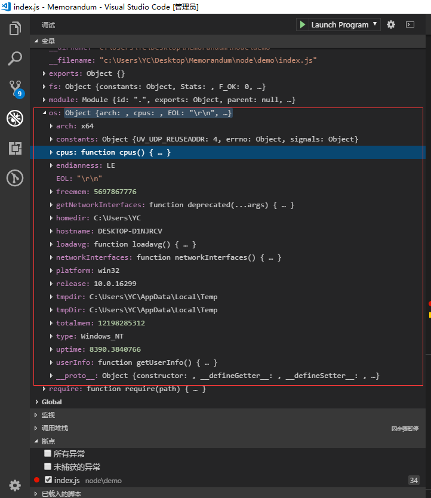

# os (操作系统)

* [os.EOL](#os-eol)
* [os.cpus()](#os-cpus)
* [os.endianness()](#os-endianness)
* [os.freemem()](#os-freemem)
* [os.homedir()](#os-homedir)
* [os.hostname()](#os-hostname)
* [os.loadavg()](#os-loadavg)
* [os.networkInterfaces()](#os-networkinterfaces)
* [os.platform()](#os-platform)
* [os.release()](#os-release)
* [os.tmpdir()](#os-tmpdir)
* [os.totalmem()](#os-totalmem)
* [os.type()](#os-type)
* [os.uptime()](#os-uptime)
* [os.userInfo([options])](#os-userinfo)

os 模块提供了一些操作系统相关的实用方法

```js
const os = require('os');
```

<h2 id="os-eol">os.EOL</h2>
一个字符串常量,定义操作系统相关的行末标志:

* \n 在 POSIX 系统上
* \r\n 在 Windows系统上

<h2 id="os-arch">os.arch()</h2>
返回一个字符串, 表明 Node.js 二进制编译所用的 操作系统CPU架构.

现在可能的值有: 'arm', 'arm64', 'ia32', 'mips', 'mipsel', 'ppc', 'ppc64', 's390', 's390x', 'x32', 'x64'。

等价于 process.arch.

<h2 id="os-constants">os.constants</h2>
请查看详细文档

<h2 id="os-cpus">os.cpus()</h2>
返回一个对象数组, 包含每个逻辑 CPU 内核的信息.

<h2 id="os-endianness">os.endianness()</h2>
返回一个字符串,表明Node.js二进制编译环境的字节顺序

* 'BE' 大端模式
* 'LE' 小端模式

<h2 id="os-freemem">os.freemem()</h2>
以整数的形式回空闲系统内存 的字节数.

<h2 id="os-homedir">os.homedir()</h2>
以字符串的形式返回当前用户的home目录.

<h2 id="os-hostname">os.hostname()</h2>
以字符串的形式返回操作系统的主机名.

<h2 id="os-loadavg">os.loadavg()</h2>
返回一个数组,包含1, 5, 15分钟平均负载.

<h2 id="os-networkinterfaces">os.networkInterfaces()</h2>
返回一个对象,包含只有被赋予网络地址的网络接口.

被赋予网络地址的对象包含的属性:

* address <string> 被赋予的 IPv4 或 IPv6 地址
* netmask <string> IPv4 或 IPv6 子网掩码
* family <string> IPv4 或 IPv6
* mac <string> 网络接口的MAC地址
* internal <boolean> 如果 网络接口是loopback或相似的远程不能用的接口时, 值为true,否则为false
* scopeid <number> IPv6 数字领域识别码 (只有当 family 是IPv6时可用)
* cidr <string> 以 CIDR 表示法分配的带有路由前缀的 IPv4 或 IPv6 地址。如果 netmask 参数不可用，则该属性是 null。

<h2 id="os-platform">os.platform()</h2>
返回一个字符串, 指定Node.js编译时的操作系统平台

当前可能的值有:
* 'aix'
* 'darwin'
* 'freebsd'
* 'linux'
* 'openbsd'
* 'sunos'
* 'win32'  

等价于 process.platform.

<h2 id="os-release">os.release()</h2>
返回一个字符串, 指定操作系统的发行版.

<h2 id="os-tmpdir">os.tmpdir()</h2>
返回一个字符串, 表明操作系统的 默认临时文件目录.

<h2 id="os-totalmem">os.totalmem()</h2>
以整数的形式返回所有系统内存的字节数.

<h2 id="os-type">os.type()</h2>
返回一个字符串,表明操作系统的名字

<h2 id="os-uptime">os.uptime()</h2>
在几秒内返回操作系统的上线时间.

<h2 id="os-userinfo">os.userInfo([options])</h2>
当前有效用户的信息

<h1>OS 常量</h1>

常量被os.constants 所输出