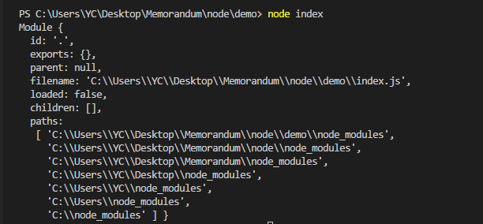

# 模块

## 模块包装器

```js
//
//
(function(exports, require, module, __filename, __dirname) {
// 模块的代码实际上在这里
});


```
## __dirname 

当前模块的文件夹名称 等同于 __filename 的 path.dirname() 的值


## __filename 

当前模块的文件名称---解析后的绝对路径。

## exports

module.exports 的更简短的引用形式

## module 对象



### module.children
被该模块引用的模块对象。

### module.exports
module.exports 对象是由模块系统创建的。

### exports 快捷方式
exports 变量是在模块的文件级别作用域内有效的，它在模块被执行前被赋予 module.exports 的值。

`exports就是module.exports的引用，故给exports赋值后exports将不可用`

代码事例
```js
function require(/* ... */) {
  const module = { exports: {} };
  ((module, exports) => {
    // 模块代码在这。在这个例子中，定义了一个函数。
    function someFunc() {}
    exports = someFunc;
    // 此时，exports 不再是一个 module.exports 的快捷方式，
    // 且这个模块依然导出一个空的默认对象。
    module.exports = someFunc;
    // 此时，该模块导出 someFunc，而不是默认对象。
  })(module, module.exports);
  return module.exports;
}
```

### module.filename
模块的完全解析后的文件名。

### module.id
模块的标识符。 通常是完全解析后的文件名。

### module.loaded
模块是否已经加载完成，或正在加载中。

### module.parent
最先引用该模块的模块。

### module.paths
模块的搜索路径。

### module.require(id)