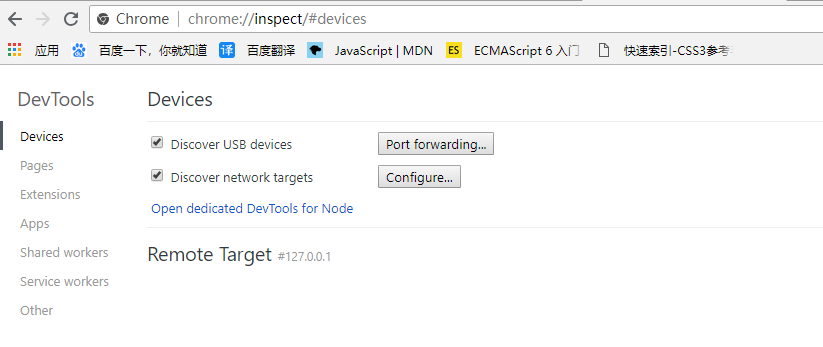
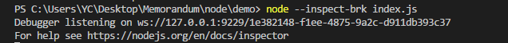
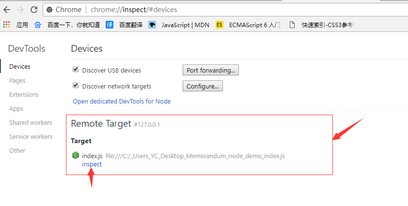
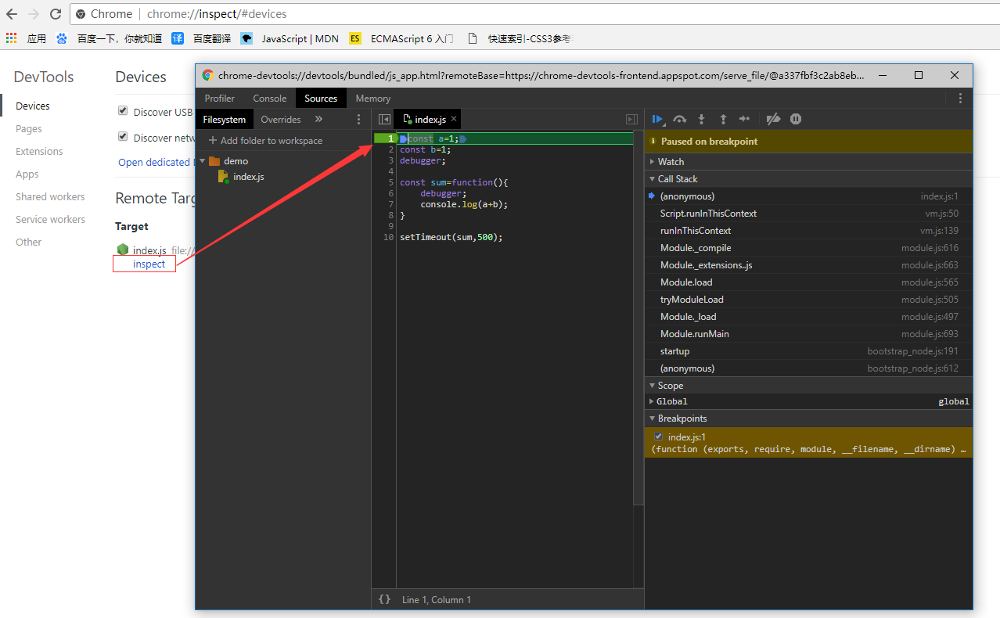
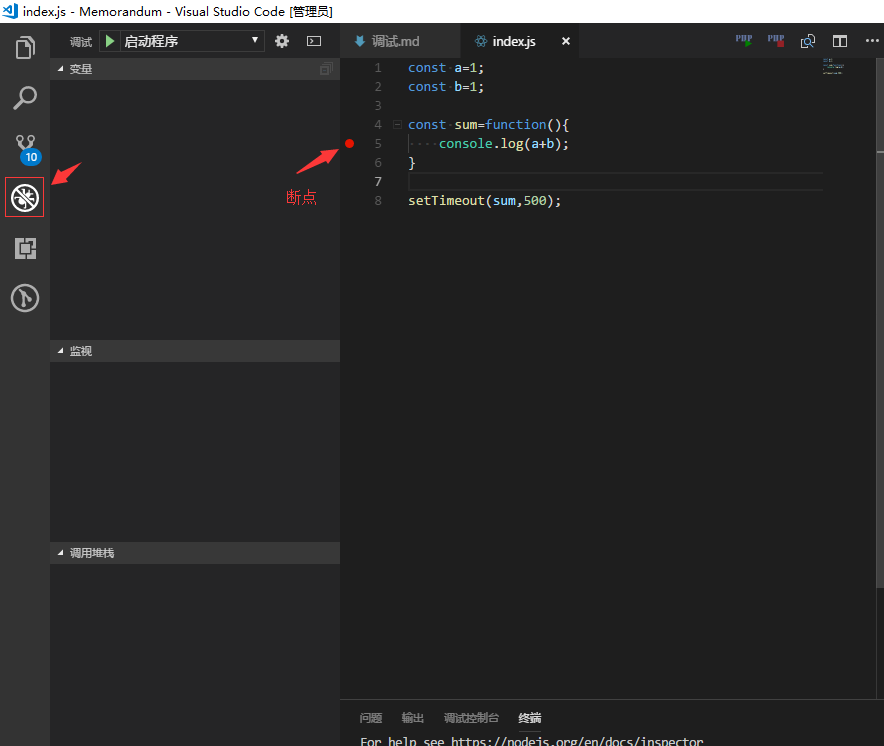
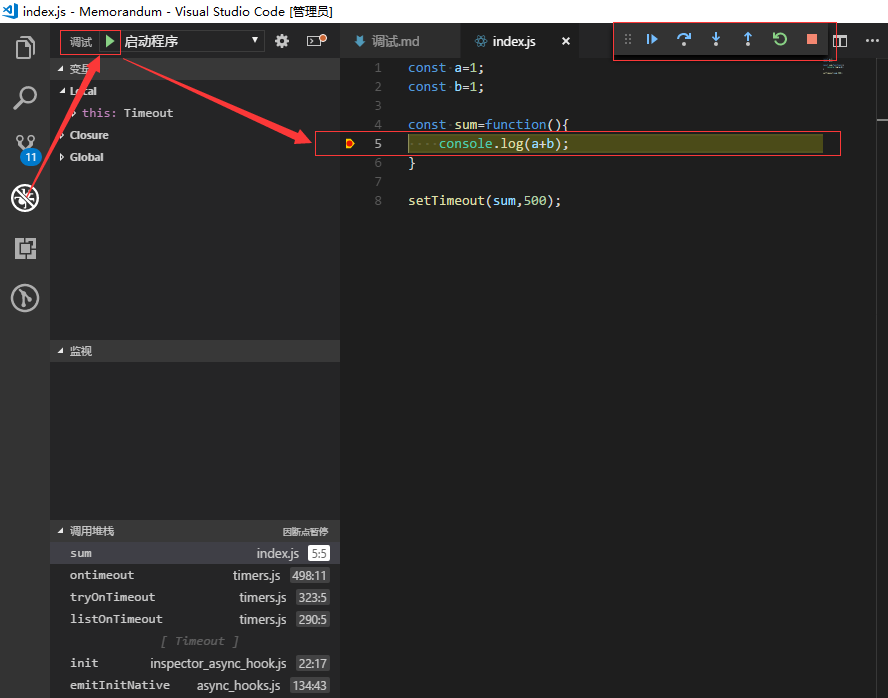
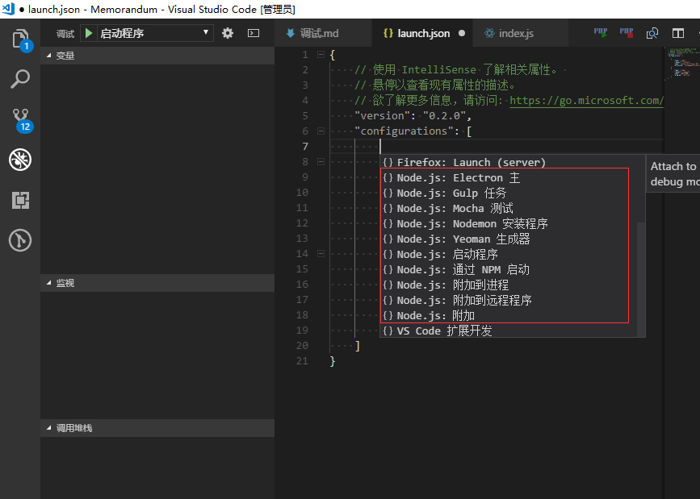

# 调试

* [Debugger](#debugger)
     * [命令参考](#commond)
* [Node.js的V8 Inspector集成](#inspector)
* [VS Code](#vscode)
    * [预定变量](#bianliang)
    * [调试模式](#moshi)
    * [launch.json 属性配置](#vsattr)


> <i id="debugger"></i>Debugger

`不推荐使用,太难用了`

Node.js的调试器客户端不是一个功能齐全的调试器，但可以进行简单的步骤和检查。

```js
$ node inspect myscript.js
< Debugger listening on ws://127.0.0.1:9229/80e7a814-7cd3-49fb-921a-2e02228cd5ba
< For help see https://nodejs.org/en/docs/inspector
< Debugger attached.
Break on start in myscript.js:1
> 1 (function (exports, require, module, __filename, __dirname) { global.x = 5;
  2 setTimeout(() => {
  3   console.log('world');
debug>
```
* debugger;断点设置

* <i id="commond"></i>命令参考

`步进`  
cont，c- 继续执行  
next，n- 接下来  
step，s- 介入  
out，o- 走出去  
pause - 暂停运行代码（如开发人员工具中的暂停按钮）  

`断点`  
setBreakpoint()，sb()- 在当前行上设置断点  
setBreakpoint(line)，sb(line)- 在特定行上设置断点  
setBreakpoint('fn()')，sb(...)- 在函数体中的第一个语句上设置断点  
setBreakpoint('script.js', 1)，sb(...)- 在script.js的第一行设置断点  
clearBreakpoint('script.js', 1)，cb(...)- 在第1行的script.js中清除断点   

`信息`  
backtrace，bt- 打印当前执行帧的回溯  
list(5) - 列出具有5行上下文的脚本源代码（前后5行）  
watch(expr) - 将表达式添加到监视列表  
unwatch(expr) - 从监视列表中删除表达式  
watchers - 列出所有观察者及其值（在每个断点上自动列出）  
repl - 在调试脚本的上下文中打开调试器的repl以进行评估  
exec expr - 在调试脚本的上下文中执行表达式  

`执行控制`  
run - 运行脚本（在调试器启动时自动运行）  
restart - 重启脚本  
kill - 杀死脚本  


> <i id="inspector"></i><span id="inspector"></span>Node.js的V8 Inspector集成

`建议使用`，市面上有很多好用客服端支持。

* 使用Chrome DevTools调试Node.js

```js
$ node --inspect index.js

# --inspect-brk相当于将断点打在第一行,
$ node --inspect-brk index.js
```
`Chrome v.67.0.3396.99`  

命令：chrome://inspect | about:inspect  
`注意`想要在Setp 3中`inspect`可启用调试器，请使用`--inspect-brk`,`--inspect`无效  
Setp 1.

Setp 2. 

Setp 3. 

Setp 4. 


> <i id="vscode"></i><span id="vscode"></span>VS Code

`由于内容太多，细节请参考下列连接`

https://code.visualstudio.com/docs/editor/debugging#_launch-configurations

https://code.visualstudio.com/docs/nodejs/nodejs-debugging

`简单调试`



`高级调试 只讨论--inspect Node.js v.* > = 6.3`

* 启动配置属性 launch.json

`launch.json 配置预备工作`

<i id="bianliang"></i><span id="bianliang"></span>预定义变量：

${workspaceFolder} - 在VS Code中打开的文件夹的路径  
${workspaceFolderBasename} - VS代码中打开的文件夹的名称，没有任何斜杠（/）  
${file} - 当前打开的文件  
${relativeFile} - 当前打开的文件相对于workspaceFolder  
${fileBasename} - 当前打开文件的基本名称  
${fileBasenameNoExtension} - 当前打开文件的基本名称，没有文件扩展名  
${fileDirname} - 当前打开文件的目录名  
${fileExtname} - 当前打开文件的扩展名  
${cwd} - 任务运行器在启动时的当前工作目录  
${lineNumber} - 活动文件中当前选定的行号  
${selectedText} - 活动文件中当前选定的文本  

<i id="moshi"></i><span id=""></span>VS Code调试器支持调试模式

1. 调试模式下启动程序 `launch`
2. 调试模式下附加到已在运行的程序 `attach`

<i id="vsattr"></i><span id=""></span>**launch和attach支持的属性**

protocol - 要使用的调试协议。请参阅上面的支持节点类运行时一节。  
port - 要使用的调试端口。请参阅附加到Node.js和远程调试部分。  
address - 调试端口的TCP / IP地址。请参阅附加到Node.js和远程调试部分。  
sourceMaps- 通过将此设置为启用源映射true。请参见源地图部分。  
outFiles - 用于定位生成的JavaScript文件的glob模式数组。请参见源地图部分。  
restart - 终止时重启会话。请参见自动重新启动调试会话一节。  
autoAttachChildProcesses - 跟踪调试对象的所有子进程，并自动附加到以调试模式启动的那些子进程。请参阅下面的自动将调试器附加到Node.js子进程一节。  
timeout - 重新启动会话时，请在此毫秒数后放弃。请参阅附加到Node.js一节。  
stopOnEntry - 程序启动时立即中断。  
localRoot - VS Code的根目录。请参阅下面的远程调试部分  
remoteRoot - 节点的根目录。请参阅下面的远程调试部分  
smartStep - 尝试自动跳过不映射到源文件的代码。请参阅智能步进部分。  
skipFiles - 自动跳过这些glob模式所涵盖的文件。请参阅跳过不感兴趣的代码部分。  
trace - 启用诊断输出。

**launch 还支持属性**

program - 要调试的Node.js程序的绝对路径。  
args - 传递给程序进行调试的参数。此属性的类型为array，并且将各个参数作为数组元素。  
cwd - 启动程序以在此目录中进行调试。  
runtimeExecutable - 要使用的运行时可执行文件的绝对路径。默认是node。请参阅启动'npm'的配置支持和其他工具一节。  
runtimeArgs - 传递给运行时可执行文件的可选参数。  
runtimeVersion- 如果“ nvm ”（或“ nvm-windows ”）或“ nvs ”用于管理Node.js版本，则此属性可用于选择Node.js的特定版本。请参阅下面的多版本支持部分。  
env - 可选的环境变量。此属性期望环境变量为字符串类型键/值对的列表。  
envFile - 包含环境变量定义的文件的可选路径。请参阅下面的从外部文件加载环境变量一节。  
console-样的控制台启动程序（的internalConsole，integratedTerminal，externalTerminal）。请参阅下面的Node Console部分。

**attach 还支持属性**

processId - 调试器在发送USR1信号后尝试连接到此进程。使用此设置，调试器可以附加到未在调试模式下启动的已在运行的进程。使用该processId属性时，将根据node.js版本（以及使用的协议）自动确定调试端口，并且无法显式配置。所以不要指定port属性。

vs code 提供的代码段的列表



参考fis3 发布入口
```js
{
    // Use IntelliSense to learn about possible Node.js debug attributes.
    // Hover to view descriptions of existing attributes.
    // For more information, visit: https://go.microsoft.com/fwlink/?linkid=830387
    "version": "0.2.0",
    "configurations": [
        {
            "type": "node",
            "request": "launch",
            "name": "Launch Program",
            "args":["release","-c","-d","../output"],
            "program": "C:/Program Files/nodejs/node_modules/fis3/bin/fis.js"
        }
    ]
}
```