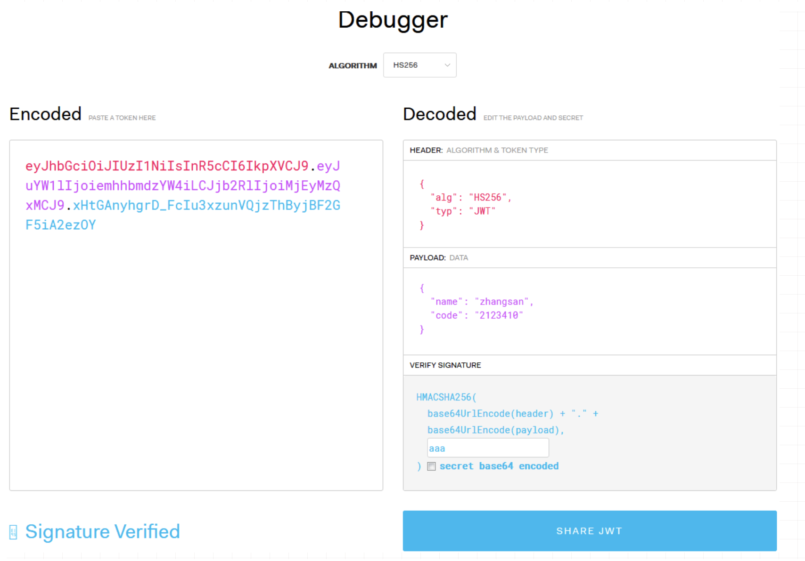

# JWT

JWT 全称叫 JSON Web Token, 是一个非常轻巧的规范。这个规范允许我们使用 JWT 在用户和服务器之间传递安全可靠的信息。

## jwt 使用场景

jwt 用途广泛，例如授权、鉴权等


## jwt 的组成、原理及实现

JSON Web Token由三部分组成，它们之间用圆点(.)连接。这三部分分别是：  
* Header  
* Payload  
* Signature  

头部 (Header)

```
{
  "typ": "JWT",
  "alg": "md5"
}
```
将上面的 json 字符串使用 base64 进行编码后，可以得到一下内容，我们称其为 JWT 的头部 (Header)。

```
eyJ0eXAiOiJqd3QiLCJhbGciOiJtZDUifQ==
```

载荷（Payload）

我们先将上面的邀请入群的操作描述成一个 JSON 对象。其中添加了一些其他的信息，帮助今后收到这个 JWT 的服务器理解这个 JWT。

```
{
    "sub": "1",
    "iss": "http://host/group/invite",
    "iat": 1451888119,
    "exp": 1454516119,
    "nbf": 1451888119,
    "jti": "37c107e4609ddbcc9c096ea5ee76c667",
    "group_id": 1,
    "invite_user": "A"
}
```

sub: 该 JWT 所面向的用户  
iss: 该 JWT 的签发者  
iat (issued at): 在什么时候签发的 token  
exp (expires): token 什么时候过期  
nbf (not before)：token 在此时间之前不能被接收处理  
jti：JWT ID 为 web token 提供唯一标识  

将上面的 json 字符串使用 base64 进行编码后，可以得到一下内容，我们称其为 JWT 的载荷 (Payload)。

```
eyJzdWIiOiIxIiwiaXNzIjoiaHR0cDpcL1wvOiIsImV4cCI6MTUyNzY2NzY2MywiaWF0IjoxNTI3NjY0MDYzLCJuYmYiOjE1Mjc2NjQwNjMsImdyb3VwX2lkIjoxLCJpbnZpdGVfdXNlciI6IkEiLCJqdGkiOiJlMjE4ZTJhZDdlYTdmZjUzYTVhM2RlZjA0MmFjMjM4NCJ9
```

签名 (Signature)

在签名之前我们需要先得到用于签名的字符串，将头部和载荷使用 . 进行拼接 (头部在前), 得到用于签名的字符串

```
eyJ0eXAiOiJqd3QiLCJhbGciOiJtZDUifQ==.eyJzdWIiOiIxIiwiaXNzIjoiaHR0cDpcL1wvOiIsImV4cCI6MTUyNzY2NzY2MywiaWF0IjoxNTI3NjY0MDYzLCJuYmYiOjE1Mjc2NjQwNjMsImdyb3VwX2lkIjoxLCJpbnZpdGVfdXNlciI6IkEiLCJqdGkiOiJlMjE4ZTJhZDdlYTdmZjUzYTVhM2RlZjA0MmFjMjM4NCJ9
```

然后使用签名方法对用于签名的字符串进行签名， 得到如下字符串，即 签名 (Signature)

```
NDljMzljOTkyOGNmYWU1NGEyZDYzMTk5NTNlNGEwZDA=
```

最后把用于签名的字符串和签名使用 . 进行拼接 (签名在后)， 即可得到 一个完整的 token。但是，此时的




## JSON Web Tokens是如何工作的

在认证的时候，当用户用他们的凭证成功登录以后，一个JSON Web Token将会被返回。此后，token就是用户凭证了，你必须非常小心以防止出现安全问题。一般而言，你保存令牌的时候不应该超过你所需要它的时间。

无论何时用户想要访问受保护的路由或者资源的时候，用户代理（通常是浏览器）都应该带上JWT，典型的，通常放在Authorization header中，用Bearer schema。

header应该看起来是这样的：

```
Authorization: Bearer <token>
```

服务器上的受保护的路由将会检查Authorization header中的JWT是否有效，如果有效，则用户可以访问受保护的资源。如果JWT包含足够多的必需的数据，那么就可以减少对某些操作的数据库查询的需要，尽管可能并不总是如此。

如果token是在授权头（Authorization header）中发送的，那么跨源资源共享(CORS)将不会成为问题，因为它不使用cookie。

下面这张图显示了如何获取JWT以及使用它来访问APIs或者资源：

## JWT与Session的差异

相同点是，它们都是存储用户信息；然而，Session是在服务器端的，而JWT是在客户端的。

Session方式存储用户信息的最大问题在于要占用大量服务器内存，增加服务器的开销。

而JWT方式将用户状态分散到了客户端中，可以明显减轻服务端的内存压力。

Session的状态是存储在服务器端，客户端只有session id；而Token的状态是存储在客户端。

## 基于Token的身份认证是如何工作

虽然这一实现可能会有所不同，但其主要流程如下：

* 用户携带用户名和密码请求访问
* 服务器校验用户凭据
* 应用提供一个token给客户端
* 客户端存储token，并且在随后的每一次请求中都带着它
* 服务器校验token并返回数据

注意：

* 每一次请求都需要token
* Token应该放在请求header中
* 我们还需要将服务器设置为接受来自所有域的请求，用Access-Control-Allow-Origin: *

## 用Token的好处

 * 无状态和可扩展性：Tokens存储在客户端。完全无状态，可扩展。我们的负载均衡器可以将用户传递到任意服务器，因为在任何地方都没有状态或会话信息。
 * 安全：Token不是Cookie。（The token, not a cookie.）每次请求的时候Token都会被发送。而且，由于没有Cookie被发送，还有助于防止CSRF攻击。即使在你的实现中将token存储到客户端的Cookie中，这个Cookie也只是一种存储机制，而非身份认证机制。没有基于会话的信息可以操作，因为我们没有会话!

## JWT与OAuth的区别

* OAuth2是一种授权框架 ，JWT是一种认证协议  
* 无论使用哪种方式切记用HTTPS来保证数据的安全性  
* OAuth2用在使用第三方账号登录的情况(比如使用weibo, qq, github登录某个app)，而JWT是用在前后端分离, 需要简单的对后台API进行保护时使用。