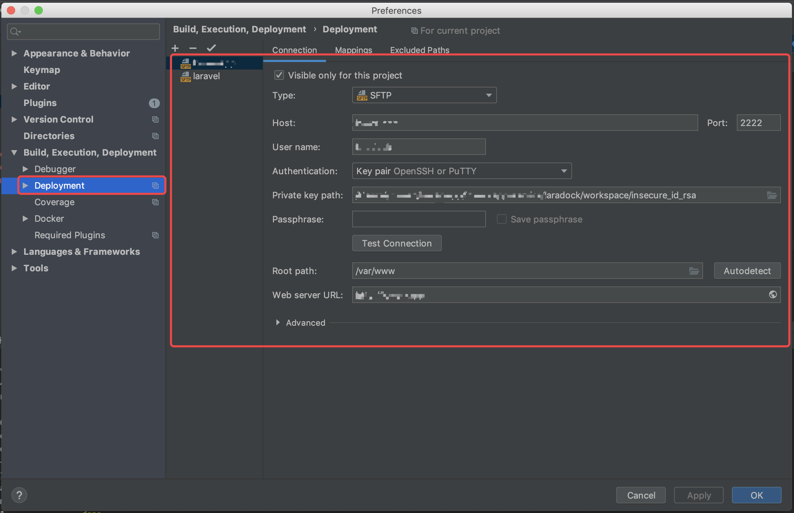

<!-- TOC -->

- [laradock+laravel 搭建](#laradocklaravel-搭建)
    - [Docker](#docker)
    - [Macbook 可以 window(需要cpu支持虚拟化)](#macbook-可以-window需要cpu支持虚拟化)
    - [Laradock](#laradock)
        - [使用](#使用)
    - [laravel 6](#laravel-6)
    - [开始](#开始)
    - [mysql](#mysql)
    - [Nginx](#nginx)
    - [xDebug](#xdebug)
    - [远程调试](#远程调试)

<!-- /TOC -->
# laradock+laravel 搭建

搭建要求：

    * git
    * Docker >= 17.12
    * Macbook
    * Laradock
    * laravel 6

## Docker

    最重要，自行学习见Docker.md
    docker 的管理建议使用vscode的插件，如果对docker熟悉可以手撸cli

## Macbook 可以 window(需要cpu支持虚拟化)

## Laradock

docker的完整PHP开发环境,可是开发环境，也可以直接上生产，因为是docker.

images:

    * 数据库引擎： MySQL - MariaDB - Percona - MongoDB - Neo4j - RethinkDB - MSSQL - PostgreSQL - Postgres-PostGIS。
    * 数据库管理： PhpMyAdmin - Adminer - PgAdmin
    * 缓存引擎： Redis - Memcached - Aerospike
    * PHP服务器： NGINX - Apache2 - Caddy
    * PHP编译器： PHP FPM - HHVM
    * 消息队列： Beanstalkd - RabbitMQ - PHP工作者
    * 排队管理： Beanstalkd控制台 - RabbitMQ控制台
    * 随机工具： Mailu - HAProxy - Certbot - Blackfire - Selenium - Jenkins - ElasticSearch - Kibana - Grafana - Gitlab - Mailhog - MailDev - Minio - Varnish - Swoole - NetData - Portainer - Laravel Echo - Phalcon ......

    * Workspace PHP CLI - Composer - Git - Linuxbrew - 节点 - V8JS - Gulp - SQLite - xDebug - Envoy - Deployer - Vim - Yarn - SOAP - Drush - WP-CLI 

Workspace 这个镜像是开发环境，所需要的一些工具，可以不污染本机的系统环境.

### 使用

* docker-compose build workspace nginx mysql
* docker-compose up -d {container-name} 运行容器
----------------------
* docker-compose build --no-cache {container-name} 
* docker-compose exec workspace bash 进入容器
* docker-compose exec --user=laradock workspace bash 添加用户

## laravel 6

php开源开发框架

## 开始

```
//第一步 下载laradock+laravel包到本地,下载到同目录下
git clone https://github.com/Laradock/laradock.git
git clone https://github.com/laravel/laravel

//第二步 复制根目录下的配制文件
cp env-example .env（laradock配制文件生效）

//第三步 下载开发环境镜像并创建容器
docker-compose up -d workspace

//第四步 配制
进入workspace容器
$ root@workspace:/var/www# composer install  容器
$ root@workspace:/var/www# cp .env.example .env
$ root@workspace:/var/www# php artisan key:generate  //一定要生产key
$ root@workspace:/var/www# exit

//本机
$root@server:~/laravel/laradock# cd ..
$root@server:~/laravel# sudo chmod -R 777 storage bootstrap/cache //设置项目权限

//完成
http://127.0.0.1 即可访问
```

## mysql

```
docker-compose up -d mysql

用户名：root 密码:root  端口：3306

MYSQL_VERSION=5.7
MYSQL_DATABASE=default
MYSQL_USER=default
MYSQL_PASSWORD=secret
MYSQL_PORT=3306
MYSQL_ROOT_PASSWORD=root
MYSQL_ENTRYPOINT_INITDB=./mysql/docker-entrypoint-initdb.d

${DATA_PATH_HOST}=~/.laradock/data
目录映射位置 ：${DATA_PATH_HOST}/mysql:/var/lib/mysql

my.cnf 是配制文件
```

## Nginx

```
docker-compose up -d nginx

NGINX_HOST_HTTP_PORT=80
NGINX_HOST_HTTPS_PORT=443
NGINX_HOST_LOG_PATH=./logs/nginx/
NGINX_SITES_PATH=./nginx/sites/  - 配制conf目录
NGINX_PHP_UPSTREAM_CONTAINER=php-fpm
NGINX_PHP_UPSTREAM_PORT=9000
NGINX_SSL_PATH=./nginx/ssl/


${APP_CODE_PATH_HOST} = APP_CODE_PATH_CONTAINER=/var/www  映射的目录../

laradock/nginx/sites/default.conf 这个是nginx http服务器默认配制
```

## xDebug

```
1 - 首先xDebug在Workspace和PHP-FPM容器中安装： 
a）打开.env文件 
b）WORKSPACE_INSTALL_XDEBUG=true
c）PHP_FPM_INSTALL_XDEBUG=true

2 - 重新构建容器 docker-compose build workspace php-fpm
```

## 远程调试

* ./laradock/.env 配置
```
PHP_FPM_INSTALL_XDEBUG=true
WORKSPACE_INSTALL_XDEBUG=true
WORKSPACE_INSTALL_WORKSPACE_SSH=true
```
* docker-compose.yml 配置

 \-

 * ./php-fpm/xdebug.ini  
  注意 remote_connect_back=1 可能无效，推荐开发不要使用  
  host.docker.internal docker获取本机ip，很重要注意  
```
xdebug.remote_host=host.docker.internal
xdebug.remote_connect_back=0
xdebug.remote_autostart=1
xdebug.remote_enable=1
xdebug.cli_color=1
```

* 在php-fpm上启用xDebug

位于laradock文件夹中的主机终端中 运行：./php-fpm/xdebug status | start | stop
查看状态
```
./php-fpm/xdebug status
```

docker-compose build workspace php-fpm

* PHPStorm设置


这个配制没什么用


* Xdebug helper

谷歌浏览器安装此插件，开启调试模式

* 开始调试（完）


 ## docker-compose -help

  build              - 生成或重建服务  
  bundle             - 从合成文件生成docker包  
  config             - 验证并查看撰写文件    
  create             - 创建服务    
  down               - 停止并删除容器、网络、图像和卷    
  events             - 从容器接收实时事件  
  exec               - 在正在运行的容器中执行命令    
  help               - Get help on a command  
  images             - List images  
  kill               - Kill containers  
  logs               - View output from containers  
  pause              - 暂停服务   
  port               - 打印端口绑定的公共端口    
  ps                 - 列出容器    
  pull               - 拉取服务映像    
  push               - 推送服务映像    
  restart            - Restart services  
  rm                 - Remove stopped containers  
  run                - 运行一次性命令    
  scale              - 设置服务的容器数    
  start              - Start services  
  stop               - Stop services  
  top                - Display the running processes  
  unpause            - 取消暂停服务    
  up                 - 创建和启动容器   
  version            - Show the Docker-Compose version information  
