# Next.js 知识图谱

```mermaid
graph TD
    A[Next.js 框架] --> B[基础概念]
    A --> C[App Router]
    A --> D[Pages Router]
    A --> E[第三方模块]
    
    B --> B1[什么是 Next.js]
    B --> B2[项目结构]
    B --> B3[图片和字体优化]
    B --> B4[CSS 支持]
    B --> B5[环境变量]
    
    C --> C1[路由系统]
    C --> C2[渲染模式]
    C --> C3[数据获取]
    C --> C4[组件]
    C --> C5[优化功能]
    C --> C6[内置组件]
    
    C1 --> C1a[文件系统路由]
    C1 --> C1b[动态路由]
    C1 --> C1c[路由组]
    C1 --> C1d[并行路由]
    C1 --> C1e[拦截路由]
    C1 --> C1f[Route Handlers]
    C1 --> C1g[中间件]
    C1 --> C1h[链接和导航]
    C1 --> C1i[重定向]
    C1 --> C1j[Loading UI]
    C1 --> C1k[错误处理]
    
    C2 --> C2a[服务器组件]
    C2 --> C2b[客户端组件]
    C2 --> C2c[静态渲染]
    C2 --> C2d[动态渲染]
    C2 --> C2e[流式渲染]
    C2 --> C2f[部分预渲染]
    
    C3 --> C3a[服务端数据获取]
    C3 --> C3b[客户端数据获取]
    C3 --> C3c[数据缓存]
    C3 --> C3d[重新验证]
    C3 --> C3e[增量静态再生 ISR]
    
    C4 --> C4a[服务器和客户端组合]
    C4 --> C4b[组件间数据共享]
    C4 --> C4c[Context 使用]
    
    C5 --> C5a[字体优化]
    C5 --> C5b[Metadata API]
    
    C6 --> C6a[Image 组件]
    C6 --> C6b[Video 组件]
    C6 --> C6c[iframe 组件]
    
    D --> D1[Pages Router 路由]
    
    E --> E1[next-auth]
    
    %% 样式定义
    classDef framework fill:#e1f5fe,stroke:#01579b,stroke-width:3px
    classDef concept fill:#f3e5f5,stroke:#4a148c,stroke-width:2px
    classDef router fill:#e8f5e8,stroke:#1b5e20,stroke-width:2px
    classDef feature fill:#fff3e0,stroke:#e65100,stroke-width:2px
    classDef component fill:#fce4ec,stroke:#880e4f,stroke-width:2px
    
    class A framework
    class B,C,D,E concept
    class C1,C2,C3,C4,D1 router
    class C5,C6 feature
    class C1a,C1b,C1c,C1d,C1e,C1f,C1g,C1h,C1i,C1j,C1k,C2a,C2b,C2c,C2d,C2e,C2f,C3a,C3b,C3c,C3d,C3e,C4a,C4b,C4c,C5a,C5b,C6a,C6b,C6c,E1 component
```

## 核心概念总结

### 🏗️ Next.js 是什么
- 基于 React 的全栈框架
- 提供文件系统路由、SSR/SSG、API 路由等功能
- 自动优化性能，支持 TypeScript

### 📁 项目结构
- `app/` - App Router 目录（推荐）
- `pages/` - Pages Router 目录（传统）
- `public/` - 静态资源
- `components/` - 组件目录

### 🛣️ 路由系统
- **文件系统路由**: 基于文件夹结构自动生成路由
- **动态路由**: `[slug]`、`[...slug]`、`[[...slug]]`
- **路由组**: `(group)` 组织路由而不影响URL
- **并行路由**: `@folder` 同时渲染多个页面
- **拦截路由**: `(.)` `(..)` 在当前布局中拦截路由

### 🎨 渲染模式
- **服务器组件**: 默认，在服务器渲染，性能更好
- **客户端组件**: `'use client'`，支持交互和状态
- **静态渲染**: 构建时预渲染
- **动态渲染**: 请求时渲染
- **流式渲染**: 逐步加载内容

### 📊 数据获取
- **服务端**: `fetch`、ORM/数据库
- **客户端**: `useEffect` + `fetch`、第三方库
- **缓存**: `force-cache`、`no-store`
- **重新验证**: 基于时间或按需重新验证
- **ISR**: 增量静态再生

### 🔧 特殊文件约定
- `layout.js` - 布局组件
- `page.js` - 页面组件
- `loading.js` - 加载状态
- `error.js` - 错误边界
- `not-found.js` - 404页面
- `route.js` - API路由
- `middleware.js` - 中间件

### ⚡ 优化功能
- **字体优化**: `next/font`
- **图片优化**: `next/image`
- **Metadata API**: SEO优化
- **代码分割**: 自动按路由分割
- **预取**: 自动预取链接

### 🔗 组件关系
- 服务器组件不能导入客户端组件
- 客户端组件可以接收服务器组件作为 props
- Context 只能在客户端组件中使用
- 数据通过 props 在组件间传递

### 📡 API 功能
- **Route Handlers**: 创建 API 端点
- **服务器操作**: `'use server'` 处理表单提交
- **中间件**: 请求拦截和处理
- **CORS**: 跨域资源共享

### 🔄 状态管理
- 服务器组件: 无状态，数据获取
- 客户端组件: React状态钩子
- 全局状态: Context或状态管理库
- 服务器状态: 数据缓存和重新验证

## 学习路径建议

1. **入门阶段**
   - 理解 Next.js 基本概念
   - 掌握文件系统路由
   - 学习服务器组件vs客户端组件

2. **进阶阶段**  
   - 掌握数据获取模式
   - 学习缓存和重新验证
   - 理解渲染模式选择

3. **高级阶段**
   - 掌握并行路由和拦截路由
   - 学习性能优化技巧
   - 理解中间件和API设计

4. **实战阶段**
   - 构建完整应用
   - 集成第三方服务
   - 部署和监控