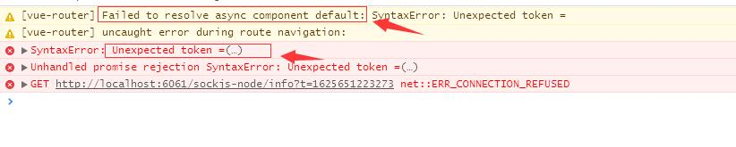

<!-- TOC -->

- [程序化的事件侦听器](#程序化的事件侦听器)
- [form 表单](#form-表单)
- [对象属性响应式易错](#对象属性响应式易错)
- [element-ui Cascader 级联选择器](#element-ui-cascader-级联选择器)
- [触发钩子的完整顺序：](#触发钩子的完整顺序)
- [Vue.extend( options )](#vueextend-options-)
- [\$mount()](#\mount)
- [\$listeners](#\listeners)
- [应用 \<keepAlive\> 清除 vue 缓存 key](#应用-\keepalive\-清除-vue-缓存-key)
- [引入 node_modules 中 es6 文件 导致浏览报错](#引入-node_modules-中-es6-文件-导致浏览报错)

<!-- /TOC -->

# 程序化的事件侦听器

- 通过 hook:\* 可以定义生命周期函数

```js
this.$once('hook:beforeDestroy', function () {
  picker.destroy();
});
```

# form 表单

- 注意数据类型的匹配

# 对象属性响应式易错

- 反例

```js
this.addForm = res.data.data;
this.addForm.orgId = ''; // orgId无法响应式注意
this.addForm.deptId = ''; // deptId无法响应式注意

改进;
res.data.data.orgId = '';
res.data.data.deptId = '';
this.addForm = res.data.data;
```

- 反例

```js
let res = await taskApi.getApi(this.dataId);
this.pageData = res.data.data;
res.data.data.orgId = ''; // orgId无法响应式注意
res.data.data.deptId = ''; // deptId无法响应式注意
```

# element-ui Cascader 级联选择器

- 父节点上 id 为 0 时默认不会选中

# 触发钩子的完整顺序：

将路由导航、keep-alive、和组件生命周期钩子结合起来的，触发顺序，假设是从 a 组件离开，第一次进入 b 组件：

1. beforeRouteLeave:路由组件的组件离开路由前钩子，可取消路由离开。
2. beforeEach: 路由全局前置守卫，可用于登录验证、全局路由 loading 等。
3. beforeEnter: 路由独享守卫
4. beforeRouteEnter: 路由组件的组件进入路由前钩子。
5. beforeResolve:路由全局解析守卫
6. afterEach:路由全局后置钩子
7. beforeCreate:组件生命周期，不能访问 this。
8. created:组件生命周期，可以访问 this，不能访问 dom。
9. beforeMount:组件生命周期
10. deactivated: 离开缓存组件 a，或者触发 a 的 beforeDestroy 和 destroyed 组件销毁钩子。
11. mounted:访问/操作 dom。
12. activated:进入缓存组件，进入 a 的嵌套子组件(如果有的话)。
13. 执行 beforeRouteEnter 回调函数 next。

# Vue.extend( options )

使用基础 Vue 构造器，创建一个“子类”

```js
// 创建构造器
var Profile = Vue.extend({
  template: '<p>{{firstName}} {{lastName}} aka {{alias}}</p>',
  data: function () {
    return {
      firstName: 'Walter',
      lastName: 'White',
      alias: 'Heisenberg',
    };
  },
});
// 创建 Profile 实例，并挂载到一个元素上。
new Profile().$mount('#mount-point');
```

# \$mount()

- $mount() 如果 Vue 实例在实例化时没有收到 el 选项，则它处于“未挂载”状态，没有关联的 DOM 元素。可以使用 vm.$mount() 手动地挂载一个未挂载的实例。

```js
var MyComponent = Vue.extend({
  template: '<div>Hello!</div>',
});

// 创建并挂载到 #app (会替换 #app)
new MyComponent().$mount('#app');

// 同上
new MyComponent({ el: '#app' });

// 或者，在文档之外渲染并且随后挂载
var component = new MyComponent().$mount();
document.getElementById('app').appendChild(component.$el);
```

# \$listeners

$listeners property，可以配合 v-on="$listeners" 将所有的事件监听器指向这个组件的某个特定的子元素。

# 应用 \<keepAlive\> 清除 vue 缓存 key

```js
if (this.$vnode.parent && this.$vnode.parent.componentInstance.cache) {
  // vue keep-alive render
  const vnode = this.$vnode;
  const componentOptions = vnode && vnode.componentOptions;
  const key = vnode.key == null ? componentOptions.Ctor.cid + (componentOptions.tag ? '::' + componentOptions.tag : '') : vnode.key;
  this.$vnode.parent.componentInstance.cache[key] = null;
  delete this.$vnode.parent.componentInstance.cache[key];
}
```

# 引入 node_modules 中 es6 文件 导致浏览报错



- 解决方案
  - 将模块代码引入项目中
  - transpileDependencies:['@ticampus/form'],
