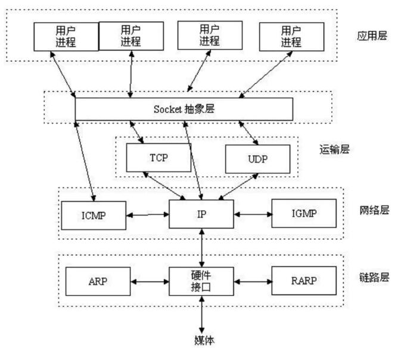

<!-- TOC -->

- [TCP/IP协议组](#tcpip协议组)
- [HTTP](#http)
- [Socket](#socket)
- [TCP](#tcp)
    - [TCP特点](#tcp特点)
    - [适用情况](#适用情况)
- [UDP](#udp)
    - [UDP特点](#udp特点)
    - [适用情况](#适用情况-1)
- [TCP和UDP区别](#tcp和udp区别)
- [Socket 套接字](#socket-套接字)
    - [套接字（socket）概念](#套接字socket概念)
    - [建立socket连接](#建立socket连接)
- [HTTP](#http-1)
- [总结](#总结)

<!-- /TOC -->

# TCP/IP协议组

TCP/IP协议(传输控制协议)由网络层的IP协议和传输层的TCP协议组成  
* IP层负责网络主机的定位,数据传输的路由,由IP地址可以唯一的确定Internet上的一台主机。
* TCP层负责面向应用的可靠的或费可靠的数据传输机制，这是网络编程的主要对象。

TCP/IP是个协议组,可分为三个层次:网络层,传输层和应用层:

* 网络层：IP协议、ICMP协议、ARP协议、RARP协议和BOOTP协议
* 传输层：TCP协议与UDP协议；
* 应用层：FTP、HTTP、TELNET、SMTP、DNS等协议

# HTTP

HTTP是应用层协议，其传输都是被包装成TCP协议传输。

# Socket

Socket是实现传输层协议的一种编程API,可以是TCP，也可以是UDP。

# TCP

## TCP特点

* 1.TCP是面向连接的协议，通过三次握手建立连接，通讯完成时要拆除连接，由于TCP是面向连接协议，所以只能用于点对点的通讯。而且建立连接也需要消耗时间和开销。
* 2.TCP传输数据无大小限制，进行大数据传输。
* 3.TCP是一个可靠的协议，它能保证接收方能够完整正确地接收到发送方发送的全部数据。

## 适用情况

一般网页（http）、邮件（SMTP)、远程连接(Telnet)、文件(FTP)传送就用TCP

# UDP

UDP(User Datagram Protocol),即用户数据报协议，是一个无连接的简单的面向数据报的运输层协议。UDP不提供可靠性，它只是把应用程序传给IP层的数据报发送出去，但是并不能保证它们能到达目的地。由于UDP在传输数据报前不用在客户端和服务器之间建立一个连接，且没有超时重发等机制，固而传输速度很快。

## UDP特点

UDP是面向无连接的通讯协议，UDP数据包括目的端口号和源端口号信息，由于通讯不需要连接，所以可以实现广播发送。

UDP传输数据时有大小限制，每个被传输的数据报必须限定在64KB之内。

UDP是一个不可靠的协议，发送方所发送的数据报并不一定以相同的次序到达接收方。

## 适用情况

UDP是面向消息的协议，通讯时不需要建立连接，数据的传输自然是不可靠的，UDP一般多用于多点通讯和实时的数据业务，比如语音广播、视频、QQ、TFTP（简单文件传送）、SNMP(简单网络管理协议)、RTP（实时传送协议）RIP（路由信息协议，如报告股票市场，航空信息）、DNS(域名解释）。注重速度流畅。

UDP操作简单，而且仅需要较少的监护，因此通常用于局域网高可靠性的分散系统中client/server应用程序。例如视频会议系统，并不要求音频视频数据绝对的正确，只要保证连贯性就可以了，这种情况下显然使用UDP会更合理一些。

# TCP和UDP区别

* TCP是面向流字符的，数据流间无边界；UDP是面向分组的，分组间有明确的边界。
* TCP是面向连接的，UDP是无连接的。类比于打电话和发电报的关系。

# Socket 套接字

Socket通常也称作“套接字”，用于描述IP地址和端口，是一个通信链的句柄。网络上的两个程序通过一个双向的通讯连接实现数据的交换，这个双向链路的一端称为一个Socket,一个Socket由一个IP地址和一个端口号唯一确定。应用程序通常通过“套接字”向网络发送请求或者应答网络请求。Socket是TCP/IP协议的一个十分流行的编程界面，但是，Socket所支持的协议种类也不光TCP/IP一种，因此两者之间是没有必然联系的。

Socket是应用层与TCP/IP协议族通信的中间软件抽象层，它是一组接口

大部分防火墙默认会关闭长时间处于非活跃状态的连接而导致Socket连接断连，因此需要通过轮询告诉网络，该连接处于活跃状态。

## 套接字（socket）概念

套接字（socket）是通信的基石，是支持TCP/IP协议的网络通信的基本操作单元。它是网络通信过程中端点的抽象表示，包括进行网络通信必需的五种信息：连接使用的协议、本地主机的IP地址、本地进程的协议端口、远地主机的IP地址，远地进程的协议端口。

## 建立socket连接

建立Socket连接至少需要一对套接字，其中一个运行于客户端，称为ClientSocket ，另一个运行于服务器端，称为ServerSocket。

# HTTP

HTTP(Hypertext Transfer Protocol )协议是建立在TCP协议之上的一种应用，HTTP连接使用的是“请求—响应”的方式，不仅在请求时需要先建立TCP连接，而且需要客户端向服务器发出请求请求中包含请求方法、URI、协议版本以及相关的MIME样式的消息，服务器端才能回复数据。

# 总结

HTTP是应用层协议，其传输都是被包装成TCP协议传输。可以用SOCKET实现HTTP。SOCKET是实现传输层协议的一种编程API，可以是TCP，也可以是UDP。

TPC/UDP协议是传输层协议，主要解决数据如何在网络中传输，而HTTP是应用层协议，主要解决如何包装数据。

TCP/IP与UDP只是一个协议栈，就像操作系统的运行机制一样，必须要具体实现，同时还要提供对外的操作接口。这个就像操作系统会提供标准的编程接口，比如win32编程接口一样，TCP/IP也要提供可供程序员做网络开发所用的接口，这就是Socket编程接口。