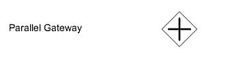
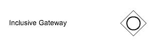
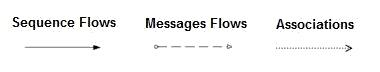
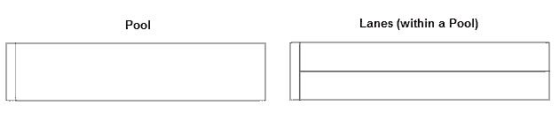
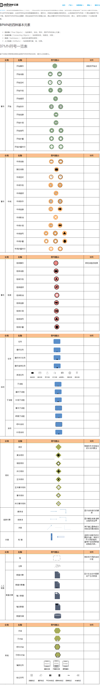

<!-- TOC -->

- [工作流&&流程图](#工作流流程图)
- [BPMN](#bpmn)
- [BPMN分类](#bpmn分类)
- [BPMN建模](#bpmn建模)
    - [元素组成](#元素组成)
- [BPMN补充](#bpmn补充)
    - [流对象](#流对象)
        - [事件](#事件)
        - [活动](#活动)
        - [网关](#网关)
    - [数据](#数据)
    - [连接对象](#连接对象)
    - [泳道](#泳道)
    - [附加工件 (人工信息)](#附加工件-人工信息)
    - [BPMN和Visio流程的区别](#bpmn和visio流程的区别)
- [BPM有各种开源软件](#bpm有各种开源软件)
- [工作流与BPM](#工作流与bpm)
    - [流程有两个好处](#流程有两个好处)
    - [初学者学习掌握设计一个BPMN](#初学者学习掌握设计一个bpmn)
- [BPML](#bpml)
- [DMN](#dmn)
- [CMMN](#cmmn)
- [其他参考](#其他参考)
    - [BPMN符号](#bpmn符号)

<!-- /TOC -->


# 工作流&&流程图

# BPMN

BPMN：业务流程建模与标注，包括这些图元如何组合成一个业务流程图（Business Process Diagram）

# BPMN分类

* 协作流程模型——又称协作流程图、共有流程，用池的方式描述两个或更多业务实体（流程）之间可视活动的交互作用。
* 独立流程模型——又称私有流程、内部业务流程，用泳道表示特定组织内部的独立、私有业务流程。
* 组合流程——又称公共流程，表示私有业务流程与其它流程或参与者之间的交互。

# BPMN建模

* Visio——提供一套完整的BPMN符号，内置少量BPMN模板参考，可以设计绘制和建模业务流程。
* Process On流程图设计器——支持BPMN2.0的三种标准类型建模，还可以设置与特定图形相关的业务属性。

https://www.processon.com/

## 元素组成

* 流对象(Flow)
    * 事件 - 表示一个业务流程期间发生的东西
    * 活动 - 是要处理工作的一般术语
    * 条件 - 控制序列流的分支与合并
* 连接对象(Connection)
    * 顺序流 - 顺序流用一个带实心箭头的实心线表示，用于指定活动执行的顺序
    * 消息流 - 消息流用一条带有开箭头的虚线表示，用于描述两个独立的业务参与者（业务实体或业务角色）之间发送和接受的消息流动。
    * 关联 - 用一根带有线箭头的点线表示关联，用于将相关的数据、文本和其他人工信息与流对象联系起来。
* 泳道(Swimlane)
    * 池 - 池描述流程中的一个参与者。
    * 道 - 道就是在池里面再细分，可以是垂直的也可以是水平的。
* 人工信息(Artifact)
    * 数据对象 - 数据对象是一个显示活动是如何需要或产生数据的。它们通过关联与活动连接起来。
    * 组 - 组用一个虚线的圆角矩形表示，用于记录或分析的目的，但不影响顺序流。
    * 注释 - 注释是建模者为BPMN图的读者提供附加文本信息的一个机制 

# BPMN补充

https://www.jdon.com/workflow/bpmn-five-elemnets.html
https://www.jdon.com/workflow-bpm.html

* BPMN 2.0以后融入了BPEL，从而实现人工流和服务流程的综合调度编排

## 流对象

流对象是用于定义业务流程行为的主要图形元素。

* 活动（或称任务、节点）
* 事件
* 网关 用于显示不同流程路径的分支


https://baike.baidu.com/item/BPML/8922770


### 事件

```xml
<process id="myprocess-Id" name="myprocess" isExecutable="true">
    <startEvent id="start"></startEvent>
    <endEvent id="end"></endEvent>
</process>
```
表达事件的符号始终是未填充的圆圈
* 事件符号的外圈 可以是单个圆圈、双圆圈或填充环。
    * 单个粗圆 - 意味着事件是一个起始事件
    * 双圆圈 - 表示事件是一个中间事件
    * 填充的环 - 表示事件是结束事件
* 虚线与实心圆
    * 实线用于显示中断事件
    * 虚线用于显示非中断事件
* BPMN定时事件
    * 定时启动事件:中断
    * 定时启动事件:非中断
    * 定时中间事件:中断
    * 定时中间事件:非中断


### 活动

```xml
<userTask id="userTaskId" activiti:assignee="PPP" activiti:formKey="UUU">

</userTask>
```

### 网关

* 排他网关Exclusive Gateway (专用网关) (相当于if/else if/else 只能沿着路径)  

* 并行网关  

* 包含网关  
 用于沿着条件评估为“True”的所有路径引导顺序流，路径策略可以有一个 或几个或全部 （相当于if(){} if(){} if(){}）

## 数据

* 数据对象
* 数据输入
* 数据输出
* 数据存储

## 连接对象

* 顺序流
* 消息流
* 关联



```xml
<sequenceFlow id="sid" sourceRef="start" targetRef="userTaskId"></sequenceFlow>
```

## 泳道

泳道用于对主要建模元素进行分组

* 池 Pools 
* 管道 Lanes



## 附加工件 (人工信息)

附加工件提供有关流程的其他信息  
标准工件

* Groups 组用一个虚线的圆角矩形表示，用于记录或分析的目的，但不影响顺序流。
* Text Annotation 注释－－－注释是建模者为BPMN图的读者提供附加文本信息的一个机制。


## BPMN和Visio流程的区别

Visio代表的是一种业务流程图，主要是给人看的，而BPMN是可执行模型，能够被编译解释到Java等语言让机器执行。

# BPM有各种开源软件

* 轻量级工作流引擎，如：Camunda，Activiti，JBoss jBPM。
* BPM套件遵循“零代码”方法，如：IBM，Pega，Software AG。
* 带DSL的纯状态机，如：Amazon Simple Workflow，Netflix conductor。
* 简单的“事件反应机器”，如：IFTTT，Zapier，Microsoft Flow。
* 大数据或ETL的数据流框架，如：Spring Cloud数据流，Apache Airflow。

# 工作流与BPM

##　流程有两个好处

* 自动化流程
* 状态跟踪

## 初学者学习掌握设计一个BPMN

* 启动事件 结束事件和一个用户任务（表单），主要掌握事件、任务和顺序流的概念
* 请假流程。这实际上是一个审核流，主要掌握网关实现批准或否决的用途，网关只能和顺序流衔接
* 四眼原则。双人审核流，有两个人审核，主要掌握事件和子流程概念，BPMN中事件有60多种，很多事件有使用场景，上下文不同事件的概念不同，使用事件可以实现各种流程路由，如回退、取回、抄送、关系等功能。

# BPML

BPML(Business Process Modeling Language) [业务流程建模语言]：是业务流程建模的元语言，就像XML是业务数据建模的元语言一样。

# DMN

Decision Modeling Notation（决策建模符号）是由对象管理组于2015年发布。它是用于业务决策的图形语言。DMN的主要目的是为分析人员提供一种工具，用于将业务决策逻辑与业务流程分离，这有助于大大降低业务流程模型的复杂性并促进其可读性，使用DMN封装业务决策逻辑还允许业务流程或业务规则在不相互影响的情况下进行更改

DMN的主要目的是为分析人员提供一种工具，用于将业务决策逻辑与业务流程分离，这有助于大大降低业务流程模型的复杂性并促进其可读性，使用DMN封装业务决策逻辑还允许业务流程或业务规则在不相互影响的情况下进行更改，说白了，DMN其实引入了业务规则。

# CMMN

CMMN是一种图形符号，用于捕获基于处理需要各种活动的案例的工作方法，这些活动可能以不可预测的顺序执行以响应不断变化的情况。使用以事件为中心的方法和案例文件的概念，CMMN扩展了可以用BPMN建模的界限，包括结构化工作量减少和知识工作者推动的工作量。

# 其他参考

## BPMN符号


