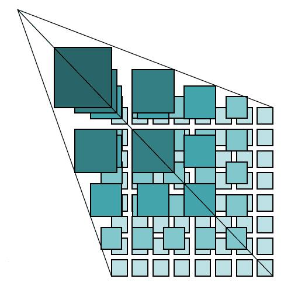

<!-- TOC -->

- [离线地图](#离线地图)
- [瓦片地图](#瓦片地图)
    - [原理](#原理)
    - [优势：](#优势)
- [android](#android)
- [OpenStreetMap](#openstreetmap)

<!-- /TOC -->

https://mobac.sourceforge.io/screenshots.html
https://developers.arcgis.com/
http://greatmaps.codeplex.com

# 离线地图

# 瓦片地图

## 原理

瓦片地图由一片一片的地图瓦片构成，它的尺寸是256px*256px，是一张张的图片。下面的金字塔图片，从上到下，呈一个指数关系的增长，最上面对应比例尺最小，表示范围最大的地图，一般而言，最大的这个就代表世界地图整个的地球范围。然后依次往下，对应不同的层级。

## 优势：

* 高效缓存
* 渐进加载
* 简单易用

# android

# OpenStreetMap

https://www.openstreetmap.org/