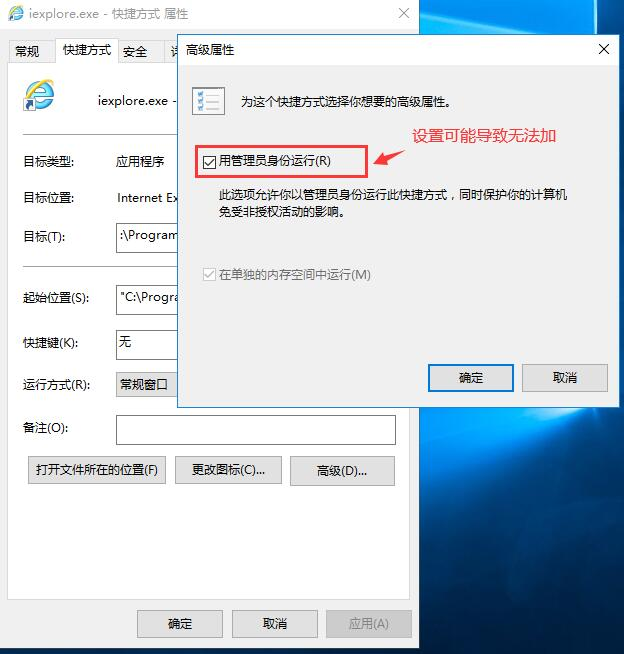

<!-- TOC -->

- [TabProcGrowth (win10 64 位 IE 浏览器 单进程)](#tabprocgrowth-win10-64-位-ie-浏览器-单进程)
    - [第一种方式](#第一种方式)
    - [第二种方式](#第二种方式)
- [Activex控件 无法加载问题](#activex控件-无法加载问题)

<!-- /TOC -->

# TabProcGrowth (win10 64 位 IE 浏览器 单进程)

## 第一种方式
```
> gpedit.msc
```
* 计算机配置—》管理模板—》windows组件—》Internet Explore -->设置标签页进程增长

## 第二种方式
```
> regedit
```

* 注册表：HKEY_CURRENT_USER\Software\Microsoft\Internet Explorer\Main
* 新建一个DWORD32值，并将其命名为TabProcGrowth 输入“0”或者“1” 0：单进程 1：多进程

# Activex控件 无法加载问题

* \<object\> 页面初始化时设置'style:display:none;' 
* 管理员权限配置

