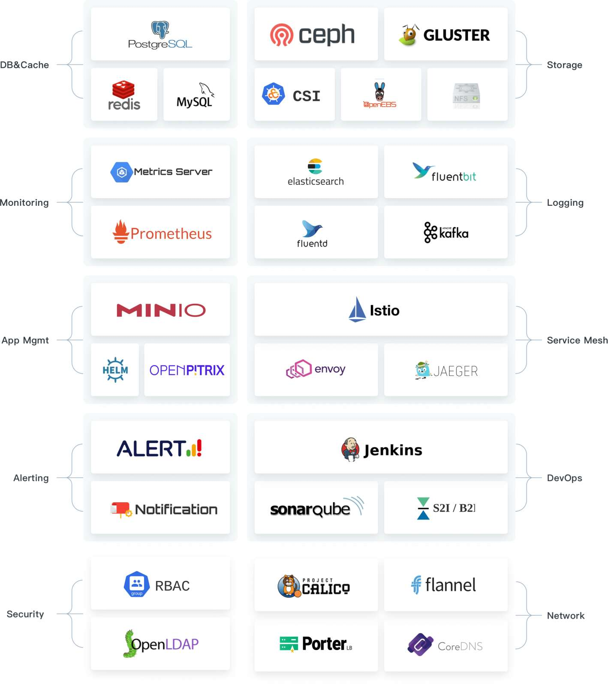

<!-- TOC -->

- [提醒 alerting](#%E6%8F%90%E9%86%92-alerting)
    - [ALERT](#alert)
    - [Notification](#notification)
- [开发运营 DevOps](#%E5%BC%80%E5%8F%91%E8%BF%90%E8%90%A5-devops)
    - [jenkins](#jenkins)
    - [sonarQube](#sonarqube)
    - [s2i/B2](#s2ib2)
- [安全 Security](#%E5%AE%89%E5%85%A8-security)
    - [RBAC](#rbac)
    - [OpenLDAP](#openldap)
- [网络 Network](#%E7%BD%91%E7%BB%9C-network)
    - [CALICQ](#calicq)
    - [flannel](#flannel)
    - [Porter](#porter)
    - [CoreDNS](#coredns)
- [数据库 DB&Cache](#%E6%95%B0%E6%8D%AE%E5%BA%93-dbcache)
    - [PostgreSQL](#postgresql)
    - [redis](#redis)
    - [Mysql](#mysql)
    - [CEPH](#ceph)
- [贮存 Storage](#%E8%B4%AE%E5%AD%98-storage)
    - [GLUSTER](#gluster)
    - [CSI](#csi)
    - [openEBS](#openebs)
    - [NFS](#nfs)
- [监控 Monitoring](#%E7%9B%91%E6%8E%A7-monitoring)
    - [Metrics Server](#metrics-server)
- [日志记录 Logging](#%E6%97%A5%E5%BF%97%E8%AE%B0%E5%BD%95-logging)
    - [elasticsearch](#elasticsearch)
    - [fluentbit](#fluentbit)
    - [Prometheus](#prometheus)
    - [Fluentd](#fluentd)
    - [Kafka](#kafka)
- [应用管理 App Mgmt](#%E5%BA%94%E7%94%A8%E7%AE%A1%E7%90%86-app-mgmt)
    - [minio](#minio)
    - [HELM](#helm)
    - [OPENPITRIX](#openpitrix)
- [服务网格 Service Mesh](#%E6%9C%8D%E5%8A%A1%E7%BD%91%E6%A0%BC-service-mesh)
    - [Istio](#istio)
    - [envoy](#envoy)
    - [JAEGER](#jaeger)
- [other](#other)
    - [Mobx](#mobx)
    - [koa](#koa)

<!-- /TOC -->

# 提醒 alerting

## ALERT

## Notification

# 开发运营 DevOps

## jenkins

## sonarQube

## s2i/B2

# 安全 Security

## RBAC

## OpenLDAP

# 网络 Network

## CALICQ

## flannel

## Porter

## CoreDNS

# 数据库 DB&Cache

## PostgreSQL

## redis

## Mysql

## CEPH

# 贮存 Storage

## GLUSTER

## CSI

## openEBS

## NFS

# 监控 Monitoring

## Metrics Server

# 日志记录 Logging

## elasticsearch

## fluentbit

## Prometheus

## Fluentd

## Kafka

# 应用管理 App Mgmt

## minio

## HELM

## OPENPITRIX

# 服务网格 Service Mesh

## Istio

## envoy

## JAEGER

# other

## Mobx

## koa